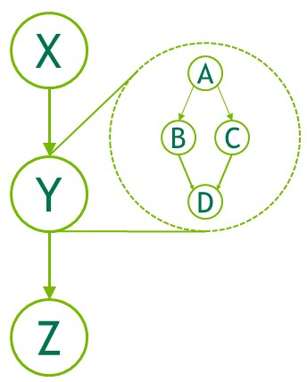
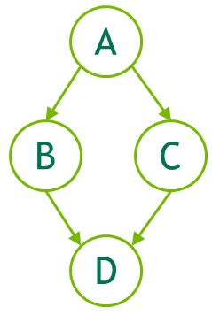
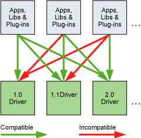

# 第三章编程接口
CUDA C++ 为熟悉 C++ 编程语言的用户提供了一种可以轻松编写设备执行程序的简单途径。

它由 C++ 语言的最小扩展集和运行时库组成。

编程模型通过引入了核心语言扩展，使得程序员可将内核函数定义为 C++ 函数，并在每次函数调用时通过一些新语法来指定网格和块的维度。所有扩展的完整描述可以在 [C++ 语言扩展](https://docs.nvidia.com/cuda/cuda-c-programming-guide/index.html#c-language-extensions)中找到。包含这些扩展名的任何源文件都必须使用 `nvcc` 进行编译，如 [使用NVCC编译](https://docs.nvidia.com/cuda/cuda-c-programming-guide/index.html#compilation-with-nvcc) 中所述。

[CUDA Runtime](https://docs.nvidia.com/cuda/cuda-c-programming-guide/index.html#cuda-c-runtime) 通过引入运行时，提供了一些可在主机上执行的 C 和 C++ 函 数，这些函数用于设备内存的分配和释放、主机内存和设备内存之间的数据传输、具有多个设备的系统管理等。运行时的完整描述可以在 CUDA 参考手册中找到。

运行时构建在更低级别的 C API（即 CUDA 驱动程序 API）之上，同时应用程序也可以访问 CUDA 驱动程序 API。驱动程序 API 通过暴露诸如 CUDA 上下文（类似于设备的"主机"进程）和 CUDA 模块（类似于设备的动态加载库）等较低级别的概念 (Concept) 来提供额外级别的控制。因为不需要这种额外级别的控制，大多数应用程序不使用驱动程序 API，并且在使用 CUDA 运行时的过程中，上下文和模块管理也会隐式进行，这也可以使得应用程序代码更简洁。由于运行时可与驱动程序 API 相互操作，因此大多数需要驱动程序 API 功能的应用程序可以默认使用运行时 API，同时仅在需要时使用驱动程序 API。 [Driver API](https://docs.nvidia.com/cuda/cuda-c-programming-guide/index.html#driver-api) 中介绍了驱动 API 并在参考手册中进行了全面描述。

## 3.1 利用 NVCC 编译
内核可以使用被称为 `PTX` 的 CUDA 指令集架构来编写，`PTX` 参考手册中对此进行了描述。 但是通常使用高级编程语言（如 C++）更有效。在这两种情况下，内核都必须通过 `nvcc` 编译成二进制代码才能在设备上执行。

`nvcc` 是一种编译器驱动程序，可简化 `C++` 或 `PTX` 代码的编译流程：它提供了简单且熟悉的命令行选项，并通过调用不同编译阶段的工具集来执行代码编译。 本节概述了 `nvcc` 工作流程和命令选项。 完整的描述可以在 `nvcc` 用户手册中找到。

### 3.1.1 编译流程
#### 3.1.1.1 离线编译

使用 nvcc  编译的源文件可以包含主机代码（即在`host`上执行的代码）和设备代码（即在`device`上执行的代码）。 nvcc 的基本工作流程包括将设备代码与主机代码分离，然后： 

* 将设备代码编译成汇编形式（`PTX` 代码）或二进制形式（`cubin` 对象）
* 通过 CUDA 运行时中的函数调用来替换主机代码中的 <<<...>>> 语法，对主机代码进行修改（更具体的描述可以参照[执行配置](https://docs.nvidia.com/cuda/cuda-c-programming-guide/index.html#execution-configuration)），来从 `PTX` 代码或 `cubin` 对象中加载和启动每个编译好的内核。
  

修改后的主机代码要么作为 C++ 代码输出，然后使用另一个工具编译，要么作为目标代码直接输出——通过让 nvcc 在最后编译阶段调用主机编译器对代码进行编译。

然后应用程序可以：

* 链接已编译的主机代码（这是最常见的情况），
* 或者忽略修改后的主机代码（如果有），使用 CUDA 驱动程序 API（请参阅[驱动程序 API](https://docs.nvidia.com/cuda/cuda-c-programming-guide/index.html#driver-api)）来加载和执行 `PTX` 代码或 `cubin` 对象。

#### 3.1.1.2 即时编译
应用程序在运行时加载的任何 `PTX` 代码都由设备驱动程序进一步编译为二进制代码。这称为即时编译（`just-in-time compilation`）。即时编译增加了应用程序加载时间，但它使得应用程序可以从每个新的设备驱动程序内置的新编译器中获得性能改进。同时它也是使得应用程序能够在那些编译时不存在的设备中运行的唯一方式，如应用[程序兼容性](https://docs.nvidia.com/cuda/cuda-c-programming-guide/index.html#application-compatibility)中所述。

当设备驱动程序为某些应用程序即时编译一些 `PTX` 代码时，驱动程序会自动缓存生成的二进制代码副本，避免应用程序在后续函数调用中重复的编译。缓存（称为计算缓存）在设备驱动程序升级时自动失效，因此应用程序可以从新的设备驱动程序的内置即时编译器中获得改进收益。

环境变量可用于控制即时编译，如[ CUDA 环境变量](https://docs.nvidia.com/cuda/cuda-c-programming-guide/index.html#env-vars)中所述

作为 `nvcc` 编译 CUDA C++ 设备代码的替代方法，`NVRTC` 可在运行时将 CUDA C++ 设备代码编译为 `PTX`。 `NVRTC` 是 CUDA C++ 的运行时编译库；更多信息可以在 `NVRTC` 用户指南中找到。

### 3.1.2 Binary 兼容性

二进制代码是特定于体系结构的。 使用指定目标体系结构的编译器选项 `-code` 生成 `cubin` 对象：例如，使用 `-code=sm_35` 编译会为[计算能力](https://docs.nvidia.com/cuda/cuda-c-programming-guide/index.html#compute-capability)为 3.5 的设备生成二进制代码。 从一个次要修订版到下一个修订版都保证了二进制兼容性，但不能保证从一个次要修订版到前一个修订版或跨主要修订版。 换句话说，为计算能力为 X.y 生成的 `cubin` 对象只能在计算能力为X.z , z≥y 的设备上执行。

***注意：仅桌面型产品支持二进制兼容性。 Tegra 型产品不支持它。 此外，不支持桌面和 Tegra 之间的二进制兼容性。***

### 3.1.3 PTX 兼容性
某些 PTX 指令仅在具有较高计算能力的设备上受支持。 例如，[Warp Shuffle Functions](https://docs.nvidia.com/cuda/cuda-c-programming-guide/index.html#warp-shuffle-functions) 仅在计算能力 3.0 及以上的设备上支持。 -arch 编译器选项指定了将 C++ 编译为 PTX 代码时假定的计算能力。 因此，例如，包含 `warp shuffle` 的代码必须使用 -arch=compute_30（或更高版本）进行编译。

为某些特定计算能力生成的 PTX 代码始终可以编译为比当前设备计算能力更高或相等的设备的二进制代码。 请注意，从早期 PTX 版本编译的二进制文件可能无法使用某些硬件功能。 例如，将在计算能力 6.0 (Pascal) 环境中生成的 PTX 代码编译为计算能力 7.0 (Volta) 的二进制目标设备将不会使用 Tensor Core 指令，因为这些指令在 Pascal 上不可用。 因此，最终二进制文件的性能可能会比使用最新版本的 PTX 生成的二进制文件更差。

### 3.1.4 应用程序兼容性

要在具有特定计算能力的设备上执行代码，应用程序必须加载与此计算能力兼容的二进制或 PTX 代码，如[二进制兼容性](https://docs.nvidia.com/cuda/cuda-c-programming-guide/index.html#binary-compatibility)和 [PTX 兼容性](https://docs.nvidia.com/cuda/cuda-c-programming-guide/index.html#ptx-compatibility)中所述。 特别是，为了能够在具有更高计算能力的未来架构上执行代码（尚无法生成二进制代码），应用程序必须加载 PTX 代码，并在这些设备中即时编译（参见[即时编译](https://docs.nvidia.com/cuda/cuda-c-programming-guide/index.html#just-in-time-compilation)）。

哪些 `PTX` 和二进制代码会嵌入到 CUDA C++ 应用程序中由 `-arch` 和 `-code` 编译器选项或 `-gencode` 编译器选项控制，详见 nvcc 用户手册。 例如:
```C++
nvcc x.cu
        -gencode arch=compute_50,code=sm_50
        -gencode arch=compute_60,code=sm_60
        -gencode arch=compute_70,code=\"compute_70,sm_70\"
```
嵌入与计算能力 5.0 和 6.0（第一和第二`-gencode` 选项）兼容的二进制代码以及与计算能力 7.0（第三`-gencode` 选项）兼容的 PTX 和二进制代码。

生成主机代码会在运行时自动选择最合适的代码来加载和执行，在上面的示例中，这些代码将是：
* 面向计算能力 5.0 和 5.2 的设备生成的 5.0 二进制代码，
* 面向计算能力 6.0 和 6.1 的设备生成的 6.0 二进制代码，
* 面向计算能力 7.0 和 7.5 的设备生成的 7.0 二进制代码，
* PTX 代码在运行时编译为具有计算能力 8.0 和 8.6 的设备的二进制代码。

例如，`x.cu` 可以有一个优化代码的方法，使用 warp shuffle 操作，这些操作仅在计算能力 3.0 及更高版本的设备中受支持。 `__CUDA_ARCH__` 宏可根据计算能力区分各种代码方案。 它仅为设备代码定义。 例如，当使用 `-arch=compute_35` 编译时，`__CUDA_ARCH__` 等于 350。

使用驱动 API 的应用程序必须编译代码以分离文件并在运行时显式加载和执行最合适的文件。

Volta 架构引入了独立线程调度（`Independent Thread Scheduling`），它改变了在 GPU 上调度线程的方式。 对于依赖于以前架构中 [SIMT 调度](https://docs.nvidia.com/cuda/cuda-c-programming-guide/index.html#simt-architecture)的特定行为的代码，独立线程调度可能会改变参与线程的集合，从而导致不正确的结果。 为了实现在[独立线程调度](https://docs.nvidia.com/cuda/cuda-c-programming-guide/index.html#independent-thread-scheduling-7-x)中详述的纠正措施并同时帮助迁移，Volta 开发人员可以使用编译器选项组合 `-arch=compute_60 -code=sm_70` 加入 Pascal 的线程调度。

nvcc 用户手册列出了 `-arch、-code` 和 `-gencode` 编译器选项的各种简写。 例如，`-arch=sm_70` 是 `-arch=compute_70 -code=compute_70,sm_70` 的简写（与 `-gencode arch=compute_70,code=\"compute_70,sm_70\"` 相同）。

### 3.1.5 C++兼容性
编译器前端根据 C++ 语法规则处理 CUDA 源文件。 主机代码支持完整的 C++。 但是，设备代码仅完整支持 C++ 的一个子集，如 [C++ 语言支持](https://docs.nvidia.com/cuda/cuda-c-programming-guide/index.html#c-cplusplus-language-support)中所述。

### 3.1.6 64位支持

64 位版本的 `nvcc` 以 64 位模式编译设备代码（即指针是 64 位的）。 以 64 位模式编译的设备代码仅支持以 64 位模式编译的主机代码。

同样，32 位版本的 `nvcc` 以 32 位模式编译设备代码，而以 32 位模式编译的设备代码仅支持以 32 位模式编译的主机代码。

32 位版本的 `nvcc` 也可以使用 `-m64` 编译器选项以 64 位模式编译设备代码。

64 位版本的 `nvcc` 也可以使用 `-m32` 编译器选项以 32 位模式编译设备代码。

## 3.2 CUDA Runtime
运行时在 `cudart` 库中实现，该库链接到应用程序，可以通过 `cudart.lib` 或 `libcudart.a` 静态链接，也可以通过 `cudart.dll` 或 `libcudart.so` 动态链接。 通常动态链接 `cudart.dll` 或 `cudart.so` 的应用程序会将运行时库作为应用程序安装包的一部分。只有在两个组件链接到同一个 CUDA 运行时实例时，在它们之间进行 CUDA 运行时符号的地址传递才是安全的。

它的所有入口都以 `cuda` 为前缀。

如[异构编程](https://docs.nvidia.com/cuda/cuda-c-programming-guide/index.html#heterogeneous-programming)中所述，CUDA 编程模型假设系统由主机和设备组成，每个设备都有自己独立的内存。 [设备内存](https://docs.nvidia.com/cuda/cuda-c-programming-guide/index.html#device-memory)概述了用于管理设备内存的运行时函数。

[共享内存](https://docs.nvidia.com/cuda/cuda-c-programming-guide/index.html#shared-memory) 说明了使用线程层次结构中引入的共享内存来最大化性能。

[Page-Locked Host Memory](https://docs.nvidia.com/cuda/cuda-c-programming-guide/index.html#page-locked-host-memory) 引入了 page-locked 主机内存，它需要将内核执行与主机和设备内存之间的数据传输重叠。

[异步并发执行](https://docs.nvidia.com/cuda/cuda-c-programming-guide/index.html#asynchronous-concurrent-execution) 描述了用于在系统的各个级别启用异步并发执行的概念和 API。

[多设备系统](https://docs.nvidia.com/cuda/cuda-c-programming-guide/index.html#multi-device-system) 展示了编程模型如何扩展到具有多个设备连接到同一主机的系统中。

[错误检查](https://docs.nvidia.com/cuda/cuda-c-programming-guide/index.html#error-checking) 描述了如何正确检查运行时生成的错误。

[调用堆栈](https://docs.nvidia.com/cuda/cuda-c-programming-guide/index.html#call-stack) 提到了那些用于管理 CUDA C++ 调用堆栈的运行时函数。

[Texture and Surface Memory](https://docs.nvidia.com/cuda/cuda-c-programming-guide/index.html#texture-and-surface-memory) 描述了纹理和表面内存空间，它们提供了另一种访问设备内存的方式；它们还公开了 GPU 纹理硬件的一个子集。

[图形互操作性](https://docs.nvidia.com/cuda/cuda-c-programming-guide/index.html#graphics-interoperability) 介绍了运行时提供的各种功能，用于与两个主要图形 API（OpenGL 和 Direct3D）进行互操作。

### 3.2.1 初始化

运行时没有显式的初始化函数；它在第一次调用运行时函数（更具体地说，这包括参考手册中除了错误处理和版本管理部分的函数之外的任何函数）时进行初始化。因此，在对运行时的函数进行计时，以及将错误代码从第一次函数调用解释到运行时的时候，需要牢记这一点。

运行时为系统中的每个设备创建一个 CUDA 上下文（有关 CUDA 上下文的更多详细信息，请参阅[上下文](https://docs.nvidia.com/cuda/cuda-c-programming-guide/index.html#context)）。此`context`是设备的主要（`primary`）上下文，并且在设备需要活动上下文时，通过第一个运行时函数进行初始化。它在应用程序的所有主机线程之间共享。作为创建上下文的一部分，设备代码在必要时会进行即时编译（请参阅[即时编译](https://docs.nvidia.com/cuda/cuda-c-programming-guide/index.html#just-in-time-compilation)）并加载到设备内存中。这一切都是透明地发生的。如果需要，例如根据驱动程序 API 和 CUDA 运行时的互操作性，可以从驱动程序 API 访问设备的主要上下文，如[运行时和驱动程序 API 之间的互操作性](https://docs.nvidia.com/cuda/cuda-c-programming-guide/index.html#interoperability-between-runtime-and-driver-apis)中所述。

当主机线程调用 `cudaDeviceReset()` 时，主机线程会破坏当前设备的主要上下文（即[设备选择]()中定义的当前设备）。当一个新的主机线程将此设备设置为当前设备时，它可以通过调用下一个运行时函数为该设备创建一个新的主要上下文。

***注意：CUDA接口使用全局状态，在主机程序初始化时初始化，在主机程序终止时销毁。 CUDA 运行时和驱动程序无法检测此状态是否有效，因此在程序启动或 main 后终止期间使用其中任意接口（隐式或显式）将导致未定义的行为。***

### 3.2.2 设备存储
如[异构编程](https://docs.nvidia.com/cuda/cuda-c-programming-guide/index.html#heterogeneous-programming)中所述，CUDA 编程模型假设系统由主机和设备组成，每个设备都有自己独立的内存。 内核在设备内存之外运行，因此运行时提供了分配、释放和复制设备内存以及在主机内存和设备内存之间传输数据的功能。

设备内存可以分配为`线性内存`或 `CUDA 数组`。

CUDA 数组是针对纹理获取进行优化了的不透明内存布局。 它们在[纹理和表面内存](https://docs.nvidia.com/cuda/cuda-c-programming-guide/index.html#texture-and-surface-memory)中有所描述。

线性内存分配在一个统一的地址空间中，这意味着单独分配的内存实体可以通过指针相互引用，例如在二叉树或链表中。 地址空间的大小取决于主机系统 (CPU) 和所用 GPU 的计算能力：

Table 1. Linear Memory Address Space

| 	|x86_64 (AMD64)|	POWER (ppc64le)	|ARM64|
|----|----|----|----|
|up to compute capability 5.3 (Maxwell)|	40bit|	40bit|	40bit|
|compute capability 6.0 (Pascal) or newer|	up to 47bit	|up to 49bit|	up to 48bit|

**注意：在计算能力为 5.3 (Maxwell) 及更早版本的设备上，CUDA 驱动程序会创建一个未提交的 40 位虚拟地址预留，以确保内存分配（指针）在支持的范围内。 此预留显示为预留虚拟内存，但在程序实际分配内存之前不会占用任何物理内存。**

线性内存通常使用 `cudaMalloc()` 分配并使用 `cudaFree()` 释放，主机内存和设备内存之间的数据传输通常使用 `cudaMemcpy()` 完成。 在[Kernels](https://docs.nvidia.com/cuda/cuda-c-programming-guide/index.html#kernels)的向量加法代码示例中，需要将向量从主机内存复制到设备内存：

``` C++
// Device code
__global__ void VecAdd(float* A, float* B, float* C, int N)
{
    int i = blockDim.x * blockIdx.x + threadIdx.x;
    if (i < N)
        C[i] = A[i] + B[i];
}
            
// Host code
int main()
{
    int N = ...;
    size_t size = N * sizeof(float);

    // Allocate input vectors h_A and h_B in host memory
    float* h_A = (float*)malloc(size);
    float* h_B = (float*)malloc(size);
    float* h_C = (float*)malloc(size);

    // Initialize input vectors
    ...

    // Allocate vectors in device memory
    float* d_A;
    cudaMalloc(&d_A, size);
    float* d_B;
    cudaMalloc(&d_B, size);
    float* d_C;
    cudaMalloc(&d_C, size);

    // Copy vectors from host memory to device memory
    cudaMemcpy(d_A, h_A, size, cudaMemcpyHostToDevice);
    cudaMemcpy(d_B, h_B, size, cudaMemcpyHostToDevice);

    // Invoke kernel
    int threadsPerBlock = 256;
    int blocksPerGrid =
            (N + threadsPerBlock - 1) / threadsPerBlock;
    VecAdd<<<blocksPerGrid, threadsPerBlock>>>(d_A, d_B, d_C, N);

    // Copy result from device memory to host memory
    // h_C contains the result in host memory
    cudaMemcpy(h_C, d_C, size, cudaMemcpyDeviceToHost);

    // Free device memory
    cudaFree(d_A);
    cudaFree(d_B);
    cudaFree(d_C);
            
    // Free host memory
    ...
}
```

线性内存也可以通过 `cudaMallocPitch()` 和 `cudaMalloc3D() `分配。 建议将这些函数用于 2D 或 3D 数组的分配，因为它确保分配的内存会被适当地填充以满足[设备内存访问](https://docs.nvidia.com/cuda/cuda-c-programming-guide/index.html#device-memory-accesses)中描述的对齐要求，从而确保在访问行地址或在 2D 数组和其他区域设备内存之间执行复制时获得最佳性能（使用 cudaMemcpy2D() 和 cudaMemcpy3D() 函数）。 返回的间距（或步幅）必须用于访问数组元素。 以下代码示例分配一个`width x height`的 2D 浮点数组，并展示了如何在设备代码中循环遍历数组元素： 
``` C++
// Host code
int width = 64, height = 64;
float* devPtr;
size_t pitch;
cudaMallocPitch(&devPtr, &pitch,
                width * sizeof(float), height);
MyKernel<<<100, 512>>>(devPtr, pitch, width, height);

// Device code
__global__ void MyKernel(float* devPtr,
                         size_t pitch, int width, int height)
{
    for (int r = 0; r < height; ++r) {
        float* row = (float*)((char*)devPtr + r * pitch);
        for (int c = 0; c < width; ++c) {
            float element = row[c];
        }
    }
}
```

以下代码示例分配了一个`width x height x depth` 的 3D 浮点数组，并展示了如何在设备代码中循环遍历数组元素：
```  C++
// Host code
int width = 64, height = 64, depth = 64;
cudaExtent extent = make_cudaExtent(width * sizeof(float),
                                    height, depth);
cudaPitchedPtr devPitchedPtr;
cudaMalloc3D(&devPitchedPtr, extent);
MyKernel<<<100, 512>>>(devPitchedPtr, width, height, depth);

// Device code
__global__ void MyKernel(cudaPitchedPtr devPitchedPtr,
                         int width, int height, int depth)
{
    char* devPtr = devPitchedPtr.ptr;
    size_t pitch = devPitchedPtr.pitch;
    size_t slicePitch = pitch * height;
    for (int z = 0; z < depth; ++z) {
        char* slice = devPtr + z * slicePitch;
        for (int y = 0; y < height; ++y) {
            float* row = (float*)(slice + y * pitch);
            for (int x = 0; x < width; ++x) {
                float element = row[x];
            }
        }
    }
}
```

***注意：为避免分配过多内存从而影响系统层面的性能，请根据问题大小从用户请求中获得分配参数。 如果分配失败，您可以回退到其他较慢的内存类型（`cudaMallocHost()`、`cudaHostRegister()` 等），或者返回一个错误，告诉用户需要多少内存被拒绝。 如果您的应用程序由于某种原因无法请求内存分配参数，我们建议对其使用 `cudaMallocManaged()`。***

参考手册列出了用于在使用 `cudaMalloc()` 分配的线性内存、使用 `cudaMallocPitch()` 或 `cudaMalloc3D() `分配的线性内存、CUDA 数组以及为在全局或常量内存空间中声明的变量分配的内存之间复制内存的所有各种函数。

以下代码示例说明了通过运行时 API 访问全局变量的各种方法：

```C++
__constant__ float constData[256];
float data[256];
cudaMemcpyToSymbol(constData, data, sizeof(data));
cudaMemcpyFromSymbol(data, constData, sizeof(data));

__device__ float devData;
float value = 3.14f;
cudaMemcpyToSymbol(devData, &value, sizeof(float));

__device__ float* devPointer;
float* ptr;
cudaMalloc(&ptr, 256 * sizeof(float));
cudaMemcpyToSymbol(devPointer, &ptr, sizeof(ptr));
```
`cudaGetSymbolAddress()` 用于检索那些声明在全局内存空间中的变量内存地址。 分配内存的大小是通过 `cudaGetSymbolSize()` 获得的。 

### 3.2.3 L2 级设备内存管理

当一个 CUDA 内核重复访问全局内存中的一个数据区域时，这种数据访问可以被认为是持久化的 (`persisting `)。 另一方面，如果数据只被访问一次，那么这种数据访问可以被认为是流式的 (`streaming `)。

从 CUDA 11.0 开始，计算能力 8.0 及以上的设备能够影响 L2 缓存中数据的持久性，进而可能对全局内存的访问提供更高带宽和更低延迟。

#### 3.2.3.1 为持久访问预留L2缓存
可以留出一部分 L2 缓存用于对全局内存的持久化数据访问。 持久访问优先使用 L2 缓存的这个预留部分，而对全局内存的访问来说，无论正常访问或流式访问，它都只能使用那些未被持久访问使用的 L2 缓存。

在一定范围内，用于持久访问的 L2 缓存预留大小可以修改：
``` C++
cudaGetDeviceProperties(&prop, device_id);                
size_t size = min(int(prop.l2CacheSize * 0.75), prop.persistingL2CacheMaxSize);
cudaDeviceSetLimit(cudaLimitPersistingL2CacheSize, size); /* set-aside 3/4 of L2 cache for persisting accesses or the max allowed*/ 
```

在多实例 GPU (MIG) 模式下配置 GPU 时，L2 缓存预留功能被禁用。

使用多进程服务 (MPS) 时，`cudaDeviceSetLimit` 无法更改 L2 缓存预留大小。 而作为替代方法，只能在 MPS 服务器启动时通过环境变量 `CUDA_DEVICE_DEFAULT_PERSISTING_L2_CACHE_PERCENTAGE_LIMIT` 指定预留大小。

#### 3.2.3.2 L2持久化访问策略

访问策略窗口指定了全局内存的连续区域，以及用于访问该区域的 L2 缓存中的持久性属性。

下面的代码示例展示了如何使用 CUDA stream 设置 L2 持久访问窗口。
```C++
cudaStreamAttrValue stream_attribute;                                         // Stream level attributes data structure
stream_attribute.accessPolicyWindow.base_ptr  = reinterpret_cast<void*>(ptr); // Global Memory data pointer
stream_attribute.accessPolicyWindow.num_bytes = num_bytes;                    // Number of bytes for persistence access.
                                                                              // (Must be less than cudaDeviceProp::accessPolicyMaxWindowSize)
stream_attribute.accessPolicyWindow.hitRatio  = 0.6;                          // Hint for cache hit ratio
stream_attribute.accessPolicyWindow.hitProp   = cudaAccessPropertyPersisting; // Type of access property on cache hit
stream_attribute.accessPolicyWindow.missProp  = cudaAccessPropertyStreaming;  // Type of access property on cache miss.

//Set the attributes to a CUDA stream of type cudaStream_t
cudaStreamSetAttribute(stream, cudaStreamAttributeAccessPolicyWindow, &stream_attribute); 
```

当内核随后在 CUDA stream 中执行时，在全局内存范围 `[ptr..ptr+num_bytes)` 内的内存访问比对其他全局内存位置的访问更有可能保留在 L2 缓存中。

也可以为 CUDA Graph Kernel Node 节点设置 L2 持久性，如下例所示：
```C++
cudaKernelNodeAttrValue node_attribute;                                     // Kernel level attributes data structure
node_attribute.accessPolicyWindow.base_ptr  = reinterpret_cast<void*>(ptr); // Global Memory data pointer
node_attribute.accessPolicyWindow.num_bytes = num_bytes;                    // Number of bytes for persistence access.
                                                                            // (Must be less than cudaDeviceProp::accessPolicyMaxWindowSize)
node_attribute.accessPolicyWindow.hitRatio  = 0.6;                          // Hint for cache hit ratio
node_attribute.accessPolicyWindow.hitProp   = cudaAccessPropertyPersisting; // Type of access property on cache hit
node_attribute.accessPolicyWindow.missProp  = cudaAccessPropertyStreaming;  // Type of access property on cache miss.
                                    
//Set the attributes to a CUDA Graph Kernel node of type cudaGraphNode_t
cudaGraphKernelNodeSetAttribute(node, cudaKernelNodeAttributeAccessPolicyWindow, &node_attribute); 
```

`hitRatio` 参数可用于指定接收 `hitProp` 属性的访问比例。 在上面的两个示例中，全局内存区域 `[ptr..ptr+num_bytes)` 中 60% 的内存访问具有持久属性，40% 的内存访问具有流属性。 哪些特定的内存访问被归类为持久化访问（`hitProp`）是随机的，概率大约为 `hitRatio`； 概率分布取决于硬件架构和内存范围。

例如，如果 L2 预留缓存大小为 16KB，而 `accessPolicyWindow` 中的 `num_bytes` 为 32KB：
* `hitRatio` 为 0.5 时，硬件将随机选择 32KB 窗口中的 16KB 指定为持久化并缓存在预留的 L2 缓存区域中。
* `hitRatio` 为 1.0 时，硬件将尝试在预留的 L2 缓存区域中缓存一整个 32KB 窗口。 由于预留区域小于窗口，缓存行将被换出，以保持将 32KB 数据中最近使用的 16KB 保留在 L2 缓存的预留部分。

因此，`hitRatio` 可用于避免缓存的抖动，并从整体上减少移入和移出 L2 高速缓存的数据量。

低于 1.0 的 `hitRatio` 值可用于手动控制并发的 CUDA 流中不同 `accessPolicyWindows` 可以缓存在 L2 中的数据量。 例如，让 L2 预留缓存大小为 16KB； 两个不同 CUDA 流中的并发内核，每个内核都有一个 16KB 的 `accessPolicyWindow`，并且两者的 `hitRatio` 值都为 1.0：由于它们需要竞争共享的 L2 资源，因此可能会清除彼此的缓存。 但是，如果两个 `accessPolicyWindows` 的 `hitRatio` 值都为 0.5时，就不太可能会清除自己或彼此的持久缓存。 

#### 3.2.3.3 L2 访问属性

为不同的全局内存数据访问定义了三种类型的访问属性：

1. `cudaAccessPropertyStreaming`：使用流属性产生的内存访问不太可能在 L2 缓存中持久存在，因为这些访问会优先被清除。
2.  `cudaAccessPropertyPersisting`：使用持久属性产生的内存访问更有可能持久存在于 L2 缓存中，因为这些访问会优先保留在 L2 缓存的预留部分中。
3. `cudaAccessPropertyNormal`：此访问属性会强制将先前应用的持久访问属性重置为正常状态。从以前的 CUDA 内核中获得的带有持久化属性的内存访问可能会在使用后很长时间内都保留在L2缓存中。这种使用后的持久性减少了 L2 缓存量，这些 L2 缓存本来可被后续不使用持久化属性的内核所使用。使用 `cudaAccessPropertyNormal` 属性重置访问属性窗口会移除先前访问所产生的持久化（优先保留）状态，使得先前访问就像没有访问属性一样。

#### 3.2.3.4 L2 持久性示例

以下示例展示了如何为持久化访问预留 L2 缓存，通过 CUDA Stream 在 CUDA 内核中使用预留的 L2 缓存，然后重置 L2 缓存。
```C++
cudaStream_t stream;
cudaStreamCreate(&stream);                                                                  // Create CUDA stream

cudaDeviceProp prop;                                                                        // CUDA device properties variable
cudaGetDeviceProperties( &prop, device_id);                                                 // Query GPU properties
size_t size = min( int(prop.l2CacheSize * 0.75) , prop.persistingL2CacheMaxSize );
cudaDeviceSetLimit( cudaLimitPersistingL2CacheSize, size);                                  // set-aside 3/4 of L2 cache for persisting accesses or the max allowed

size_t window_size = min(prop.accessPolicyMaxWindowSize, num_bytes);                        // Select minimum of user defined num_bytes and max window size.

cudaStreamAttrValue stream_attribute;                                                       // Stream level attributes data structure
stream_attribute.accessPolicyWindow.base_ptr  = reinterpret_cast<void*>(data1);               // Global Memory data pointer
stream_attribute.accessPolicyWindow.num_bytes = window_size;                                // Number of bytes for persistence access
stream_attribute.accessPolicyWindow.hitRatio  = 0.6;                                        // Hint for cache hit ratio
stream_attribute.accessPolicyWindow.hitProp   = cudaAccessPropertyPersisting;               // Persistence Property
stream_attribute.accessPolicyWindow.missProp  = cudaAccessPropertyStreaming;                // Type of access property on cache miss

cudaStreamSetAttribute(stream, cudaStreamAttributeAccessPolicyWindow, &stream_attribute);   // Set the attributes to a CUDA Stream

for(int i = 0; i < 10; i++) {
    cuda_kernelA<<<grid_size,block_size,0,stream>>>(data1);                                 // This data1 is used by a kernel multiple times
}                                                                                           // [data1 + num_bytes) benefits from L2 persistence
cuda_kernelB<<<grid_size,block_size,0,stream>>>(data1);                                     // A different kernel in the same stream can also benefit
                                                                                            // from the persistence of data1

stream_attribute.accessPolicyWindow.num_bytes = 0;                                          // Setting the window size to 0 disable it
cudaStreamSetAttribute(stream, cudaStreamAttributeAccessPolicyWindow, &stream_attribute);   // Overwrite the access policy attribute to a CUDA Stream
cudaCtxResetPersistingL2Cache();                                                            // Remove any persistent lines in L2 

cuda_kernelC<<<grid_size,block_size,0,stream>>>(data2);                                     // data2 can now benefit from full L2 in normal mode
```

#### 3.2.3.5 将 L2 Access 重置为 Normal

以前 CUDA 内核中的 L2 缓存在被使用后可能会长期保存在 L2 中。因此，L2 缓存重设为正常状态对于 Stream 或  Normal 内存访问很重要，以便它们可以用正常的优先级使用 L2 缓存。有三种方法可以将持久化访问重置为正常状态。
1. 使用访问属性`cudaAccessPropertyNormal`重置之前的持久化内存区域。
2. 通过调用`cudaCtxResetPersistingL2Cache()`将所有持久化 L2 缓存行重置为正常。
3. **最终**，未触及的缓存行会自动重置为正常。对自动复位的依赖性很强。

#### 3.2.3.6 管理 L2 预留缓存的利用率
在不同 CUDA Stream 中并发执行的多个 CUDA 内核可能具有不同访问策略窗口，这由分配给它们的所在的 Stream 所分配。 但是，L2 预留缓存在这些并发的所有 CUDA 内核之间共享。 因此，预留缓存的净利用率是所有并发内核进行单独使用的总和。当持久化访问的数量超过预留的 L2 缓存的容量时，将内存访问指定为持久化访问的收益就会减少。

要管理预留 L2 缓存部分的利用率，应用程序必须考虑以下事项：

* L2 预留缓存的大小。
* 可并发执行的 CUDA 内核。
* 可并发执行的所有 CUDA 内核的访问策略窗口。
* 何时以及怎样对 L2 重置来使正常或流式访问可用同等优先级使用先前预留的 L2 缓存。

#### 3.2.3.7 查询 L2 缓存属性
与 L2 缓存相关的属性是 `cudaDeviceProp` 结构的一部分，可以使用 CUDA 运行时 API `cudaGetDeviceProperties` 进行查询。

CUDA 设备属性包括：

* `l2CacheSize`：GPU 上可用的二级缓存数量。
* `persistingL2CacheMaxSize`：可为持久化内存访问留出的 L2 缓存的最大数量。
* `accessPolicyMaxWindowSize`：访问策略窗口的最大尺寸。

#### 3.2.3.8 控制 L2 缓存的预留大小来持久内存访问
使用 CUDA 运行时 API `cudaDeviceGetLimit` 查询用于持久内存访问的 L2 预留缓存大小，并使用 CUDA 运行时 API `cudaDeviceSetLimit` 作为 `cudaLimit` 进行设置。设置此限制的最大值是 `cudaDeviceProp::persistingL2CacheMaxSize`。
```C++
enum cudaLimit {
    /* other fields not shown */
    cudaLimitPersistingL2CacheSize
}; 
```
### 3.2.4 Shared Memory
如[可变内存空间说明](https://docs.nvidia.com/cuda/cuda-c-programming-guide/index.html#variable-memory-space-specifiers)中所述，共享内存是使用 `__shared__` 内存空间说明符分配的。

正如[线程体系](https://docs.nvidia.com/cuda/cuda-c-programming-guide/index.html#thread-hierarchy)中提到的和[共享内存](https://docs.nvidia.com/cuda/cuda-c-programming-guide/index.html#shared-memory)中详述的那样，共享内存比全局内存快得多。 它可以用作暂存器（或软件管理的缓存），以最大限度地减少 CUDA 块的全局内存访问，如下面的矩阵乘法示例所示。


以下代码示例是不利用共享内存的矩阵乘法的简单实现。 每个线程读取 *A* 的一行和 *B* 的一列，并计算 *C* 的相应元素，如图所示。因此，从全局内存中读取 *A* 为 `B.width` 次，而 *B* 为读取 `A.height` 次。
```C++
// Matrices are stored in row-major order:
// M(row, col) = *(M.elements + row * M.width + col)
typedef struct {
    int width;
    int height;
    float* elements;
} Matrix;

// Thread block size
#define BLOCK_SIZE 16

// Forward declaration of the matrix multiplication kernel
__global__ void MatMulKernel(const Matrix, const Matrix, Matrix);

// Matrix multiplication - Host code
// Matrix dimensions are assumed to be multiples of BLOCK_SIZE
void MatMul(const Matrix A, const Matrix B, Matrix C)
{
    // Load A and B to device memory
    Matrix d_A;
    d_A.width = A.width; d_A.height = A.height;
    size_t size = A.width * A.height * sizeof(float);
    cudaMalloc(&d_A.elements, size);
    cudaMemcpy(d_A.elements, A.elements, size,
               cudaMemcpyHostToDevice);
    Matrix d_B;
    d_B.width = B.width; d_B.height = B.height;
    size = B.width * B.height * sizeof(float);
    cudaMalloc(&d_B.elements, size);
    cudaMemcpy(d_B.elements, B.elements, size,
               cudaMemcpyHostToDevice);

    // Allocate C in device memory
    Matrix d_C;
    d_C.width = C.width; d_C.height = C.height;
    size = C.width * C.height * sizeof(float);
    cudaMalloc(&d_C.elements, size);

    // Invoke kernel
    dim3 dimBlock(BLOCK_SIZE, BLOCK_SIZE);
    dim3 dimGrid(B.width / dimBlock.x, A.height / dimBlock.y);
    MatMulKernel<<<dimGrid, dimBlock>>>(d_A, d_B, d_C);

    // Read C from device memory
    cudaMemcpy(C.elements, d_C.elements, size,
               cudaMemcpyDeviceToHost);

    // Free device memory
    cudaFree(d_A.elements);
    cudaFree(d_B.elements);
    cudaFree(d_C.elements);
}

// Matrix multiplication kernel called by MatMul()
__global__ void MatMulKernel(Matrix A, Matrix B, Matrix C)
{
    // Each thread computes one element of C
    // by accumulating results into Cvalue
    float Cvalue = 0;
    int row = blockIdx.y * blockDim.y + threadIdx.y;
    int col = blockIdx.x * blockDim.x + threadIdx.x;
    for (int e = 0; e < A.width; ++e)
        Cvalue += A.elements[row * A.width + e]
                * B.elements[e * B.width + col];
    C.elements[row * C.width + col] = Cvalue;
}
```


以下代码示例是利用共享内存的矩阵乘法实现。在这个实现中，每个线程块负责计算 *C* 的一个方形子矩阵 $C_{sub}$ ，块内的每个线程负责计算 $C_{sub}$ 的一个元素。如图所示， $C_{sub}$ 等于两个矩形矩阵的乘积：维度 *A* 的子矩阵 (`A.width`, `block_size`) 与 $C_{sub}$ 具有相同的行索引，以及维度 *B* 的子矩阵(`block_size`, `A.width` ) 具有与 $C_{sub}$ 相同的列索引。为了适应设备的资源，这两个矩形矩阵根据需要被分成多个尺寸为 `block_size` 的方阵，并且 $C_{sub}$  通过这些方阵的乘积之和进行计算。这些乘积中的每一个都是通过将两个对应的方阵首先从全局内存加载到共享内存中的开始，然后一个线程加载每个矩阵中的一个元素，然后让每个线程计算乘积的一个元素。每个线程将这些乘积中的结果累积到寄存器中，并在完成后将结果写回全局内存。


通过以这种方式将计算分块，我们利用了快速的共享内存并节省了大量的全局内存带宽，因为 *A* 只从全局内存中读取 (`B.width / block_size`) 次，而 B 被读取 (`A.height / block_size`) 次.

前面代码示例中的 Matrix 类型增加了一个 stride 字段，因此子矩阵可以用相同的类型有效地表示。 `__device__` 函数用于获取和设置元素并从矩阵构建任何子矩阵。
```C++
// Matrices are stored in row-major order:
// M(row, col) = *(M.elements + row * M.stride + col)
typedef struct {
    int width;
    int height;
    int stride; 
    float* elements;
} Matrix;

// Get a matrix element
__device__ float GetElement(const Matrix A, int row, int col)
{
    return A.elements[row * A.stride + col];
}

// Set a matrix element
__device__ void SetElement(Matrix A, int row, int col,
                           float value)
{
    A.elements[row * A.stride + col] = value;
}

// Get the BLOCK_SIZExBLOCK_SIZE sub-matrix Asub of A that is
// located col sub-matrices to the right and row sub-matrices down
// from the upper-left corner of A
 __device__ Matrix GetSubMatrix(Matrix A, int row, int col) 
{
    Matrix Asub;
    Asub.width    = BLOCK_SIZE;
    Asub.height   = BLOCK_SIZE;
    Asub.stride   = A.stride;
    Asub.elements = &A.elements[A.stride * BLOCK_SIZE * row
                                         + BLOCK_SIZE * col];
    return Asub;
}

// Thread block size
#define BLOCK_SIZE 16

// Forward declaration of the matrix multiplication kernel
__global__ void MatMulKernel(const Matrix, const Matrix, Matrix);

// Matrix multiplication - Host code
// Matrix dimensions are assumed to be multiples of BLOCK_SIZE
void MatMul(const Matrix A, const Matrix B, Matrix C)
{
    // Load A and B to device memory
    Matrix d_A;
    d_A.width = d_A.stride = A.width; d_A.height = A.height;
    size_t size = A.width * A.height * sizeof(float);
    cudaMalloc(&d_A.elements, size);
    cudaMemcpy(d_A.elements, A.elements, size,
               cudaMemcpyHostToDevice);
    Matrix d_B;
    d_B.width = d_B.stride = B.width; d_B.height = B.height;
    size = B.width * B.height * sizeof(float);
    cudaMalloc(&d_B.elements, size);
    cudaMemcpy(d_B.elements, B.elements, size,
    cudaMemcpyHostToDevice);

    // Allocate C in device memory
    Matrix d_C;
    d_C.width = d_C.stride = C.width; d_C.height = C.height;
    size = C.width * C.height * sizeof(float);
    cudaMalloc(&d_C.elements, size);

    // Invoke kernel
    dim3 dimBlock(BLOCK_SIZE, BLOCK_SIZE);
    dim3 dimGrid(B.width / dimBlock.x, A.height / dimBlock.y);
    MatMulKernel<<<dimGrid, dimBlock>>>(d_A, d_B, d_C);

    // Read C from device memory
    cudaMemcpy(C.elements, d_C.elements, size,
               cudaMemcpyDeviceToHost);

    // Free device memory
    cudaFree(d_A.elements);
    cudaFree(d_B.elements);
    cudaFree(d_C.elements);
}

// Matrix multiplication kernel called by MatMul()
 __global__ void MatMulKernel(Matrix A, Matrix B, Matrix C)
{
    // Block row and column
    int blockRow = blockIdx.y;
    int blockCol = blockIdx.x;

    // Each thread block computes one sub-matrix Csub of C
    Matrix Csub = GetSubMatrix(C, blockRow, blockCol);

    // Each thread computes one element of Csub
    // by accumulating results into Cvalue
    float Cvalue = 0;

    // Thread row and column within Csub
    int row = threadIdx.y;
    int col = threadIdx.x;

    // Loop over all the sub-matrices of A and B that are
    // required to compute Csub
    // Multiply each pair of sub-matrices together
    // and accumulate the results
    for (int m = 0; m < (A.width / BLOCK_SIZE); ++m) {

        // Get sub-matrix Asub of A
        Matrix Asub = GetSubMatrix(A, blockRow, m);

        // Get sub-matrix Bsub of B
        Matrix Bsub = GetSubMatrix(B, m, blockCol);

        // Shared memory used to store Asub and Bsub respectively
        __shared__ float As[BLOCK_SIZE][BLOCK_SIZE];
        __shared__ float Bs[BLOCK_SIZE][BLOCK_SIZE];

        // Load Asub and Bsub from device memory to shared memory
        // Each thread loads one element of each sub-matrix
        As[row][col] = GetElement(Asub, row, col);
        Bs[row][col] = GetElement(Bsub, row, col);

        // Synchronize to make sure the sub-matrices are loaded
        // before starting the computation
        __syncthreads();
        // Multiply Asub and Bsub together
        for (int e = 0; e < BLOCK_SIZE; ++e)
            Cvalue += As[row][e] * Bs[e][col];

        // Synchronize to make sure that the preceding
        // computation is done before loading two new
        // sub-matrices of A and B in the next iteration
        __syncthreads();
    }

    // Write Csub to device memory
    // Each thread writes one element
    SetElement(Csub, row, col, Cvalue);
}
```

### 3.2.5 Page-Locked Host Memory
运行时提供的函数允许使用锁页（也称为固定(`pinned`)）主机内存（与常规可分页的主机内存，由 malloc() 分配，相反）：

* 锁页主机内存通过 `cudaHostAlloc()` 和 `cudaFreeHost()` 分配和释放；
* `cudaHostRegister()` 将 `malloc()` 分配的内存范围变为锁页内存（有关限制，请参阅参考手册）。

使用页面锁定的主机内存有几个好处：

* 锁页内存和设备内存之间的复制可以与某些设备，在[异步并发执行](https://docs.nvidia.com/cuda/cuda-c-programming-guide/index.html#asynchronous-concurrent-execution)中有所提及，的 Kernel execution  并发执行。
* 在某些设备上，锁页主机内存可以映射到设备的地址空间，因此无需将其在设备和主机内存之间复制，如[映射内存](https://docs.nvidia.com/cuda/cuda-c-programming-guide/index.html#mapped-memory)中所述。
* 在具有前端总线的系统上，如果分配页锁定的主机内存，则主机内存和设备内存之间的带宽可以更高，另外如果主机内存分配为合并访存，则带宽可进一步提升，如[合并写入内存](https://docs.nvidia.com/cuda/cuda-c-programming-guide/index.html#write-combining-memory)中所述。

然而，锁页主机内存是一种稀缺资源，因此，在锁页内存中的分配将比在可分页内存中的分配早得多。 此外，锁页主机内存减少了操作系统可用于分页的物理内存量，消耗过多的锁页内存会降低系统的整体性能。

***注意：锁页主机内存不会在非 I/O 一致的 Tegra 设备上缓存。 此外，非 I/O 一致的 Tegra 设备不支持 `cudaHostRegister()`。***                                                                                                                                                                                                                                                                                                                                                                                                                                                                                                                                                                                                                                                                                                                                                                                                                                                                                                                                                                                                                                                                                                                                                                                                                                                     

简单的零拷贝 CUDA 示例附带了关于页面锁定内存 API 的详细文档。

#### 3.2.5.1 Portable Memory
一块 (Block) 锁页内存可以与系统中的任何设备一起使用（有关多设备系统的更多详细信息，请参阅[多设备系统](https://docs.nvidia.com/cuda/cuda-c-programming-guide/index.html#multi-device-system)），但默认情况下，上述的关于使用锁页内存的的好处只与分配锁页内存块时所对应的设备一起使用时才会有效（或者若设备支持统一设备空间，则也可通过所有设备共享相同的统一地址空间来获得锁页内存所带来的好处，如[统一虚拟地址空间](https://docs.nvidia.com/cuda/cuda-c-programming-guide/index.html#unified-virtual-address-space)中所述）。锁页块需要通过将标志`cudaHostAllocPortable`传递给`cudaHostAlloc()`来进行分配，或者通过将标志`cudaHostRegisterPortable`传递给`cudaHostRegister()`来锁定页面。

#### 3.2.5.2 Write-Combing Memory
默认情况下，锁页主机内存使用可缓存的方式进行分配。它可以选择分配为写组合 (`Write-Combing`)，而不将标志 `cudaHostAllocWriteCombined` 传递给 `cudaHostAlloc()`。 写组合内存释放了主机的 L1 和 L2 缓存资源，为应用程序的其余部分提供更多缓存。 此外，在通过 PCI Express 总线的传输过程中，写组合内存不会被监听 (snooped)，这可使传输性能提升多达 40%。

从主机读取写组合内存会非常慢，因此写组合内存通常应用于仅发生主机写入的内存。

应避免在 WC 内存上使用 CPU 原子指令，因为并非所有 CPU 实现都能保证该功能。

#### 3.2.5.3 Mapped Memory
通过将标志 `cudaHostAllocMapped` 传递给 `cudaHostAlloc()` 或将标志 `cudaHostRegisterMapped` 传递给 `cudaHostRegister()`，也可将锁页主机内存块映射到设备的地址空间。因此，这样的块通常有两个地址：一个在主机内存中，由 `cudaHostAlloc()` 或 `malloc()` 返回，另一个在设备内存中，可以使用 `cudaHostGetDevicePointer()` 检索，然后从内核中访问该块。唯一的例外是使用 `cudaHostAlloc()` 分配的指针，以及当主机和设备使用统一地址空间时， 如[统一虚拟地址空间](https://docs.nvidia.com/cuda/cuda-c-programming-guide/index.html#unified-virtual-address-space)中提到的。

直接从内核中访问主机内存不会获得与设备内存相同的带宽，但确实有一些优势：

* 无需在设备内存中分配一个块，并在该块和主机内存中的块之间拷贝数据；这种情况下的数据传输是根据内核的需要隐式执行的；
* 无需使用 Stream (请参阅[并发数据传输](https://docs.nvidia.com/cuda/cuda-c-programming-guide/index.html#concurrent-data-transfers)) 将数据传输与内核执行重叠；内核发起的数据传输时自动与内核执行重叠。


然而，由于映射的锁页内存在主机和设备之间是共享的，因此应用程序必须使用 Stream 或事件（请参阅[异步并发执行](https://docs.nvidia.com/cuda/cuda-c-programming-guide/index.html#asynchronous-concurrent-execution)）在内存访问中同步，以避免任何潜在的 read-after-write、write-after-read 或 write-after-write危险。

为了能够检索到所有映射到的锁页内存的设备指针，必须在执行其他任何 CUDA 函数之前通过调用 `cudaSetDeviceFlags()` 并设置使用 `cudaDeviceMapHost`  Flag 来启用页面锁定内存映射。否则， `cudaHostGetDevicePointer()` 将返回错误。

如果设备不支持映射锁页主机内存，`cudaHostGetDevicePointer()` 也会返回错误。应用程序可以通过检查 `canMapHostMemory` 设备属性 (请参阅[设备枚举](https://docs.nvidia.com/cuda/cuda-c-programming-guide/index.html#device-enumeration)) 来查询此功能，对于支持映射锁页主机内存的设备，该属性等于 1。

请注意，从主机或其他设备的角度来看，在映射的锁页内存上运行原子函数（请参阅[原子函数](https://docs.nvidia.com/cuda/cuda-c-programming-guide/index.html#atomic-functions)）不是原子的。

另请注意，CUDA 运行时要求：从主机和其他设备的角度来看，从设备启动，并按1字节、2字节、4字节和8字节自然对齐地加载或存储到主机内存的操作应保留为单一访问。在某些平台上，内存的原子操作可能会被硬件分解为单独的加载和存储操作。这些组件的加载和存储操同样需要保留自然对齐的访问。例如，CUDA 运行时不支持 PCI Express 总线拓扑，此处 PCI Express 桥会将 8 字节自然对齐的写入拆分为设备和主机之间的两个 4 字节进行写入。 

### 3.2.6 Asynchronous Concurrent Execution  
CUDA 将以下操作公开为可以彼此同时操作的独立任务：

* 在主机上计算；
* 设备上的计算；
* 从主机到设备的内存传输；
* 从设备到主机的内存传输；
* 在给定设备的内存中进行内存传输；
* 设备之间的内存传输。
  

这些操作之间实现的同时程度将取决于设备的功能和计算能力，如下所述。

#### 3.2.6.1 Concurrent Execution between Host and Device  

在设备完成请求的任务之前，异步库函数将控制权返回给主机线程，使得设备和主机可以同时执行。在使用异步函数调用时，多个设备操作会入队，在合适的设备资源可用时由 CUDA 驱动程序执行。这使得主机线程可以摆脱设备管理的大部分任务，并自由处理其他任务。以下设备操作对主机是异步的:

* 内核启动;
* 复制到单个设备内存中的内存拷贝;
* 从主机到设备的内存拷贝，内存块大小不超过 64kb;
* 带有 Async 后缀的函数执行的内存拷贝;
* 内存设置的函数调用。

通过将 `CUDA_LAUNCH_BLOCKING` 环境变量设置为1，程序员可全局禁用所有在系统中运行的 CUDA 应用程序的内核异步启动能力。此特性应仅用于调试目的，不应作为一种使生产软件可靠运行的方法。

除非启用了并发内核分析，否则在使用分析工具（Nsight、Visual Profiler）收集硬件计数时，内核启动是同步的。如果异步内存复制涉及了非锁页的主机内存，则该操作也会是同步运行的。

#### 3.2.6.2 Concurrent Kernel Execution  

某些计算能力 2.x 及以上版本的设备可以同时执行多个内核。 应用程序可以通过检查 `concurrentKernels` 设备属性（请参阅[设备枚举](https://docs.nvidia.com/cuda/cuda-c-programming-guide/index.html#device-enumeration)）来查询此功能，对于支持它的设备，该属性等于 1。

设备可同时执行的内核启动的最大数量取决于其计算能力，并在[表15](https://docs.nvidia.com/cuda/cuda-c-programming-guide/index.html#features-and-technical-specifications__technical-specifications-per-compute-capability) 中列出。

不同CUDA 上下文的内核不能同时执行。

使用许多纹理或大量本地内存的内核不太可能与其他内核同时执行。

#### 3.2.6.3 Overlap of Data Transfer and Kernel Execution  
一些设备可以在内核执行的同时执行与 GPU 之间的异步内存复制。 应用程序可以通过检查 `asyncEngineCount` 设备属性（请参阅[设备枚举](https://docs.nvidia.com/cuda/cuda-c-programming-guide/index.html#device-enumeration)）来查询此功能，对于支持它的设备，该属性大于零。 如果复制过程中涉及主机内存，则其必须是锁页内存。

设备内 (`intra-device  `) 拷贝可以与内核执行（需要设备支持 `concurrentKernels` 设备属性），或设备之间的拷贝（对于支持 `asyncEngineCount` 属性的设备）同时执行。实现设备内复制可以通过使用标准内存复制函数初始化，并将拷贝目标地址和源地址设置在同一设备中。

#### 3.2.6.4 Concurrent Data Transfers  
某些计算能力为 2.x 及以上版本的设备可以重叠 (Overlap) 进行设备之间的数据拷贝。 应用程序可以通过检查 `asyncEngineCount` 设备属性（请参阅[设备枚举](https://docs.nvidia.com/cuda/cuda-c-programming-guide/index.html#device-enumeration)）来查询是否支持此功能，对于支持它的设备，该属性值等于 2。 为了重叠进行数据拷贝，传输中涉及的任何主机内存都必须是锁页的。

#### 3.2.6.5 Streams
应用程序通过 Stream 管理上述并发操作。Stream 是按顺序执行的命令序列（其可能发射于不同的主机线程）。 另一方面，不同的 Stream 之间可以乱序或并发地执行命令； 由于不能确保这种行为，因此不应依赖其正确性（例如，内核间通信是未定义的）。 当所有命令依赖都已满足后，Stream 中的命令就可以执行。 依赖项可能来自之前在同一 Stream 上启动的命令或来自其他 Stream 的依赖。同时成功地完成同步函数调用确保了所有启动的命令都已完成。

##### 3.2.6.5.1 创建与销毁

 Stream 是通过创建一个 Stream 对象，并为其指定为一系列与内核启动、主机 <-> 设备内存拷贝相关的 Stream 参数来定义的。 以下代码示例创建两个 Stream 并在锁页内存中分配一个浮点数组 `hostPtr`。
```C++
cudaStream_t stream[2];
for (int i = 0; i < 2; ++i)
    cudaStreamCreate(&stream[i]);
float* hostPtr;
cudaMallocHost(&hostPtr, 2 * size);
```
上述的每个 Stream 都由以下代码示例定义，示例代码定义了一个序列，包括一次从主机到设备的内存复制、一次内核启动和一次从设备到主机进行的内存复制：
```C++
for (int i = 0; i < 2; ++i) {
    cudaMemcpyAsync(inputDevPtr + i * size, hostPtr + i * size,
                    size, cudaMemcpyHostToDevice, stream[i]);
    MyKernel <<<100, 512, 0, stream[i]>>>
          (outputDevPtr + i * size, inputDevPtr + i * size, size);
    cudaMemcpyAsync(hostPtr + i * size, outputDevPtr + i * size,
                    size, cudaMemcpyDeviceToHost, stream[i]);
}
```

每个 Stream 将其输入数组 `hostPtr` 的部分复制到设备内存中的数组 `inputDevPtr`，通过调用 `MyKernel()` 处理设备上的 `inputDevPtr`，并将结果 `outputDevPtr` 复制回 `hostPtr` 的同一部分。 [重叠行为](#3.2.6.5.5 重叠行为)描述了此示例中的 Stream 如何根据设备的功能进行操作重叠。 请注意，`hostPtr` 必须指向锁页的主机内存才能发生操作重叠。

通过调用 `cudaStreamDestroy() `释放 Stream :
``` C++
for (int i = 0; i < 2; ++i)
    cudaStreamDestroy(stream[i]);
```
如果调用 `cudaStreamDestroy()` 时设备仍在 Steam 中工作，则该函数将立即返回，同时一旦设备完成 Stream 中的所有工作之后，则与 Stream 相关的资源也会自动释放。

##### 3.2.6.5.2 Default Stream 
未指定任何 Stream 参数或将 Stream 参数等同于设置为零的内核启动和主机 <-> 设备内存拷贝命令将发射到 Default  Stream 。因此，它们是按顺序执行的。

对于使用 `--default-stream per-thread` 编译标志编译（或在包含 CUDA 头文件（`cuda.h` 和 `cuda_runtime.h`）之前定义了 `CUDA_API_PER_THREAD_DEFAULT_STREAM` 宏）的代码，Default  Stream 是常规 Stream ，并且每个主机线程都有自己的 Default Stream 。

***注意：当代码由 nvcc 编译时，`#define CUDA_API_PER_THREAD_DEFAULT_STREAM 1` 不能用于启用本行为，因为 nvcc 在翻译单元的顶部隐式包含 `cuda_runtime.h`。在这种情况下，需要使用 `--default-stream per-thread` 编译标志或使用 `-DCUDA_API_PER_THREAD_DEFAULT_STREAM=1` 编译器标志来定义 `CUDA_API_PER_THREAD_DEFAULT_STREAM` 宏。***

对于使用 `--default-stream legacy` 编译 Flag 编译的代码，Default  Stream 是被称为 `NULL`  Stream 的特殊 Stream ，每个设备都有一个用于所有主机线程的 NULL  Stream 。 NULL  Stream 很特殊，因为它会隐式同步，如[隐式同步](https://docs.nvidia.com/cuda/cuda-c-programming-guide/index.html#implicit-synchronization)中所述。

对于在没有指定 `--default-stream`  Flag 的情况下编译的代码， 默认值为 `--default-stream legacy` 。

##### 3.2.6.5.3 Explicit Synchronization 
有多种方法对 Stream 进行显式同步 (Explicit Synchronization)。

`cudaDeviceSynchronize()` 一直等待，直到所有主机线程的所有 Stream 中的所有命令都完成。

`cudaStreamSynchronize()` 接受一个 Stream 作为参数，并等待给定 Stream 中的所有先前的命令完成。 它可用于主机与特定 Stream 地同步，并其他 Stream 继续在设备上执行。

`cudaStreamWaitEvent()` 以一个 Stream 和一个事件作为参数 (关于事件的描述，请参阅[事件](https://docs.nvidia.com/cuda/cuda-c-programming-guide/index.html#events)），并在调用 `cudaStreamWaitEvent()` 后将所有发射到给定 Stream 中的命令延迟执行，直到给定事件完成。

`cudaStreamQuery()` 为应用程序提供了一种方法来了解 Stream 中所有先前的命令是否已完成。

##### 3.2.6.5.4 Implicit Synchronization

如果主机线程向一个 Stream 发射以下任一操作，则不同 Stream 中的两个命令不能并发地运行：

* 锁页主机内存分配，
* 设备内存分配，
* 设备内存设置，
* 两个地址之间的内存拷贝到同一设备内存，
* 对 NULL  Stream 的任何 CUDA 命令，
* 在[计算能力 3.x ](https://docs.nvidia.com/cuda/cuda-c-programming-guide/index.html#compute-capability-3-0)和[计算能力 7.x](https://docs.nvidia.com/cuda/cuda-c-programming-guide/index.html#compute-capability-3-0) 中描述的 L1 / 共享内存配置之间的切换。

针对支持并发内核执行且计算能力为 3.0 及以下的设备，对任何需要进行依赖检查，为了确认 Stream 的内核的启动是否完成，的操作来说：

* 只有当所有内核的线程块均从 CUDA 上下文中的 Stream 启动之后，它才能开始执行；
* 阻塞 CUDA 上下文中的所有后续的内核启动，无论其来自哪个 Steam，直到被检查的内核启动完成。

需要依赖检查的操作包括：同一 Stream 中任何正在进行启动前检查的其他命令，以及在该 Steam 中任何关于 `cudaStreamQuery()` 的调用。 因此，应用程序应按照以下准则来提高并发内核执行的潜力：

* 在依赖项操作之前发出所有独立操作，
* 尽可能地延迟任何类型的同步操作。

##### 3.2.6.5.5 Overlap Behavior
两个 Stream 之间的重叠运行程度取决于每个 Stream 中命令的顺序，以及设备是否支持数据传输与内核执行重叠（请参阅[数据传输和内核执行的重叠](https://docs.nvidia.com/cuda/cuda-c-programming-guide/index.html#overlap-of-data-transfer-and-kernel-execution)）、同时内核执行（ 请参阅[并发内核执行](https://docs.nvidia.com/cuda/cuda-c-programming-guide/index.html#concurrent-kernel-execution)）和并发数据传输（请参阅[并发数据传输](https://docs.nvidia.com/cuda/cuda-c-programming-guide/index.html#concurrent-data-transfers)）重叠。

例如，在不支持并发数据传输的设备上，代码示例中的这两个 Stream 的创建和销毁将不会重叠运行，具体来说，从设备到主机的内存复制操作被发射给 Stream[0]之后，从主机到设备的内存复制操作才被发射给 Stream[1]，如果代码以以下方式重写 (假设设备支持数据传输和内核执行的重叠）
```C++
for (int i = 0; i < 2; ++i)
    cudaMemcpyAsync(inputDevPtr + i * size, hostPtr + i * size,
                    size, cudaMemcpyHostToDevice, stream[i]);
for (int i = 0; i < 2; ++i)
    MyKernel<<<100, 512, 0, stream[i]>>>
          (outputDevPtr + i * size, inputDevPtr + i * size, size);
for (int i = 0; i < 2; ++i)
    cudaMemcpyAsync(hostPtr + i * size, outputDevPtr + i * size,
                    size, cudaMemcpyDeviceToHost, stream[i]);
```

那么发射到 Stream[1]上的从主机到设备的内存复制将与发射到 Stream[0] 上的内核启动命令实现重叠运行。

在支持并发数据传输的设备上，代码示例 [创建与销毁](https://docs.nvidia.com/cuda/cuda-c-programming-guide/index.html#creation-and-destruction-streams) 中的两个流确实实现了重叠运行，这包括：发射到 Stream[1] 上的从主机到设备的内存复制、发射到 Stream[0] 上的从设备到主机的内存复制，甚至是发射到  Stream[0] 上的内核启动（假设设备支持数据传输和内核执行的重叠）。但是，对于计算能力为 3.0 及以下的设备，内核执行不能重叠，因为在从设备到主机的内存复制命令发射给 Stream[0]之后，第二个内核启动命令才被发送给 Stream[1]，因此它会被阻塞，直到根据隐式同步规则，在 Stream[0] 上已经完成第一个内核启动。如果代码如上进行重写，则内核执行会重叠（假设设备支持并发内核执行），这是由于在从设备到主机的内存复制命令发射给 Stream[0] 之前，第二次内核启动会被发送给 Stream[1]。但是，在这种情况下，根据[隐式同步](https://docs.nvidia.com/cuda/cuda-c-programming-guide/index.html#implicit-synchronization)，发射给 Stream[0] 的从设备到主机的内存复制命令仅会与 Stream[1] 上的内核启动的最后一个线程块重叠执行，而这只能代表一小部分的内核的执行时间。 

##### 3.2.6.5.6 Host Function (Callback)
运行时提供了一种在 Stream 的任何位置插入将 CPU 函数调用的方法，这通过 `cudaLaunchHostFunc()` 。 在回调 (Callback) 完成之前，一旦向 Stream 发射了所有命令，就在主机上执行所提供的函数。

以下代码示例为向每个流发射主机到设备内存复制、内核启动和设备到主机内存复制后，将主机函数 `MyCallback` 添加到两个流中。 每个设备到主机的内存复制命令完成后，该函数将在主机上开始执行。
```C++
void CUDART_CB MyCallback(cudaStream_t stream, cudaError_t status, void *data){
    printf("Inside callback %d\n", (size_t)data);
}
...
for (size_t i = 0; i < 2; ++i) {
    cudaMemcpyAsync(devPtrIn[i], hostPtr[i], size, cudaMemcpyHostToDevice, stream[i]);
    MyKernel<<<100, 512, 0, stream[i]>>>(devPtrOut[i], devPtrIn[i], size);
    cudaMemcpyAsync(hostPtr[i], devPtrOut[i], size, cudaMemcpyDeviceToHost, stream[i]);
    cudaLaunchHostFunc(stream[i], MyCallback, (void*)i);
}
```
在主机函数完成之前，向 Stream 中发射的命令不会开始执行。

入队的 Steam 的主机函数不得进行直接或间接的 CUDA API 调用，因为如果它调用一个导致死锁的函数，可能会结束自我等待。

##### 3.2.6.5.7 Stream Priorities 
在创建 Stream 时可以使用 `cudaStreamCreateWithPriority() `指定 Stream 的相对优先级。 使用 `cudaDeviceGetStreamPriorityRange()` 函数获得优先级的范围，优先级按 [最高优先级，最低优先级] 排序。 对运行时来说，高优先级的 Stream 中的待处理工作优先于低优先级流中的待处理工作。

以下代码示例展示了获取当前设备的优先级范围，并创建具有最高和最低可用优先级的 Stream。
```C++
// get the range of stream priorities for this device
int priority_high, priority_low;
cudaDeviceGetStreamPriorityRange(&priority_low, &priority_high);
// create streams with highest and lowest available priorities
cudaStream_t st_high, st_low;
cudaStreamCreateWithPriority(&st_high, cudaStreamNonBlocking, priority_high);
cudaStreamCreateWithPriority(&st_low, cudaStreamNonBlocking, priority_low);
```

#### 3.2.6.6 CUDA Graphs
CUDA Graphs 提供了一种在 CUDA 中提交工作的新模型。Graphs 由一系列操作构成，例如内核启动等，并通过依赖关系连接，同时图的定义和执行彼此独立。这使得一个 Graphs 可以一次定义，多次启动。将 Graphs 的定义与执行分开可以实现许多优化：首先，与 Stream 相比，因为大部分设置都是提前完成的，故降低了 CPU 的启动成本；其次，Graph 可以将整个工作流呈现给 CUDA ，CUDA 可以对其进行优化，而这对于 Stream的分段工作提交机制来说可能无法实现。

为了更好的理解 Graphs 为什么可以优化，请考虑使用 Stream 的情况：当您将内核放入 Stream 中，主机驱动程序会执行一系列操作，准备在 GPU 上执行内核。这些操作是设置和启动内核所必需的，它们是每个内核执行时所必须支付的间接成本。对于执行时间较短的 GPU 内核，这种开销可能就占到了很大一部分的端到端执行时间。

使用 Graphs 的工作提交分为三个阶段：定义、实例化和执行。
* 在定义阶段，程序创建 Graph 中操作的描述以及它们之间的依赖关系。
* 实例化获取 Graph 模板的快照，对其进行验证，并执行大部分的设置和初始化工作，目的是最大限度地减少启动时所需要的工作。 生成的实例称为可执行图 (Executable Graph)。
* Executable Graph 可以在 Stream 中启动，与任何其他的 CUDA 工作类似。 它可以在不重复实例化的情况下启动任意多次。

##### 3.2.6.6.1 Graph Structure  

一个操作就是 Graph 中的一个节点。 操作之间的依赖关系是边。 这些依赖关系限制了操作的执行顺序。

一个操作可以在它所依赖的节点完成后随时调度。 调度由 CUDA 系统决定。

###### 3.2.6.6.1.1 Node Type
图节点可以是以下之一：

* 核函数
* CPU函数调用
* 内存拷贝
* 内存设置
* 空节点
* 等待事件
* 记录事件
* 发出外部信号量的信号
* 等待外部信号量
* 子图：执行单独的嵌套图。 请参下图。



##### 3.2.6.6.2 利用 Graph API 创建 Graph
可以通过两种机制创建 Graph：显式 API 和 Stream 捕获。 下面是一个创建和执行以下 Graph 的示例。



```C++
// Create the graph - it starts out empty
cudaGraphCreate(&graph, 0);

// For the purpose of this example, we'll create
// the nodes separately from the dependencies to
// demonstrate that it can be done in two stages.
// Note that dependencies can also be specified 
// at node creation. 
cudaGraphAddKernelNode(&a, graph, NULL, 0, &nodeParams);
cudaGraphAddKernelNode(&b, graph, NULL, 0, &nodeParams);
cudaGraphAddKernelNode(&c, graph, NULL, 0, &nodeParams);
cudaGraphAddKernelNode(&d, graph, NULL, 0, &nodeParams);

// Now set up dependencies on each node
cudaGraphAddDependencies(graph, &a, &b, 1);     // A->B
cudaGraphAddDependencies(graph, &a, &c, 1);     // A->C
cudaGraphAddDependencies(graph, &b, &d, 1);     // B->D
cudaGraphAddDependencies(graph, &c, &d, 1);     // C->D
```

##### 3.2.6.6.3 使用 Stream Capture 来创建 Graph
Stream 捕获 (Capture) 提供了一种从现有基于 Stream 的 API 中创建 Graph 的机制。具体而言，这通过调用 `cudaStreamBeginCapture()` 和 `cudaStreamEndCapture()`把一段启动到 Stream (包括现有代码) 的任务的代码括起来。如下所示：
```C++
cudaGraph_t graph;

cudaStreamBeginCapture(stream);

kernel_A<<< ..., stream >>>(...);
kernel_B<<< ..., stream >>>(...);
libraryCall(stream);
kernel_C<<< ..., stream >>>(...);

cudaStreamEndCapture(stream, &graph);
```

调用 `cudaStreamBeginCapture()` 可将 Stream 置于捕获模式。 在捕获 Stream 时，Stream 中启动的任务不会继续排队执行，而是被附加到正在构建的内部 Graph 中。 然后通过调用 `cudaStreamEndCapture()` 返回构建好的 Graph，并结束 Stream 的捕获模式。 由 Stream Capture 构建的 Graph 称为捕获图 (Capture Graph)。

Stream Capture 可用于除 `cudaStreamLegacy`（“NULL 流”）之外的任何 CUDA Stream。 请注意，它也可以在 `cudaStreamPerThread` 上使用。 如果程序正在使用`legacy stream`，则可以将 Stream 0 重定义为功能不变的 per-thread Stream，请参阅[默认流](https://docs.nvidia.com/cuda/cuda-c-programming-guide/index.html#default-stream)。

使用 `cudaStreamIsCapturing()` 查询 Stream 是否处于捕获模式。

###### 3.2.6.6.3.1 Cross-stream Dependencies and Events  
Stream Capture 可以处理通过 `cudaEventRecord()` 和 `cudaStreamWaitEvent()` 展示的 Cross-stream 依赖关系，前提是正在等待的事件被记录到同一个捕获图中。

当一个 Stream 处于捕获模式时，如果某事件被记录了，则我们称记录了捕获事件 (Captured Event)。捕获事件表示的是捕获图中的一组节点。

当 Stream 在等待捕获事件时，如果 Stream 还没有置于捕获模式，则会被它会被自动置于捕获模式，Stream 中的下一项将对捕获事件中的节点具有额外的依赖关系，并将两个 Stream 捕获到同一个捕获图中。

当 Stream Capture 中存在 Cross-stream 依赖时，需要在调用 `cudaStreamEndCapture()` 的 Stream 中调用 `cudaStreamBeginCapture()` 完成整个过程；同时称调用 `cudaStreamEndCapture()` 的 Stream 为原始 Stream (origin stream)。由于基于事件的依赖关系，所有在同一捕获图中的其他 Stream 也必须连接回原始 Stream。如下所示。在 `cudaStreamEndCapture()` 时，同一捕获图的所有 Stream 都将退出捕获模式。若某 Stream 未能加入原始流，则将导致整个捕获操作失败。 
```C++
// stream1 is the origin stream
cudaStreamBeginCapture(stream1);

kernel_A<<< ..., stream1 >>>(...);

// Fork into stream2
cudaEventRecord(event1, stream1);
cudaStreamWaitEvent(stream2, event1);

kernel_B<<< ..., stream1 >>>(...);
kernel_C<<< ..., stream2 >>>(...);

// Join stream2 back to origin stream (stream1)
cudaEventRecord(event2, stream2);
cudaStreamWaitEvent(stream1, event2);

kernel_D<<< ..., stream1 >>>(...);

// End capture in the origin stream
cudaStreamEndCapture(stream1, &graph);

// stream1 and stream2 no longer in capture mode  
```
上述代码返回的图如[图 10](https://docs.nvidia.com/cuda/cuda-c-programming-guide/index.html#creating-a-graph-using-api__fig-creating-using-graph-apis) 所示。

***注意：当 Stream 退出捕获模式时，Stream 中如果有下一个未捕获项，则它将仍依赖最近的先前未捕获项，尽管中间项已被删除。***

###### 3.2.6.6.3.2 关于禁止和未处理的操作

对于正在捕获的 Stream 或捕获事件的执行状态进行同步或查询是无效的，因为它们不表示那些计划执行的项。当任何关联 Stream 处于捕获模式时，对包含活动的 Stream Capture 的更宽泛的句柄（例如设备或上下文句柄）的执行状态同步或查询也是无效的。

当捕获同一上下文中的任何 Stream 时，若它不是使用 `cudaStreamNonBlocking` 创建的，则尝试使用`legacy stream`的行为都是无效的。这是因为 `legacy stream` 句柄始终包含其他流；`legacy stream` 将创建关于正在捕获的 Stream 的依赖，并且会查询或同步正在捕获的 Stream。

因此，在这种情况下调用同步 API 也是无效的。同步 API，例如 `cudaMemcpy()`，会向`legacy stream`  发送任务，并在返回之前对其进行同步。

***注意：作为一般规则，当依赖关系将捕获的内容与未捕获的内容联系起来并入队执行时，CUDA 倾向于返回错误而不是忽略依赖关系。在将 Stream 使能或失能捕获模式时会触发异常；这是由于该操作切断了在模式转换前后添加到流中的项之间的依赖关系。***

通过等待一个捕获事件来合并两个独立的捕获图是无效的，该事件来自一个正在被捕获的流，且与一个不同的捕获图相关联。等待正在捕获的 Stream 中的未捕获事件是无效的。

少数向 Stream 中入队异步操作的 API 现在还不被 Graph支持，如果使用捕获模式的 Stream 调用调用它们，就会返回错误，例如 `cudaStreamAttachMemAsync()`。

###### 3.2.6.6.3.3 无效操作
在 Stream 捕获期间使用无效操作会导致与之关联的其他捕获图都无效。当捕获图无效时，继续使用处于捕获模式的 Stream 或与该图关联的捕获事件，将导致无效并将返回错误，直到碰到 `cudaStreamEndCapture() `结束流捕获。 该函数调用将使关联的 Stream 脱离捕获模式，并返回错误值和 NULL 图。

##### 3.2.6.6.4 更新实例化图

使用图的任务提交分为三个不同的阶段：定义、实例化和执行。在工作流不改变的情况下，定义和实例化的开销可以分摊到多次执行中，为 Graph 提供了明显优于 Stream 的优势。

图是工作流的快照，包括内核、参数和依赖项，这些要素可以使图能够尽可能快速有效地重复执行。当工作流发生变化时，图就需要更新，对其进行修改。对图结构（例如拓扑或节点类型）的重大更改需要重新实例化原图，这是因为各种与拓扑相关的优化技术需要重新应用。

反复实例化会降低图执行带来的整体性能优势，但通常情况下，只有图的节点参数（例如内核参数和 cudaMemcpy 地址）发生变化，而拓扑结构保持不变。在这种情况下，CUDA 提供了一种称为“图更新 (Graph Update  ) ”的轻量级机制，它允许 in-place 修改图中的节点参数，而无需重建整个图。这比重新实例化要高效得多。

更新将在图下次启动时生效，因此它们不会影响以前启动的图，即使更新时它们正在运行。一个图可能会被反复更新和重启，因此多个更新/启动可以入队到一个 Stream 中。

CUDA 提供了两种更新实例化图的机制，全图更新和单节点更新。全图更新允许用户提供一个拓扑相同的 `cudaGraph_t` 对象，其节点包含更新的参数。单节点更新允许用户显式更新单节点的参数。当大量节点被更新，或当调用者不知道图的拓扑结构时（即，图是由库调用的 Stream Capture  产生的），使用全图更新会更方便。当更改的数量很少并且用户拥有需要更新的节点的句柄时，首选使用单节点更新。单节点更新将跳过未修改的节点的拓扑检查与比较，因此在许多情况下它可以更高效。下面将更详细地解释每种方法。 

###### 3.2.6.6.4.1 图更新限制

内核节点：

* 函数所属的上下文不能改变。
* 那些最初未使用 CUDA 动态并行性功能的节点无法更新为使用 CUDA 动态并行性功能的节点。

`cudaMemset` 和 `cudaMemcpy` 节点：

* 分配/映射操作数所指向的 CUDA 设备不能更改。
* 源/目标内存必须从与原始的源/目标内存相同的上下文中分配。
* 只能更改一维 `cudaMemset`/`cudaMemcpy` 节点。


额外的 `memcpy` 节点限制：

* 不支持修改源或目标位置的内存类型（即 `cudaPitchedPtr`、`cudaArray_t` 等），或传输类型（即 `cudaMemcpyKind`）。


外部信号量等待节点和记录节点：

* 不支持修改信号量的数量。

对主机节点、事件记录节点或事件等待节点的更新没有限制。


###### 3.2.6.6.4.2 全图更新
`cudaGraphExecUpdate()` 允许使用具有相同拓扑结构的图（“更新”图）中的参数更新实例化图（“原始图”）。 更新图的拓扑结构必须与实例化 `cudaGraphExec_t` 的原始图相同。 此外，将节点添加到原始图（或从中删除）的顺序必须与节点添加到更新图（或从中删除）的顺序一致。 因此，在使用 Stream Capture 时，必须以相同的顺序捕获节点，而在显式使用图节点创建 API 时，必须以相同的顺序添加或删除所有节点。

以下示例显示了如何使用 API 更新实例化图：
```C++
cudaGraphExec_t graphExec = NULL;

for (int i = 0; i < 10; i++) {
    cudaGraph_t graph;
    cudaGraphExecUpdateResult updateResult;
    cudaGraphNode_t errorNode;

    // In this example we use stream capture to create the graph.
    // You can also use the Graph API to produce a graph.
    cudaStreamBeginCapture(stream, cudaStreamCaptureModeGlobal);

    // Call a user-defined, stream based workload, for example
    do_cuda_work(stream);

    cudaStreamEndCapture(stream, &graph);

    // If we've already instantiated the graph, try to update it directly
    // and avoid the instantiation overhead
    if (graphExec != NULL) {
        // If the graph fails to update, errorNode will be set to the
        // node causing the failure and updateResult will be set to a
        // reason code.
        cudaGraphExecUpdate(graphExec, graph, &errorNode, &updateResult);
    }

    // Instantiate during the first iteration or whenever the update
    // fails for any reason
    if (graphExec == NULL || updateResult != cudaGraphExecUpdateSuccess) {

        // If a previous update failed, destroy the cudaGraphExec_t
        // before re-instantiating it
        if (graphExec != NULL) {
            cudaGraphExecDestroy(graphExec);
        }   
        // Instantiate graphExec from graph. The error node and
        // error message parameters are unused here.
        cudaGraphInstantiate(&graphExec, graph, NULL, NULL, 0);
    }   

    cudaGraphDestroy(graph);
    cudaGraphLaunch(graphExec, stream);
    cudaStreamSynchronize(stream);
}
```
典型的工作流程是使用 Stream Capture或 Graph API 创建初始 `cudaGraph_t`。 然后`cudaGraph_t` 被实例化并正常启动。 初始化后，使用与初始图相同的方法创建新的 `cudaGraph_t`，并调用 `cudaGraphExecUpdate()`。 如果图更新成功，如上面示例中的 `updateResult` 参数所示，然后启动更新的 `cudaGraphExec_t`。 如果由于任何原因更新失败，则调用 `cudaGraphExecDestroy()` 和 `cudaGraphInstantiate()` 来销毁原始的 `cudaGraphExec_t` 并实例化一个新的。

也可以直接更新 `cudaGraph_t` 节点（即，使用 `cudaGraphKernelNodeSetParams()`）然后再更新 `cudaGraphExec_t`，但在这种情况下，使用下一节中介绍的显式节点更新 API 会更有效。

有关使用和当前限制的更多信息，请参阅 [Graph API](https://docs.nvidia.com/cuda/cuda-runtime-api/group__CUDART__GRAPH.html#group__CUDART__GRAPH)。

###### 3.2.6.6.4.3 单个节点更新
实例化的 Graph 节点参数可以直接更新。 这消除了实例化的开销以及创建新 `cudaGraph_t` 的开销。 如果需要更新的节点数比图中的总节点数小一些，则最好使用单独更新节点。 以下方法可用于`cudaGraphExec_t` 节点的更新 ：
* `cudaGraphExecKernelNodeSetParams()`
* `cudaGraphExecMemcpyNodeSetParams()`
* `cudaGraphExecMemsetNodeSetParams()`
* `cudaGraphExecHostNodeSetParams()`
* `cudaGraphExecChildGraphNodeSetParams()`
* `cudaGraphExecEventRecordNodeSetEvent()`
* `cudaGraphExecEventWaitNodeSetEvent()`
* `cudaGraphExecExternalSemaphoresSignalNodeSetParams()`
* `cudaGraphExecExternalSemaphoresWaitNodeSetParams()`

有关使用情况和当前限制的更多信息，请参阅 [Graph API](https://docs.nvidia.com/cuda/cuda-runtime-api/group__CUDART__GRAPH.html#group__CUDART__GRAPH)。

##### 3.2.6.6.5 使用图 API
`cudaGraph_t` 对象不是线程安全的。 用户有责任确保多个线程不会同时访问一个 `cudaGraph_t`。

`cudaGraphExec_t` 不能与自身同时运行。 `cudaGraphExec_t` 将在同一个可执行图地前一次启动之后启动。

图执行在 Stream 中完成，方便与其他异步任务进行排序。 但是，Stream 仅用于排序，这意味着它不会限制图的内部并行性，也不影响图节点的执行。

请参阅 [Graph API](https://docs.nvidia.com/cuda/cuda-runtime-api/group__CUDART__GRAPH.html#group__CUDART__GRAPH) 。

#### 3.2.6.7 Events
运行时还提供了一种密切监视设备进度，以及进行准确计时，的方法，该方法是让应用程序异步地记录程序中任意点的事件 (Events)，并通过查询这些事件何时完成来实现对于设备地监控。 当事件之前的所有任务（或给定 Stream 中的所有命令）都已完成时，事件也会完成。空 Stream 中的事件会在全部 Stream 中的全部先前任务和命令都完成后完成。

##### 3.2.6.7.1 创建和销毁
以下代码示例创建两个事件：
```C++
cudaEvent_t start, stop;
cudaEventCreate(&start);
cudaEventCreate(&stop);
```
它们通过这种方式被销毁：
```C++
cudaEventDestroy(start);
cudaEventDestroy(stop);
```

##### 3.2.6.7.2 计算时间
可以用以下方式来计时:
```C++
cudaEventRecord(start, 0);
for (int i = 0; i < 2; ++i) {
    cudaMemcpyAsync(inputDev + i * size, inputHost + i * size,
                    size, cudaMemcpyHostToDevice, stream[i]);
    MyKernel<<<100, 512, 0, stream[i]>>>
               (outputDev + i * size, inputDev + i * size, size);
    cudaMemcpyAsync(outputHost + i * size, outputDev + i * size,
                    size, cudaMemcpyDeviceToHost, stream[i]);
}
cudaEventRecord(stop, 0);
cudaEventSynchronize(stop);
float elapsedTime;
cudaEventElapsedTime(&elapsedTime, start, stop);
```

#### 3.2.6.8 同步调用
调用同步函数时，控制权限会设备完成请求的任务之后返回给主机线程。 在主机线程执行任何其他 CUDA 调用之前，可以通过调用带有特定标志（有关详细信息，请参阅参考手册）的 `cudaSetDeviceFlags()` 来指出主机线程可能的让步、阻塞或自旋行为。

### 3.2.7 多设备系统

#### 3.2.7.1设备枚举
一个主机系统可以有多个设备。以下代码示例展示了如何枚举这些设备、查询它们的属性并确定 CUDA-enabled 的设备的数量。
```C++
int deviceCount;
cudaGetDeviceCount(&deviceCount);
int device;
for (device = 0; device < deviceCount; ++device) {
    cudaDeviceProp deviceProp;
    cudaGetDeviceProperties(&deviceProp, device);
    printf("Device %d has compute capability %d.%d.\n",
           device, deviceProp.major, deviceProp.minor);
}
```

#### 3.2.7.2 设备选择
主机线程可以通过调用 `cudaSetDevice()`随时设置它所操作的设备，同时设备内存分配和内核启动等相关的操作在当前设置的设备上进行； Stream 和 Event是与当前设置的设备相关联的。 如果未调用 `cudaSetDevice()`，则默认值为设备0。

以下代码示例说明了设置当前设备如何影响内存分配和内核执行。
```C++
size_t size = 1024 * sizeof(float);
cudaSetDevice(0);            // Set device 0 as current
float* p0;
cudaMalloc(&p0, size);       // Allocate memory on device 0
MyKernel<<<1000, 128>>>(p0); // Launch kernel on device 0
cudaSetDevice(1);            // Set device 1 as current
float* p1;
cudaMalloc(&p1, size);       // Allocate memory on device 1
MyKernel<<<1000, 128>>>(p1); // Launch kernel on device 1
```
#### 3.2.7.3 Stream 和 Event 行为
如果在与当前设备无关的 Stream 上启动内核会导致操作失败，如以下代码示例所示。
```C++
cudaSetDevice(0);               // Set device 0 as current
cudaStream_t s0;
cudaStreamCreate(&s0);          // Create stream s0 on device 0
MyKernel<<<100, 64, 0, s0>>>(); // Launch kernel on device 0 in s0
cudaSetDevice(1);               // Set device 1 as current
cudaStream_t s1;
cudaStreamCreate(&s1);          // Create stream s1 on device 1
MyKernel<<<100, 64, 0, s1>>>(); // Launch kernel on device 1 in s1

// This kernel launch will fail:
MyKernel<<<100, 64, 0, s0>>>(); // Launch kernel on device 1 in s0
```

同时，内存复制命令可以发送给与当前设备无关的 Stream。

如果输入 Event 和输入 Stream 关联到了不同的设备，则 `cudaEventRecord()`函数将失败。

如果两个输入 Event 关联到不同的设备，则  `cudaEventElapsedTime()` 函数也将失败。

即使输入事件关联到的是与当前设备不同的设备，`cudaEventSynchronize()` 和 `cudaEventQuery()` 也会成功。

即使输入 Stream 和输入事件关联到不同的设备，`cudaStreamWaitEvent()` 也会成功。 因此，`cudaStreamWaitEvent()`可用于多个设备的相互同步。

每个设备都有自己的默认流（请参阅[Default Stream](https://docs.nvidia.com/cuda/cuda-c-programming-guide/index.html#default-stream)），因此向设备默认 Stream 发射的命令可能会乱序执行或与向其他设备的默认流发射的命令并发执行。


#### 3.2.7.4 Peer-to-Peer 内存访问
根据系统属性，特别是 PCIe 或 NVLINK 拓扑结构，设备能够相互寻址对方的内存（即，在一个设备上执行的内核可以对指向另一设备内存的指针进行解引用）。 如果 `cudaDeviceCanAccessPeer()` 为这两个设备返回 true，则在两个设备之间支持这种对等 (Peer-to-Peer) 内存访问功能。

对等内存访问仅支持 64 位应用程序，并且必须通过调用 `cudaDeviceEnablePeerAccess()` 在两个设备之间启用，如以下代码示例所示。 在未启用 `NVSwitch` 的系统上，每个设备最多可支持系统范围内的八个对等连接。

两个设备使用统一的地址空间（请参阅[统一虚拟地址空间](https://docs.nvidia.com/cuda/cuda-c-programming-guide/index.html#unified-virtual-address-space)），因此可以使用相同的指针在两个设备进行内存寻址，如下面的代码示例所示。

```C++

cudaSetDevice(0);                   // Set device 0 as current
float* p0;
size_t size = 1024 * sizeof(float);
cudaMalloc(&p0, size);              // Allocate memory on device 0
MyKernel<<<1000, 128>>>(p0);        // Launch kernel on device 0
cudaSetDevice(1);                   // Set device 1 as current
cudaDeviceEnablePeerAccess(0, 0);   // Enable peer-to-peer access
                                    // with device 0

// Launch kernel on device 1
// This kernel launch can access memory on device 0 at address p0
MyKernel<<<1000, 128>>>(p0);

```
##### 3.2.7.4.1 Linux上的 IOMMU
仅在 Linux 上，CUDA 和显示驱动程序不支持 IOMMU-enable 的裸机 PCIe 对等内存复制。 但是，CUDA 和显示驱动程序支持通过 VM 传递的 IOMMU。 因此，对Linux 的用户来说，当在本机裸机系统上运行时，应禁用 IOMMU。 如启用 IOMMU，应将 VFIO 驱动程序用作虚拟机的 PCIe 通道。

在 Windows 上，上述限制不存在。

另请参阅[在 64 位平台上分配 DMA 缓冲区](https://download.nvidia.com/XFree86/Linux-x86_64/396.51/README/dma_issues.html)。

#### 3.2.7.5 Peer-to-Peer 内存拷贝
可以在两个不同设备之间执行内存复制。

当两个设备使用统一地址空间时（请参阅[统一虚拟地址空间](https://docs.nvidia.com/cuda/cuda-c-programming-guide/index.html#unified-virtual-address-space)），上述操作可以使用设备内存中提到的常规内存复制功能完成。

否则，可以使用 `cudaMemcpyPeer()`、`cudaMemcpyPeerAsync()`、`cudaMemcpy3DPeer()` 或 `cudaMemcpy3DPeerAsync()` 完成 Peer-to-Peer 内存拷贝，如以下代码示例所示。 
```C++
cudaSetDevice(0);                   // Set device 0 as current
float* p0;
size_t size = 1024 * sizeof(float);
cudaMalloc(&p0, size);              // Allocate memory on device 0
cudaSetDevice(1);                   // Set device 1 as current
float* p1;
cudaMalloc(&p1, size);              // Allocate memory on device 1
cudaSetDevice(0);                   // Set device 0 as current
MyKernel<<<1000, 128>>>(p0);        // Launch kernel on device 0
cudaSetDevice(1);                   // Set device 1 as current
cudaMemcpyPeer(p1, 1, p0, 0, size); // Copy p0 to p1
MyKernel<<<1000, 128>>>(p1);   
```

两个不同设备的内存拷贝（发生在隐式 NULL 流中）：

* 直到之前向所有设备发出的全部命令都完成后才会启动，
* 且，需要在任何复制操作之后发射的命令（请参阅[异步并发执行](https://docs.nvidia.com/cuda/cuda-c-programming-guide/index.html#asynchronous-concurrent-execution)）可以开始之前运行完成。
  

与 Stream 的正常行为一致，两个设备的内存之间的异步拷贝可与另一个流中的拷贝或内核重叠运行。

请注意，如果通过 `cudaDeviceEnablePeerAccess()` 在两个设备之间启用 Peer-to-Peer访问，如[Peer-to-Peer内存访问](https://docs.nvidia.com/cuda/cuda-c-programming-guide/index.html#peer-to-peer-memory-access)中所述，这两个设备之间的 Peer-to-Peer 内存复制将不再需要通过主机, 因此速度更快。

### 3.2.8 统一虚拟地址空间
当应用程序通过 64 位进程运行时，可以通过单个地址空间访问主机和计算能力 2.0 及更高版本的所有设备。通过 CUDA API 调用进行的所有主机内存分配以及受支持设备上的所有设备内存分配都在此虚拟地址范围内。所以：

* 通过 CUDA 分配的主机内存以及使用了统一地址空间的设备内存的位置都可以通过 `cudaPointerGetAttributes()` 从指针的值中确定。
* 当从任意使用统一地址空间的设备中进行内存复制（包括复制入和复制出）时，可以将 `cudaMemcpy*()` 的 `cudaMemcpyKind` 参数设置为 `cudaMemcpyDefault` 来根据指针确定位置。这也适用于未通过 CUDA 分配的主机指针，只要当前设备使用统一寻址。
* 通过 `cudaHostAlloc()` 进行的分配可以在所有使用统一地址空间的设备之间进行自动移植（请参阅[可移植内存](https://docs.nvidia.com/cuda/cuda-c-programming-guide/index.html#portable-memory)），并且 `cudaHostAlloc()` 返回的指针可以直接在运行于这些设备上的内核中使用（即，不需要通过 `cudaHostGetDevicePointer()` 获取设备指针，如映射内存中所述）。
  

应用程序可以通过检查 `UnifiedAddressing` 设备属性（请参阅[设备枚举](https://docs.nvidia.com/cuda/cuda-c-programming-guide/index.html#device-enumeration)）是否等于 1 来查询特定设备是否使用了统一地址空间。 

### 3.2.9 进程间通信
由主机线程创建的任何设备内存指针或事件句柄都可以被同一进程中的任何其他线程直接引用。然而，其在这个进程之外是无效的，因此属于不同进程的线程不能直接引用它。

要跨进程共享设备内存指针和事件，应用程序必须使用进程间通信 API，参考手册中有详细描述。 IPC API 仅支持 64 位 Linux  进程以及计算能力 2.0 及以上的设备。请注意，`cudaMallocManaged` 分配的资源不支持 IPC API。

在使用此 API 时，应用程序可以使用 `cudaIpcGetMemHandle()` 获取给定设备内存指针的 IPC 句柄，使用标准 IPC 机制（例如，进程间共享内存或文件）将其传递给另一个进程，并使用 `cudaIpcOpenMemHandle()` 检索来自 IPC 句柄的设备指针，该指针是其他进程中的有效指针。可以使用类似的入口点共享事件句柄。

请注意，出于性能考虑，`cudaMalloc()` 函数可能会从更大的内存块中分配内存。在这种情况下，CUDA IPC API 将共享整个底层内存块，这可能导致分配的其他小内存块被共享，导致进程之间的信息泄露。为了防止这种行为，建议仅共享 2MB 内存对齐的分配内存。

使用 IPC API 的一个示例是单个主进程生成一批输入数据，使得多个次进程可以访问数据，从而无需重新生成或拷贝。

使用 CUDA IPC 相互通信的应用程序应使用相同的 CUDA 驱动程序和运行时进行编译、链接和运行。

***注意：自 CUDA 11.5 起，L4T 和具有计算能力 7.x 及以上的嵌入式 Linux Tegra 设备仅支持事件共享 IPC API。 Tegra 平台仍然不支持内存共享 IPC API。***

### 3.2.10 错误检查
所有运行时函数都会返回错误代码，但对于异步函数 (请参阅[异步并发执行](https://docs.nvidia.com/cuda/cuda-c-programming-guide/index.html#asynchronous-concurrent-execution))，由于函数是在在设备完成任务之前返回的，所以它的错误代码不能报告那些可能发生在设备上的异步错误，错误代码仅报告那些在执行任务之前发生在主机上的错误，通常与参数验证有关；如果发生异步错误，会由后续一些不相关的运行时函数进行报告。

因此，在某些异步函数调用之后检查异步错误的唯一方法是：在调用之后通过调用 `cudaDeviceSynchronize()`（或[异步并发执行](https://docs.nvidia.com/cuda/cuda-c-programming-guide/index.html#asynchronous-concurrent-execution)中描述的其他任何同步机制）来检查。

运行时为每个初始化为` cudaSuccess` 的主机线程维护一个错误变量，并在发生错误时用错误代码覆盖（无论是参数验证错误还是异步错误）。 `cudaPeekAtLastError()` 会返回此变量。 `cudaGetLastError()` 返回此变量并将其重置为 `cudaSuccess`。

内核启动不返回任何错误代码，因此必须在内核启动后立即调用 `cudaPeekAtLastError()` 或 `cudaGetLastError()` 以确认任何启动前错误。为了确保 `cudaPeekAtLastError()` 或 `cudaGetLastError()` 返回的任何错误不是来自内核启动之前的调用，必须确保在内核启动之前将 CUDA 运行时的错误变量设置为 `cudaSuccess`，例如，可以在内核启动之前调用`cudaGetLastError()` 。内核启动是异步的，因此要检查异步错误，应用程序必须在内核启动和 `cudaPeekAtLastError()` 或 `cudaGetLastError()` 的调用之间进行同步。

请注意，`cudaStreamQuery()` 和 `cudaEventQuery()` 可能返回 `cudaErrorNotReady` ，它不被视为错误，因此 `cudaPeekAtLastError()` 或 `cudaGetLastError()` 不会报告。

### 3.2.11 调用栈
在计算能力 2.x 及更高版本的设备上，调用堆栈的大小可以使用 `cudaDeviceGetLimit()` 查询并使用 `cudaDeviceSetLimit()` 设置。

当调用堆栈溢出时，如果应用程序采用 CUDA 调试器（cuda-gdb、Nsight）来运行程序，则会出现内核调用失败和堆栈溢出错误，否则会出现未指定的启动错误。

### 3.2.12 Texture and Surface Memory  

CUDA 支持一个纹理硬件子集，在该子集 GPU 使用图形来访问纹理和表面内存 (Texture and Surface Memory)。 如[设备内存访问](https://docs.nvidia.com/cuda/cuda-c-programming-guide/index.html#device-memory-accesses)中所述，从纹理或表面内存，而不是全局内存，中读取数据可以带来多项性能优势。

有两种不同的 API 可以访问纹理和表面内存：

* 所有设备都支持的纹理引用 API (the texture reference API)，
* 仅在计算能力 3.x 及更高版本的设备上支持的纹理对象 API (The texture object API)。

纹理引用 API 相对于纹理对象 API 存在一些限制。 在 [[DEPRECATED] 纹理引用 API ](https://docs.nvidia.com/cuda/cuda-c-programming-guide/index.html#texture-reference-api)中有所提及。

#### 3.2.12.1 纹理内存
使用纹理函数中描述的设备函数从内核读取纹理内存。 调用这些函数之一读取纹理的过程称为纹理提取。 每个纹理提取指定一个参数，称为纹理对象 API 的纹理对象或纹理引用 API 的纹理引用。

纹理对象或纹理引用指定：
* 纹理，即提取的纹理内存。 纹理对象在运行时创建，并在创建纹理对象时指定纹理，如[纹理对象 API ](https://docs.nvidia.com/cuda/cuda-c-programming-guide/index.html#texture-object-api)中所述。 纹理引用是在编译时创建的，纹理是在运行时通过 [[DEPRECATED] Texture Reference API](https://docs.nvidia.com/cuda/cuda-c-programming-guide/index.html#texture-reference-api) 中描述的运行时函数将纹理引用绑定到纹理来指定的； 几个不同的纹理引用可能绑定到相同的纹理或内存中重叠的纹理。 纹理可以是线性内存的任何区域或 CUDA 数组（在 [CUDA 数组](https://docs.nvidia.com/cuda/cuda-c-programming-guide/index.html#cuda-arrays)中描述）。
  
* 它的维数指定纹理是使用一个纹理坐标的一维数组、使用两个纹理坐标的二维数组还是使用三个纹理坐标的三维数组。数组的元素称为`texels`，是纹理元素的缩写。纹理的宽度、高度和深度是指数组在每个维度上的大小。[表 15](https://docs.nvidia.com/cuda/cuda-c-programming-guide/index.html#features-and-technical-specifications__technical-specifications-per-compute-capability) 列出了取决于设备计算能力的最大纹理宽度、高度和深度。
  
* `texels`的类型，仅限于基本整数和单精度浮点类型以及从基本向量类型派生的内置向量类型中定义的任何 1、2 和 4 分量向量类型整数和单精度浮点类型。
  
* 读取模式，等同于 `cudaReadModeNormalizedFloat` 或 `cudaReadModeElementType`。如果是 `cudaReadModeNormalizedFloat` 并且 texel 的类型是 16 位或 8 位整数类型，则纹理获取返回的值实际上是作为浮点类型返回的，并且整数类型的全范围映射到 [0.0 , 1.0] 表示无符号整数类型，[-1.0, 1.0] 表示有符号整数类型；例如，值为 0xff 的无符号 8 位纹理元素读取为 1。如果是 `cudaReadModeElementType`，则不执行转换。
  
* 纹理坐标是否标准化。默认情况下，使用 [0, N-1] 范围内的浮点坐标（通过 Texture Functions 的函数）引用纹理，其中 N 是与坐标对应的维度中纹理的大小。例如，大小为 64x32 的纹理将分别使用 x 和 y 维度的 [0, 63] 和 [0, 31] 范围内的坐标进行引用。标准化纹理坐标导致坐标被指定在[0.0,1.0-1/N]范围内，而不是[0,N-1]，所以相同的64x32纹理将在x和y维度的[0,1 -1/N]范围内被标准化坐标定位。如果纹理坐标独立于纹理大小，则归一化纹理坐标自然适合某些应用程序的要求。
  
* 寻址方式。使用超出范围的坐标调用 B.8 节的设备函数是有效的。寻址模式定义了在这种情况下会发生什么。默认寻址模式是将坐标限制在有效范围内：[0, N) 用于非归一化坐标，[0.0, 1.0) 用于归一化坐标。如果指定了边框模式，则纹理坐标超出范围的纹理提取将返回零。对于归一化坐标，还可以使用环绕模式和镜像模式。使用环绕模式时，每个坐标 x 都转换为 frac(x)=x - floor(x)，其中 floor(x) 是不大于 x 的最大整数。使用镜像模式时，如果 floor(x) 为偶数，则每个坐标 x 转换为 frac(x)，如果 floor(x) 为奇数，则转换为 1-frac(x)。寻址模式被指定为一个大小为 3 的数组，其第一个、第二个和第三个元素分别指定第一个、第二个和第三个纹理坐标的寻址模式；寻址模式为`cudaAddressModeBorder`、`cudaAddressModeClamp`、`cudaAddressModeWrap`和`cudaAddressModeMirror`； `cudaAddressModeWrap` 和 `cudaAddressModeMirror` 仅支持标准化纹理坐标
  
* 过滤模式指定如何根据输入纹理坐标计算获取纹理时返回的值。线性纹理过滤只能对配置为返回浮点数据的纹理进行。它在相邻纹素之间执行低精度插值。启用后，将读取纹理提取位置周围的`texels`，并根据纹理坐标落在`texels`之间的位置对纹理提取的返回值进行插值。对一维纹理进行简单线性插值，对二维纹理进行双线性插值，对三维纹理进行三线性插值。 [Texture Fetching](https://docs.nvidia.com/cuda/cuda-c-programming-guide/index.html#texture-fetching) 提供了有关纹理获取的更多细节。过滤模式等于 `cudaFilterModePoint` 或 `cudaFilterModeLinear`。如果是`cudaFilterModePoint`，则返回值是纹理坐标最接近输入纹理坐标的`texel`。如果是`cudaFilterModeLinear`，则返回值是纹理坐标最接近的两个（一维纹理）、四个（二维纹理）或八个（三维纹理）`texel`的线性插值输入纹理坐标。 `cudaFilterModeLinear` 仅对浮点类型的返回值有效。

[纹理对象 API ](https://docs.nvidia.com/cuda/cuda-c-programming-guide/index.html#texture-object-api) 介绍了纹理对象API。

[[DEPRECATED] Texture Reference API](https://docs.nvidia.com/cuda/cuda-c-programming-guide/index.html#texture-reference-api) 介绍了纹理引用API。

[16位浮点纹理](https://docs.nvidia.com/cuda/cuda-c-programming-guide/index.html#sixteen-bit-floating-point-textures)解释了如何处理16位浮点纹理。

纹理也可以分层，如[分层纹理](https://docs.nvidia.com/cuda/cuda-c-programming-guide/index.html#layered-textures)中所述。

[立方体贴图纹理](https://docs.nvidia.com/cuda/cuda-c-programming-guide/index.html#cubemap-textures)和[立方体贴图分层纹理](https://docs.nvidia.com/cuda/cuda-c-programming-guide/index.html#cubemap-layered-textures)描述了一种特殊类型的纹理，立方体贴图纹理。

[Texture Gather ](https://docs.nvidia.com/cuda/cuda-c-programming-guide/index.html#texture-gather)描述了一种特殊的纹理获取，纹理收集。

##### 3.2.12.1.1 纹理对象API
使用 `cudaCreateTextureObject()` 从指定纹理的 `struct cudaResourceDesc` 类型的资源描述和定义如下的纹理描述创建纹理对象：
```C++
struct cudaTextureDesc
{
    enum cudaTextureAddressMode addressMode[3];
    enum cudaTextureFilterMode  filterMode;
    enum cudaTextureReadMode    readMode;
    int                         sRGB;
    int                         normalizedCoords;
    unsigned int                maxAnisotropy;
    enum cudaTextureFilterMode  mipmapFilterMode;
    float                       mipmapLevelBias;
    float                       minMipmapLevelClamp;
    float                       maxMipmapLevelClamp;
};
```
* `addressMode` 指定寻址模式；
* `filterMode` 指定过滤模式；
* `readMode` 指定读取模式；
* `normalizedCoords` 指定纹理坐标是否被归一化；
* `sRGB、maxAnisotropy、mipmapFilterMode、mipmapLevelBias、minMipmapLevelClamp` 和 `maxMipmapLevelClamp` 请参阅的参考手册。

以下代码示例将一些简单的转换内核应用于纹理。
```C++
// Simple transformation kernel
__global__ void transformKernel(float* output,
                                cudaTextureObject_t texObj,
                                int width, int height,
                                float theta) 
{
    // Calculate normalized texture coordinates
    unsigned int x = blockIdx.x * blockDim.x + threadIdx.x;
    unsigned int y = blockIdx.y * blockDim.y + threadIdx.y;

    float u = x / (float)width;
    float v = y / (float)height;

    // Transform coordinates
    u -= 0.5f;
    v -= 0.5f;
    float tu = u * cosf(theta) - v * sinf(theta) + 0.5f;
    float tv = v * cosf(theta) + u * sinf(theta) + 0.5f;

    // Read from texture and write to global memory
    output[y * width + x] = tex2D<float>(texObj, tu, tv);
}
// Host code
int main()
{
    const int height = 1024;
    const int width = 1024;
    float angle = 0.5;

    // Allocate and set some host data
    float *h_data = (float *)std::malloc(sizeof(float) * width * height);
    for (int i = 0; i < height * width; ++i)
        h_data[i] = i;

    // Allocate CUDA array in device memory
    cudaChannelFormatDesc channelDesc =
        cudaCreateChannelDesc(32, 0, 0, 0, cudaChannelFormatKindFloat);
    cudaArray_t cuArray;
    cudaMallocArray(&cuArray, &channelDesc, width, height);

    // Set pitch of the source (the width in memory in bytes of the 2D array pointed
    // to by src, including padding), we dont have any padding
    const size_t spitch = width * sizeof(float);
    // Copy data located at address h_data in host memory to device memory
    cudaMemcpy2DToArray(cuArray, 0, 0, h_data, spitch, width * sizeof(float),
                        height, cudaMemcpyHostToDevice);

    // Specify texture
    struct cudaResourceDesc resDesc;
    memset(&resDesc, 0, sizeof(resDesc));
    resDesc.resType = cudaResourceTypeArray;
    resDesc.res.array.array = cuArray;

    // Specify texture object parameters
    struct cudaTextureDesc texDesc;
    memset(&texDesc, 0, sizeof(texDesc));
    texDesc.addressMode[0] = cudaAddressModeWrap;
    texDesc.addressMode[1] = cudaAddressModeWrap;
    texDesc.filterMode = cudaFilterModeLinear;
    texDesc.readMode = cudaReadModeElementType;
    texDesc.normalizedCoords = 1;

    // Create texture object
    cudaTextureObject_t texObj = 0;
    cudaCreateTextureObject(&texObj, &resDesc, &texDesc, NULL);

    // Allocate result of transformation in device memory
    float *output;
    cudaMalloc(&output, width * height * sizeof(float));

    // Invoke kernel
    dim3 threadsperBlock(16, 16);
    dim3 numBlocks((width + threadsperBlock.x - 1) / threadsperBlock.x,
                    (height + threadsperBlock.y - 1) / threadsperBlock.y);
    transformKernel<<<numBlocks, threadsperBlock>>>(output, texObj, width, height,
                                                    angle);
    // Copy data from device back to host
    cudaMemcpy(h_data, output, width * height * sizeof(float),
                cudaMemcpyDeviceToHost);

    // Destroy texture object
    cudaDestroyTextureObject(texObj);

    // Free device memory
    cudaFreeArray(cuArray);
    cudaFree(output);

    // Free host memory
    free(h_data);

    return 0;
}
```
##### 3.2.12.1.2 [已弃用] 纹理引用 API
纹理参考 API 已弃用。

纹理引用的某些属性是不可变的，必须在编译时知道； 它们是在声明纹理引用时指定的。 纹理引用在文件范围内声明为纹理类型的变量：
```C++
texture<DataType, Type, ReadMode> texRef;
```
* `DataType` 指定纹素的类型；
* `Type` 指定纹理参考的类型，等于 `cudaTextureType1D`、`cudaTextureType2D` 或 `cudaTextureType3D`，分别用于一维、二维或三维纹理，或 `cudaTextureType1DLayered` 或 `cudaTextureType2DLayered` 用于一维或二维 分别分层纹理； `Type` 是一个可选参数，默认为 `cudaTextureType1D`；
* `ReadMode` 指定读取模式； 它是一个可选参数，默认为 `cudaReadModeElementType`。

纹理引用只能声明为静态全局变量，不能作为参数传递给函数。

纹理引用的其他属性是可变的，并且可以在运行时通过主机运行时进行更改。 如参考手册中所述，运行时 API 具有低级 C 样式接口和高级 C++ 样式接口。 纹理类型在高级 API 中定义为公开派生自低级 API 中定义的 `textureReference `类型的结构，如下所示：
```C++
struct textureReference {
    int                          normalized;
    enum cudaTextureFilterMode   filterMode;
    enum cudaTextureAddressMode  addressMode[3];
    struct cudaChannelFormatDesc channelDesc;
    int                          sRGB;
    unsigned int                 maxAnisotropy;
    enum cudaTextureFilterMode   mipmapFilterMode;
    float                        mipmapLevelBias;
    float                        minMipmapLevelClamp;
    float                        maxMipmapLevelClamp;
}
```
* `normalized` 指定纹理坐标是否被归一化；
* `filterMode` 指定过滤模式；
* `addressMode` 指定寻址模式；
* `channelDesc` 描述了`texel`的格式； 它必须匹配纹理引用声明的 `DataType` 参数； `channelDesc` 属于以下类型：
```C++
struct cudaChannelFormatDesc {
  int x, y, z, w;
  enum cudaChannelFormatKind f;
};
其中 x、y、z 和 w 等于返回值的每个分量的位数，f 为：

*cudaChannelFormatKindSigned 如果这些组件是有符号整数类型，
*cudaChannelFormatKindUnsigned 如果它们是无符号整数类型，
*cudaChannelFormatKindFloat 如果它们是浮点类型。
```

* `sRGB、maxAnisotropy、mipmapFilterMode、mipmapLevelBias、minMipmapLevelClamp 和 maxMipmapLevelClamp` 请参阅参考手册

`normalized`、`addressMode` 和 `filterMode` 可以直接在主机代码中修改。

在纹理内存中读取之前内核可以使用纹理引用，纹理引用必须绑定到纹理，使用 `cudaBindTexture()` 或 `cudaBindTexture2D()` 用于线性内存，或 `cudaBindTextureToArray()` 用于 CUDA 数组。 `cudaUnbindTexture()` 用于取消绑定纹理引用。 一旦纹理引用被解除绑定，它可以安全地重新绑定到另一个数组，即使使用之前绑定的纹理的内核还没有完成。 建议使用 `cudaMallocPitch()` 在线性内存中分配二维纹理，并使用 `cudaMallocPitch()` 返回的间距作为 `cudaBindTexture2D()` 的输入参数。

以下代码示例将 2D 纹理引用绑定到 devPtr 指向的线性内存：
* 使用低层次API:
```C++
texture<float, cudaTextureType2D,
        cudaReadModeElementType> texRef;
textureReference* texRefPtr;
cudaGetTextureReference(&texRefPtr, &texRef);
cudaChannelFormatDesc channelDesc =
                             cudaCreateChannelDesc<float>();
size_t offset;
cudaBindTexture2D(&offset, texRefPtr, devPtr, &channelDesc,
                  width, height, pitch);
```
* 使用高层次API:
```C++
texture<float, cudaTextureType2D,
        cudaReadModeElementType> texRef;
cudaChannelFormatDesc channelDesc =
                             cudaCreateChannelDesc<float>();
size_t offset;
cudaBindTexture2D(&offset, texRef, devPtr, channelDesc,
                  width, height, pitch);
```
以下代码示例将 2D 纹理引用绑定到 CUDA 数组 `cuArray`：
* 使用低层次API:
```C++
texture<float, cudaTextureType2D,
        cudaReadModeElementType> texRef;
textureReference* texRefPtr;
cudaGetTextureReference(&texRefPtr, &texRef);
cudaChannelFormatDesc channelDesc;
cudaGetChannelDesc(&channelDesc, cuArray);
cudaBindTextureToArray(texRef, cuArray, &channelDesc);
```
* 使用高层次API:
```C++
texture<float, cudaTextureType2D,
        cudaReadModeElementType> texRef;
cudaBindTextureToArray(texRef, cuArray);
```

将纹理绑定到纹理引用时指定的格式必须与声明纹理引用时指定的参数匹配； 否则，纹理提取的结果是未定义的。

[如表 15](https://docs.nvidia.com/cuda/cuda-c-programming-guide/index.html#features-and-technical-specifications__technical-specifications-per-compute-capability) 中指定的，可以绑定到内核的纹理数量是有限的。

以下代码示例将一些简单的转换内核应用于纹理。
```C++
// 2D float texture
texture<float, cudaTextureType2D, cudaReadModeElementType> texRef;

// Simple transformation kernel
__global__ void transformKernel(float* output,
                                int width, int height,
                                float theta) 
{
    // Calculate normalized texture coordinates
    unsigned int x = blockIdx.x * blockDim.x + threadIdx.x;
    unsigned int y = blockIdx.y * blockDim.y + threadIdx.y;

    float u = x / (float)width;
    float v = y / (float)height;

    // Transform coordinates
    u -= 0.5f;
    v -= 0.5f;
    float tu = u * cosf(theta) - v * sinf(theta) + 0.5f;
    float tv = v * cosf(theta) + u * sinf(theta) + 0.5f;


    // Read from texture and write to global memory
    output[y * width + x] = tex2D(texRef, tu, tv);
}

// Host code
int main()
{
    // Allocate CUDA array in device memory
    cudaChannelFormatDesc channelDesc =
               cudaCreateChannelDesc(32, 0, 0, 0,
                                     cudaChannelFormatKindFloat);
    cudaArray* cuArray;
    cudaMallocArray(&cuArray, &channelDesc, width, height);

    // Copy to device memory some data located at address h_data
    // in host memory 
    cudaMemcpyToArray(cuArray, 0, 0, h_data, size,
                      cudaMemcpyHostToDevice);

    // Set texture reference parameters
    texRef.addressMode[0] = cudaAddressModeWrap;
    texRef.addressMode[1] = cudaAddressModeWrap;
    texRef.filterMode     = cudaFilterModeLinear;
    texRef.normalized     = true;

    // Bind the array to the texture reference
    cudaBindTextureToArray(texRef, cuArray, channelDesc);

    // Allocate result of transformation in device memory
    float* output;
    cudaMalloc(&output, width * height * sizeof(float));

    // Invoke kernel
    dim3 dimBlock(16, 16);
    dim3 dimGrid((width  + dimBlock.x - 1) / dimBlock.x,
                 (height + dimBlock.y - 1) / dimBlock.y);
    transformKernel<<<dimGrid, dimBlock>>>(output, width, height,
                                           angle);

    // Free device memory
    cudaFreeArray(cuArray);
    cudaFree(output);

    return 0;
}
```
##### 3.2.12.1.3 16位浮点类型纹理
CUDA 数组支持的 16 位浮点或 *half* 格式与 IEEE 754-2008 binary2 格式相同。

CUDA C++ 不支持匹配的数据类型，但提供了通过 `unsigned short` 类型与 32 位浮点格式相互转换的内在函数：`__float2half_rn(float)` 和 `__half2float(unsigned short)`。 这些功能仅在设备代码中受支持。 例如，主机代码的等效函数可以在 OpenEXR 库中找到。

在执行任何过滤之前，在纹理提取期间，16 位浮点组件被提升为 32 位浮点。

可以通过调用 `cudaCreateChannelDescHalf*()` 函数来创建 16 位浮点格式的通道描述。

##### 3.2.12.1.4 分层纹理
一维或二维分层纹理（在 Direct3D 中也称为纹理数组，在 OpenGL 中也称为数组纹理）是由一系列层组成的纹理，这些层都是具有相同维度、大小和数据类型的常规纹理.

使用整数索引和浮点纹理坐标来寻址一维分层纹理；索引表示序列中的层，坐标表示该层中的`texel`。使用整数索引和两个浮点纹理坐标来寻址二维分层纹理；索引表示序列中的层，坐标表示该层中的`texel` 。

分层纹理只能是一个 CUDA 数组，方法是使用 `cudaArrayLayered` 标志调用的`cudaMalloc3DArray()`（一维分层纹理的高度为零）。

使用 `tex1DLayered()、tex1DLayered()、tex2DLayered() 和 tex2DLayered()` 中描述的设备函数获取分层纹理。纹理过滤（请参阅纹理提取）仅在层内完成，而不是跨层。

分层纹理仅在计算能力 2.0 及更高版本的设备上受支持。

##### 3.2.12.1.5 立方体纹理(Cubemap Textures)
Cubemap Textures是一种特殊类型的二维分层纹理，它有六层代表立方体的面：

* 层的宽度等于它的高度。
* 立方体贴图使用三个纹理坐标 x、y 和 z 进行寻址，这些坐标被解释为从立方体中心发出并指向立方体的一个面和对应于该面的层内的texel的方向矢量。 更具体地说，面部是由具有最大量级 m 的坐标选择的，相应的层使用坐标 `(s/m+1)/2` 和 `(t/m+1)/2` 来寻址，其中 s 和 t 在表中定义 .

| 	|    |face|	m	|s	|t|
|----|----|----|----|----|----|
|\|x\| > \|y\| and \|x\| > \|z\||	x > 0|	0|	x|	-z	|-y|
|\|x\| > \|y\| and \|x\| > \|z\||x < 0|	1|	-x|	z|	-y|
|\|y\| > \|x\| and \|y\| > \|z\||	y > 0|	2|	y|	x|	z|
|\|y\| > \|x\| and \|y\| > \|z\||y < 0|	3	|-y	|x|	-z|
|\|z\| > \|x\| and \|z\| > \|y\||	z > 0	|4	|z|	x	|-y|
|\|z\| > \|x\| and \|z\| > \|y\||z < 0	|5|	-z|	-x|	-y|

通过使用 `cudaArrayCubemap` 标志调用 `cudaMalloc3DArray()`，立方体贴图纹理只能是 CUDA 数组。

立方体贴图纹理是使用 `texCubemap()`和 `texCubemap()` 中描述的设备函数获取的。

Cubemap 纹理仅在计算能力 2.0 及更高版本的设备上受支持。 

##### 3.2.12.1.6 分层的立方体纹理内存(Cubemap Layered Textures)

立方体贴图分层纹理是一种分层纹理，其层是相同维度的立方体贴图。

使用整数索引和三个浮点纹理坐标来处理立方体贴图分层纹理； 索引表示序列中的立方体贴图，坐标表示该立方体贴图中的纹理元素。

通过使用 `cudaArrayLayered` 和 `cudaArrayCubemap` 标志调用的 `cudaMalloc3DArray()`，立方体贴图分层纹理只能是 CUDA 数组。

立方体贴图分层纹理是使用 `texCubemapLayered()` 和 `texCubemapLayered()` 中描述的设备函数获取的。 纹理过滤（请参阅[纹理提取](https://docs.nvidia.com/cuda/cuda-c-programming-guide/index.html#texture-fetching)）仅在层内完成，而不是跨层。

Cubemap 分层纹理仅在计算能力 2.0 及更高版本的设备上受支持。

##### 3.2.12.1.7 纹理收集(Texture Gather)
纹理聚集是一种特殊的纹理提取，仅适用于二维纹理。它由 `tex2Dgather()` 函数执行，该函数具有与 `tex2D()` 相同的参数，外加一个等于 0、1、2 或 3 的附加 comp 参数（参见 [tex2Dgather()](https://docs.nvidia.com/cuda/cuda-c-programming-guide/index.html#tex2dgather) 和 [tex2Dgather()](https://docs.nvidia.com/cuda/cuda-c-programming-guide/index.html#tex2dgather-object)）。它返回四个 32 位数字，对应于在常规纹理提取期间用于双线性过滤的四个texel中每一个的分量 comp 的值。例如，如果这些纹理像素的值是 (253, 20, 31, 255), (250, 25, 29, 254), (249, 16, 37, 253), (251, 22, 30, 250)，并且comp 为 2，`tex2Dgather()` 返回 (31, 29, 37, 30)。

请注意，纹理坐标仅使用 8 位小数精度计算。因此，对于 `tex2D()` 将使用 1.0 作为其权重之一（α 或 β，请参阅[线性过滤](https://docs.nvidia.com/cuda/cuda-c-programming-guide/index.html#linear-filtering)）的情况，`tex2Dgather()` 可能会返回意外结果。例如，x 纹理坐标为 2.49805：xB=x-0.5=1.99805，但是 xB 的小数部分以 8 位定点格式存储。由于 0.99805 比 255.f/256.f 更接近 256.f/256.f，因此 xB 的值为 2。因此，在这种情况下，`tex2Dgather()` 将返回 x 中的索引 2 和 3，而不是索引1 和 2。

纹理收集仅支持使用 `cudaArrayTextureGather` 标志创建的 CUDA 数组，其宽度和高度小于[表 15](https://docs.nvidia.com/cuda/cuda-c-programming-guide/index.html#features-and-technical-specifications__technical-specifications-per-compute-capability) 中为纹理收集指定的最大值，该最大值小于常规纹理提取。

纹理收集仅在计算能力 2.0 及更高版本的设备上受支持。

#### 3.2.12.2 表面内存(Surface Memory)
对于计算能力 2.0 及更高版本的设备，可以使用 [Surface Functions](https://docs.nvidia.com/cuda/cuda-c-programming-guide/index.html#surface-functions) 中描述的函数通过表面对象或表面引用来读取和写入使用 `cudaArraySurfaceLoadStore` 标志创建的 CUDA 数组（在 Cubemap Surfaces 中描述）。

[表 15](https://docs.nvidia.com/cuda/cuda-c-programming-guide/index.html#features-and-technical-specifications__technical-specifications-per-compute-capability) 列出了最大表面宽度、高度和深度，具体取决于设备的计算能力。

##### 3.2.12.2.1 表面内存对象API
使用 `cudaCreateSurfaceObject()` 从 `struct cudaResourceDesc` 类型的资源描述中创建表面内存对象。

以下代码示例将一些简单的转换内核应用于纹理。
```C++
// Simple copy kernel
__global__ void copyKernel(cudaSurfaceObject_t inputSurfObj,
                           cudaSurfaceObject_t outputSurfObj,
                           int width, int height) 
{
    // Calculate surface coordinates
    unsigned int x = blockIdx.x * blockDim.x + threadIdx.x;
    unsigned int y = blockIdx.y * blockDim.y + threadIdx.y;
    if (x < width && y < height) {
        uchar4 data;
        // Read from input surface
        surf2Dread(&data,  inputSurfObj, x * 4, y);
        // Write to output surface
        surf2Dwrite(data, outputSurfObj, x * 4, y);
    }
}

// Host code
int main()
{
    const int height = 1024;
    const int width = 1024;

    // Allocate and set some host data
    unsigned char *h_data =
        (unsigned char *)std::malloc(sizeof(unsigned char) * width * height * 4);
    for (int i = 0; i < height * width * 4; ++i)
        h_data[i] = i;

    // Allocate CUDA arrays in device memory
    cudaChannelFormatDesc channelDesc =
        cudaCreateChannelDesc(8, 8, 8, 8, cudaChannelFormatKindUnsigned);
    cudaArray_t cuInputArray;
    cudaMallocArray(&cuInputArray, &channelDesc, width, height,
                    cudaArraySurfaceLoadStore);
    cudaArray_t cuOutputArray;
    cudaMallocArray(&cuOutputArray, &channelDesc, width, height,
                    cudaArraySurfaceLoadStore);

    // Set pitch of the source (the width in memory in bytes of the 2D array
    // pointed to by src, including padding), we dont have any padding
    const size_t spitch = 4 * width * sizeof(unsigned char);
    // Copy data located at address h_data in host memory to device memory
    cudaMemcpy2DToArray(cuInputArray, 0, 0, h_data, spitch,
                        4 * width * sizeof(unsigned char), height,
                        cudaMemcpyHostToDevice);

    // Specify surface
    struct cudaResourceDesc resDesc;
    memset(&resDesc, 0, sizeof(resDesc));
    resDesc.resType = cudaResourceTypeArray;

    // Create the surface objects
    resDesc.res.array.array = cuInputArray;
    cudaSurfaceObject_t inputSurfObj = 0;
    cudaCreateSurfaceObject(&inputSurfObj, &resDesc);
    resDesc.res.array.array = cuOutputArray;
    cudaSurfaceObject_t outputSurfObj = 0;
    cudaCreateSurfaceObject(&outputSurfObj, &resDesc);

    // Invoke kernel
    dim3 threadsperBlock(16, 16);
    dim3 numBlocks((width + threadsperBlock.x - 1) / threadsperBlock.x,
                    (height + threadsperBlock.y - 1) / threadsperBlock.y);
    copyKernel<<<numBlocks, threadsperBlock>>>(inputSurfObj, outputSurfObj, width,
                                                height);

    // Copy data from device back to host
    cudaMemcpy2DFromArray(h_data, spitch, cuOutputArray, 0, 0,
                            4 * width * sizeof(unsigned char), height,
                            cudaMemcpyDeviceToHost);

    // Destroy surface objects
    cudaDestroySurfaceObject(inputSurfObj);
    cudaDestroySurfaceObject(outputSurfObj);

    // Free device memory
    cudaFreeArray(cuInputArray);
    cudaFreeArray(cuOutputArray);

    // Free host memory
    free(h_data);

  return 0;
}
```
##### 3.2.12.2.3 立方体表面内存
使用 `surfCubemapread()` 和 `surfCubemapwrite()`（[surfCubemapread](https://docs.nvidia.com/cuda/cuda-c-programming-guide/index.html#surfcubemapread) 和 [surfCubemapwrite](https://docs.nvidia.com/cuda/cuda-c-programming-guide/index.html#surfcubemapwrite)）作为二维分层表面来访问立方体贴图表面内存，即，使用表示面的整数索引和寻址对应于该面的层内的纹素的两个浮点纹理坐标 . 面的顺序如[表 2](https://docs.nvidia.com/cuda/cuda-c-programming-guide/index.html#cubemap-textures__cubemap-fetch)所示。

##### 3.2.12.2.4 立方体分层表面内存
使用 `surfCubemapLayeredread()` 和 `surfCubemapLayeredwrite()`（[surfCubemapLayeredread()](https://docs.nvidia.com/cuda/cuda-c-programming-guide/index.html#surfcubemaplayeredread) 和 [surfCubemapLayeredwrite()](https://docs.nvidia.com/cuda/cuda-c-programming-guide/index.html#surfcubemaplayeredwrite)）作为二维分层表面来访问立方体贴图分层表面，即，使用表示立方体贴图之一的面和两个浮点纹理的整数索引 坐标寻址对应于该面的层内的纹理元素。 面的顺序如表 2 所示，因此例如 index ((2 * 6) + 3) 会访问第三个立方体贴图的第四个面。

#### 3.2.12.3 CUDA Array
CUDA Array是针对纹理获取优化的不透明内存布局。 它们是一维、二维或三维，由元素组成，每个元素有 1、2 或 4 个分量，可以是有符号或无符号 8 位、16 位或 32 位整数、16 位浮点数、 或 32 位浮点数。 CUDA Array只能由内核通过纹理内存中描述的纹理获取或表面内存中描述的表面读取和写入来访问。

#### 3.2.12.4 读写一致性
纹理和表面内存被缓存（请参阅[设备内存访问](https://docs.nvidia.com/cuda/cuda-c-programming-guide/index.html#device-memory-accesses)），并且在同一个内核调用中，缓存在全局内存写入和表面内存写入方面并不保持一致，因此任何纹理获取或表面内存读取到一个地址 ,在同一个内核调用中通过全局写入或表面写入写入会返回未定义的数据。 换句话说，线程可以安全地读取某个纹理或表面内存位置，前提是该内存位置已被先前的内核调用或内存拷贝更新，但如果它先前已由同一个线程或来自同一线程的另一个线程更新，则不能内核调用。

### 3.2.13图形一致性
来自 OpenGL 和 Direct3D 的一些资源可能会映射到 CUDA 的地址空间中，以使 CUDA 能够读取 OpenGL 或 Direct3D 写入的数据，或者使 CUDA 能够写入数据以供 OpenGL 或 Direct3D 使用。

资源必须先注册到 CUDA，然后才能使用 [OpenGL 互操作](https://docs.nvidia.com/cuda/cuda-c-programming-guide/index.html#opengl-interoperability)和 [Direct3D 互操作](https://docs.nvidia.com/cuda/cuda-c-programming-guide/index.html#direct3d-interoperability)中提到的函数进行映射。这些函数返回一个指向 `struct cudaGraphicsResource` 类型的 CUDA 图形资源的指针。注册资源可能会产生高开销，因此通常每个资源只调用一次。使用 `cudaGraphicsUnregisterResource()` 取消注册 CUDA 图形资源。每个打算使用该资源的 CUDA 上下文都需要单独注册它。

将资源注册到 CUDA 后，可以根据需要使用 `cudaGraphicsMapResources()` 和 `cudaGraphicsUnmapResources() `多次映射和取消映射。可以调用 `cudaGraphicsResourceSetMapFlags()` 来指定 CUDA 驱动程序可以用来优化资源管理的使用提示（只写、只读）。

内核可以使用 `cudaGraphicsResourceGetMappedPointer()` 返回的设备内存地址来读取或写入映射的资源，对于缓冲区，使用 `cudaGraphicsSubResourceGetMappedArray()` 的 CUDA 数组。

在映射时通过 OpenGL、Direct3D 或其他 CUDA 上下文访问资源会产生未定义的结果。 [OpenGL 互操作](https://docs.nvidia.com/cuda/cuda-c-programming-guide/index.html#opengl-interoperability)和 [Direct3D 互操作](https://docs.nvidia.com/cuda/cuda-c-programming-guide/index.html#direct3d-interoperability)为每个图形 API 和一些代码示例提供了细节。 [SLI 互操作](https://docs.nvidia.com/cuda/cuda-c-programming-guide/index.html#sli-interoperability)给出了系统何时处于 SLI 模式的细节。

#### 3.2.13.1. OpenGL 一致性
可以映射到 CUDA 地址空间的 OpenGL 资源是 OpenGL 缓冲区、纹理和渲染缓冲区对象。

使用 `cudaGraphicsGLRegisterBuffer()` 注册缓冲区对象。在 CUDA 中，它显示为设备指针，因此可以由内核或通过 `cudaMemcpy()` 调用读取和写入。

使用 `cudaGraphicsGLRegisterImage()` 注册纹理或渲染缓冲区对象。在 CUDA 中，它显示为 CUDA 数组。内核可以通过将数组绑定到纹理或表面引用来读取数组。如果资源已使用 `cudaGraphicsRegisterFlagsSurfaceLoadStore` 标志注册，他们还可以通过表面写入函数对其进行写入。该数组也可以通过 `cudaMemcpy2D()` 调用来读取和写入。 `cudaGraphicsGLRegisterImage()` 支持具有 1、2 或 4 个分量和内部浮点类型（例如，`GL_RGBA_FLOAT32`）、标准化整数（例如，`GL_RGBA8、GL_INTENSITY16`）和非标准化整数（例如，`GL_RGBA8UI`）的所有纹理格式（请注意，由于非标准化整数格式需要 OpenGL 3.0，它们只能由着色器编写，而不是固定函数管道）。

正在共享资源的 OpenGL 上下文对于进行任何 OpenGL 互操作性 API 调用的主机线程来说必须是最新的。

***注意：当 OpenGL 纹理设置为无绑定时（例如，通过使用 `glGetTextureHandle*/glGetImageHandle*` API 请求图像或纹理句柄），它不能在 CUDA 中注册。应用程序需要在请求图像或纹理句柄之前注册纹理以进行互操作***。

以下代码示例使用内核动态修改存储在顶点缓冲区对象中的 2D width x height 网格：
```C++
GLuint positionsVBO;
struct cudaGraphicsResource* positionsVBO_CUDA;

int main()
{
    // Initialize OpenGL and GLUT for device 0
    // and make the OpenGL context current
    ...
    glutDisplayFunc(display);

    // Explicitly set device 0
    cudaSetDevice(0);

    // Create buffer object and register it with CUDA
    glGenBuffers(1, &positionsVBO);
    glBindBuffer(GL_ARRAY_BUFFER, positionsVBO);
    unsigned int size = width * height * 4 * sizeof(float);
    glBufferData(GL_ARRAY_BUFFER, size, 0, GL_DYNAMIC_DRAW);
    glBindBuffer(GL_ARRAY_BUFFER, 0);
    cudaGraphicsGLRegisterBuffer(&positionsVBO_CUDA,
                                 positionsVBO,
                                 cudaGraphicsMapFlagsWriteDiscard);

    // Launch rendering loop
    glutMainLoop();

    ...
}

void display()
{
    // Map buffer object for writing from CUDA
    float4* positions;
    cudaGraphicsMapResources(1, &positionsVBO_CUDA, 0);
    size_t num_bytes; 
    cudaGraphicsResourceGetMappedPointer((void**)&positions,
                                         &num_bytes,  
                                         positionsVBO_CUDA));

    // Execute kernel
    dim3 dimBlock(16, 16, 1);
    dim3 dimGrid(width / dimBlock.x, height / dimBlock.y, 1);
    createVertices<<<dimGrid, dimBlock>>>(positions, time,
                                          width, height);

    // Unmap buffer object
    cudaGraphicsUnmapResources(1, &positionsVBO_CUDA, 0);

    // Render from buffer object
    glClear(GL_COLOR_BUFFER_BIT | GL_DEPTH_BUFFER_BIT);
    glBindBuffer(GL_ARRAY_BUFFER, positionsVBO);
    glVertexPointer(4, GL_FLOAT, 0, 0);
    glEnableClientState(GL_VERTEX_ARRAY);
    glDrawArrays(GL_POINTS, 0, width * height);
    glDisableClientState(GL_VERTEX_ARRAY);

    // Swap buffers
    glutSwapBuffers();
    glutPostRedisplay();
}
void deleteVBO()
{
    cudaGraphicsUnregisterResource(positionsVBO_CUDA);
    glDeleteBuffers(1, &positionsVBO);
}

__global__ void createVertices(float4* positions, float time,
                               unsigned int width, unsigned int height)
{
    unsigned int x = blockIdx.x * blockDim.x + threadIdx.x;
    unsigned int y = blockIdx.y * blockDim.y + threadIdx.y;

    // Calculate uv coordinates
    float u = x / (float)width;
    float v = y / (float)height;
    u = u * 2.0f - 1.0f;
    v = v * 2.0f - 1.0f;

    // calculate simple sine wave pattern
    float freq = 4.0f;
    float w = sinf(u * freq + time)
            * cosf(v * freq + time) * 0.5f;

    // Write positions
    positions[y * width + x] = make_float4(u, w, v, 1.0f);
}
```
在 Windows 和 Quadro GPU 上，`cudaWGLGetDevice()` 可用于检索与 `wglEnumGpusNV()` 返回的句柄关联的 CUDA 设备。 Quadro GPU 在多 GPU 配置中提供比 GeForce 和 Tesla GPU 更高性能的 OpenGL 互操作性，其中 OpenGL 渲染在 Quadro GPU 上执行，CUDA 计算在系统中的其他 GPU 上执行。

#### 3.2.13.2. Direct3D 一致性
Direct3D 9Ex、Direct3D 10 和 Direct3D 11 均支持 Direct3D 的互操作性。

CUDA 上下文只能与满足以下条件的 Direct3D 设备互操作： Direct3D 9Ex 设备必须使用设置为 `D3DDEVTYPE_HAL` 的 `DeviceType` 和使用 `D3DCREATE_HARDWARE_VERTEXPROCESSING` 标志的 `BehaviorFlags` 创建； Direct3D 10 和 Direct3D 11 设备必须在 `DriverType` 设置为 `D3D_DRIVER_TYPE_HARDWARE` 的情况下创建。

可以映射到 CUDA 地址空间的 Direct3D 资源是 Direct3D 缓冲区、纹理和表面。 这些资源使用 `cudaGraphicsD3D9RegisterResource()`、`cudaGraphicsD3D10RegisterResource()` 和 `cudaGraphicsD3D11RegisterResource()` 注册。

以下代码示例使用内核动态修改存储在顶点缓冲区对象中的 2D width x height网格。

Direct3D 9 Version:
```C++
IDirect3D9* D3D;
IDirect3DDevice9* device;
struct CUSTOMVERTEX {
    FLOAT x, y, z;
    DWORD color;
};
IDirect3DVertexBuffer9* positionsVB;
struct cudaGraphicsResource* positionsVB_CUDA;

int main()
{
    int dev;
    // Initialize Direct3D
    D3D = Direct3DCreate9Ex(D3D_SDK_VERSION);

    // Get a CUDA-enabled adapter
    unsigned int adapter = 0;
    for (; adapter < g_pD3D->GetAdapterCount(); adapter++) {
        D3DADAPTER_IDENTIFIER9 adapterId;
        g_pD3D->GetAdapterIdentifier(adapter, 0, &adapterId);
        if (cudaD3D9GetDevice(&dev, adapterId.DeviceName)
            == cudaSuccess)
            break;
    }

     // Create device
    ...
    D3D->CreateDeviceEx(adapter, D3DDEVTYPE_HAL, hWnd,
                        D3DCREATE_HARDWARE_VERTEXPROCESSING,
                        &params, NULL, &device);

    // Use the same device
    cudaSetDevice(dev);

    // Create vertex buffer and register it with CUDA
    unsigned int size = width * height * sizeof(CUSTOMVERTEX);
    device->CreateVertexBuffer(size, 0, D3DFVF_CUSTOMVERTEX,
                               D3DPOOL_DEFAULT, &positionsVB, 0);
    cudaGraphicsD3D9RegisterResource(&positionsVB_CUDA,
                                     positionsVB,
                                     cudaGraphicsRegisterFlagsNone);
    cudaGraphicsResourceSetMapFlags(positionsVB_CUDA,
                                    cudaGraphicsMapFlagsWriteDiscard);

    // Launch rendering loop
    while (...) {
        ...
        Render();
        ...
    }
    ...
}
void Render()
{
    // Map vertex buffer for writing from CUDA
    float4* positions;
    cudaGraphicsMapResources(1, &positionsVB_CUDA, 0);
    size_t num_bytes; 
    cudaGraphicsResourceGetMappedPointer((void**)&positions,
                                         &num_bytes,  
                                         positionsVB_CUDA));

    // Execute kernel
    dim3 dimBlock(16, 16, 1);
    dim3 dimGrid(width / dimBlock.x, height / dimBlock.y, 1);
    createVertices<<<dimGrid, dimBlock>>>(positions, time,
                                          width, height);

    // Unmap vertex buffer
    cudaGraphicsUnmapResources(1, &positionsVB_CUDA, 0);

    // Draw and present
    ...
}

void releaseVB()
{
    cudaGraphicsUnregisterResource(positionsVB_CUDA);
    positionsVB->Release();
}

__global__ void createVertices(float4* positions, float time,
                               unsigned int width, unsigned int height)
{
    unsigned int x = blockIdx.x * blockDim.x + threadIdx.x;
    unsigned int y = blockIdx.y * blockDim.y + threadIdx.y;

    // Calculate uv coordinates
    float u = x / (float)width;
    float v = y / (float)height;
    u = u * 2.0f - 1.0f;
    v = v * 2.0f - 1.0f;

    // Calculate simple sine wave pattern
    float freq = 4.0f;
    float w = sinf(u * freq + time)
            * cosf(v * freq + time) * 0.5f;

    // Write positions
    positions[y * width + x] =
                make_float4(u, w, v, __int_as_float(0xff00ff00));
}
```

Direct3D 10 Version
```C++
ID3D10Device* device;
struct CUSTOMVERTEX {
    FLOAT x, y, z;
    DWORD color;
};
ID3D10Buffer* positionsVB;
struct cudaGraphicsResource* positionsVB_CUDA;
            
int main()
{
    int dev;
    // Get a CUDA-enabled adapter
    IDXGIFactory* factory;
    CreateDXGIFactory(__uuidof(IDXGIFactory), (void**)&factory);
    IDXGIAdapter* adapter = 0;
    for (unsigned int i = 0; !adapter; ++i) {
        if (FAILED(factory->EnumAdapters(i, &adapter))
            break;
        if (cudaD3D10GetDevice(&dev, adapter) == cudaSuccess)
            break;
        adapter->Release();
    }
    factory->Release();
            
    // Create swap chain and device
    ...
    D3D10CreateDeviceAndSwapChain(adapter, 
                                  D3D10_DRIVER_TYPE_HARDWARE, 0, 
                                  D3D10_CREATE_DEVICE_DEBUG,
                                  D3D10_SDK_VERSION, 
                                  &swapChainDesc, &swapChain,
                                  &device);
    adapter->Release();

    // Use the same device
    cudaSetDevice(dev);

    // Create vertex buffer and register it with CUDA
    unsigned int size = width * height * sizeof(CUSTOMVERTEX);
    D3D10_BUFFER_DESC bufferDesc;
    bufferDesc.Usage          = D3D10_USAGE_DEFAULT;
    bufferDesc.ByteWidth      = size;
    bufferDesc.BindFlags      = D3D10_BIND_VERTEX_BUFFER;
    bufferDesc.CPUAccessFlags = 0;
    bufferDesc.MiscFlags      = 0;
    device->CreateBuffer(&bufferDesc, 0, &positionsVB);
    cudaGraphicsD3D10RegisterResource(&positionsVB_CUDA,
                                      positionsVB,
                                      cudaGraphicsRegisterFlagsNone);
                                      cudaGraphicsResourceSetMapFlags(positionsVB_CUDA,
                                      cudaGraphicsMapFlagsWriteDiscard);

    // Launch rendering loop
    while (...) {
        ...
        Render();
        ...
    }
    ...
}
void Render()
{
    // Map vertex buffer for writing from CUDA
    float4* positions;
    cudaGraphicsMapResources(1, &positionsVB_CUDA, 0);
    size_t num_bytes; 
    cudaGraphicsResourceGetMappedPointer((void**)&positions,
                                         &num_bytes,  
                                         positionsVB_CUDA));

    // Execute kernel
    dim3 dimBlock(16, 16, 1);
    dim3 dimGrid(width / dimBlock.x, height / dimBlock.y, 1);
    createVertices<<<dimGrid, dimBlock>>>(positions, time,
                                          width, height);

    // Unmap vertex buffer
    cudaGraphicsUnmapResources(1, &positionsVB_CUDA, 0);

    // Draw and present
    ...
}

void releaseVB()
{
    cudaGraphicsUnregisterResource(positionsVB_CUDA);
    positionsVB->Release();
}

__global__ void createVertices(float4* positions, float time,
                               unsigned int width, unsigned int height)
{
    unsigned int x = blockIdx.x * blockDim.x + threadIdx.x;
    unsigned int y = blockIdx.y * blockDim.y + threadIdx.y;

    // Calculate uv coordinates
    float u = x / (float)width;
    float v = y / (float)height;
    u = u * 2.0f - 1.0f;
    v = v * 2.0f - 1.0f;

    // Calculate simple sine wave pattern
    float freq = 4.0f;
    float w = sinf(u * freq + time)
            * cosf(v * freq + time) * 0.5f;
            
    // Write positions
    positions[y * width + x] =
                make_float4(u, w, v, __int_as_float(0xff00ff00));
}
```

Direct3D 11 Version
```C++
ID3D11Device* device;
struct CUSTOMVERTEX {
    FLOAT x, y, z;
    DWORD color;
};
ID3D11Buffer* positionsVB;
struct cudaGraphicsResource* positionsVB_CUDA;

int main()
{
    int dev;
    // Get a CUDA-enabled adapter
    IDXGIFactory* factory;
    CreateDXGIFactory(__uuidof(IDXGIFactory), (void**)&factory);
    IDXGIAdapter* adapter = 0;
    for (unsigned int i = 0; !adapter; ++i) {
        if (FAILED(factory->EnumAdapters(i, &adapter))
            break;
        if (cudaD3D11GetDevice(&dev, adapter) == cudaSuccess)
            break;
        adapter->Release();
    }
    factory->Release();

    // Create swap chain and device
    ...
    sFnPtr_D3D11CreateDeviceAndSwapChain(adapter, 
                                         D3D11_DRIVER_TYPE_HARDWARE,
                                         0, 
                                         D3D11_CREATE_DEVICE_DEBUG,
                                         featureLevels, 3,
                                         D3D11_SDK_VERSION, 
                                         &swapChainDesc, &swapChain,
                                         &device,
                                         &featureLevel,
                                         &deviceContext);
    adapter->Release();

    // Use the same device
    cudaSetDevice(dev);

    // Create vertex buffer and register it with CUDA
    unsigned int size = width * height * sizeof(CUSTOMVERTEX);
    D3D11_BUFFER_DESC bufferDesc;
    bufferDesc.Usage          = D3D11_USAGE_DEFAULT;
    bufferDesc.ByteWidth      = size;
    bufferDesc.BindFlags      = D3D11_BIND_VERTEX_BUFFER;
    bufferDesc.CPUAccessFlags = 0;
    bufferDesc.MiscFlags      = 0;
    device->CreateBuffer(&bufferDesc, 0, &positionsVB);
    cudaGraphicsD3D11RegisterResource(&positionsVB_CUDA,
                                      positionsVB,
                                      cudaGraphicsRegisterFlagsNone);
    cudaGraphicsResourceSetMapFlags(positionsVB_CUDA,
                                    cudaGraphicsMapFlagsWriteDiscard);

    // Launch rendering loop
    while (...) {
        ...
        Render();
        ...
    }
    ...
}
void Render()
{
    // Map vertex buffer for writing from CUDA
    float4* positions;
    cudaGraphicsMapResources(1, &positionsVB_CUDA, 0);
    size_t num_bytes; 
    cudaGraphicsResourceGetMappedPointer((void**)&positions,
                                         &num_bytes,  
                                         positionsVB_CUDA));

    // Execute kernel
    dim3 dimBlock(16, 16, 1);
    dim3 dimGrid(width / dimBlock.x, height / dimBlock.y, 1);
    createVertices<<<dimGrid, dimBlock>>>(positions, time,
                                          width, height);

    // Unmap vertex buffer
    cudaGraphicsUnmapResources(1, &positionsVB_CUDA, 0);

    // Draw and present
    ...
}

void releaseVB()
{
    cudaGraphicsUnregisterResource(positionsVB_CUDA);
    positionsVB->Release();
}

    __global__ void createVertices(float4* positions, float time,
                          unsigned int width, unsigned int height)
{
    unsigned int x = blockIdx.x * blockDim.x + threadIdx.x;
    unsigned int y = blockIdx.y * blockDim.y + threadIdx.y;

// Calculate uv coordinates
    float u = x / (float)width;
    float v = y / (float)height;
    u = u * 2.0f - 1.0f;
    v = v * 2.0f - 1.0f;

    // Calculate simple sine wave pattern
    float freq = 4.0f;
    float w = sinf(u * freq + time)
            * cosf(v * freq + time) * 0.5f;

    // Write positions
    positions[y * width + x] =
                make_float4(u, w, v, __int_as_float(0xff00ff00));
}
```

### 3.2.13.3 SLI一致性
在具有多个 GPU 的系统中，所有支持 CUDA 的 GPU 都可以通过 CUDA 驱动程序和运行时作为单独的设备进行访问。然而，当系统处于 SLI 模式时，有如下所述的特殊注意事项。

首先，在一个 GPU 上的一个 CUDA 设备中的分配将消耗其他 GPU 上的内存，这些 GPU 是 Direct3D 或 OpenGL 设备的 SLI 配置的一部分。因此，分配可能会比预期的更早失败。

其次，应用程序应该创建多个 CUDA 上下文，一个用于 SLI 配置中的每个 GPU。虽然这不是严格要求，但它避免了设备之间不必要的数据传输。应用程序可以将 `cudaD3D[9|10|11]GetDevices() `用于 Direct3D 和 `cudaGLGetDevices()` 用于 OpenGL 调用，以识别当前执行渲染的设备的 CUDA 设备句柄和下一帧。鉴于此信息，应用程序通常会选择适当的设备并将 Direct3D 或 OpenGL 资源映射到由 `cudaD3D[9|10|11]GetDevices()` 或当 `deviceList` 参数设置为 `cudaD3D[9|10 |11]DeviceListCurrentFrame` 或 `cudaGLDeviceListCurrentFrame`。

请注意，从 `cudaGraphicsD9D[9|10|11]RegisterResource` 和 `cudaGraphicsGLRegister[Buffer|Image]` 返回的资源只能在发生注册的设备上使用。因此，在 SLI 配置中，当在不同的 CUDA 设备上计算不同帧的数据时，有必要分别为每个设备注册资源。

有关 CUDA 运行时如何分别与 Direct3D 和 OpenGL 互操作的详细信息，请参阅 [Direct3D 互操作性](https://docs.nvidia.com/cuda/cuda-c-programming-guide/index.html#direct3d-interoperability)和 [OpenGL 互操作性](https://docs.nvidia.com/cuda/cuda-c-programming-guide/index.html#opengl-interoperability)。

### 3.2.14 扩展资源互操作性

这里待定(实际上是作者不熟悉)

### 3.2.15 CUDA 用户对象
CUDA 用户对象可用于帮助管理 CUDA 中异步工作所使用的资源的生命周期。 特别是，此功能对于 [CUDA Graphs](https://docs.nvidia.com/cuda/cuda-c-programming-guide/index.html#cuda-graphs)和[Stream Capture](https://docs.nvidia.com/cuda/cuda-c-programming-guide/index.html#creating-a-graph-using-stream-capture)非常有用。

各种资源管理方案其实与 CUDA Graph不兼容。 例如，事件池或同步创建、异步销毁方案。
```C++
// Library API with pool allocation
void libraryWork(cudaStream_t stream) {
    auto &resource = pool.claimTemporaryResource();
    resource.waitOnReadyEventInStream(stream);
    launchWork(stream, resource);
    resource.recordReadyEvent(stream);
}
// Library API with asynchronous resource deletion
void libraryWork(cudaStream_t stream) {
    Resource *resource = new Resource(...);
    launchWork(stream, resource);
    cudaStreamAddCallback(
        stream,
        [](cudaStream_t, cudaError_t, void *resource) {
            delete static_cast<Resource *>(resource);
        },
        resource,
        0);
    // Error handling considerations not shown
}
```
这些方案很难处理 CUDA Graph，因为资源的指针或句柄是非固定的，需要间接或 Graph 的更新，并且每次提交工作时需要同步的CPU代码。如果某些注意事项对库的调用者隐藏，同时由于在流捕获期间使用了不允许的 API，那么这些方案同样也不能用于流捕获。在这种情况下，就存在各种解决方案，例如将资源暴露给调用者。而 CUDA 用户对象提供了另一种方法。

CUDA 用户对象将用户指定的析构函数回调与内部引用计数相关联，类似于 C++ `shared_ptr`。引用归 CPU 上的用户代码和 CUDA 图所有。请注意，对于用户拥有的引用，与 C++ 智能指针不同，没有代表引用的对象；用户必须手动跟踪那些用户引用。一个典型的用法是在创建用户对象后立即将单一的用户引用移动到 CUDA 图中。

当引用关联到 CUDA 图之后，CUDA 将自动管理图操作。通过克隆一个 `cudaGraph_t` 副本来保留源 `cudaGraph_t` 所拥有的每个引用，具有相同的多重性 (`multiplicity  `)。实例化的 `cudaGraphExec_t` 保留源 `cudaGraph_t` 中每个引用的副本。当 `cudaGraphExec_t` 在未同步的情况下被销毁时，引用将保留到执行完成。

这是一个示例用法。
```C++
cudaGraph_t graph;  // Preexisting graph

Object *object = new Object;  // C++ object with possibly nontrivial destructor
cudaUserObject_t cuObject;
cudaUserObjectCreate(
    &cuObject,
    object,  // Here we use a CUDA-provided template wrapper for this API,
             // which supplies a callback to delete the C++ object pointer
    1,  // Initial refcount
    cudaUserObjectNoDestructorSync  // Acknowledge that the callback cannot be
                                    // waited on via CUDA
);
cudaGraphRetainUserObject(
    graph,
    cuObject,
    1,  // Number of references
    cudaGraphUserObjectMove  // Transfer a reference owned by the caller (do
                             // not modify the total reference count)
);
// No more references owned by this thread; no need to call release API
cudaGraphExec_t graphExec;
cudaGraphInstantiate(&graphExec, graph, nullptr, nullptr, 0);  // Will retain a
                                                               // new reference
cudaGraphDestroy(graph);  // graphExec still owns a reference
cudaGraphLaunch(graphExec, 0);  // Async launch has access to the user objects
cudaGraphExecDestroy(graphExec);  // Launch is not synchronized; the release
                                  // will be deferred if needed
cudaStreamSynchronize(0);  // After the launch is synchronized, the remaining
                           // reference is released and the destructor will
                           // execute. Note this happens asynchronously.
// If the destructor callback had signaled a synchronization object, it would
// be safe to wait on it at this point.
```
子图节点中的图所拥有的引用只与对应子图相关联，而不与父图相关联。如果更新或删除子图，则引用会相应更改。如果使用 `cudaGraphExecUpdate` 或 `cudaGraphExecChildGraphNodeSetParams` 更新可执行图或子图，则会克隆新源图中的引用并替换目标图中的引用。在任何一种情况下，如果先前的启动不同步，则将保留任何将被释放的引用，直到启动完成执行。

目前没有通过 CUDA API 等待用户对象析构函数的机制。用户可以从析构代码中手动发出同步对象的信号。另外，在析构函数中调用 CUDA API 是不合法的，这与 `cudaLaunchHostFunc` 的限制类似。这是为了避免阻塞CUDA 内部共享线程和阻止前进进程。如果依赖关系是单向的，并且调用线程不能阻止 CUDA 工作的前进，那么给另一个线程发信号执行 API 调用是合法的。

用户对象使用 `cudaUserObjectCreate` 创建的，这是浏览相关 API 的一个很好的起点。

## 3.3 Versioning and Compatibility

开发人员在开发 CUDA 应用程序时应该关注两个版本号：描述计算设备的一般规范和特性的计算能力（请参阅[计算能力](https://docs.nvidia.com/cuda/cuda-c-programming-guide/index.html#compute-capability)）和描述受支持的特性的 CUDA 驱动程序 API 的版本。驱动程序 API 和运行时。

驱动程序 API 的版本在驱动程序头文件中定义为 `CUDA_VERSION`。它允许开发人员检查他们的应用程序是否需要比当前安装的设备驱动程序更新的设备驱动程序。这很重要，因为驱动 API 是向后兼容的，这意味着针对特定版本的驱动 API 编译的应用程序、插件和库（包括 CUDA 运行时）将继续在后续的设备驱动版本上工作，如下图所示. 驱动 API 不向前兼容，这意味着针对特定版本的驱动 API 编译的应用程序、插件和库（包括 CUDA 运行时）将不适用于以前版本的设备驱动。

需要注意的是，支持的版本的混合和匹配存在限制：

* 由于系统上一次只能安装一个版本的 CUDA 驱动程序，因此安装的驱动程序必须与必须在已建成的系统其上运行的任何应用程序、插件或库所依据的最大驱动程序 API 版本相同或更高版本 。
* 应用程序使用的所有插件和库必须使用相同版本的 CUDA 运行时，除非它们静态链接到运行时，在这种情况下，运行时的多个版本可以共存于同一进程空间中。 请注意，如果使用 nvcc 链接应用程序，则默认使用静态版本的 CUDA Runtime 库，并且所有 CUDA Toolkit 库都针对 CUDA Runtime 静态链接。
* 应用程序使用的所有插件和库必须使用与使用运行时的任何库（例如 cuFFT、cuBLAS...）相同的版本，除非静态链接到这些库。



对于 Tesla GPU 产品，CUDA 10 为 CUDA 驱动程序的用户模式组件引入了新的向前兼容升级路径。 此功能在 [CUDA 兼容性](https://docs.nvidia.com/deploy/cuda-compatibility/index.html)中进行了描述。 此处描述的对 CUDA 驱动程序版本的要求适用于用户模式组件的版本。

## 3.4 Compute Modes
在运行 Windows Server 2008 及更高版本或 Linux 的 Tesla 解决方案上，可以使用 NVIDIA 的系统管理接口 (nvidia-smi) 将系统中的任何设备设置为以下三种模式之一，这是作为驱动程序一部分分发的工具：

* 默认计算模式：多个主机线程可以同时使用该设备（通过在此设备上调用 `cudaSetDevice()`，当使用运行时 API 时，或通过使 current 成为与设备关联的上下文，当使用驱动程序 API 时）。
* 独占进程计算模式：在设备上只能在系统中的所有进程中创建一个 CUDA 上下文。 在创建该上下文的进程中，该上下文可以是当前任意数量的线程。
* 禁止的计算模式：不能在设备上创建 CUDA 上下文。

这尤其意味着，如果设备 0 处于禁止模式或独占进程模式并被另一个设备使用，则使用运行时 API 而不显式调用 `cudaSetDevice()` 的主机线程可能与设备 0 以外的设备相关联过程。 `cudaSetValidDevices()` 可用于从设备的优先级列表中设置设备。

另请注意，对于采用 Pascal 架构（具有主要修订号 6 及更高版本的计算能力）的设备，存在对计算抢占的支持。这允许计算任务在命令级粒度上被抢占，而不是像以前的 Maxwell 和 Kepler GPU 架构中那样以线程块粒度进行抢占，其好处是可以防止具有长时间运行内核的应用程序垄断系统或超时。但是，将存在与计算抢占相关的上下文切换开销，它会在支持的设备上自动启用。具有属性 `cudaDevAttrComputePreemptionSupported` 的单个属性查询函数 `cudaDeviceGetAttribute()` 可用于确定正在使用的设备是否支持计算抢占。希望避免与不同进程相关的上下文切换开销的用户可以通过选择独占进程模式来确保在 GPU 上只有一个进程处于活动状态。

应用程序可以通过检查 `computeMode` 设备属性来查询设备的计算模式（请参阅[设备枚举](https://docs.nvidia.com/cuda/cuda-c-programming-guide/index.html#device-enumeration)）。 

## 3.5 Mode Switches 
具有显示输出的 GPU 将一些 DRAM 内存专用于所谓的主画面，用于刷新用户查看其输出的显示设备。当用户通过更改显示器的分辨率或位深度（使用 NVIDIA 控制面板或 Windows 上的显示控制面板）来启动显示器的模式切换时，主表面所需的内存量会发生变化。例如，如果用户将显示分辨率从 $1280\times1024\times32$ 位更改为 $1600\times1200\times32$ 位，则系统必须将 7.68 MB 专用于主画面，而不是 5.24 MB。 （在启用抗锯齿的情况下运行的全屏图形应用程序可能需要更多的主画面显示内存。）在 Windows 上，可能会启动显示模式切换的其他事件包括启动全屏 DirectX 应用程序，按 Alt+Tab 来完成任务从全屏 DirectX 应用程序切换，或按 Ctrl+Alt+Del 锁定计算机。

如果模式切换增加了主画面所需的内存量，系统可能不得不蚕食专用于 CUDA 应用程序的内存分配。因此，模式切换会引发所有 CUDA 运行时的函数调用失败并返回无效的上下文错误。

## 3.6 在 Windows 上的 Tesla 计算集群
使用 NVIDIA 的系统管理界面 (Nvidia-Smi)可以将 Windows 设备驱动程序置于 Tesla 和 Quadro 系列设备的 TCC（Tesla Compute Cluster）模式。

TCC 模式不支持任何图形功能。


