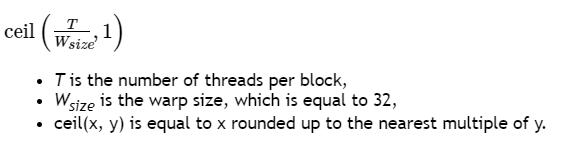

# 第四章 硬件实现
NVIDIA GPU 架构围绕可扩展的多线程流式多处理器 (SM: Streaming Multiprocessors) 阵列构建。当主机 CPU 上的 CUDA 程序调用内核网格时，网格的块被枚举并分发到具有可用执行能力的多处理器。一个线程块的线程在一个SM上并发执行，多个线程块可以在一个SM上并发执行。当线程块终止时，新块在空出的SM上启动。

SM旨在同时执行数百个线程。为了管理如此大量的线程，它采用了一种称为 SIMT（Single-Instruction, Multiple-Thread: 单指令，多线程）的独特架构，在 [SIMT 架构](https://docs.nvidia.com/cuda/cuda-c-programming-guide/index.html#simt-architecture)中进行了描述。这些指令是流水线的，利用单个线程内的指令级并行性，以及通过同时硬件多线程处理的广泛线程级并行性，如[硬件多线程](https://docs.nvidia.com/cuda/cuda-c-programming-guide/index.html#hardware-multithreading)中详述。与 CPU 内核不同，它们是按顺序发出的，没有分支预测或推测执行。

[SIMT 架构](https://docs.nvidia.com/cuda/cuda-c-programming-guide/index.html#simt-architecture)和[硬件多线程](https://docs.nvidia.com/cuda/cuda-c-programming-guide/index.html#hardware-multithreading)描述了所有设备通用的流式多处理器的架构特性。 [Compute Capability 3.x、Compute Capability 5.x、Compute Capability 6.x 和 Compute Capability 7.x](https://docs.nvidia.com/cuda/cuda-c-programming-guide/index.html#compute-capability-3-0) 分别为计算能力 3.x、5.x、6.x 和 7.x 的设备提供了详细信息。

NVIDIA GPU 架构使用 little-endian 表示。 

## 4.1 SIMT 架构

多处理器以 32 个并行线程组（称为 warp）的形式创建、管理、调度和执行线程。组成 warp 的各个线程一起从同一个程序地址开始，但它们有自己的指令地址计数器和寄存器状态，因此可以自由地分支和独立执行。warp一词源于编织，这是第一个并行线程技术。半warp是warp的前半部分或后半部分。四分之一经线是warp的第一、第二、第三或第四四分之一。

当一个多处理器被赋予一个或多个线程块来执行时，它将它们划分为warp，并且每个warp都由warp调度程序调度以执行。一个块被分割成warp的方式总是一样的；每个warp包含连续的线程，增加线程ID，第一个warp包含线程0。[线程层次结构](https://docs.nvidia.com/cuda/cuda-c-programming-guide/index.html#thread-hierarchy)描述了线程ID如何与块中的线程索引相关。

一个 warp 一次执行一条公共指令，因此当一个 warp 的所有 32 个线程都同意它们的执行路径时，就可以实现完全的效率。如果 warp 的线程通过依赖于数据的条件分支发散，则 warp 执行所采用的每个分支路径，禁用不在该路径上的线程。分支分歧只发生在一个warp内；不同的 warp 独立执行，无论它们是执行公共的还是不相交的代码路径。

SIMT 体系结构类似于 SIMD（单指令多数据）向量组织，其中单指令控制多个处理元素。一个关键区别是 SIMD 矢量组织向软件公开了 SIMD 宽度，而 SIMT 指令指定单个线程的执行和分支行为。与 SIMD 向量机相比，SIMT 使程序员能够为独立的标量线程编写线程级并行代码，以及为协调线程编写数据并行代码。为了正确起见，程序员基本上可以忽略 SIMT 行为；但是，通过代码很少需要warp中的线程发散，可以实现显着的性能改进。在实践中，这类似于传统代码中缓存线的作用：在设计正确性时可以安全地忽略缓存线大小，但在设计峰值性能时必须在代码结构中考虑。另一方面，向量架构需要软件将负载合并到向量中并手动管理分歧。

在 Volta 之前，warp 使用在 warp 中的所有 32 个线程之间共享的单个程序计数器以及指定 warp 的活动线程的活动掩码。结果，来自不同区域或不同执行状态的同一warp的线程无法相互发送信号或交换数据，并且需要细粒度共享由锁或互斥锁保护的数据的算法很容易导致死锁，具体取决于来自哪个warp竞争线程。

从 Volta 架构开始，独立线程调度允许线程之间的完全并发，而不管 warp。使用独立线程调度，GPU 维护每个线程的执行状态，包括程序计数器和调用堆栈，并且可以在每个线程的粒度上产生执行，以便更好地利用执行资源或允许一个线程等待数据由他人生产。调度优化器确定如何将来自同一个 warp 的活动线程组合成 SIMT 单元。这保留了与先前 NVIDIA GPU 一样的 SIMT 执行的高吞吐量，但具有更大的灵活性：线程现在可以在 sub-warp 粒度上发散和重新收敛。

如果开发人员对先前硬件架构的 warp-synchronicity2 做出假设，独立线程调度可能会导致参与执行代码的线程集与预期的完全不同。特别是，应重新访问任何warp同步代码（例如无同步、内部warp减少），以确保与 Volta 及更高版本的兼容性。有关详细信息，请参阅[计算能力 7.x](https://docs.nvidia.com/cuda/cuda-c-programming-guide/index.html#compute-capability-7-x)。

**注意:**

**参与当前指令的 warp 线程称为活动线程，而不在当前指令上的线程是非活动的（禁用）。线程可能由于多种原因而处于非活动状态，包括比其 warp 的其他线程更早退出，采用与 warp 当前执行的分支路径不同的分支路径，或者是线程数不是线程数的块的最后一个线程warp尺寸的倍数。**

如果 warp 执行的非原子指令为多个 warp 的线程写入全局或共享内存中的同一位置，则该位置发生的序列化写入次数取决于设备的计算能力（参见 [Compute Capability 3.x、Compute Capability 5.x、Compute Capability 6.x 和 Compute Capability 7.x](https://docs.nvidia.com/cuda/cuda-c-programming-guide/index.html#compute-capability-3-0)），哪个线程执行最终写入是未定义的。

如果一个由 warp 执行的[原子指令](https://docs.nvidia.com/cuda/cuda-c-programming-guide/index.html#atomic-functions)读取、修改和写入全局内存中多个线程的同一位置，则对该位置的每次读取/修改/写入都会发生并且它们都被序列化，但是它们发生的顺序是不确定的。

## 4.2 硬件多线程
多处理器处理的每个 warp 的执行上下文（程序计数器、寄存器等）在 warp 的整个生命周期内都在芯片上维护。因此，从一个执行上下文切换到另一个执行上下文是没有成本的，并且在每个指令发出时，warp 调度程序都会选择一个线程准备好执行其下一条指令（warp 的[活动线程](https://docs.nvidia.com/cuda/cuda-c-programming-guide/index.html#simt-architecture__notes)）并将指令发布给这些线程.

特别是，每个多处理器都有一组 32 位寄存器，这些寄存器在 warp 之间进行分区，以及在线程块之间进行分区的并行数据缓存或共享内存。

对于给定内核，可以在多处理器上一起驻留和处理的块和warp的数量取决于内核使用的寄存器和共享内存的数量以及多处理器上可用的寄存器和共享内存的数量。每个多处理器也有最大数量的驻留块和驻留warp的最大数量。这些限制以及多处理器上可用的寄存器数量和共享内存是设备计算能力的函数，在附录[计算能力](https://docs.nvidia.com/cuda/cuda-c-programming-guide/index.html#compute-capabilities)中给出。如果每个多处理器没有足够的寄存器或共享内存来处理至少一个块，内核将无法启动。

一个块中的warp总数如下：

为块分配的寄存器总数和共享内存总量记录在 CUDA 工具包中提供的 CUDA Occupancy Calculator中。