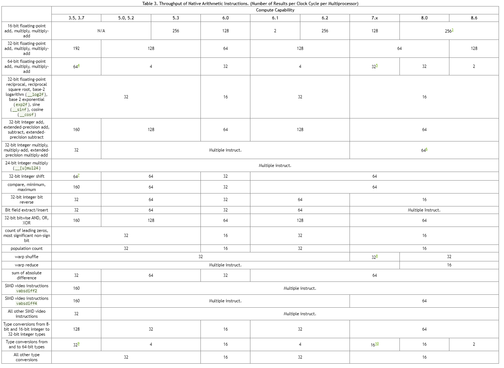

# 第五章 性能指南

## 5.1 性能优化策略总览

性能优化围绕四个基本策略：

* 最大化并行执行以实现最大利用率；
* 优化内存使用，实现最大内存吞吐量；
* 优化指令使用，实现最大指令吞吐量；
* 尽量减少内存抖动。
  

一个策略能否为应用程序的特定部分产生最佳性能增益，取决于这一部分的性能限制原因； 例如，优化主要受访存限制的内核的指令使用不会产生任何显着的性能提升。 因此，应该通过测量和监控性能限制来不断指导优化工作，例如使用 CUDA Profiler 。 此外，将特定内核的浮点运算吞吐量或内存吞吐量（以更有意义的为准）与设备的相应峰值理论吞吐量进行比较，可以确定内核还有多少改进空间。

## 5.2 最大化使用率
为了最大限度地提高利用率，应用程序的结构应该尽可能多地体现并行性，并有效地将这种并行性映射到系统的各个组件，使其在大部分时间都处于忙碌状态。

### 5.2.1 Application Level
在宏观层次上，应用程序应该使用异步函数调用和[异步并发执行](https://docs.nvidia.com/cuda/cuda-c-programming-guide/index.html#asynchronous-concurrent-execution)中描述的 Stream 来最大化主机、设备、以及将主机与设备相连的总线之间的并行执行。同时应用程序应该为不同的处理器分配它最擅长的工作类型：将串行任务发送给主机；将并行任务发送给设备。

对于并行任务来说，在算法中，由于某些线程需要同步以便彼此共享数据，因此并行性被破坏，这种有两种情况： 第一种情况是这些线程属于同一个块，在这种情况下，应使用 `__syncthreads ()` 进行同步并在同一个内核调用中通过共享内存来共享数据；另一种情况是它们属于不同的块，在这种情况下，它们必须通过全局内存来共享数据，并使用两个单独的内核调用，一个调用用于向全局内存写入，另一个调用用于从全局内存读取。第二种情况的性能会不太理想，因为它增加了额外内核调用以及全局内存移动的开销。因此，应该将算法映射到 CUDA 编程模型，使需要线程间通信的计算尽可能在单个线程块内执行，从而最大限度地减少第二种情况的发生。

### 5.2.2 Device Level
在次低的层面上，应用程序应该最大化设备中 SM 之间的并行执行。

多个内核可以在一个设备上并发执行，因此也可以通过使用 Stream 来启用足够多的内核来实现设备的利用率最大化，如[异步并发执行](https://docs.nvidia.com/cuda/cuda-c-programming-guide/index.html#asynchronous-concurrent-execution)中所述。

### 5.2.3 Multiprocessor Level
在更低的层次上，应用程序应该最大化 SM 内不同功能单元之间的并行执行。

如硬件多线程中所述，GPU SM 主要依靠线程级并行性来最大限度地利用其功能单元。因此，资源利用率与 SM 中常驻 Warp 的数量直接相关。每当指令发射时，Warp 调度器会选择一条准备好执行的指令，该指令可以是相同 Warp 中的另一条独立指令，这样可以利用指令级并行性；更常见的是发射另一个 Warp 的指令，利用线程级并行性。如果准备执行的指令已经选择好，则将其发射到 Warp 的活动线程中。Warp 准备好执行下一条指令所需的时钟周期数称为 时延 (Lantency)，并且，如果所有 Warp 调度器在时延期间的每个时钟周期上都有一些可以发射的指令，那么 GPU 就可以实现完全利用，换句话说，时延隐藏 (hidden) 时系统利用率达到最大。对具有 L 个时钟周期的时延进行隐藏所需的指令数量取决于指令自身的吞吐量（有关各种算术指令的吞吐量，请参见[算术指令](https://docs.nvidia.com/cuda/cuda-c-programming-guide/index.html#arithmetic-instructions)）。如果假设指令具有最大吞吐量，则需要的指令数量等于： 

* 对于计算能力 5.x、6.1、6.2、7.x 和 8.x 的设备来说，该值为 4L。因为对于这些设备，SM 在一个时钟周期内为每个 Warp 发出一条指令，一次四个 warp，如[计算能力](https://docs.nvidia.com/cuda/cuda-c-programming-guide/index.html#compute-capabilities)中所述。
* 对于计算能力 6.0 的设备，该值为2L。因为对于这些设备，每个时钟周期发射两条指令，两个不同的warp各有一条指令。
* 对于计算能力 3.x 的设备，该值为8L。因为对于这些设备，每个周期发射八条指令，分为四对，用于四个不同的warp，每对都用于相同的warp。

Warp 未准备好执行下一条指令的最常见原因是该指令的输入操作数尚不可用。

如果所有输入操作数都是寄存器操作数，则时延是由寄存器依赖导致的，也就是：一些输入操作数由一些先前尚未完成的指令来写入。在这种情况下，时延等于前一条指令的执行时间，Warp 调度器在此期间会需要调度其他 Warp 的指令。执行时间因指令而异。在计算能力 7.x 的设备上，大多数算术指令通常需要 4 个时钟周期。这意味着每个 SM 需要 16 个活动 warp（4 个周期，4 个 warp 调度器）来隐藏算术指令延迟（假设 Warp 以最大吞吐量执行指令，否则不需要这么多 Warp）。如果各个 Warp 表现出指令级并行性，也就是在它们的指令流中有多个相互独立指令，则需要更少的warp，这是因为多个独立指令可以从一个 Warp 中连续发出。

如果某些输入操作数驻留在片外存储器中，则它的时延会高很多，通常为数百个时钟周期。在如此高的延迟期间，保持 Warp 调度器忙碌所需的 Warp 数量取决于内核代码及其指令级并行度。如果没有片外存储操作数的指令数(即大多数情况下的算术指令)比有片外内存操作数的指令数的比率低的多(这个比率通常被称为程序的算术强度)，那么通常需要更多的 Warp。 


Warp 未准备好执行其下一条指令的另一个原因是由于其处于某个内存栅栏 (memory fence)（[内存栅栏函数](https://docs.nvidia.com/cuda/cuda-c-programming-guide/index.html#memory-fence-functions)）或同步点 (synchronization point)（[同步函数](https://docs.nvidia.com/cuda/cuda-c-programming-guide/index.html#synchronization-functions)）处等待。随着越来越多的 Warp 陷入等待同一个块中的其他 Warp 完成同步点之前指令执行的状态，SM 会因为同步点而强制陷入空闲。在这种情况下，每个 SM 拥有多个常驻块有助于减少空闲，因为来自不同块的 Warp 不需要在同步点进行等待。


对于一个内核调用来说，驻留在每个 SM 上的块和 Warp 的数量取决于调用的执行配置（[执行配置](https://docs.nvidia.com/cuda/cuda-c-programming-guide/index.html#execution-configuration)）、SM 的内存资源以及内核的资源需求，如[硬件多线程](https://docs.nvidia.com/cuda/cuda-c-programming-guide/index.html#hardware-multithreading)中所述。使用 `--ptxas-options=-v` 选项编译时，编译器会报告寄存器和共享内存的使用情况。


一个块所需的共享内存总量等于静态分配的共享内存量和动态分配的共享内存量之和。


内核使用的寄存器数量会对常驻 Warp 的数量产生重大影响。例如，对于计算能力为 6.x 的设备，如果内核使用 64 个寄存器并且每个块有 512 个线程并少量的共享内存，那么在多处理器上可以常驻两个块（即 32 个 warp），因为当前配置需要 $2\times512\times64$ 个寄存器，这个值与 SM 上可用的寄存器数量匹配。但是一旦内核多使用一个寄存器，就只能在 SM 上常驻一个块（即 16 个 warp），因为两个块需要 2x512x65 个寄存器，这比 SM 上可用的寄存器的数量多。因此，编译器会尽量减少寄存器的使用，同时保持寄存器溢出（请参阅[设备内存访问](https://docs.nvidia.com/cuda/cuda-c-programming-guide/index.html#device-memory-accesses)）和最少的指令数量。使用 `maxrregcount` 编译器选项或启动边界，如[启动边界](https://docs.nvidia.com/cuda/cuda-c-programming-guide/index.html#launch-bounds)中所述来控制寄存器的使用。

寄存器文件按 32 位寄存器进行组织。因此，存储在寄存器中的每个变量都需要至少一个 32 位寄存器，例如，double 变量使用了两个 32 位寄存器。

对于给定的内核调用，执行配置对性能的影响通常取决于内核代码。因此建议通过实验确定执行配置。应用程序还可以根据寄存器文件大小和共享内存大小对执行配置进行参数化，这取决于设备的计算能力、设备的 SM 数量以及内存带宽，这些信息都可以使用运行时进行查询（参见参考手册）。

每个块的线程数应按 Warp 大小的整数倍进行选择，尽可能避免在填充不足的 Warp 上进行计算，这会浪费计算资源。

#### 5.2.3.1 Occupancy Calculator
有几个 API 函数来帮助程序员根据寄存器和共享内存的大小要求选择适合的线程块大小。

* 占用计算 (Occupancy Calculator) API，`cudaOccupancyMaxActiveBlocksPerMultiprocessor`，可以根据内核的块大小和共享内存使用情况提供占用预测。此函数根据每个 SM 的并发线程块数量报告占用情况。
  * **注意，此值可以转换为其他指标。该值乘以每个块的 Warp 数可得每个 SM 的并发 Warp 数；进一步，将并发 Warp 数除以每个 SM 的最大 Warp 数可得占用率的百分比。**

*  基于占用率的启动配置 API，`cudaOccupancyMaxPotentialBlockSize` 和 `cudaOccupancyMaxPotentialBlockSizeVariableSMem`，启发式计算实现 SM-level 的最大占用率所对应的执行配置。

以下代码示例展示了计算 MyKernel 的占用率。然后，通过计算并发 Warp 数与每个 SM 的最大 Warp 之间的比值输出occupancy level  。
```C++
/ Device code
__global__ void MyKernel(int *d, int *a, int *b)
{
    int idx = threadIdx.x + blockIdx.x * blockDim.x;
    d[idx] = a[idx] * b[idx];
}

// Host code
int main()
{
    int numBlocks;        // Occupancy in terms of active blocks
    int blockSize = 32;

    // These variables are used to convert occupancy to warps
    int device;
    cudaDeviceProp prop;
    int activeWarps;
    int maxWarps;

    cudaGetDevice(&device);
    cudaGetDeviceProperties(&prop, device);
    
    cudaOccupancyMaxActiveBlocksPerMultiprocessor(
        &numBlocks,
        MyKernel,
        blockSize,
        0);

    activeWarps = numBlocks * blockSize / prop.warpSize;
    maxWarps = prop.maxThreadsPerMultiProcessor / prop.warpSize;

    std::cout << "Occupancy: " << (double)activeWarps / maxWarps * 100 << "%" << std::endl;
    
    return 0;
}
```

下面的代码示例展示了根据用户输入配置了一个基于占用率的内核启动 MyKernel。
```C++
// Device code
__global__ void MyKernel(int *array, int arrayCount)
{
    int idx = threadIdx.x + blockIdx.x * blockDim.x;
    if (idx < arrayCount) {
        array[idx] *= array[idx];
    }
}

// Host code
int launchMyKernel(int *array, int arrayCount)
{
    int blockSize;      // The launch configurator returned block size
    int minGridSize;    // The minimum grid size needed to achieve the
                        // maximum occupancy for a full device
                        // launch
    int gridSize;       // The actual grid size needed, based on input
                        // size

    cudaOccupancyMaxPotentialBlockSize(
        &minGridSize,
        &blockSize,
        (void*)MyKernel,
        0,
        arrayCount);

    // Round up according to array size
    gridSize = (arrayCount + blockSize - 1) / blockSize;

    MyKernel<<<gridSize, blockSize>>>(array, arrayCount);
    cudaDeviceSynchronize();

    // If interested, the occupancy can be calculated with
    // cudaOccupancyMaxActiveBlocksPerMultiprocessor

    return 0;
}
```

CUDA 工具包还提供了一个自文档化的，独立的占用率计算器和启动配置器，它们实现在<CUDA_Toolkit_Path>/include/cuda_occupancy.h中，用于那些不能依赖 CUDA Stack 的用例。 除此之外，我们还提供了占用计算器的电子表格版本。 电子表格版本作为一种学习工具特别有用，它可以对影响占用率的参数（块大小、每个线程的寄存器和每个线程的共享内存）的影响进行可视化。


## 5.3 最大化存储吞吐量
最大化应用程序的整体内存吞吐量的第一步是最小化那些低带宽的数据传输。

如 [主机和设备之间的数据传输](https://docs.nvidia.com/cuda/cuda-c-programming-guide/index.html#data-transfer-between-host-and-device) 中所述，这需要我们最大限度地减少主机和设备之间的数据传输，因为它们的带宽比全局内存和设备之间的数据传输低得多。

这也需要我们最大化片上内存的使用来最小化全局内存和设备之间的数据传输：共享内存和缓存（即计算能力 2.x 及以上版本的设备中可用的 L1 缓存和 L2 缓存；同时也包括纹理缓存和常量缓存，它们适用于所有设备）。

共享内存是一种用户可管理的缓存：应用程序可以显式分配它和访问它。 如 [CUDA Runtime](https://docs.nvidia.com/cuda/cuda-c-programming-guide/index.html#cuda-c-runtime) 所示，典型的程序模式是将来自设备内存的数据暂存到共享内存中； 换句话说，对于一个块中的每个线程：
* 将数据从设备内存加载到共享内存，
* 通过与块中的其他线程进行同步，使得每个线程可以安全地读取由不同线程填充的共享内存位置，
* 处理共享内存中的数据，
* 如有必要，可以通过同步以确保共享内存中的结果已更新，
* 将结果写回到设备内存。

对于某些应用程序（例如，全局内存访问模式是数据依赖的），使用传统的硬件管理缓存的方法会更好地利用数据局部性。如 Compute Capability 3.x、Compute Capability 7.x 和 Compute Capability 8.x 中所述，对于计算能力 3.x、7.x 和 8.x 的设备，它们用于 L1 和共享内存的片上存储器数量一致，并可针对每个内核调用的情况对 L1 以及共享内存的使用量进行针对性配置。

根据不同内存类型的访问模式，内核访问内存的吞吐量会发生数量级程度的变化。因此，最大化内存吞吐量的下一步是根据 [设备内存访问](https://docs.nvidia.com/cuda/cuda-c-programming-guide/index.html#device-memory-accesses) 中描述的最佳内存访问模式，尽可能优化地组织内存访问方式。这种优化对于全局内存访问尤为重要，因为与可用的片上带宽和算术指令吞吐量相比，全局内存带宽较低，因此非最佳的全局内存访问方式通常会对性能产生很大影响。

### 5.3.1 设备与主机之间的数据传输
应用程序应尽量减少主机和设备之间的数据传输。 实现这一点的一种方法是将更多代码从主机移动到设备，即使在设备中运行的内核无法提供足够的并行性以达到最优效率。 中间数据结构可以在设备内存中创建，由设备操作，并在无主机映射或复制到主机内存的情况下销毁。

此外，由于每次传输都会产生开销的原因，因此将许多小批量的传输转换为单个的大传输总是比单独进行小传输时执行得更好。

在具有前端总线的系统中，实现主机和设备之间的更高性能的数据是通过使用锁页主机内存来实现的，如[锁页主机内存](https://docs.nvidia.com/cuda/cuda-c-programming-guide/index.html#page-locked-host-memory)中所述。

此外，在使用映射锁页内存 (mapped page-locked memory)（[Mapped Memory](https://docs.nvidia.com/cuda/cuda-c-programming-guide/index.html#mapped-memory)）时，无需分配任何设备内存，也无需在设备和主机内存之间进行显式数据复制。 每次内核访问映射内存时都会隐式执行数据传输。 为了获得最佳性能，这些内存访问必须与全局内存访问合并（请参阅[设备内存访问](https://docs.nvidia.com/cuda/cuda-c-programming-guide/index.html#device-memory-accesses)）。 如果需要被映射的内存只被读取或写入了一次，那么使用映射锁页内存，而不是设备和主机内存之间的显式复制，可以提高性能。

对于设备内存和主机内存在物理上相同的集成系统来说，主机和设备内存之间的任何复制都是多余的，应使用映射锁页内存。 应用程序可以通过查询集成设备属性（请参阅[设备枚举](https://docs.nvidia.com/cuda/cuda-c-programming-guide/index.html#device-enumeration)）是否等于 1 来确认设备是否集成。

### 5.3.2 设备内存访问
访问可寻址内存（即全局、本地、共享、常量或纹理内存）的指令可能需要多次重发射，这具体取决于内存地址在 Warp 线程中的分布。而对于不同类型的内存，地址分布是如何以这种方式影响指令吞吐量的，将在下面的部分中进行描述。 例如，一般的，对于全局内存来说，地址越分散，吞吐量就越低。

**全局内存**

全局内存驻留在设备内存中，设备内存通过 32、64 或 128 字节的内存事务访问。这些内存事务必须是自然对齐的：只有按 32字节、64字节或128字节大小进行对齐的设备内存段(即，其第一个地址是其大小的倍数) 才能被内存事务读写。

当一个 Warp 执行一条访问全局内存的指令时，它会将 Warp 内的线程的访问合并为一个或多个内存事务，这具体取决于每个线程访问的大小以及内存地址在线程间的分布。一般来说，需要的事务内存越多，由线程访问而传输来的未使用字也越多，这就相应地降低了指令吞吐量。例如，如果每个线程的 4 字节访问生成了一个 32 字节的内存事务，则吞吐量除以 8。

需要多少事务以及最终影响多少吞吐量取决于设备的计算能力。 如何为各种计算能力的设备处理全局内存访问，[Compute Capability 3.x、Compute Capability 5.x、Compute Capability 6.x、Compute Capability 7.x 和 Compute Capability 8.x](https://docs.nvidia.com/cuda/cuda-c-programming-guide/index.html#compute-capability-3-0) 中提供了更多详细信息。

为了最大化全局内存吞吐量，以下方式的最大化合并非常重要：

* 遵循 [Compute Capability 3.x、Compute Capability 5.x、Compute Capability 6.x、Compute Capability 7.x 和 Compute Capability 8.x](https://docs.nvidia.com/cuda/cuda-c-programming-guide/index.html#compute-capability-3-0) 的最佳访问模式
* 使用满足以下“Size and Alignment Requirement”部分中详述的大小和对齐要求的数据类型，
* 在某些情况下对数据进行填充，例如，在访问二维数组时，如下面的二维数组部分所述。

**Size and Alignment Requirement  **

全局内存指令支持读写大小等于 1、2、4、8 或 16 字节的字。 当且仅当数据类型的大小为 1、2、4、8 或 16 字节并且数据对齐（即，其地址是该大小的整数倍）。

如果未满足大小 (Size) 和对齐 (Alignment) 要求，则访问将被编译成交错访问模式的多个指令，这阻止这些指令完全合并。 因此，对于驻留在全局内存中的数据，建议使用满足此类要求的数据类型。

[内置矢量类型](https://docs.nvidia.com/cuda/cuda-c-programming-guide/index.html#built-in-vector-types)自动满足对齐要求。

对于结构，大小和对齐要求可以由编译器使用对齐说明符 `__align__(8)` 或 `__align__(16)` 强制执行，例如:
```C++
struct __align__(8) {
    float x;
    float y;
};

struct __align__(16) {
    float x;
    float y;
    float z;
};
```

驻留在全局内存中，或由驱动程序或运行时API的某个内存分配例程返回的变量的任何地址总是对齐到至少256字节。

读取非自然对齐的 8 字节或 16 字节字会产生不正确的结果（相差几个字），因此必须特别小心地将这些类型的任何值或数组值的起始地址保持对齐。 一个可能容易被忽视的典型情况是：使用一些自定义全局内存分配方案时，多个数组的分配（多次调用 `cudaMalloc()` 或 `cuMemAlloc()`）被替换为对单个大块内存的分区分配，在这种情况下，每个数组的起始地址都与块的起始地址有偏移。

**二维数组**

一个常见的全局内存访问模式是：索引 `(tx,ty)` 的每个线程使用以下地址访问一个宽度为 `width` 的二维数组中的元素时，位于 `type*` 类型的地址 `BaseAddress` （其中 type 满足在 [最大化使用率]() 中描述的要求要求）：

`BaseAddress + width * ty + tx`

为了让这些访问完全合并，线程块的宽度和数组的宽度都必须是 Warp 大小的整数倍。

特别是，对于那些宽度不是 Warp 大小的倍数的数组，如果它实际分配的宽度为 Warp 的整数倍，并对应地填充空行，那么数组的访问效率会更高。 参考手册中描述的 `cudaMallocPitch()` 和 `cuMemAllocPitch()` 函数以及相关的内存复制函数使程序员能够编写不依赖于硬件的代码来分配符合这些约束的数组。

**本地内存**

本地内存访问仅发生在 [可变内存空间说明符](https://docs.nvidia.com/cuda/cuda-c-programming-guide/index.html#variable-memory-space-specifiers) 中提到的某些自动变量中。 编译器可能放置在本地内存中的变量有：

* 无法确定它们是否以常数索引的数组，
* 会占用过多寄存器空间的大型结构或数组，
* 如果内核使用的寄存器多于可用寄存器（这也称为寄存器溢出），那么任何变量都会放到本地内存。

通过对 `PTX` 汇编代码进行审查（通过使用 `-ptx` 或 `-keep` 选项进行编译），可以判断在第一个编译阶段是否已将变量放置到本地内存中，因为编译器会使用 `.local` 助记符声明和 `ld.local` 和 `st.local` 助记符访问。即使当前没有，如果编译器发现内核为目标体系结构消耗了过多的寄存器空间，则后续编译阶段可能仍会将其放入本地内存：使用 `cuobjdump` 检查 `cubin` 对象判断是否出现了这种情况。此外，当使用 `--ptxas-options=-v` 选项编译时，编译器会报告每个内核的总本地内存使用量(`lmem`) 。请注意，某些数学函数可能具有访问本地内存的实现路径。

本地内存空间驻留在**设备内存**中，因此本地内存访问与全局内存访问具有相同的高延迟和低带宽，并且与 [设备内存访问]() 中所述的内存合并要求相同。然而，本地存储的组织方式是通过连续的线程 ID 访问连续的 32 位字。因此，只要一个 Warp 中的所有线程访问相同的相对地址（例如，数组变量中的相同索引，结构变量中的相同成员），访问就会完全合并。

在某些计算能力 3.x 的设备上，本地内存访问始终缓存在 L1 和 L2 中，其方式与全局内存访问相同（请参阅[计算能力 3.x](https://docs.nvidia.com/cuda/cuda-c-programming-guide/index.html#compute-capability-3-0)）。

在计算能力 5.x 和 6.x 的设备上，本地内存访问始终以与全局内存访问相同的方式缓存在 L2 中（请参阅[计算能力 5.x 和计算能力 6.x](https://docs.nvidia.com/cuda/cuda-c-programming-guide/index.html#compute-capability-5-x)）。

**共享内存**

因为它是片上的，所以共享内存比本地或全局内存具有更高的带宽和更低的延迟。

为了实现高带宽，共享内存被分成大小相等的内存模块，称为 Banks，可以同时访问。因此，对 n 个不同的 memory banks 中的 n 个地址进行的任何内存读写请求都可以同时处理，从而使得总带宽是单个模块带宽的 n 倍。

但是，如果一个内存请求的两个地址落在同一个内存 bank 中，就会发生 bank conflict，访问会转换为串行化进行。硬件会根据需要将 bank 冲突的内存请求拆分为多个单独的无冲突请求，使得吞吐量降低为每个单独内存请求数量的总和。如果单独的内存请求的数量为 n，则称初始内存请求会导致 n-way bank 冲突。

因此，为了获得最佳性能，重要的是要了解内存地址如何映射到内存 bank，并参与到内存请求调度，从而最大限度地减少内存 bank 冲突。这在[计算能力 3.x、计算能力 5.x、计算能力 6.x、计算能力 7.x 和计算能力 8.x](https://docs.nvidia.com/cuda/cuda-c-programming-guide/index.html#compute-capability-3-0) 中针对计算能力 3.x、5.x、6.x 7.x 和 8.x 的设备分别进行了描述。

**常量内存**

常量内存空间驻留在设备内存中，并缓存在常量缓存中。

然后，当初始请求中存在不同的内存地址时，初始请求会按照相同地址为划分拆分为单独请求，从而将吞吐量降低等于单独请求数量的总和。

在缓存命中的情况下，系统会以常量缓存的吞吐量为结果请求提供服务，否则就以设备内存的吞吐量为请求提供服务。

**纹理和表面记忆**  

纹理和表面内存空间驻留在设备内存中，并缓存在纹理缓存中，因此纹理提取或表面读取仅在缓存未命中时从设备内存读取一次内存，否则会从纹理缓存中读取。 纹理缓存针对 2D 空间局部性进行了优化，因此读取 2D 中地址靠近在一起的纹理或表面的同一 warp 的线程将获得最佳性能。 此外，它专为具有恒定时延的流式提取 (stream fetch) 而设计； 缓存命中会降低 DRAM 带宽需求，但不会降低获取时延。

通过纹理或表面获取 (texture or surface fetching) 读取设备内存具有一些优势，可以使其成为从全局或常量内存读取设备内存的有利替代方案：
* 如果内存读取不遵循那些访问模式，它们是全局或常量内存读取必须遵循以获得良好性能的访问模式，则可以实现更高的带宽，前提是纹理提取或表面读取中存在局部性；
* 寻址计算由专用单元在内核外部执行；
* 打包的数据可以在单个操作中广播到单独的变量；
* 8 位和 16 位整数输入数据可以选择转换为 [0.0, 1.0] 或 [-1.0, 1.0] 范围内的 32 位浮点值（请参阅[纹理内存](https://docs.nvidia.com/cuda/cuda-c-programming-guide/index.html#texture-memory)）。

## 5.4 最大化指令吞吐量
为了最大化指令吞吐量，应用程序应该：

* 尽量减少使用低吞吐量的算术指令； 包括在不影响最终结果的情况下通过精度换取速度，例如使用内部函数而不是常规函数（内部函数在[内部函数](https://docs.nvidia.com/cuda/cuda-c-programming-guide/index.html#intrinsic-functions)中列出），使用单精度而不是双精度，或者将非规范化数字赋值为零；
* 最大限度地减少由控制流指令引起的 Warp 发散，如[控制流指令](https://docs.nvidia.com/cuda/cuda-c-programming-guide/index.html#control-flow-instructions)中所述
* 减少指令的数量，例如，尽可能优化同步点（如[同步指令](https://docs.nvidia.com/cuda/cuda-c-programming-guide/index.html#synchronization-instruction)中所述）或使用受限指针（如 [__restrict__](https://docs.nvidia.com/cuda/cuda-c-programming-guide/index.html#restrict) 中所述）。

在本节中，吞吐量以每 SM 的每时钟周期的操作数目给出。 对于 32 大小的 Warp ，一条指令对应 32 次操作，因此若 N 是每个时钟周期的操作数量，则指令吞吐量为 N/32 每时钟周期/指令。

所有吞吐量都是针对单个 SM 的。 整个设备的吞吐量必须乘以设备中的所有 SM 的数量。

### 5.4.1 算数指令
[如下图所示](https://docs.nvidia.com/cuda/cuda-c-programming-guide/index.html#arithmetic-instructions__throughput-native-arithmetic-instructions)


其他指令和函数是在 Native 指令之上实现的。计算能力不同的设备可能有不同的实现，编译后的 Native 指令的数量可能会随着编译器版本的不同而变化。对于复杂的函数，可能有多个代码路径，具体取决于输入。 `cuobjdump` 可用于检查 `cubin` 对象中的特定实现。

一些函数的实现在 CUDA 头文件（`math_functions.h、device_functions.h`、...）中很容易获得。

通常，使用 `-ftz=true` 编译的代码（非规范化数字刷新为零）往往比使用 `-ftz=false` 编译的代码具有更高的性能。类似地，使用 `-prec-div=false`（不太精确的除法）编译的代码往往比使用 `-prec-div=true` 编译的代码具有更高的性能，使用 `-prec-sqrt=false`（不太精确的平方根）编译的代码往往比使用 `-prec-sqrt=true` 编译的代码具有更高的性能。 nvcc 用户手册更详细地描述了这些编译标志。 

**Single-Precision Floating-Point Division**

`__fdividef(x, y)`（参见[内部函数](https://docs.nvidia.com/cuda/cuda-c-programming-guide/index.html#intrinsic-functions)）提供了比除法运算符更快的单精度浮点除法。

**Single-Precision Floating-Point Reciprocal Square Root**

为了保留 IEEE-754 语义，编译器会将 `1.0 / sqrtf()` 优化为 `rsqrtf()`，这种情况只发生在倒数与平方根都相近时（即 `-prec-div=false` 和 `-prec-sqrt=false`）。 因此，如果需要时，建议直接调用 `rsqrtf()`。

**Single-Precision Floating-Point Square Root**

单精度浮点平方根的实现是先取倒数的平方根，然后取倒数，而不是在计算倒数平方根后跟乘法，因此它在 0 和无穷大情况下提供正确的结果。

**Sine and Cosine**

`sinf(x)`、`cosf(x)`、`tanf(x)`、`sincosf(x)` 和相应的双精度指令更为昂贵，同时如果参数 x 的量级很大，则更是如此。

更准确地说，参数缩减代码（参见实现的[数学函数](https://docs.nvidia.com/cuda/cuda-c-programming-guide/index.html#mathematical-functions)）包括两个代码路径，分别称为快速路径和慢速路径。

快速路径用于大小足够小的参数，它基本由几个乘加运算组成。 慢速路径用于量级较大的参数，包含了许多冗长的计算，因为需要在整个参数范围内获得正确结果。

目前，三角函数的参数缩减代码在单精度函数量级小于 `105615.0f`，双精度函数量级小于 `2147483648.0` 时选择快速路径。

由于慢速路径比快速路径需要更多的寄存器，因此会在本地内存中存储一些中间变量来降低慢速路径的寄存器压力，但是因为本地内存的高延迟和带宽（请参阅[设备内存访问](https://docs.nvidia.com/cuda/cuda-c-programming-guide/index.html#device-memory-accesses)）的原因，这可能会而影响性能。 目前，单精度函数使用 28 字节的本地内存，双精度函数使用 44 字节。 并且，确切的本地内存数量可能会发生变化。

由于在慢路径中需要进行冗长的计算和使用本地内存，当需要进行慢路径缩减时，与快速路径缩减相比，这些三角函数的吞吐量会低一个数量级。

**Integer Arithmetic**

整数除法和模运算的成本很高，因为它们最多可编译为 20 条指令。 在某些情况下，可以用位运算代替除法和取模运算：如果 n 是 2 的幂，则 `(i/n)` 等价于 `(i>>log2(n))` 并且 `(i%n)` 等价于` (i&(n- 1))`; 如果 n 是字母，则编译器会执行这些转换。

`__brev` 和 `__popc` 将映射为一条指令，而 `__brevll` 和 `__popcll` 将映射为几条指令。

`__[u]mul24` 是遗留内部函数，在任何情况下都不应该使用。

**Half Precision Arithmetic**

为了实现 16 位精度浮点加、乘或乘加的良好性能，建议使用 `half2` 数据类型替换 `half` 精度，使用 `__nv_bfloat162` 替换 `__nv_bfloat16` 精度， 并使用 `vector intrinsics` 函数（例如 `__hadd2、__hsub2、__hmul2、__hfma2`）在一条指令中执行两个操作。 使用 `half2` 或 `__nv_bfloat162` 代替使用 `half` 或 `__nv_bfloat16` 的两个调用也可能有助于提升其他 intrinsics 函数的性能，例如 Warp Shuffles。

提供了intrinsics 的 `__halves2half2` 以将两个 `half`精 度值转换为 `half2` 数据类型。

提供了 intrinsics 的 `__halves2bfloat162` 以将两个 `__nv_bfloat` 精度值转换为 `__nv_bfloat162` 数据类型。

**Type Conversion**

有时，编译器必须插入转换指令，而这引入了额外的执行周期。 具体情况如下：

* 对 `char` 或 `short` 类型进行操作的函数，其操作数通常需要转换为 `int`，
* （由 C/C++ 标准规定）单精度浮点计算的输入会转换为双精度浮点常量（即转换为那些没有任何类型后缀定义的常量）。


最后一种情况可以通过使用单精度浮点常量来避免，这些常量使用 f 后缀定义，例如 `3.141592653589793f`、`1.0f`、`0.5f`。

### 5.4.2 控制流指令
任何流控制指令（`if、switch、do、for、while`）都会导致同一个 Warp 中的线程发散（即遵循不同的执行路径），并显着影响有效指令的吞吐量。如果发生这种情况，则必须对不同的执行路径进行序列化，从而增加 Warp 执行的指令总数。

在控制流依赖线程 ID 的情况下， 为了获得最佳性能，应设计控制条件来最小化 Warp 发散的数量。这是可能实现的，因为一个线程块中的 Warp 分布是确定性的，如 [SIMT 架构](https://docs.nvidia.com/cuda/cuda-c-programming-guide/index.html#simt-architecture)中所说。一个简单的例子是当控制条件仅取决于 `(threadIdx / warpSize)` 时，这里 warpSize 是 Warp 的大小。在这种情况下，由于控制条件与 Warp 完全对齐，因此不会出现 Warp 发散。

如下所述，有时，编译器可能会进行循环展开，或者会通过分支预测来优化短的 if 或 switch 块。在这些情况下，所有 Warp 都不会发散。程序员还可以使用#`pragma unroll` 指令控制循环展开（参见[#pragma unroll](https://docs.nvidia.com/cuda/cuda-c-programming-guide/index.html#pragma-unroll)）。

当使用分支预测时，编译器会执行那些与控制条件相关的所有指令。同时，其中的每条指令都与 per-thread 的状态码或 predicate 相关联，这些状态码或 predicate 会根据控制条件设置为 true 或 false；尽管每个指令都会都会执行，但实际上只有predicate 为 True 的指令被执行。predicate 为 False 的指令不会写入结果，也不计算地址或读取操作数。

### 5.4.3 同步指令
对于计算能力为 3.x 的设备，`__syncthreads()` 的吞吐量为每个时钟周期 128 次操作，对于计算能力为 6.0 的设备，每个时钟周期为 32 次操作，对于计算能力为 7.x 和 8.x 的设备，每个时钟周期为 16 次操作。 对于计算能力为 5.x、6.1 和 6.2 的设备，每个时钟周期 64 次操作。

请注意，`__syncthreads()` 可以会强制 SM 空闲对性能产生影响，如[设备内存访问](https://docs.nvidia.com/cuda/cuda-c-programming-guide/index.html#device-memory-accesses)中所述。

## 5.5最小化内存抖动
经常频繁分配和释放内存的应用程序可能会发现内存分配的函数调用通常会随着时间的推移而变慢，直至达到极限。这很容易预判到，因为这是将内存释放回操作系统并供其自己使用的本质特性。为了在这方面获得最佳性能，我们建议如下：
* 尝试根据手头的问题调整分配大小。不要尝试使用 `cudaMalloc / cudaMallocHost / cuMemCreate` 分配所有可用内存，因为这会强制内存立即驻留并阻止其他应用程序使用该内存，给操作系统的调度程序带来更大的压力；或者也可以阻碍其他使用相同 GPU 的应用程序完全运行。
* 尝试在应用程序的早期以适当大小分配内存，并仅在应用程序对内存没有任何用途时分配内存。减少应用程序中的 `cudaMalloc`+`cudaFree` 调用次数，尤其是在性能关键区域。
* 如果应用程序无法分配足够的设备内存，请考虑使用其他内存类型，例如 `cudaMallocHost` 或 `cudaMallocManaged`，它们的性能可能不高，但可以让应用程序运行下去。
* 对于支持`cudaMallocManaged` 功能的平台，`cudaMallocManaged` 允许超额订阅 (oversubscription)，同时通过正确地使用 `cudaMemAdvise` 策略，将使得应用程序保留 `cudaMalloc` 的大部分（如果不是全部）性能。  在所分配的内存被需要或被预取之前，`cudaMallocManaged` 也不会强制将一个内存分配设置为常驻，这可以减少操作系统调度程序的整体压力并更好地使用 multi-tenet 用例。