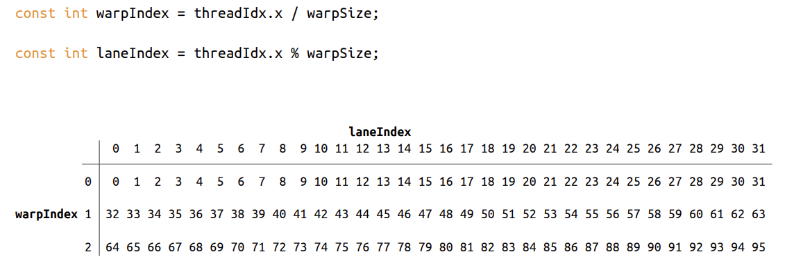
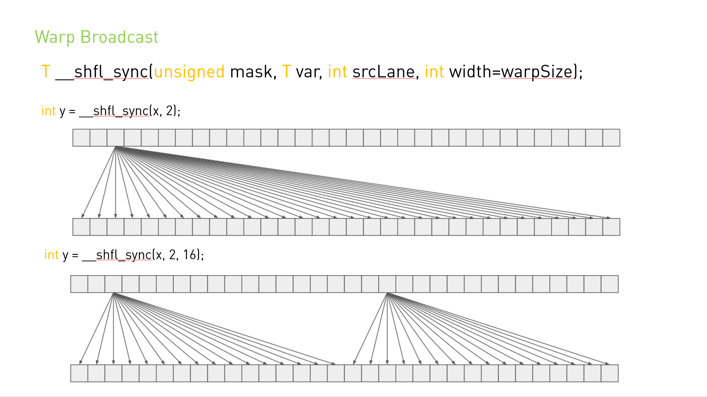
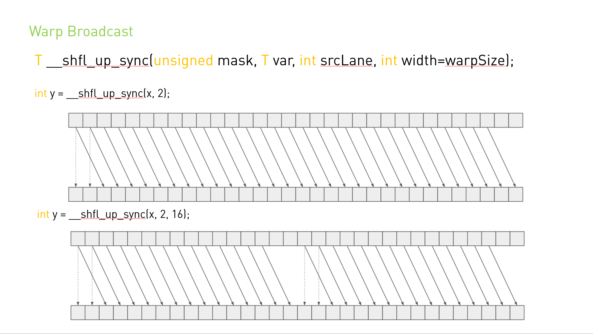
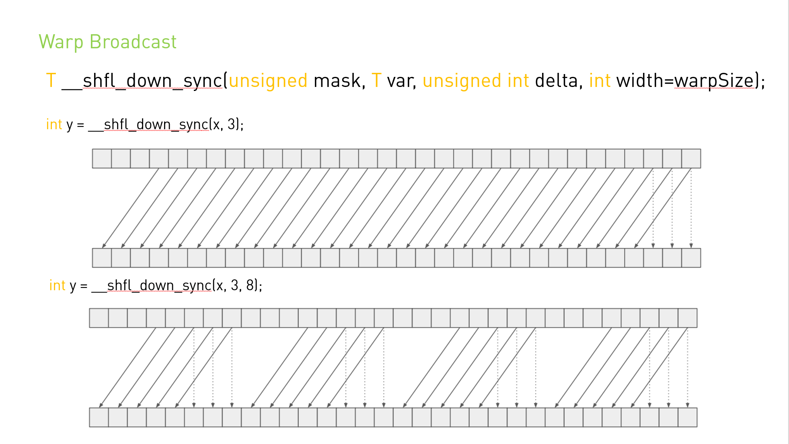
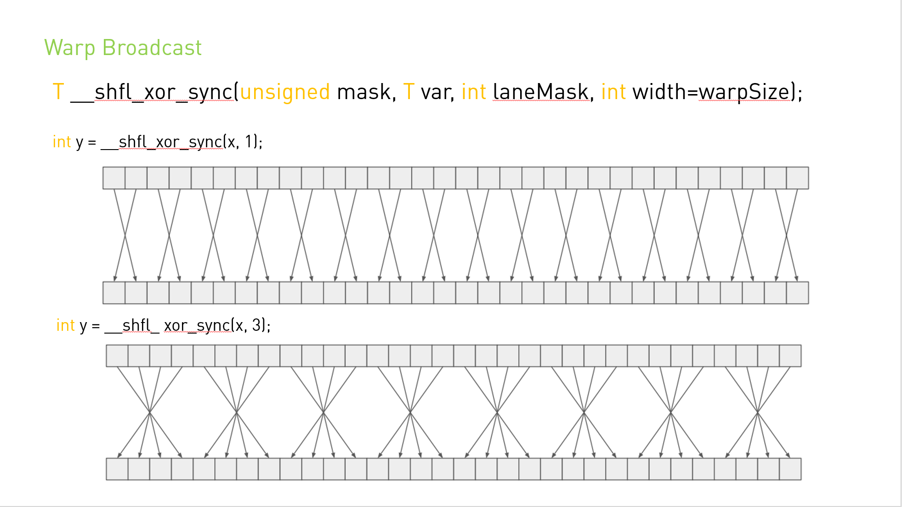

# 附录B 对 C++ 语言扩展的详细描述

## B.1 Function Execution Space Specifiers  
函数执行空间说明符 (`Function Execution Space Specifiers  `) 表示函数是在主机上执行还是在设备上执行，以及它可被主机调用还是可被设备调用。

### B.1.1 \_\_global\_\_
`__global__` 执行空间说明符将函数声明为内核。 它的功能是：

* 在设备上执行，
* 可从主机调用，
* 可在计算能力为 3.2 及以上的设备调用（有关更多详细信息，请参阅 [CUDA 动态并行性](https://docs.nvidia.com/cuda/cuda-c-programming-guide/index.html#cuda-dynamic-parallelism)）。
`__global__` 函数必须具有 void 返回类型，并且不能是类的成员。

对 `__global__` 函数的任何调用都必须指定其执行配置，如[执行配置](https://docs.nvidia.com/cuda/cuda-c-programming-guide/index.html#execution-configuration)中所述。

对 `__global__` 函数的调用是异步的，这意味着它在设备执行完成之前返回。

### B.1.2 \_\_device\_\_
`__device__` 执行空间说明符声明了一个函数：

* 在设备上执行，
* 只能从设备调用。
`__global__` 和 `__device__` 执行空间说明符不能一起使用。

### B.1.3 \_\_host\_\_
`__host__` 执行空间说明符声明了一个函数：

* 在主机上执行，
* 只能从主机调用。

声明一个只带有 `__host__` 执行空间说明符的函数等价于声明一个没有 `__host__` `、__device__` 或 `__global__` 执行空间说明符的函数； 在上述任何一种情况下，该函数都仅为主机编译。

`__global__` 和 `__host__` 执行空间说明符不能一起使用。

但是， `__device__` 和 `__host__` 执行空间说明符可以一起使用，在这种情况下，该函数是为主机和设备编译的。 [应用程序兼容性]()中引入的 `__CUDA_ARCH__ `宏可用于区分主机和设备之间的代码路径：
```C++
__host__ __device__ func()
{
#if __CUDA_ARCH__ >= 800
   // Device code path for compute capability 8.x
#elif __CUDA_ARCH__ >= 700
   // Device code path for compute capability 7.x
#elif __CUDA_ARCH__ >= 600
   // Device code path for compute capability 6.x
#elif __CUDA_ARCH__ >= 500
   // Device code path for compute capability 5.x
#elif __CUDA_ARCH__ >= 300
   // Device code path for compute capability 3.x
#elif !defined(__CUDA_ARCH__) 
   // Host code path
#endif
}
```

### B.1.4 Undefined behavior
在以下情况下，“跨执行空间(cross-execution space)”的调用将导致未定义的行为：
* 对`__CUDA_ARCH__` 定义了，发生了从 `__global__` 、 `__device__` 或 `__host__ __device__` 函数内部对 `__host__` 函数的调用。
* 对`__CUDA_ARCH__` 未定义，发生了从 `__host__` 函数内部对 `__device__` 函数的调用。

#### B.1.5 `__noinline__` and `__forceinline__`

编译器在认为合适时内联任何 `__device__` 函数。

`__noinline__` 函数限定符可用作提示编译器尽可能不要内联函数。

`__forceinline__` 函数限定符用于强制编译器内联函数。

`__noinline__` 和 `__forceinline__` 函数限定符不能一起使用，并且两个函数限定符都不能应用于内联函数。

## B.2 Variable Memory Space Specifiers

变量内存空间说明符 ( Variable Memory Space Specifiers ) 表示变量在设备上的内存位置。

在设备代码中声明的没有本节中描述的任何 `__device__`、`__shared__` 和 `__constant__` 内存空间说明符的自动变量通常驻留在寄存器中。 但是，在某些情况下，编译器可能会选择将其放置在本地内存中，这可能会产生不利的性能后果，如[设备内存访问](https://docs.nvidia.com/cuda/cuda-c-programming-guide/index.html#device-memory-accesses)中所述。

### B.2.1 \_\_device\_\_
`__device__` 内存空间说明符声明了一个驻留在设备上的变量。

在接下来的三个部分中定义的其他内存空间说明符中最多有一个可以与 `__device__` 一起使用，以进一步表示变量属于哪个内存空间。 如果它们都不存在，则变量：

* 驻留在全局内存空间中，
* 具有创建它的 CUDA 上下文的生命周期，
* 每个设备都有一个不同的对象，
* 可从网格内的所有线程和主机通过运行时库 (`cudaGetSymbolAddress() / cudaGetSymbolSize() / cudaMemcpyToSymbol() / cudaMemcpyFromSymbol()`) 访问。

### B.2.2. \_\_constant\_\_
`__constant__` 内存空间说明符，可选择与 `__device__` 一起使用，声明一个变量：

* 驻留在常量的内存空间中，
* 具有创建它的 CUDA 上下文的生命周期，
* 每个设备都有一个不同的对象，
* 可从网格内的所有线程和主机通过运行时库 (`cudaGetSymbolAddress() / cudaGetSymbolSize() / cudaMemcpyToSymbol() / cudaMemcpyFromSymbol()`) 访问。

### B.2.3 \_\_shared\_\_

`__shared__` 内存空间说明符，可选择与 `__device__` 一起使用，声明一个变量：

* 驻留在线程块的共享内存空间中，
* 具有块的生命周期，
* 每个块有一个不同的对象，
* 只能从块内的所有线程访问，
* 没有固定地址。

将共享内存中的变量声明为外部数组时，例如:
```C++
extern __shared__ float shared[];
```
数组的大小在启动时确定（请参阅[执行配置](https://docs.nvidia.com/cuda/cuda-c-programming-guide/index.html#execution-configuration)）。 以这种方式声明的所有变量都从内存中的相同地址开始，因此必须通过偏移量显式管理数组中变量的布局。 例如，如果想要在动态分配的共享内存中等价于，
```C++
short array0[128];
float array1[64];
int   array2[256];
```
可以通过以下方式声明和初始化数组：
```C++
extern __shared__ float array[];
__device__ void func()      // __device__ or __global__ function
{
    short* array0 = (short*)array; 
    float* array1 = (float*)&array0[128];
    int*   array2 =   (int*)&array1[64];
}
```
***请注意，指针需要与它所指向的类型对齐，因此，下面的代码无法工作，因为 array1 未对齐到 4 个字节。***

```C++
extern __shared__ float array[];
__device__ void func()      // __device__ or __global__ function
{
    short* array0 = (short*)array; 
    float* array1 = (float*)&array0[127];
}
```
[表 4](https://docs.nvidia.com/cuda/cuda-c-programming-guide/index.html#vector-types__alignment-requirements-in-device-code) 列出了内置向量类型的对齐要求。

### B.2.4. \__managed__
`__managed__` 内存空间说明符，可选择与 `__device__` 一起使用，声明一个变量：

* 可以从设备和主机代码中引用，例如，可取其地址，也可以直接从设备或主机函数读写。
* 具有应用程序的生命周期。

有关更多详细信息，请参阅 [`__managed__` 内存空间](https://docs.nvidia.com/cuda/cuda-c-programming-guide/index.html#managed-specifier)说明符。

### B.2.5. \__restrict__
nvcc 通过 `__restrict__` 关键字支持受限 (restricted) 指针。

C99中引入了受限指针，以缓解存在于 C-type 语言中的别名 (aliasing) 问题，它可以禁止从代码重排到公共子表达式消除 (CSE) 等的各种编译器优化。

下面是一个别名问题的例子，使用受限指针可以帮助编译器减少指令的数量：
```C++
void foo(const float* a,
         const float* b,
         float* c)
{
    c[0] = a[0] * b[0];
    c[1] = a[0] * b[0];
    c[2] = a[0] * b[0] * a[1];
    c[3] = a[0] * a[1];
    c[4] = a[0] * b[0];
    c[5] = b[0];
    ...
}
```

在 C-type 语言中，指针 *a*、*b* 和 *c* 可能是彼此的别名，所以任何 *c* 的写入操作都可能修改 *a* 或 *b* 的元素 。这意味着为了保证功能正确，编译器无法加载 `a[0]` 和 `b[0]` 到寄存器，进行相乘，然后将结果写回 `c[0]` 和 `c [1]`；这是因为如果 `a[0]`和 `c[0]` 实际上是同一位置，那么对它进行上述优化将导致计算结果就将与抽象执行模型不同。因此编译器不能利用公共子表达式对计算进行优化。同样地，编译器也不能将 `c[4]` 的计算重排到 `c[0]` 和 `c[1]` 的计算的附近，因为`c[4]`前面对 `c[3]` 的写入可能会改变 `c[4]` 的计算的输入。

通过创建 *a*、*b* 和 *c* 的受限指针，程序员向编译器断言，这些指针实际上没有别名，在这种情况下，通过 *c* 进行的写操作将永远不会覆盖 *a* 或 *b* 的元素。故函数原型如下:

```c
void foo(const float* __restrict__ a,
         const float* __restrict__ b,
         float* __restrict__ c);
```

注意，所有的指针参数都需要被限制才能让编译器对代码进行优化。添加了`__restrict__`关键字后，编译器现在可以随意重新排序并执行公共子表达式消除，同时保留与抽象执行模型相同的功能:

```c
void foo(const float* __restrict__ a,
         const float* __restrict__ b,
         float* __restrict__ c)
{
    float t0 = a[0];
    float t1 = b[0];
    float t2 = t0 * t1;
    float t3 = a[1];
    c[0] = t2;
    c[1] = t2;
    c[4] = t2;
    c[2] = t2 * t3;
    c[3] = t0 * t3;
    c[5] = t1;
    ...
}
```

这种能力减少了内存访问次数和计算次数。 由于“缓存”的加载和常见子表达式，寄存器增加的压力被平衡了。

由于寄存器压力是许多 CUDA 代码中的一个关键问题，某些情况下由于占用率降低，使用受限指针因此会对 CUDA 代码的性能产生负面影响。

## B.3. Built-in Vector Types

### B.3.1. char, short, int, long, longlong, float, double
以下是从基本整数和浮点类型派生的向量类型。 它们是结构体，同时第一个、第二个、第三个和第四个组件可以分别通过字段 `x、y、z 和 w` 进行访问。 它们都带有 `make_<type name> `形式的构造函数； 例如，
```C++
int2 make_int2(int x, int y);
```
它创建了一个值为 (x, y) 的 `int2` 类型的向量。
向量类型的对齐要求在下表中有详细说明。

|Type|	Alignment|
|----|----|
|char1,  uchar1|	1|
|char2,  uchar2|	2|
|char3,  uchar3|	1|
|char4,  uchar4	|4|
|short1,  ushort1|	2|
|short2,  ushort2|	4|
|short3,  ushort3|	2|
|short4,  ushort4|	8|
|int1, uint1	|4|
|int2, uint2	|8|
|int3, uint3	|4|
|int4, uint4|	16|
|long1, ulong1| 4  if sizeof(long) is equal to sizeof(int) 8, otherwise |
|long2, ulong2| 8  if sizeof(long) is equal to sizeof(int), 16, otherwise |
|long3, ulong3| 4  if sizeof(long) is equal to sizeof(int), 8, otherwise |
|long4, ulong4	|16|
|longlong1, ulonglong1|	8|
|longlong2, ulonglong2	|16|
|longlong3, ulonglong3|	8|
|longlong4, ulonglong4	|16|
|float1	|4|
|float2	|8|
|float3	|4|
|float4	|16|
|double1	|8|
|double2	|16|
|double3	|8|
|double4	|16|

### B.3.2. dim3
此类型是基于 `uint3` 的整数向量类型，用于指定维度。 定义 dim3 类型的变量时，所有未指定的值都将初始化为 1。

## B.4. Built-in Variables

### B.4.1. gridDim
该变量的类型为 `dim3`（请参阅[ dim3](https://docs.nvidia.com/cuda/cuda-c-programming-guide/index.html#dim3)）同时包含网格 (grid) 的维度。

### B.4.2. blockIdx
该变量是 `uint3` 类型（请参见 [char、short、int、long、longlong、float、double](https://docs.nvidia.com/cuda/cuda-c-programming-guide/index.html#vector-types)）同时包含网格内的块索引。

### B.4.3. blockDim
该变量的类型为 `dim3`（请参阅 [dim3](https://docs.nvidia.com/cuda/cuda-c-programming-guide/index.html#dim3)）同时包含块的维度。

### B.4.4. threadIdx
此变量是 `uint3` 类型（请参见 [char、short、int、long、longlong、float、double](https://docs.nvidia.com/cuda/cuda-c-programming-guide/index.html#vector-types) ）并包含块内的线程索引。

### B.4.5. warpSize
该变量是 `int` 类型，包含线程中的 `warp` 大小（有关 `warp` 的定义，请参见 [SIMT Architecture](https://docs.nvidia.com/cuda/cuda-c-programming-guide/index.html#simt-architecture)）。


## B.5. Memory Fence Functions
CUDA 程序模型认为设备具有弱序内存模型，即 CUDA 线程将数据写入共享内存、全局内存、锁页主机内存、相同设备内存的顺序不一定与另一个 CUDA 设备或主机线程观察到的数据写入的顺序相同。

在以下示例中，thread 1 执行 `writeXY()`，而thread 2 执行 `readXY()`。

```C++
__device__ int X = 1, Y = 2;

__device__ void writeXY()
{
    X = 10;
    Y = 20;
}

__device__ void readXY()
{
    int B = Y;
    int A = X;
}
```

两个线程从相同的内存位置  X 和 Y 同时读取和写入。 这种数据竞争都是未定义的行为，并且没有定义的语义。 A 和 B 的结果可以是任何值。

内存栅栏函数可用于强制对内存访问进行排序。 内存栅栏函数在执行排序的作用域上有所不同，但它们独立于访问的内存空间（共享内存、全局内存、锁页主机内存、相同设备内存）。下面介绍集中内存栅栏函数：
```C++
void __threadfence_block();
```
确保：

* 在线程调用\__threadfence_block() 之前，所有对内存的写入都会被线程块中的其他线程观察到，这发生在调用线程在调用 __threadfence_block() 之后对内存的所有写入之前；
* 在线程调用 \__threadfence_block() 之前，所有对内存的读取都会排在调用线程在调用 __threadfence_block() 之后对所有内存的读取之前。

```C++
void __threadfence();
```
作为调用线程块中的所有线程的`__threadfence_block()`，也确保调用线程在调用后不对所有内存进行写操作设备中的任何线程都会观察到`__threadfence()`发生在调用线程在调用`__threadfence()`之前对所有内存进行任何写操作之前。 请注意，要使这种排序保证为真，观察线程必须真正观察内存而不是它的缓存版本； 这可以通过使用 [volatile 限定符](https://docs.nvidia.com/cuda/cuda-c-programming-guide/index.html#volatile-qualifier)中详述的 volatile 关键字来确保。

```C++
void __threadfence_system()
```
作为调用线程块中的所有线程`__threadfence_block()`，还确保在调用之前所有的写操作都被调用线程写入所有内存`__threadfence_system()`被设备中的所有线程、主机线程和对等设备中的所有线程观察到，在调用线程在调用`__threadfence_system()`之后对所有内存进行所有写操作之前发生。

`__threadfence_system()` 仅受计算能力 2.x 及更高版本的设备支持。

在前面的代码示例中，我们可以在代码中插入栅栏，如下所示：
```C++
__device__ int X = 1, Y = 2;

__device__ void writeXY()
{
    X = 10;
    __threadfence();
    Y = 20;
}

__device__ void readXY()
{
    int B = Y;
    __threadfence();
    int A = X;
}
```
对于此代码，我们可以观察到的是以下结果：
* A 等于 1，B 等于 2，
* A 等于 10，B 等于 2，
* A 等于 10，B 等于 20。
* A 等于 1，B 等于 20。×

第四种结果是不可能的，因为第一次写入必须对第二次写入是可见的。 如果线程 1 和 2 属于同一个块，使用 `__threadfence_block()` 就足够了。 如果线程 1 和 2 不属于同一个块，同时它们是来自同一设备的 CUDA 线程，则必须使用 `__threadfence()`，如果它们是来自两个不同设备的 CUDA 线程，则必须使用 `__threadfence_system()`。

一个常见的用例是当线程消费由其他线程生产的数据时，如以下内核代码示例所示，该内核在一次调用中计算 N 个数字的数组的总和。 每个块首先对数组的一个子集求和，并将结果存储在全局内存中。 当所有块都完成后，最后一个完成的块从全局内存中读取这些部分和，并将它们相加以获得最终结果。 为了确定哪个块最后完成，每个块自动递增一个计数器以表示它已完成计算和存储其部分和（请参阅[原子函数](https://docs.nvidia.com/cuda/cuda-c-programming-guide/index.html#atomic-functions)关于原子函数）。 最后一个块是接收等于 `gridDim.x-1` 的计数器值的块。 如果在存储部分和和递增计数器之间没有设置栅栏，则计数器可能会在存储部分和之前递增，因此可能会到达 gridDim.x-1 并让最后一个块在实际更新之前在Global Memory中开始读取部分和 。

***作者添加: 开发者指南中原文介绍threadfence的时候,比较长比较绕,可能对于新手开发朋友来说比较难理解.作者觉得,可以简单的理解为一种等待行为.让Warp中线程运行到threadfence这里等一下, 不然可能产生上面的还没写完,下面的就开始读的问题. 这种写后读,可能会读到错误的数据.***

内存栅栏函数只影响线程内存操作的顺序； 它们不确保这些内存操作对其他线程可见（就像 `__syncthreads()` 对块内的线程所做的那样（请参阅[同步函数](https://docs.nvidia.com/cuda/cuda-c-programming-guide/index.html#synchronization-functions)））。 在下面的代码示例中，通过将结果变量声明为 `volatile`  来确保对结果变量的内存操作的可见性（请参阅[volatile 限定符](https://docs.nvidia.com/cuda/cuda-c-programming-guide/index.html#volatile-qualifier)）。
```C++
__device__ unsigned int count = 0;
__shared__ bool isLastBlockDone;
__global__ void sum(const float* array, unsigned int N,
                    volatile float* result)
{
    // Each block sums a subset of the input array.
    float partialSum = calculatePartialSum(array, N);

    if (threadIdx.x == 0) {

        // Thread 0 of each block stores the partial sum
        // to global memory. The compiler will use 
        // a store operation that bypasses the L1 cache
        // since the "result" variable is declared as
        // volatile. This ensures that the threads of
        // the last block will read the correct partial
        // sums computed by all other blocks.
        result[blockIdx.x] = partialSum;

        // Thread 0 makes sure that the incrementation
        // of the "count" variable is only performed after
        // the partial sum has been written to global memory.
        __threadfence();

        // Thread 0 signals that it is done.
        unsigned int value = atomicInc(&count, gridDim.x);

        // Thread 0 determines if its block is the last
        // block to be done.
        isLastBlockDone = (value == (gridDim.x - 1));
    }

    // Synchronize to make sure that each thread reads
    // the correct value of isLastBlockDone.
    __syncthreads();

    if (isLastBlockDone) {

        // The last block sums the partial sums
        // stored in result[0 .. gridDim.x-1]
        float totalSum = calculateTotalSum(result);

        if (threadIdx.x == 0) {

            // Thread 0 of last block stores the total sum
            // to global memory and resets the count
            // varialble, so that the next kernel call
            // works properly.
            result[0] = totalSum;
            count = 0;
        }
    }
}
```

## B.6. Synchronization Functions

```C
void __syncthreads();
```
等待直到线程块中的所有线程都达到这一点，并且这些线程在 `__syncthreads()` 之前进行的所有全局和共享内存访问对块中的其他线程都是可见的。

`__syncthreads()` 用于协调同一块的线程之间的通信。 当块中的某些线程访问共享或全局内存中的相同地址时，对于其中一些内存访问，可能存在读后写，写后读或写后写的冒险。 通过在这些访问之间同步线程可以避免这些数据冒险。

`__syncthreads()` 允许在条件代码中使用，但前提是条件在整个线程块中的计算结果相同，否则代码执行可能会挂起或产生意外的副作用。

计算能力 2.x 及更高版本的设备支持以下描述的三种 `__syncthreads()` 变体。

`int __syncthreads_count(int predicate)`与 `__syncthreads()` 相同，其附加功能是它为块的所有线程评估predicate并返回predicate评估为非零的线程数。

`int __syncthreads_and(int predicate)` 与 __syncthreads() 相同，其附加功能是它为块的所有线程计算predicate，并且当且仅当predicate对所有线程的计算结果都为非零时才返回非零。

`int __syncthreads_or(int predicate)` 与 __syncthreads() 相同，其附加功能是它为块的所有线程评估predicate，并且当且仅当predicate对其中任何一个线程评估为非零时才返回非零。

`void __syncwarp(unsigned mask=0xffffffff)` 将导致正在执行的线程等待，直到 mask 中命名的所有 Warp 通道都执行了 \__syncwarp()（具有相同的掩码），然后再恢复执行。 掩码中命名的所有未退出线程必须执行具有相同掩码的相应 __syncwarp()，否则结果未定义。

执行 \__syncwarp() 保证参与屏障的线程之间的内存排序。 因此，warp 中希望通过内存进行通信的线程可以存储到内存，执行 __syncwarp()，然后安全地读取 warp 中其他线程存储的值。

***注意：对于 .target sm_6x 或更低版本，mask 中的所有线程在收敛时必须执行相同的 __syncwarp()，并且 mask 中所有值的并集必须等于活动掩码。 否则，行为未定义。***

## B.7. Mathematical Functions
参考手册列出了设备代码支持的所有 C/C++ 标准库数学函数和仅设备代码支持的所有内部函数。

[数学函数](https://docs.nvidia.com/cuda/cuda-c-programming-guide/index.html#mathematical-functions-appendix)为其中一些函数提供精度信息。

## B.8. Texture Functions

纹理对象在 [Texture Object API](https://docs.nvidia.com/cuda/cuda-c-programming-guide/index.html#texture-object-api) 中描述

纹理引用在 [[DEPRECATED] 纹理引用 API](https://docs.nvidia.com/cuda/cuda-c-programming-guide/index.html#texture-reference-api) 中描述

纹理提取在[纹理提取](https://docs.nvidia.com/cuda/cuda-c-programming-guide/index.html#texture-fetching)中进行了描述。

### B.8.1. Texture Object API
#### B.8.1.1. tex1Dfetch()
```C
template<class T>
T tex1Dfetch(cudaTextureObject_t texObj, int x);
```
从使用整数纹理坐标 x 的一维纹理对象 texObj 指定的线性内存区域中获取。 tex1Dfetch() 仅适用于非归一化坐标，因此仅支持边界和钳位寻址模式。 它不执行任何纹理过滤。 对于整数类型，它可以选择将整数提升为单精度浮点数。

#### B.8.1.2. tex1D()
```C
template<class T>
T tex1D(cudaTextureObject_t texObj, float x);
```
从使用纹理坐标 x 的一维纹理对象 texObj 指定的 CUDA 数组中获取。

#### B.8.1.3. tex1DLod()
```C
template<class T>
T tex1DLod(cudaTextureObject_t texObj, float x, float level);
```
使用细节级别的纹理坐标 x 从一维纹理对象 texObj 指定的 CUDA 数组中获取。

#### B.8.1.4. tex1DGrad()
```C
template<class T>
T tex1DGrad(cudaTextureObject_t texObj, float x, float dx, float dy);
```
从使用纹理坐标 x 的一维纹理对象 texObj 指定的 CUDA 数组中获取。细节层次来源于 X 梯度 dx 和 Y 梯度 dy。

#### B.8.1.5. tex2D()
```C
template<class T>
T tex2D(cudaTextureObject_t texObj, 浮点 x, 浮点 y);
```
从 CUDA 数组或由二维纹理对象 texObj 使用纹理坐标 (x,y) 指定的线性内存区域获取。

#### B.8.1.6. tex2DLod()
```C
template<class T>
tex2DLod(cudaTextureObject_t texObj, float x, float y, float level);
```
从 CUDA 数组或二维纹理对象 texObj 指定的线性内存区域中获取，使用细节级别的纹理坐标 (x,y)。

#### B.8.1.7. tex2DGrad()
```C++
template<class T>
T tex2DGrad(cudaTextureObject_t texObj, float x, float y,
            float2 dx，float2 dy）；
```
使用纹理坐标 (x,y) 从二维纹理对象 texObj 指定的 CUDA 数组中获取。细节层次来源于 dx 和 dy 梯度。

#### B.8.1.8. tex3D()
```C++
template<class T>
T tex3D(cudaTextureObject_t texObj, float x, float y, float z);
```
使用纹理坐标 (x,y,z) 从三维纹理对象 texObj 指定的 CUDA 数组中获取。

#### B.8.1.9. tex3DLod()
```C++
template<class T>
T tex3DLod(cudaTextureObject_t texObj, float x, float y, float z, float level);
```
使用细节级别的纹理坐标 `(x,y,z) `从 CUDA 数组或由三维纹理对象 `texObj` 指定的线性内存区域获取。

#### B.8.1.10. tex3DGrad()
```C++
template<class T>
T tex3DGrad(cudaTextureObject_t texObj, float x, float y, float z,
            float4 dx，float4 dy）；
```
从由三维纹理对象 `texObj` 指定的 CUDA 数组中获取，使用纹理坐标 (x,y,z) 在从 `X` 和 `Y` 梯度 `dx` 和 `dy` 派生的细节级别。

#### B.8.1.11. tex1DLlayered()
```C++
template<class T>
T tex1DLayered(cudaTextureObject_t texObj, float x, int layer);
```
使用纹理坐标 `x `和索`layer`从一维纹理对象 `texObj` 指定的 CUDA 数组中获取，如分层纹理中所述

#### B.8.1.12. tex1DLlayeredLod()
```C++
template<class T>
T tex1DLayeredLod(cudaTextureObject_t texObj, float x, int layer, float level);
```
从使用纹理坐标 `x` 和细节级别级别的图层 `layer` 的一维分层纹理指定的 CUDA 数组中获取。

#### B.8.1.13. tex1DLlayeredGrad()
```C++
template<class T>
T tex1DLayeredGrad(cudaTextureObject_t texObj, float x, int layer,
                   float dx, float dy);
```
使用纹理坐标 `x` 和从 `dx` 和 `dy` 梯度派生的细节层次从 `layer` 的一维分层纹理指定的 CUDA 数组中获取。

#### B.8.1.14. tex2DLlayered()
```C++
template<class T>
T tex2DLayered(cudaTextureObject_t texObj,
               float float y，int layer）；
```
使用纹理坐标 `(x,y)` 和索引层从二维纹理对象 `texObj` 指定的 CUDA 数组中获取，如分层纹理中所述。

#### B.8.1.15. tex2DLlayeredLod()
```C++
template<class T>
T tex2DLayeredLod(cudaTextureObject_t texObj, float x, float y, int layer,
                  float level）；
```
使用纹理坐标 `(x,y)` 从 `layer`  的二维分层纹理指定的 CUDA 数组中获取。

#### B.8.1.16. tex2DLlayeredGrad()
```C++
template<class T>
T tex2DLayeredGrad(cudaTextureObject_t texObj, float x, float y, int layer,
                   float2 dx，float2 dy）；
```
使用纹理坐标 `(x,y)` 和从 `dx` 和 `dy`  梯度派生的细节层次从 layer  的二维分层纹理指定的 CUDA 数组中获取。

#### B.8.1.17. texCubemap()
```C++
template<class T>
T texCubemap(cudaTextureObject_t texObj, float x, float y, float z);
```
使用纹理坐标 `(x,y,z)` 获取由立方体纹理对象 `texObj` 指定的 CUDA 数组，如[立方体纹理](https://docs.nvidia.com/cuda/cuda-c-programming-guide/index.html#cubemap-textures)中所述。

#### B.8.1.18. texCubemapLod()
```C++
template<class T>
T texCubemapLod(cudaTextureObject_t texObj, float x, float, y, float z,
                float level）；
```
使用[立方体纹理](https://docs.nvidia.com/cuda/cuda-c-programming-guide/index.html#cubemap-textures)中描述的纹理坐标 (x,y,z) 从立方体纹理对象 `texObj` 指定的 CUDA 数组中获取。使用的详细级别由`level`给出。

#### B.8.1.19. texCubemapLayered()
```C++
template<class T>
T texCubemapLayered(cudaTextureObject_t texObj,
                    float x，float y，float z，int layer）；
```
使用纹理坐标 (x,y,z) 和索引层从立方体分层纹理对象 `texObj` 指定的 CUDA 数组中获取，如[立方体分层纹理](https://docs.nvidia.com/cuda/cuda-c-programming-guide/index.html#cubemap-layered-textures)中所述。

#### B.8.1.20. texCubemapLayeredLod()
```C++
template<class T>
T texCubemapLayeredLod(cudaTextureObject_t texObj, float x, float y, float z,
                       int layer，float level）；
```
使用纹理坐标 (x,y,z) 和索引层从立方体分层纹理对象 `texObj` 指定的 CUDA 数组中获取，如[立方体分层纹理](https://docs.nvidia.com/cuda/cuda-c-programming-guide/index.html#cubemap-layered-textures)中所述，在细节级别级别。

#### B.8.1.21. tex2Dgather()
```C++
template<class T>
T tex2Dgather(cudaTextureObject_t texObj,
              float x，float y，int comp = 0);
```
从 2D 纹理对象 `texObj` 指定的 CUDA 数组中获取，使用纹理坐标 x 和 y 以及[纹理采集](https://docs.nvidia.com/cuda/cuda-c-programming-guide/index.html#texture-gather)中描述的 `comp` 参数。


### B.8.2. Texture Reference API

#### B.8.2.1. tex1Dfetch()

```C++
template<class DataType>
Type tex1Dfetch(
   texture<DataType, cudaTextureType1D,
           cudaReadModeElementType> texRef,
   int x);

float tex1Dfetch(
   texture<unsigned char, cudaTextureType1D,
           cudaReadModeNormalizedFloat> texRef,
   int x);

float tex1Dfetch(
   texture<signed char, cudaTextureType1D,
           cudaReadModeNormalizedFloat> texRef,
   int x);

float tex1Dfetch(
   texture<unsigned short, cudaTextureType1D,
           cudaReadModeNormalizedFloat> texRef,
   int x);

float tex1Dfetch(
   texture<signed short, cudaTextureType1D,
           cudaReadModeNormalizedFloat> texRef,
   int x);
```
使用整数纹理坐标 x 从绑定到一维纹理引用 `texRef` 的线性内存区域中获取。 `tex1Dfetch()` 仅适用于非归一化坐标，因此仅支持边界和钳位寻址模式。 它不执行任何纹理过滤。 对于整数类型，它可以选择将整数提升为单精度浮点数。

除了上面显示的功能外，还支持 2 元组和 4 元组； 例如：
```C++
float4 tex1Dfetch(
   texture<uchar4, cudaTextureType1D,
           cudaReadModeNormalizedFloat> texRef,
   int x);
```

#### 作者添加: 因为这里的纹理引用 API 在当前版本被弃用,所以这里细节不再做过多描述.


## B.9. Surface Functions
Surface 函数仅受计算能力 2.0 及更高版本的设备支持。

Surface 对象在 [Surface Object API](https://docs.nvidia.com/cuda/cuda-c-programming-guide/index.html#surface-object-api-appendix) 中描述

Surface引用在[Surface引用 API](https://docs.nvidia.com/cuda/cuda-c-programming-guide/index.html#surface-reference-api-appendix) 中描述。

在下面的部分中，`boundaryMode` 指定了边界模式，即如何处理超出范围的表面坐标； 它等于 `cudaBoundaryModeClamp`，在这种情况下，超出范围的坐标被限制到有效范围，或 `cudaBoundaryModeZero`，在这种情况下，超出范围的读取返回零并且忽略超出范围的写入，或者 `cudaBoundaryModeTrap`， 在这种情况下，超出范围的访问会导致内核执行失败。

### B.9.1. Surface Object API
#### B.9.1.1. surf1Dread()
```C++
template<class T>
T surf1Dread(cudaSurfaceObject_t surfObj, int x,
               boundaryMode = cudaBoundaryModeTrap);
```
使用坐标 x 读取由一维surface对象 `surfObj` 指定的 CUDA 数组。

#### B.9.1.2. surf1Dwrite
```C++
template<class T>
void surf1Dwrite(T data,
                  cudaSurfaceObject_t surfObj,
                  int x,
                  boundaryMode = cudaBoundaryModeTrap);
```
将数据写入由坐标 x 处的一维surface对象 `surfObj` 指定的 CUDA 数组。

#### B.9.1.3. surf2Dread()
```C++
template<class T>
T surf2Dread(cudaSurfaceObject_t surfObj,
              int x, int y,
              boundaryMode = cudaBoundaryModeTrap);
template<class T>
void surf2Dread(T* data,
                 cudaSurfaceObject_t surfObj,
                 int x, int y,
                 boundaryMode = cudaBoundaryModeTrap);
```
使用坐标 x 和 y 读取二维surface对象 `surfObj` 指定的 CUDA 数组。

#### B.9.1.4 surf2Dwrite()
```C++
template<class T>
void surf2Dwrite(T data,
                  cudaSurfaceObject_t surfObj,
                  int x, int y,
                  boundaryMode = cudaBoundaryModeTrap);
```
将值数据写入由坐标 x 和 y 处的二维surface对象 `surfObj` 指定的 CUDA 数组。

#### B.9.1.5. surf3Dread()
```C++
template<class T>
T surf3Dread(cudaSurfaceObject_t surfObj,
              int x, int y, int z,
              boundaryMode = cudaBoundaryModeTrap);
template<class T>
void surf3Dread(T* data,
                 cudaSurfaceObject_t surfObj,
                 int x, int y, int z,
                 boundaryMode = cudaBoundaryModeTrap);
```
使用坐标 x、y 和 z 读取由三维surface对象 `surfObj` 指定的 CUDA 数组。

#### B.9.1.6. surf3Dwrite()
```C++
template<class T>
void surf3Dwrite(T data,
                  cudaSurfaceObject_t surfObj,
                  int x, int y, int z,
                  boundaryMode = cudaBoundaryModeTrap);
```
将值数据写入由坐标 x、y 和 z 处的三维surface对象 `surfObj` 指定的 CUDA 数组。

#### B.9.1.7. surf1DLayeredread()
```C++
template<class T>
T surf1DLayeredread(
                 cudaSurfaceObject_t surfObj,
                 int x, int layer,
                 boundaryMode = cudaBoundaryModeTrap);
template<class T>
void surf1DLayeredread(T data,
                 cudaSurfaceObject_t surfObj,
                 int x, int layer,
                 boundaryMode = cudaBoundaryModeTrap);
```
使用坐标 x 和索引层读取一维分层surface对象 `surfObj` 指定的 CUDA 数组。

#### B.9.1.8. surf1DLayeredwrite()
```C++
template<class Type>
void surf1DLayeredwrite(T data,
                 cudaSurfaceObject_t surfObj,
                 int x, int layer,
                 boundaryMode = cudaBoundaryModeTrap);
```
将值数据写入坐标 x 和索引层的二维分层surface对象 `surfObj` 指定的 CUDA 数组。

#### B.9.1.9. surf2DLayeredread()
```C++
template<class T>
T surf2DLayeredread(
                 cudaSurfaceObject_t surfObj,
                 int x, int y, int layer,
                 boundaryMode = cudaBoundaryModeTrap);
template<class T>
void surf2DLayeredread(T data,
                         cudaSurfaceObject_t surfObj,
                         int x, int y, int layer,	
                         boundaryMode = cudaBoundaryModeTrap);
```
使用坐标 x 和 y 以及索引层读取二维分层surface对象 `surfObj` 指定的 CUDA 数组。

#### B.9.1.10. surf2DLayeredwrite()
```C++
template<class T>
void surf2DLayeredwrite(T data,
                          cudaSurfaceObject_t surfObj,
                          int x, int y, int layer,
                          boundaryMode = cudaBoundaryModeTrap);
```
将数据写入由坐标 x 和 y 处的一维分层surface对象 `surfObj` 和索引层指定的 CUDA 数组。

#### B.9.1.11. surfCubemapread()
```C++
template<class T>
T surfCubemapread(
                 cudaSurfaceObject_t surfObj,
                 int x, int y, int face,
                 boundaryMode = cudaBoundaryModeTrap);
template<class T>
void surfCubemapread(T data,
                 cudaSurfaceObject_t surfObj,
                 int x, int y, int face,
                 boundaryMode = cudaBoundaryModeTrap);
```
使用坐标 x 和 y 以及面索引 face 读取立方体surface对象 `surfObj` 指定的 CUDA 数组。

#### B.9.1.12. surfCubemapwrite()
```C++
template<class T>
void surfCubemapwrite(T data,
                 cudaSurfaceObject_t surfObj,
                 int x, int y, int face,
                 boundaryMode = cudaBoundaryModeTrap);
```
将数据写入由立方体对象 surfObj 在坐标 x 和 y 以及面索引 face 处指定的 CUDA 数组。 

#### B.9.1.13. surfCubemapLayeredread()
```C++
template<class T>
T surfCubemapLayeredread(
             cudaSurfaceObject_t surfObj,
             int x, int y, int layerFace,
             boundaryMode = cudaBoundaryModeTrap);
template<class T>
void surfCubemapLayeredread(T data,
             cudaSurfaceObject_t surfObj,
             int x, int y, int layerFace,
             boundaryMode = cudaBoundaryModeTrap);
```
使用坐标 x 和 y 以及索引 `layerFace` 读取由立方体分层surface对象 `surfObj` 指定的 CUDA 数组。

#### B.9.1.14. surfCubemapLayeredwrite()
```C++
template<class T>
void surfCubemapLayeredwrite(T data,
             cudaSurfaceObject_t surfObj,
             int x, int y, int layerFace,
             boundaryMode = cudaBoundaryModeTrap);
```
将数据写入由立方体分层对象 `surfObj` 在坐标 x 和 y 以及索引 layerFace 指定的 CUDA 数组。

### B.9.2. Surface Reference API
#### B.9.2.1. surf1Dread()
```C++
template<class Type>
Type surf1Dread(surface<void, cudaSurfaceType1D> surfRef,
                int x,
                boundaryMode = cudaBoundaryModeTrap);
template<class Type>
void surf1Dread(Type data,
                surface<void, cudaSurfaceType1D> surfRef,
                int x,
                boundaryMode = cudaBoundaryModeTrap);
```
使用坐标 x 读取绑定到一维surface引用 `surfRef` 的 CUDA 数组。

#### B.9.2.2. surf1Dwrite
```C++
template<class Type>
void surf1Dwrite(Type data,
                 surface<void, cudaSurfaceType1D> surfRef,
                 int x,
                 boundaryMode = cudaBoundaryModeTrap);
```

#### B.9.2.3. surf2Dread()
```C++
template<class Type>
Type surf2Dread(surface<void, cudaSurfaceType2D> surfRef,
                int x, int y,
                boundaryMode = cudaBoundaryModeTrap);
template<class Type>
void surf2Dread(Type* data,
                surface<void, cudaSurfaceType2D> surfRef,
                int x, int y,
                boundaryMode = cudaBoundaryModeTrap);
```
使用坐标 x 和 y 读取绑定到二维surface引用 `surfRef` 的 CUDA 数组。

#### B.9.2.4. surf2Dwrite()
```C++
template<class Type>
void surf3Dwrite(Type data,
                 surface<void, cudaSurfaceType3D> surfRef,
                 int x, int y, int z,
                 boundaryMode = cudaBoundaryModeTrap);
```
将值数据写入绑定到坐标 x 和 y 处的二维surface引用 `surfRef` 的 CUDA 数组。 

#### B.9.2.5. surf3Dread()
```C++
template<class Type>
Type surf3Dread(surface<void, cudaSurfaceType3D> surfRef,
                int x, int y, int z,
                boundaryMode = cudaBoundaryModeTrap);
template<class Type>
void surf3Dread(Type* data,
                surface<void, cudaSurfaceType3D> surfRef,
                int x, int y, int z,
                boundaryMode = cudaBoundaryModeTrap);
```
使用坐标 x、y 和 z 读取绑定到三维surface引用 `surfRef` 的 CUDA 数组。

#### B.9.2.6. surf3Dwrite()
```C++
template<class Type>
void surf3Dwrite(Type data,
                 surface<void, cudaSurfaceType3D> surfRef,
                 int x, int y, int z,
                 boundaryMode = cudaBoundaryModeTrap);
```
将数据写入绑定到坐标 x、y 和 z 处的surface引用 `surfRef` 的 CUDA 数组。

#### B.9.2.7. surf1DLayeredread()
```C++
template<class Type>
Type surf1DLayeredread(
                surface<void, cudaSurfaceType1DLayered> surfRef,
                int x, int layer,
                boundaryMode = cudaBoundaryModeTrap);
template<class Type>
void surf1DLayeredread(Type data,
                surface<void, cudaSurfaceType1DLayered> surfRef,
                int x, int layer,
                boundaryMode = cudaBoundaryModeTrap);
```
使用坐标 x 和索引层读取绑定到一维分层surface引用 `surfRef` 的 CUDA 数组。

#### B.9.2.8. surf1DLayeredwrite()
```C++
template<class Type>
void surf1DLayeredwrite(Type data,
                surface<void, cudaSurfaceType1DLayered> surfRef,
                int x, int layer,
                boundaryMode = cudaBoundaryModeTrap);
```
将数据写入绑定到坐标 x 和索引层的二维分层surface引用 `surfRef` 的 CUDA 数组。

#### B.9.2.9. surf2DLayeredread()
```C++
template<class Type>
Type surf2DLayeredread(
                surface<void, cudaSurfaceType2DLayered> surfRef,
                int x, int y, int layer,
                boundaryMode = cudaBoundaryModeTrap);
template<class Type>
void surf2DLayeredread(Type data,
                surface<void, cudaSurfaceType2DLayered> surfRef,
                int x, int y, int layer,
                boundaryMode = cudaBoundaryModeTrap);
```
使用坐标 x 和 y 以及索引层读取绑定到二维分层surface引用 `surfRef` 的 CUDA 数组。

#### B.9.2.10. surf2DLayeredwrite()
```C++
template<class Type>
void surf2DLayeredwrite(Type data,
                surface<void, cudaSurfaceType2DLayered> surfRef,
                int x, int y, int layer,
                boundaryMode = cudaBoundaryModeTrap);
```
将数据写入绑定到坐标 x 和 y 处的一维分层surface引用 `surfRef` 和索引层的 CUDA 数组。

#### B.9.2.11. surfCubemapread()
```C++
template<class Type>
Type surfCubemapread(
                surface<void, cudaSurfaceTypeCubemap> surfRef,
                int x, int y, int face,
                boundaryMode = cudaBoundaryModeTrap);
template<class Type>
void surfCubemapread(Type data,
                surface<void, cudaSurfaceTypeCubemap> surfRef,
                int x, int y, int face,
                boundaryMode = cudaBoundaryModeTrap);
```
使用坐标 x 和 y 以及面索引 `face` 读取绑定到立方体surface引用 `surfRef` 的 CUDA 数组。

#### B.9.2.12. surfCubemapwrite()
```C++
template<class Type>
void surfCubemapwrite(Type data,
                surface<void, cudaSurfaceTypeCubemap> surfRef,
                int x, int y, int face,
                boundaryMode = cudaBoundaryModeTrap);
```
将数据写入绑定到位于坐标 x , y 和面索引 face 处的立方体引用 `surfRef` 的 CUDA 数组。

B.9.2.13. surfCubemapLayeredread()
```C++
template<class Type>
Type surfCubemapLayeredread(
            surface<void, cudaSurfaceTypeCubemapLayered> surfRef,
            int x, int y, int layerFace,
            boundaryMode = cudaBoundaryModeTrap);
template<class Type>
void surfCubemapLayeredread(Type data,
            surface<void, cudaSurfaceTypeCubemapLayered> surfRef,
            int x, int y, int layerFace,
            boundaryMode = cudaBoundaryModeTrap);
```
使用坐标 x 和 y 以及索引 layerFace 读取绑定到立方体分层surface引用 `surfRef` 的 CUDA 数组。

#### B.9.2.14. surfCubemapLayeredwrite()
```C++
template<class Type>
void surfCubemapLayeredwrite(Type data,
            surface<void, cudaSurfaceTypeCubemapLayered> surfRef,
            int x, int y, int layerFace,
            boundaryMode = cudaBoundaryModeTrap);
```
将数据写入绑定到位于坐标 x , y 和索引 layerFace处的立方体分层引用 `surfRef`  的 CUDA 数组。

## B.10. Read-Only Data Cache Load Function
只读数据缓存加载功能仅支持计算能力3.5及以上的设备。
```C++
T __ldg(const T* address);
```
返回位于地址 `address` 的 T 类型数据，其中 T 为 `char、signed char、short、int、long、long longunsigned char、unsigned short、unsigned int、unsigned long、unsigned long long、char2、char4、short2、short4、 int2、int4、longlong2uchar2、uchar4、ushort2、ushort4、uint2、uint4、ulonglong2float、float2、float4、double` 或 `double2`. 包含 `cuda_fp16.h` 头文件，T 可以是 `__half` 或 `__half2`。 同样，包含 cuda_bf16.h 头文件后，T 也可以是 `__nv_bfloat16` 或 `__nv_bfloat162`。 该操作缓存在只读数据缓存中（请参阅[全局内存](https://docs.nvidia.com/cuda/cuda-c-programming-guide/index.html#global-memory-3-0)）。

## B.11. Load Functions Using Cache Hints
这些加载功能仅受计算能力 3.5 及更高版本的设备支持。
```C++
T __ldcg(const T* address);
T __ldca(const T* address);
T __ldcs(const T* address);
T __ldlu(const T* address);
T __ldcv(const T* address);
```
返回位于地址`address`的 T 类型数据，其中 T 为 `char、signed char、short、int、long、long longunsigned char、unsigned short、unsigned int、unsigned long、unsigned long long、char2、char4、short2、short4、 int2、int4、longlong2uchar2、uchar4、ushort2、ushort4、uint2、uint4、ulonglong2float、float2、float4、double 或 double2`。 包含 `cuda_fp16.h` 头文件，T 可以是 `__half` 或 `__half2`。 同样，包含 cuda_bf16.h 头文件后，T 也可以是 `__nv_bfloat16` 或 `__nv_bfloat162`。 该操作正在使用相应的缓存运算符（请参阅 [PTX ISA](https://docs.nvidia.com/cuda/parallel-thread-execution/index.html#cache-operators)）

## B.12. Store Functions Using Cache Hints
这些存储功能仅受计算能力 3.5 及更高版本的设备支持。
```C++
void __stwb(T* address, T value);
void __stcg(T* address, T value);
void __stcs(T* address, T value);
void __stwt(T* address, T value);
```
将类型 T 的`value`参数存储到地址 `address` 的位置，其中 T 是 `char、signed char、short、int、long、long longunsigned char、unsigned short、unsigned int、unsigned long、unsigned long long、char2、char4、short2 、short4、int2、int4、longlong2uchar2、uchar4、ushort2、ushort4、uint2、uint4、ulonglong2float、float2、float4、double 或 double2`。 包含 `cuda_fp16.h` 头文件，T 可以是 `__half` 或 `__half2`。 同样，包含 cuda_bf16.h 头文件后，T 也可以是 `__nv_bfloat16` 或 `__nv_bfloat162`。 该操作正在使用相应的缓存运算符（请参阅 [PTX ISA](https://docs.nvidia.com/cuda/parallel-thread-execution/index.html#cache-operators)）

## B.13. Time Function
```C++
clock_t clock();
long long int clock64();
```
在设备代码中执行时，返回每个时钟周期递增的每个多处理器计数器的值。 在内核开始和结束时对该计数器进行采样，获取两个样本的差异，并记录每个线程的结果，为每个线程提供设备完全执行线程所花费的时钟周期数的度量， 但不是设备实际执行线程指令所花费的时钟周期数。 前一个数字大于后者，因为线程是时间切片的。

## B.14. Atomic Functions
原子函数对驻留在全局或共享内存中的一个 32 位或 64 位字执行读-修改-写原子操作。 例如，`atomicAdd()` 在全局或共享内存中的某个地址读取一个字，向其中加一个数字，然后将结果写回同一地址。 该操作是原子的，因为它保证在不受其他线程干扰的情况下执行。 换句话说，在操作完成之前，没有其他线程可以访问该地址。 原子函数不充当内存栅栏，也不意味着内存操作的同步或排序约束（有关内存栅栏的更多详细信息，请参阅 [内存栅栏函数](https://docs.nvidia.com/cuda/cuda-c-programming-guide/index.html#memory-fence-functions)）。 原子函数只能在设备函数中使用。

原子函数仅相对于特定集合的线程执行的其他操作是原子的：

* 系统范围的原子：当前程序中所有线程的原子操作，包括系统中的其他 CPU 和 GPU。 这些以 `_system` 为后缀，例如 `atomicAdd_system`。
* 设备范围的原子：当前程序中所有 CUDA 线程的原子操作，在与当前线程相同的计算设备中执行。 这些没有后缀，只是以操作命名，例如 `atomicAdd`。
* Block-wide atomics：当前程序中所有 CUDA 线程的原子操作，在与当前线程相同的线程块中执行。 这些以 _block 为后缀，例如 `atomicAdd_block`。

在以下示例中，CPU 和 GPU 都以原子方式更新地址 `addr` 处的整数值：
```C++
__global__ void mykernel(int *addr) {
  atomicAdd_system(addr, 10);       // only available on devices with compute capability 6.x
}

void foo() {
  int *addr;
  cudaMallocManaged(&addr, 4);
  *addr = 0;

   mykernel<<<...>>>(addr);
   __sync_fetch_and_add(addr, 10);  // CPU atomic operation
}
```

请注意，任何原子操作都可以基于 `atomicCAS()`（Compare And Swap）来实现。 例如，用于双精度浮点数的 atomicAdd() 在计算能力低于 6.0 的设备上不可用，但可以按如下方式实现：
```C++
#if __CUDA_ARCH__ < 600
__device__ double atomicAdd(double* address, double val)
{
    unsigned long long int* address_as_ull =
                              (unsigned long long int*)address;
    unsigned long long int old = *address_as_ull, assumed;

    do {
        assumed = old;
        old = atomicCAS(address_as_ull, assumed,
                        __double_as_longlong(val +
                               __longlong_as_double(assumed)));

    // Note: uses integer comparison to avoid hang in case of NaN (since NaN != NaN)
    } while (assumed != old);

    return __longlong_as_double(old);
}
#endif
```

以下设备范围的原子 API 有系统范围和块范围的变体，但以下情况除外：

* 计算能力低于 6.0 的设备只支持设备范围的原子操作，
* 计算能力低于 7.2 的 Tegra 设备不支持系统范围的原子操作。

### B.14.1. Arithmetic Functions
#### B.14.1.1. atomicAdd()
```C++
int atomicAdd(int* address, int val);
unsigned int atomicAdd(unsigned int* address,
                       unsigned int val);
unsigned long long int atomicAdd(unsigned long long int* address,
                                 unsigned long long int val);
float atomicAdd(float* address, float val);
double atomicAdd(double* address, double val);
__half2 atomicAdd(__half2 *address, __half2 val);
__half atomicAdd(__half *address, __half val);
__nv_bfloat162 atomicAdd(__nv_bfloat162 *address, __nv_bfloat162 val);
__nv_bfloat16 atomicAdd(__nv_bfloat16 *address, __nv_bfloat16 val);
```
读取位于全局或共享内存中地址 `address` 的 16 位、32 位或 64 位字 `old`，计算 `(old + val)`，并将结果存储回同一地址的内存中。这三个操作在一个原子事务中执行。该函数返回`old`。

`atomicAdd()` 的 32 位浮点版本仅受计算能力 2.x 及更高版本的设备支持。

`atomicAdd()` 的 64 位浮点版本仅受计算能力 6.x 及更高版本的设备支持。

`atomicAdd()` 的 32 位 `__half2` 浮点版本仅受计算能力 6.x 及更高版本的设备支持。 `__half2` 或 `__nv_bfloat162` 加法操作的原子性分别保证两个 `__half` 或 `__nv_bfloat16` 元素中的每一个；不保证整个 `__half2` 或 `__nv_bfloat162` 作为单个 32 位访问是原子的。

`atomicAdd()` 的 16 位 `__half` 浮点版本仅受计算能力 7.x 及更高版本的设备支持。

`atomicAdd()` 的 16 位 `__nv_bfloat16` 浮点版本仅受计算能力 8.x 及更高版本的设备支持。

#### B.14.1.2. atomicSub()
```C++
int atomicSub(int* address, int val);
unsigned int atomicSub(unsigned int* address,
                       unsigned int val);
```
读取位于全局或共享内存中地址`address`的 32 位字 `old`，计算 `(old - val)`，并将结果存储回同一地址的内存中。 这三个操作在一个原子事务中执行。 该函数返回`old`。

#### B.14.1.3. atomicExch()
```C++
int atomicExch(int* address, int val);
unsigned int atomicExch(unsigned int* address,
                        unsigned int val);
unsigned long long int atomicExch(unsigned long long int* address,
                                  unsigned long long int val);
float atomicExch(float* address, float val);
```
读取位于全局或共享内存中地址address的 32 位或 64 位字 `old` 并将 `val` 存储回同一地址的内存中。 这两个操作在一个原子事务中执行。 该函数返回`old`。

#### B.14.1.4. atomicMin()
```C++
int atomicMin(int* address, int val);
unsigned int atomicMin(unsigned int* address,
                       unsigned int val);
unsigned long long int atomicMin(unsigned long long int* address,
                                 unsigned long long int val);
long long int atomicMin(long long int* address,
                                long long int val);
```
读取位于全局或共享内存中地址`address`的 32 位或 64 位字 `old`，计算 `old` 和 `val` 的最小值，并将结果存储回同一地址的内存中。 这三个操作在一个原子事务中执行。 该函数返回`old`。

`atomicMin()` 的 64 位版本仅受计算能力 3.5 及更高版本的设备支持。

#### B.14.1.5. atomicMax()
```C++
int atomicMax(int* address, int val);
unsigned int atomicMax(unsigned int* address,
                       unsigned int val);
unsigned long long int atomicMax(unsigned long long int* address,
                                 unsigned long long int val);
long long int atomicMax(long long int* address,
                                 long long int val);
```
读取位于全局或共享内存中地址`address`的 32 位或 64 位字 `old`，计算 `old` 和 `val` 的最大值，并将结果存储回同一地址的内存中。 这三个操作在一个原子事务中执行。 该函数返回`old`。

`atomicMax()` 的 64 位版本仅受计算能力 3.5 及更高版本的设备支持。

#### B.14.1.6. atomicInc()
```C++
unsigned int atomicInc(unsigned int* address,
                       unsigned int val);
```

读取位于全局或共享内存中地址`address`的 32 位字 `old`，计算 `((old >= val) ? 0 : (old+1))`，并将结果存储回同一地址的内存中。 这三个操作在一个原子事务中执行。 该函数返回`old`。

#### B.14.1.7. atomicDec()
```C++
unsigned int atomicDec(unsigned int* address,
                       unsigned int val);
```
读取位于全局或共享内存中地址`address`的 32 位字 `old`，计算 `(((old == 0) || (old > val)) ? val : (old-1) )`，并将结果存储回同一个地址的内存。 这三个操作在一个原子事务中执行。 该函数返回`old`。

#### B.14.1.8. atomicCAS()
```C++
int atomicCAS(int* address, int compare, int val);
unsigned int atomicCAS(unsigned int* address,
                       unsigned int compare,
                       unsigned int val);
unsigned long long int atomicCAS(unsigned long long int* address,
                                 unsigned long long int compare,
                                 unsigned long long int val);
unsigned short int atomicCAS(unsigned short int *address, 
                             unsigned short int compare, 
                             unsigned short int val);
```
读取位于全局或共享内存中地址`address`的 16 位、32 位或 64 位字 `old`，计算 `(old == compare ? val : old)` ，并将结果存储回同一地址的内存中。 这三个操作在一个原子事务中执行。 该函数返回`old`（Compare And Swap）。

### B.14.2. Bitwise Functions

#### B.14.2.1. atomicAnd()
```C++
int atomicAnd(int* address, int val);
unsigned int atomicAnd(unsigned int* address,
                       unsigned int val);
unsigned long long int atomicAnd(unsigned long long int* address,
                                 unsigned long long int val);
```
读取位于全局或共享内存中地址`address`的 32 位或 64 位字 `old`，计算 `(old & val)`，并将结果存储回同一地址的内存中。 这三个操作在一个原子事务中执行。 该函数返回`old`。

`atomicAnd()` 的 64 位版本仅受计算能力 3.5 及更高版本的设备支持。

#### B.14.2.2. atomicOr()
```C++
int atomicOr(int* address, int val);
unsigned int atomicOr(unsigned int* address,
                      unsigned int val);
unsigned long long int atomicOr(unsigned long long int* address,
                                unsigned long long int val);
```
读取位于全局或共享内存中地址`address`的 32 位或 64 位字 `old`，计算 `(old | val)`，并将结果存储回同一地址的内存中。 这三个操作在一个原子事务中执行。 该函数返回`old`。

`atomicOr()` 的 64 位版本仅受计算能力 3.5 及更高版本的设备支持。

#### B.14.2.3. atomicXor()
```C++
int atomicXor(int* address, int val);
unsigned int atomicXor(unsigned int* address,
                       unsigned int val);
unsigned long long int atomicXor(unsigned long long int* address,
                                 unsigned long long int val);
```
读取位于全局或共享内存中地址`address`的 32 位或 64 位字 `old`，计算 `(old ^ val)`，并将结果存储回同一地址的内存中。 这三个操作在一个原子事务中执行。 该函数返回`old`。

`atomicXor()` 的 64 位版本仅受计算能力 3.5 及更高版本的设备支持。

## B.15. Address Space Predicate Functions
如果参数是空指针，则本节中描述的函数具有未指定的行为。

### B.15.1. __isGlobal()
```C++
__device__ unsigned int __isGlobal(const void *ptr);
```
如果 `ptr` 包含全局内存空间中对象的通用地址，则返回 1，否则返回 0。

### B.15.2. __isShared()
```C++
__device__ unsigned int __isShared(const void *ptr);
```
如果 `ptr` 包含共享内存空间中对象的通用地址，则返回 1，否则返回 0。

### B.15.3. __isConstant()
```C++
__device__ unsigned int __isConstant(const void *ptr);
```
如果 `ptr` 包含常量内存空间中对象的通用地址，则返回 1，否则返回 0。

### B.15.4. __isLocal()
```C++
__device__ unsigned int __isLocal(const void *ptr);
```
如果 `ptr` 包含本地内存空间中对象的通用地址，则返回 1，否则返回 0。

## B.16. Address Space Conversion Functions

### B.16.1. __cvta_generic_to_global()
```C++
__device__ size_t __cvta_generic_to_global(const void *ptr);
```
返回对 `ptr` 表示的通用地址执行 PTX `cvta.to.global` 指令的结果。

### B.16.2. __cvta_generic_to_shared()
```C++
__device__ size_t __cvta_generic_to_shared(const void *ptr);
```
返回对 `ptr` 表示的通用地址执行 PTX `cvta.to.shared` 指令的结果。

### B.16.3. __cvta_generic_to_constant()
```C++
__device__ size_t __cvta_generic_to_constant(const void *ptr);
```
返回对 `ptr` 表示的通用地址执行 PTX `cvta.to.const` 指令的结果。

### B.16.4. __cvta_generic_to_local()
```C++
__device__ void * __cvta_global_to_generic(size_t rawbits);
```
返回通过对 `rawbits` 提供的值执行 PTX `cvta.to.local` 指令获得的通用指针。

### B.16.5. __cvta_global_to_generic()
```C++
__device__ void * __cvta_global_to_generic(size_t rawbits);
```
返回通过对 `rawbits` 提供的值执行 PTX `cvta.global` 指令获得的通用指针。

### B.16.6. __cvta_shared_to_generic()
```C++
__device__ void * __cvta_shared_to_generic(size_t rawbits);
```
返回通过对 `rawbits` 提供的值执行 PTX `cvta.shared` 指令获得的通用指针。


### B.16.7. __cvta_constant_to_generic()
```C++
__device__ void * __cvta_constant_to_generic(size_t rawbits);
```
返回通过对 `rawbits` 提供的值执行 PTX `cvta.const` 指令获得的通用指针。

### B.16.8. __cvta_local_to_generic()
```C++
__device__ void * __cvta_local_to_generic(size_t rawbits);
```
返回通过对 `rawbits` 提供的值执行 PTX `cvta.local` 指令获得的通用指针。


## B.17. Alloca Function

### B.17.1. Synopsis
```C++
__host__ __device__ void * alloca(size_t size);
```

### B.17.2. Description

`alloca()` 函数在调用者的堆栈帧(stack frame)中分配 `size` 个字节的内存。 返回值是一个指向分配内存的指针，当从设备代码调用函数时，内存的开头是 16 字节对齐的。 当 `alloca()` 的调用者返回时，分配的内存会自动释放。

注意：在 Windows 平台上，在使用 `alloca()` 之前必须包含 `<malloc.h>`。 使用 `alloca()` 可能会导致堆栈溢出，用户需要相应地调整堆栈大小。

它受计算能力 5.2 或更高版本的支持。

### B.17.3. Example
```C++
__device__ void foo(unsigned int num) {
	int4 *ptr = (int4 *)alloca(num * sizeof(int4));
	// use of ptr
	...
}
```

## B.18. Compiler Optimization Hint Functions
本节中描述的函数可用于向编译器优化器提供附加信息。

### B.18.1. __builtin_assume_aligned()
```C++
void * __builtin_assume_aligned (const void *exp, size_t align)
```
允许编译器假定参数指针至少对齐`align`字节，并返回参数指针。

Example:
```C++
void *res = __builtin_assume_aligned(ptr, 32); // compiler can assume 'res' is
                                               // at least 32-byte aligned
```
三个参数版本:
```C++
      void * __builtin_assume_aligned (const void *exp, size_t align, 
                                       <integral type> offset)
```
允许编译器假设 `(char *)exp - offset` 至少对齐`align`字节，并返回参数指针。

Example:
```C++
void *res = __builtin_assume_aligned(ptr, 32, 8); // compiler can assume 
                                                  // '(char *)res - 8' is
                                                  // at least 32-byte aligned.
```

### B.18.2. __builtin_assume()
```C++
void __builtin_assume(bool exp)
```
允许编译器假定布尔参数为真。 如果参数在运行时不为真，则行为未定义。 该参数没有被评估，因此任何副作用都将被丢弃。

Example:
```C++
     __device__ int get(int *ptr, int idx) {
       __builtin_assume(idx <= 2);
       return ptr[idx];
    }
```

### B.18.3. __assume()
```C++
void __assume(bool exp)
```
允许编译器假定布尔参数为真。 如果参数在运行时不为真，则行为未定义。 该参数没有被评估，因此任何副作用都将被丢弃。

Example:
```C++
     __device__ int get(int *ptr, int idx) {
       __assume(idx <= 2);
       return ptr[idx];
    }
```

### B.18.4. __builtin_expect()
```C++
long __builtin_expect (long exp, long c)
```
向编译器指示期望 `exp == c`，并返回 `exp` 的值。 通常用于向编译器指示分支预测信息。
```C++
Example:

    // indicate to the compiler that likely "var == 0", 
    // so the body of the if-block is unlikely to be
    // executed at run time.
    if (__builtin_expect (var, 0))
      doit ();
```

### B.18.5. __builtin_unreachable()
```C++
void __builtin_unreachable(void)
```
向编译器指示控制流永远不会到达调用此函数的位置。 如果控制流在运行时确实到达了这一点，则程序具有未定义的行为。
```C++
Example:

    // indicates to the compiler that the default case label is never reached.
    switch (in) {
    case 1: return 4;
    case 2: return 10;
    default: __builtin_unreachable();
    }
```

### B.18.6. Restrictions
`__assume()` 仅在使用 cl.exe 主机编译器时受支持。 所有平台都支持其他功能，但受以下限制：

* 如果Host编译器支持该函数，则可以从translation unit中的任何位置调用该函数。
* 否则，必须从 `__device__/__global__` 函数的主体中调用该函数，或者仅在定义 `__CUDA_ARCH__` 宏时调用。
  
## B.19. Warp Vote Functions
```C++
        int __all_sync(unsigned mask, int predicate);
        int __any_sync(unsigned mask, int predicate);
        unsigned __ballot_sync(unsigned mask, int predicate);
        unsigned __activemask();
```
弃用通知：`__any、__all 和 __ballot` 在 CUDA 9.0 中已针对所有设备弃用。

删除通知：当面向具有 7.x 或更高计算能力的设备时，`__any、__all 和 __ballot` 不再可用，而应使用它们的同步变体。

warp 投票功能允许给定 warp 的线程执行缩减和广播操作。 这些函数将来自warp中每个线程的`int predicate`作为输入，并将这些值与零进行比较。 比较的结果通过以下方式之一在 warp 的活动线程中组合（减少），向每个参与线程广播单个返回值：
* `__all_sync(unsigned mask, predicate):`
评估`mask`中所有未退出线程的`predicate`，当且仅当`predicate`对所有线程的评估结果都为非零时，才返回非零值。
* `__any_sync(unsigned mask, predicate):`
评估`mask`中所有未退出线程的`predicate`，当且仅当`predicate`对其中任何一个的评估为非零时才返回非零。
* `__ballot_sync(unsigned mask, predicate):`
当且仅当 `predicate` 对 warp 的第 N 个线程计算为非零并且第 N 个线程处于活动状态时，为 `mask` 中所有未退出的线程计算`predicate`并返回一个其第 N 位被设置的整型。
* __activemask():
返回调用 warp 中所有当前活动线程的 32 位整数掩码。如果调用 `__activemask()` 时，warp 中的第 N 条通道处于活动状态，则设置第 N 位。非活动线程由返回掩码中的 0 位表示。退出程序的线程总是被标记为非活动的。请注意，在 `__activemask()` 调用中收敛的线程不能保证在后续指令中收敛，除非这些指令正在同步 warp 内置函数。

***注意:***

对于` __all_sync、__any_sync 和 __ballot_sync`，必须传递一个掩码(`mask`)来指定参与调用的线程。 必须为每个参与线程设置一个表示线程通道 ID 的位，以确保它们在硬件执行内部函数之前正确收敛。 掩码中命名的所有活动线程必须使用相同的掩码执行相同的内部线程，否则结果未定义。

## B.20. Warp Match Functions
`__match_any_sync` 和 `__match_all_sync` 在 warp 中的线程之间执行变量的广播和比较操作。

由计算能力 7.x 或更高版本的设备支持。

### B.20.1. Synopsis
```C++
unsigned int __match_any_sync(unsigned mask, T value);
unsigned int __match_all_sync(unsigned mask, T value, int *pred);
```
`T` 可以是 `int、unsigned int、long、unsigned long、long long、unsigned long long、float 或 double`。

### B.20.2. Description
`__match_sync()`的intrinsics允许在对`mask`中命名的线程进行同步之后，在不同的线程之间广播和比较一个值。

`__match_any_sync`

返回`mask`中具有相同`value`的线程掩码

`__match_all_sync`

如果掩码中的所有线程的`value`值都相同，则返回`mask`； 否则返回 0。 如果 `mask` 中的所有线程具有相同的 `value` 值，则 `pred` 设置为 `true`； 否则predicate设置为假。

新的 `*_sync` 匹配内在函数采用一个掩码，指示参与调用的线程。 必须为每个参与线程设置一个表示线程通道 ID 的位，以确保它们在硬件执行内部函数之前正确收敛。 掩码中命名的所有非退出线程必须使用相同的掩码执行相同的内在函数，否则结果未定义。

## B.21. Warp Reduce Functions
`__reduce_sync(unsigned mask, T value)` 内在函数在同步 `mask` 中命名的线程后对 `value` 中提供的数据执行归约操作。 `T` 对于 `{add, min, max}` 可以是无符号的或有符号的，并且仅对于 `{and, or, xor}` 操作是无符号的。

由计算能力 8.x 或更高版本的设备支持。

### B.21.1. Synopsis
```C++
// add/min/max
unsigned __reduce_add_sync(unsigned mask, unsigned value);
unsigned __reduce_min_sync(unsigned mask, unsigned value);
unsigned __reduce_max_sync(unsigned mask, unsigned value);
int __reduce_add_sync(unsigned mask, int value);
int __reduce_min_sync(unsigned mask, int value);
int __reduce_max_sync(unsigned mask, int value);

// and/or/xor
unsigned __reduce_and_sync(unsigned mask, unsigned value);
unsigned __reduce_or_sync(unsigned mask, unsigned value);
unsigned __reduce_xor_sync(unsigned mask, unsigned value);
```

### B.21.2. Description
`__reduce_add_sync、__reduce_min_sync、__reduce_max_sync`

返回对 `mask` 中命名的每个线程在 `value` 中提供的值应用算术加法、最小或最大规约操作的结果。

`__reduce_and_sync、__reduce_or_sync、__reduce_xor_sync`

返回对 `mask` 中命名的每个线程在 `value` 中提供的值应用逻辑 `AND、OR 或 XOR` 规约操作的结果。

## B.22. Warp Shuffle Functions
`__shfl_sync、__shfl_up_sync、__shfl_down_sync 和 __shfl_xor_sync` 在 [warp](https://docs.nvidia.com/cuda/cuda-c-programming-guide/index.html#simt-architecture) 内的线程之间交换变量。

由计算能力 3.x 或更高版本的设备支持。

弃用通知：`__shfl、__shfl_up、__shfl_down 和 __shfl_xor` 在 CUDA 9.0 中已针对所有设备弃用。

删除通知：当面向具有 7.x 或更高计算能力的设备时，`__shfl、__shfl_up、__shfl_down 和 __shfl_xor` 不再可用，而应使用它们的同步变体。
#### 作者添加:这里可能大家对接下来会提到的threadIndex, warpIdx, laneIndex会比较混淆.那么我用下图来说明.


### B.22.1. Synopsis
```C++
T __shfl_sync(unsigned mask, T var, int srcLane, int width=warpSize);
T __shfl_up_sync(unsigned mask, T var, unsigned int delta, int width=warpSize);
T __shfl_down_sync(unsigned mask, T var, unsigned int delta, int width=warpSize);
T __shfl_xor_sync(unsigned mask, T var, int laneMask, int width=warpSize);
```
`T` 可以是 `int、unsigned int、long、unsigned long、long long、unsigned long long、float 或 double`。 包含 `cuda_fp16.h` 头文件后，`T` 也可以是 `__half 或 __half2`。 同样，包含 cuda_bf16.h 头文件后，T 也可以是 `__nv_bfloat16 或 __nv_bfloat162`。

### B.22.2. Description
`__shfl_sync()` 内在函数允许在 warp 内的线程之间交换变量，而无需使用共享内存。 交换同时发生在 warp 中的所有活动线程（并以`mask`命名），根据类型移动每个线程 4 或 8 个字节的数据。

warp 中的线程称为通道(lanes)，并且可能具有介于 0 和 warpSize-1（包括）之间的索引。 支持四种源通道(source-lane)寻址模式：

`__shfl_sync()`

从索引通道直接复制

`__shfl_up_sync()`

从相对于调用者 ID 较低的通道复制

`__shfl_down_sync()`

从相对于调用者具有更高 ID 的通道复制

`__shfl_xor_sync()`

基于自身通道 ID 的按位`异或`从通道复制

线程只能从积极参与 `__shfl_sync()` 命令的另一个线程读取数据。 如果目标线程处于非活动状态，则检索到的值未定义。

所有 `__shfl_sync()` 内在函数都采用一个可选的宽度参数，该参数会改变内在函数的行为。 `width` 的值必须是 2 的幂； 如果 `width` 不是 2 的幂，或者是大于 `warpSize` 的数字，则结果未定义。

`__shfl_sync()` 返回由 `srcLane` 给定 ID 的线程持有的 `var` 的值。 如果 `width` 小于 `warpSize`，则 warp 的每个子部分都表现为一个单独的实体，其起始逻辑通道 ID 为 0。如果 `srcLane` 超出范围 [0:width-1]，则返回的值对应于通过 `srcLane` srcLane modulo width所持有的 `var` 的值 （即在同一部分内）。
#### 作者添加:这里原本中说的有点绕,我还是用图来说明比较好.注意下面四个图均由作者制作,如果有问题,仅仅是作者水平问题-_-!.


`__shfl_up_sync()` 通过从调用者的通道 ID 中减去 delta 来计算源通道 ID。 返回由生成的通道 ID 保存的 `var` 的值：实际上， `var` 通过 `delta` 通道向上移动。 如果宽度小于 `warpSize`，则warp的每个子部分都表现为一个单独的实体，起始逻辑通道 ID 为 0。源通道索引不会环绕宽度值，因此实际上较低的 `delta` 通道将保持不变。


`__shfl_down_sync()` 通过将 delta 加调用者的通道 ID 来计算源通道 ID。 返回由生成的通道 ID 保存的 `var` 的值：这具有将 `var` 向下移动 `delta` 通道的效果。 如果 `width` 小于 warpSize，则 warp 的每个子部分都表现为一个单独的实体，起始逻辑通道 ID 为 0。至于 `__shfl_up_sync()`，源通道的 ID 号不会环绕宽度值，因此 upper delta lanes将保持不变。


`__shfl_xor_sync()` 通过对调用者的通道 ID 与 `laneMask` 执行按位异或来计算源通道 ID：返回结果通道 ID 所持有的 `var` 的值。 如果宽度小于warpSize，那么每组宽度连续的线程都能够访问早期线程组中的元素，但是如果它们尝试访问后面线程组中的元素，则将返回他们自己的`var`值。 这种模式实现了一种蝶式寻址模式，例如用于树规约和广播。


新的 `*_sync shfl` 内部函数采用一个掩码，指示参与调用的线程。 必须为每个参与线程设置一个表示线程通道 ID 的位，以确保它们在硬件执行内部函数之前正确收敛。 掩码中命名的所有非退出线程必须使用相同的掩码执行相同的内在函数，否则结果未定义。

### B.22.3. Notes
线程只能从积极参与 __shfl_sync() 命令的另一个线程读取数据。 如果目标线程处于非活动状态，则检索到的值未定义。

宽度必须是 2 的幂（即 2、4、8、16 或 32）。 未指定其他值的结果。

### B.22.4. Examples
#### B.22.4.1. Broadcast of a single value across a warp
```C++
#include <stdio.h>

__global__ void bcast(int arg) {
    int laneId = threadIdx.x & 0x1f;
    int value;
    if (laneId == 0)        // Note unused variable for
        value = arg;        // all threads except lane 0
    value = __shfl_sync(0xffffffff, value, 0);   // Synchronize all threads in warp, and get "value" from lane 0
    if (value != arg)
        printf("Thread %d failed.\n", threadIdx.x);
}

int main() {
    bcast<<< 1, 32 >>>(1234);
    cudaDeviceSynchronize();

    return 0;
}
```

B.22.4.2. Inclusive plus-scan across sub-partitions of 8 threads
```C++
#include <stdio.h>

__global__ void scan4() {
    int laneId = threadIdx.x & 0x1f;
    // Seed sample starting value (inverse of lane ID)
    int value = 31 - laneId;

    // Loop to accumulate scan within my partition.
    // Scan requires log2(n) == 3 steps for 8 threads
    // It works by an accumulated sum up the warp
    // by 1, 2, 4, 8 etc. steps.
    for (int i=1; i<=4; i*=2) {
        // We do the __shfl_sync unconditionally so that we
        // can read even from threads which won't do a
        // sum, and then conditionally assign the result.
        int n = __shfl_up_sync(0xffffffff, value, i, 8);
        if ((laneId & 7) >= i)
            value += n;
    }

    printf("Thread %d final value = %d\n", threadIdx.x, value);
}

int main() {
    scan4<<< 1, 32 >>>();
    cudaDeviceSynchronize();

    return 0;
}
```

#### B.22.4.3. Reduction across a warp
```C++
#include <stdio.h>

__global__ void warpReduce() {
    int laneId = threadIdx.x & 0x1f;
    // Seed starting value as inverse lane ID
    int value = 31 - laneId;

    // Use XOR mode to perform butterfly reduction
    for (int i=16; i>=1; i/=2)
        value += __shfl_xor_sync(0xffffffff, value, i, 32);

    // "value" now contains the sum across all threads
    printf("Thread %d final value = %d\n", threadIdx.x, value);
}

int main() {
    warpReduce<<< 1, 32 >>>();
    cudaDeviceSynchronize();

    return 0;
}
```

## B.23. Nanosleep Function
### B.23.1. Synopsis
```C++
T __nanosleep(unsigned ns);
```
### B.23.2. Description
`__nanosleep(ns)` 将线程挂起大约接近延迟 ns 的睡眠持续时间，以纳秒为单位指定。

它受计算能力 7.0 或更高版本的支持。

## B.23.3. Example
以下代码实现了一个具有指数回退的互斥锁。
```C++
__device__ void mutex_lock(unsigned int *mutex) {
    unsigned int ns = 8;
    while (atomicCAS(mutex, 0, 1) == 1) {
        __nanosleep(ns);
        if (ns < 256) {
            ns *= 2;
        }
    }
}

__device__ void mutex_unlock(unsigned int *mutex) {
    atomicExch(mutex, 0);
}
```

## B.24. Warp matrix functions
C++ warp矩阵运算利用 Tensor Cores 来加速 `D=A*B+C` 形式的矩阵问题。 计算能力 7.0 或更高版本的设备的混合精度浮点数据支持这些操作。 这需要一个 warp 中所有线程的合作。 此外，仅当条件在整个 [warp](https://docs.nvidia.com/cuda/cuda-c-programming-guide/index.html#simt-architecture) 中的计算结果相同时，才允许在条件代码中执行这些操作，否则代码执行可能会挂起。

### B.24.1. Description
以下所有函数和类型都在命名空间 `nvcuda::wmma` 中定义。 Sub-byte操作被视为预览版，即它们的数据结构和 API 可能会发生变化，并且可能与未来版本不兼容。 这个额外的功能在 nvcuda::wmma::experimental 命名空间中定义。
```C++
template<typename Use, int m, int n, int k, typename T, typename Layout=void> class fragment;

void load_matrix_sync(fragment<...> &a, const T* mptr, unsigned ldm);
void load_matrix_sync(fragment<...> &a, const T* mptr, unsigned ldm, layout_t layout);
void store_matrix_sync(T* mptr, const fragment<...> &a, unsigned ldm, layout_t layout);
void fill_fragment(fragment<...> &a, const T& v);
void mma_sync(fragment<...> &d, const fragment<...> &a, const fragment<...> &b, const fragment<...> &c, bool satf=false);
```

`fragment`:

包含矩阵的一部分的重载类，分布在warp中的所有线程中。 矩阵元素到`fragment`内部存储的映射是未指定的，并且在未来的架构中可能会发生变化。

只允许模板参数的某些组合。 第一个模板参数指定片段将如何参与矩阵运算。 可接受的使用值是：
* `matrix_a` 当`fragment` 用作第一个被乘数时，A
* `matrix_b` 当`fragment`用作第二个被乘数时，B
* 当`fragment`用作源或目标累加器（分别为 C 或 D）时的累加器。

`m、n 和 k` 大小描述了参与乘法累加操作的warp-wide矩阵块的形状。 每个tile的尺寸取决于它的作用。 对于 `matrix_a`，图块的尺寸为 `m x k`； 对于 `matrix_b`，维度是 `k x n`，累加器块是 `m x n`。

对于被乘数，数据类型 `T` 可以是 `double、float、__half、__nv_bfloat16、char 或 unsigned char`，对于累加器，可以是 `double、float、int 或 __half`。 如[元素类型和矩阵大小](https://docs.nvidia.com/cuda/cuda-c-programming-guide/index.html#wmma-type-sizes)中所述，支持累加器和被乘数类型的有限组合。 必须为 `matrix_a` 和 `matrix_b` 片段指定 `Layout` 参数。 `row_major` 或 `col_major` 分别表示矩阵***行或列***中的元素在内存中是连续的。 累加器矩阵的 `Layout` 参数应保留默认值 `void`。 仅当按如下所述加载或存储累加器时才指定行或列布局。


`load_matrix_sync`:

等到所有warp通道(lanes)都到达 `load_matrix_sync`，然后从内存中加载矩阵片段 `a`。 `mptr` 必须是一个 256 位对齐的指针，指向内存中矩阵的第一个元素。 `ldm` 描述连续行（对于行主序）或列（对于列主序）之间的元素跨度，对于 `__half` 元素类型必须是 8 的倍数，对于浮点元素类型必须是 4 的倍数。 （即，两种情况下都是 16 字节的倍数）。 如果`fragment`是累加器，则布局参数必须指定为 `mem_row_major` 或 `mem_col_major`。 对于 `matrix_a` 和 `matrix_b` 片段，`Layout`是从`fragment`的`Layout`参数中推断出来的。 a 的 `mptr、ldm、layout` 和所有模板参数的值对于 warp 中的所有线程必须相同。 这个函数必须被warp中的所有线程调用，否则结果是未定义的。

`store_matrix_sync`:

等到所有warp通道都到达 `store_matrix_sync`，然后将矩阵片段 a 存储到内存中。 `mptr` 必须是一个 256 位对齐的指针，指向内存中矩阵的第一个元素。 `ldm` 描述连续行（对于行主序）或列（对于列主序）之间的元素跨度，对于` __half` 元素类型必须是 8 的倍数，对于浮点元素类型必须是 4 的倍数。 （即，两种情况下都是 16 字节的倍数）。 输出矩阵的布局必须指定为 `mem_row_major` 或 `mem_col_major`。 a 的 `mptr、ldm、layout` 和所有模板参数的值对于 warp 中的所有线程必须相同。

`fill_fragment`:

用常量 v 填充矩阵片段。由于未指定矩阵元素到每个片段的映射，因此该函数通常由 warp 中的所有线程调用，并具有共同的 v 值。

`mma_sync`:

等到所有`warp lanes`都到达`mma_sync`，然后执行warp同步的矩阵乘法累加操作`D=A*B+C`。 还支持原位(in-place)操作，`C=A*B+C`。 对于 warp 中的所有线程，每个矩阵片段的 `satf` 和模板参数的值必须相同。 此外，模板参数 `m、n 和 k` 必须在片段 `A、B、C 和 D` 之间匹配。该函数必须由 warp 中的所有线程调用，否则结果未定义。

如果 `satf`（饱和到有限值--saturate to finite value）模式为真，则以下附加数值属性适用于目标累加器：
* 如果元素结果为+Infinity，则相应的累加器将包含+MAX_NORM
* 如果元素结果为 -Infinity，则相应的累加器将包含 -MAX_NORM
* 如果元素结果为 NaN，则对应的累加器将包含 +0

由于未指定矩阵元素到每个线程片段的映射，因此必须在调用 `store_matrix_sync` 后从内存（共享或全局）访问单个矩阵元素。 在 warp 中的所有线程将对所有片段元素统一应用元素操作的特殊情况下，可以使用以下`fragment`类成员实现直接元素访问。

```C++
enum fragment<Use, m, n, k, T, Layout>::num_elements;
T fragment<Use, m, n, k, T, Layout>::x[num_elements];
```

例如，以下代码将累加器矩阵缩小一半。
```C++
wmma::fragment<wmma::accumulator, 16, 16, 16, float> frag;
float alpha = 0.5f; // Same value for all threads in warp
/*...*/
for(int t=0; t<frag.num_elements; t++)
frag.x[t] *= alpha; 
```

### B.24.2. Alternate Floating Point
Tensor Core 支持在具有 8.0 及更高计算能力的设备上进行替代类型的浮点运算。

`__nv_bfloat16`:

此数据格式是另一种 `fp16 `格式，其范围与 `f32` 相同，但精度降低（7 位）。 您可以直接将此数据格式与 `cuda_bf16.h` 中提供的 `__nv_bfloat16` 类型一起使用。 具有 `__nv_bfloat16` 数据类型的矩阵片段需要与浮点类型的累加器组合。 支持的形状和操作与 `__half` 相同。

`tf32`:

这种数据格式是 `Tensor Cores` 支持的特殊浮点格式，范围与 f32 相同，但精度降低（>=10 位）。这种格式的内部布局是实现定义的。为了在 `WMMA` 操作中使用这种浮点格式，输入矩阵必须手动转换为 `tf32` 精度。

为了便于转换，提供了一个新的内联函数 `__float_to_tf32`。虽然内联函数的输入和输出参数是浮点类型，但输出将是 `tf32`。这个新精度仅适用于张量核心，如果与其他浮点类型操作混合使用，结果的精度和范围将是未定义的。

一旦输入矩阵（`matrix_a` 或 `matrix_b`）被转换为 `tf32` 精度，具有`precision::tf32` 精度的片段和`load_matrix_sync` 的`float` 数据类型的组合将利用此新功能。两个累加器片段都必须具有浮点数据类型。唯一支持的矩阵大小是 `16x16x8 (m-n-k)`。

片段的元素表示为浮点数，因此从 `element_type<T>` 到 `storage_element_type<T>` 的映射是：
```C++
precision::tf32 -> float
```

### B.24.3. Double Precision
`Tensor Core` 支持计算能力 8.0 及更高版本的设备上的双精度浮点运算。 要使用这个新功能，必须使用具有 `double` 类型的片段。 `mma_sync` 操作将使用 `.rn`（四舍五入到最接近的偶数）舍入修饰符执行。

### B.24.4. Sub-byte Operations

Sub-byte `WMMA` 操作提供了一种访问 Tensor Core 的低精度功能的方法。 它们被视为预览功能，即它们的数据结构和 API 可能会发生变化，并且可能与未来版本不兼容。 此功能可通过 `nvcuda::wmma::experimental` 命名空间获得：
```C++
namespace experimental { 
    namespace precision { 
        struct u4; // 4-bit unsigned 
        struct s4; // 4-bit signed 
        struct b1; // 1-bit 
   } 
    enum bmmaBitOp {
        bmmaBitOpXOR = 1, // compute_75 minimum
        bmmaBitOpAND = 2  // compute_80 minimum
    };
    enum bmmaAccumulateOp { bmmaAccumulateOpPOPC = 1 }; 
} 
```

对于 4 位精度，可用的 API 保持不变，但您必须指定 `experimental::precision::u4` 或 `experimental::precision::s4` 作为片段数据类型。 由于片段的元素被打包在一起，`num_storage_elements` 将小于该片段的 `num_elements`。 Sub-byte片段的 `num_elements` 变量，因此返回`Sub-byte`类型 `element_type<T>` 的元素数。 对于单位精度也是如此，在这种情况下，从 `element_type<T>` 到 `storage_element_type<T>` 的映射如下：
```C++
experimental::precision::u4 -> unsigned (8 elements in 1 storage element) 
experimental::precision::s4 -> int (8 elements in 1 storage element) 
experimental::precision::b1 -> unsigned (32 elements in 1 storage element) 
T -> T  //all other types
```

Sub-byte片段的允许布局始终为 `matrix_a` 的 `row_major` 和 `matrix_b `的 `col_major`。

对于子字节操作，`load_matrix_sync` 中 `ldm` 的值对于元素类型 `experimental::precision::u4` 和 `Experimental::precision::s4` 应该是 32 的倍数，或者对于元素类型 `experimental::precision::b1` 应该是 128 的倍数 （即，两种情况下都是 16 字节的倍数）。

`bmma_sync`:
等到所有warp lane都执行了`bmma_sync`，然后执行warp同步位矩阵乘法累加运算`D = (A op B) + C`，其中op由逻辑运算`bmmaBitOp`和`bmmaAccumulateOp`定义的累加组成。 可用的操作有：
* `bmmaBitOpXOR`，`matrix_a` 中的一行与 `matrix_b` 的 128 位列的 128 位 XOR
* `bmmaBitOpAND`，`matrix_a` 中的一行与 `matrix_b` 的 128 位列的 128 位 AND，可用于计算能力 8.0 及更高版本的设备。

累积操作始终是 `bmmaAccumulateOpPOPC`，它计算设置位的数量。

### B.24.5. Restrictions
对于每个主要和次要设备架构，tensor cores所需的特殊格式可能不同。 由于线程仅持有整个矩阵的片段（不透明的架构特定的 ABI 数据结构），因此开发人员不允许对如何将各个参数映射到参与矩阵乘法累加的寄存器做出假设，这使情况变得更加复杂。

由于片段是特定于体系结构的，如果函数已针对不同的链接兼容体系结构编译并链接在一起成为相同的设备可执行文件，则将它们从函数 A 传递到函数 B 是不安全的。 在这种情况下，片段的大小和布局将特定于一种架构，而在另一种架构中使用 `WMMA API` 将导致不正确的结果或潜在的损坏。

片段布局不同的两个链接兼容架构的示例是 sm_70 和 sm_75。
```C++
fragA.cu: void foo() { wmma::fragment<...> mat_a; bar(&mat_a); }
fragB.cu: void bar(wmma::fragment<...> *mat_a) { // operate on mat_a }  
```
```C
// sm_70 fragment layout
$> nvcc -dc -arch=compute_70 -code=sm_70 fragA.cu -o fragA.o
// sm_75 fragment layout
$> nvcc -dc -arch=compute_75 -code=sm_75 fragB.cu -o fragB.o
// Linking the two together
$> nvcc -dlink -arch=sm_75 fragA.o fragB.o -o frag.o   
```
这种未定义的行为在编译时和运行时的工具也可能无法检测到，因此需要格外小心以确保片段的布局是一致的。 当与既为不同的链接兼容架构构建并期望传递 WMMA 片段的遗留库链接时，最有可能出现这种链接危险。

请注意，在弱链接的情况下（例如，CUDA C++ 内联函数），链接器可能会选择任何可用的函数定义，这可能会导致编译单元之间的隐式传递。

为避免此类问题，矩阵应始终存储到内存中以通过外部接口传输（例如 `wmma::store_matrix_sync(dst, ...)`;），然后可以安全地将其作为指针类型传递给 `bar()` [ 例如 `float *dst`]。

请注意，由于 sm_70 可以在 sm_75 上运行，因此可以将上述示例 sm_75 代码更改为 sm_70 并在 sm_75 上正确运行。 但是，当与其他 sm_75 单独编译的二进制文件链接时，建议在您的应用程序中包含 sm_75 本机代码。

### B.24.6. Element Types & Matrix Sizes
张量核心支持多种元素类型和矩阵大小。 下表显示了支持的 `matrix_a、matrix_b` 和`accumulator`矩阵的各种组合：
|Matrix A|	Matrix B|	Accumulator	|Matrix Size (m-n-k)|
|----|----|----|----|
|__half	|__half|	float|	16x16x16|
|__half|	__half|	float|	32x8x16|
|__half	|__half	|float|	8x32x16|
|__half	|__half	|__half	|16x16x16|
|__half	|__half	|__half	|32x8x16|
|__half	|__half	|__half	|8x32x16|
|unsigned char	|unsigned char|	int|	16x16x16|
|unsigned char	|unsigned char|	int	|32x8x16|
|unsigned char	|unsigned char|	int	|8x32x16|
|signed char	|signed char|	int	|16x16x16|
|signed char	|signed char|	int	|32x8x16|
|signed char	|signed char|	int	|8x32x16|

备用浮点支持：

|Matrix A	|Matrix B|	Accumulator|	Matrix Size (m-n-k)|
|----|----|----|----|
|__nv_bfloat16|	__nv_bfloat16|	float|	16x16x16|
|__nv_bfloat16|	__nv_bfloat16|	float	|32x8x16|
|__nv_bfloat16|	__nv_bfloat16|	float|	8x32x16|
|precision::tf32|	precision::tf32	|float|	16x16x8|

双精支持:

|Matrix A	|Matrix B	|Accumulator|	Matrix Size (m-n-k)|
|----|----|----|----|
|double|	double|	double|	8x8x4|

对sub-byte操作的实验性支持：

|Matrix A	|Matrix B	|Accumulator	|Matrix Size (m-n-k)|
|----|----|----|----|
|precision::u4|	precision::u4|	int|	8x8x32|
|precision::s4|	precision::s4|	int|	8x8x32|
|precision::b1|	precision::b1|	int	|8x8x128|

### B.24.7. Example
以下代码在单个warp中实现 16x16x16 矩阵乘法:
```C++
#include <mma.h>
using namespace nvcuda;
      
__global__ void wmma_ker(half *a, half *b, float *c) {
   // Declare the fragments
   wmma::fragment<wmma::matrix_a, 16, 16, 16, half, wmma::col_major> a_frag;
   wmma::fragment<wmma::matrix_b, 16, 16, 16, half, wmma::row_major> b_frag;
   wmma::fragment<wmma::accumulator, 16, 16, 16, float> c_frag;

   // Initialize the output to zero
   wmma::fill_fragment(c_frag, 0.0f);

   // Load the inputs
   wmma::load_matrix_sync(a_frag, a, 16);
   wmma::load_matrix_sync(b_frag, b, 16);

   // Perform the matrix multiplication
   wmma::mma_sync(c_frag, a_frag, b_frag, c_frag);

   // Store the output
   wmma::store_matrix_sync(c, c_frag, 16, wmma::mem_row_major);
}   
```

## B.25. Asynchronous Barrier
NVIDIA C++ 标准库引入了 [`std::barrier`](https://nvidia.github.io/libcudacxx/extended_api/synchronization_primitives/barrier.html) 的 GPU 实现。 除了 `std::barrier `的实现，该库还提供允许用户指定屏障对象范围的扩展。 屏障 API 范围记录在 [Thread Scopes](https://nvidia.github.io/libcudacxx/extended_api/thread_scopes.html) 下。 计算能力 8.0 或更高版本的设备为屏障操作和这些屏障与 memcpy_async 功能的集成提供硬件加速。 在计算能力低于 8.0 但从 7.0 开始的设备上，这些障碍在没有硬件加速的情况下可用

`nvcuda::experimental::awbarrier`被弃用，取而代之的是`cuda::barrier`。

### B.25.1. Simple Synchronization Pattern

在没有到达/等待障碍的情况下，使用 `__syncthreads()`（同步块中的所有线程）或 `group.sync()` 使用[协作组](https://docs.nvidia.com/cuda/cuda-c-programming-guide/index.html#cooperative-groups)时实现同步。
```C++
#include <cooperative_groups.h>

__global__ void simple_sync(int iteration_count) {
    auto block = cooperative_groups::this_thread_block();

    for (int i = 0; i < iteration_count; ++i) {
        /* code before arrive */
        block.sync(); /* wait for all threads to arrive here */
        /* code after wait */
    }
}
```
线程在同步点（`block.sync()`）被阻塞，直到所有线程都到达同步点。 此外，同步点之前发生的内存更新保证对同步点之后块中的所有线程可见，即等效于 `__threadfence_block()` 以及`sync`。

这种模式分为三个阶段：

* 同步前的代码执行将在同步后读取的内存更新。
* 同步点
* 同步点之后的代码，具有同步点之前发生的内存更新的可见性。

### B.25.2. Temporal Splitting and Five Stages of Synchronization

使用 std::barrier 的时间分割同步模式如下。
```C++
#include <cuda/barrier>
#include <cooperative_groups.h>

__device__ void compute(float* data, int curr_iteration);

__global__ void split_arrive_wait(int iteration_count, float *data) {
    using barrier = cuda::barrier<cuda::thread_scope_block>;
    __shared__  barrier bar;
    auto block = cooperative_groups::this_thread_block();

    if (block.thread_rank() == 0) {
        init(&bar, block.size()); // Initialize the barrier with expected arrival count
    }
    block.sync();

    for (int curr_iter = 0; curr_iter < iteration_count; ++curr_iter) {
        /* code before arrive */
       barrier::arrival_token token = bar.arrive(); /* this thread arrives. Arrival does not block a thread */
       compute(data, curr_iter); 
       bar.wait(std::move(token)); /* wait for all threads participating in the barrier to complete bar.arrive()*/
        /* code after wait */
    }
} 
```

在此模式中，同步点 (`block.sync()`) 分为到达点 (`bar.arrive()`) 和等待点 (`bar.wait(std::move(token))`)。 一个线程通过第一次调用 `bar.arrive()` 开始参与 `cuda::barrier`。 当一个线程调用 `bar.wait(std::move(token))` 时，它将被阻塞，直到参与线程完成 `bar.arrive()` 的预期次数，该次数由传递给 `init() `的预期到达计数参数指定。 在参与线程调用 `bar.arrive() `之前发生的内存更新保证在参与线程调用 `bar.wait(std::move(token))` 之后对参与线程可见。 请注意，对 `bar.arrive()` 的调用不会阻塞线程，它可以继续其他不依赖于在其他参与线程调用 `bar.arrive()` 之前发生的内存更新的工作。

`arrive` 然后`wait `模式有五个阶段，可以反复重复：

* 到达之前的代码执行将在等待后读取的内存更新。
* 带有隐式内存栅栏的到达点（即，相当于 `__threadfence_block()`）。
* 到达和等待之间的代码。
* 等待点。
* 等待后的代码，可以看到在到达之前执行的更新。

### B.25.3. Bootstrap Initialization, Expected Arrival Count, and Participation

必须在任何线程开始参与 `cuda::barrier` 之前进行初始化。
```C++
#include <cuda/barrier>
#include <cooperative_groups.h>

__global__ void init_barrier() { 
    __shared__ cuda::barrier<cuda::thread_scope_block> bar;
    auto block = cooperative_groups::this_thread_block();

    if (block.thread_rank() == 0) {
        init(&bar, block.size()); // Single thread initializes the total expected arrival count.
    }
    block.sync();         
}
```

在任何线程可以参与 `cuda::barrier` 之前，必须使用带有预期到达计数的 `init()` 初始化屏障，在本例中为 `block.size()`。 必须在任何线程调用 `bar.arrive()` 之前进行初始化。 这带来了一个引导挑战，因为线程必须在参与 `cuda::barrier` 之前进行同步，但是线程正在创建 `cuda::barrier` 以进行同步。 在此示例中，将参与的线程是协作组的一部分，并使用 `block.sync()` 来引导初始化。 在此示例中，整个线程块参与初始化，因此也可以使用 `__syncthreads()`。

`init()` 的第二个参数是预期到达计数，即参与线程在解除对 `bar.wait(std::move(token)` 的调用之前将调用 `bar.arrive()` 的次数 ））。 在前面的示例中，`cuda::barrier` 使用线程块中的线程数进行初始化，即，`cooperative_groups::this_thread_block().size()`，并且线程块中的所有线程都参与了屏障。

`cuda::barrier `可以灵活地指定线程如何参与（拆分到达/等待）以及哪些线程参与。 相比之下，来自协作组的 `this_thread_block.sync()` 或 `__syncthreads()` 适用于整个线程块，而 `__syncwarp(mask)` 是 warp 的指定子集。 如果用户的意图是同步一个完整的线程块或一个完整的warp，出于性能原因，我们建议分别使用 `__syncthreads()` 和 `__syncwarp(mask)`。

### B.25.4. A Barrier's Phase: Arrival, Countdown, Completion, and Reset
当参与线程调用 `bar.arrive()` 时，`cuda::barrier` 从预期到达计数倒数到零。当倒计时达到零时，当前阶段的 `cuda::barrier` 就完成了。当最后一次调用 `bar.arrive()` 导致倒计时归零时，倒计时会自动自动重置。重置将倒计时分配给预期到达计数，并将 `cuda::barrier` 移动到下一阶段。

从 `token=bar.arrive() `返回的 `cuda::barrier::arrival_token` 类的`token`对象与屏障的当前阶段相关联。当 `cuda::barrier` 处于当前阶段时，对 `bar.wait(std::move(token))` 的调用会阻塞调用线程，即，当与`token`关联的阶段与 `cuda::barrier` 的阶段匹配时。如果在调用 `bar.wait(std::move(token))` 之前阶段提前（因为倒计时达到零），则线程不会阻塞；如果在 `bar.wait(std::move(token))` 中线程被阻塞时阶段提前，则线程被解除阻塞。

了解何时可能发生或不可能发生重置至关重要，尤其是在到达/等待同步模式中。

* 线程对 `token=bar.arrive()` 和 `bar.wait(std::move(token))` 的调用必须按顺序进行，以便 `token=bar.arrive()` 在 `cuda::barrier` 的当前阶段发生，并且 `bar.wait (std::move(token))` 发生在同一阶段或下一阶段。
* 当屏障的计数器非零时，线程对 `bar.arrive()` 的调用必须发生。 在屏障初始化之后，如果线程对 `bar.arrive()` 的调用导致倒计时达到零，则必须先调用 `bar.wait(std::move(token))`，然后才能将屏障重新用于对 `bar.arrive()` 的后续调用。
* `bar.wait()` 只能使用当前阶段或前一个阶段的`token`对象调用。 对于`token`对象的任何其他值，行为是未定义的。
对于简单的到达/等待同步模式，遵守这些使用规则很简单。 

### B.25.5. Spatial Partitioning (also known as Warp Specialization)

线程块可以在空间上进行分区，以便warp专门用于执行独立计算。 空间分区用于生产者或消费者模式，其中一个线程子集产生的数据由另一个（不相交的）线程子集同时使用。

生产者/消费者空间分区模式需要两个单侧同步来管理生产者和消费者之间的数据缓冲区。


|Producer	|Consumer|
|----|----|
|wait for buffer to be ready to be filled|	signal buffer is ready to be filled|
|produce data and fill the buffer||	 
|signal buffer is filled|	wait for buffer to be filled|
 ||	consume data in filled buffer|

 生产者线程等待消费者线程发出缓冲区已准备好填充的信号； 但是，消费者线程不会等待此信号。 消费者线程等待生产者线程发出缓冲区已满的信号； 但是，生产者线程不会等待此信号。 对于完整的生产者/消费者并发，此模式具有（至少）双缓冲，其中每个缓冲区需要两个 `cuda::barriers`。

 ```C++
 #include <cuda/barrier>
#include <cooperative_groups.h>

using barrier = cuda::barrier<cuda::thread_scope_block>;

__device__ void producer(barrier ready[], barrier filled[], float* buffer, float* in, int N, int buffer_len)
{
    for (int i = 0; i < (N/buffer_len); ++i) {
        ready[i%2].arrive_and_wait(); /* wait for buffer_(i%2) to be ready to be filled */
        /* produce, i.e., fill in, buffer_(i%2)  */
        barrier::arrival_token token = filled[i%2].arrive(); /* buffer_(i%2) is filled */
    }
}

__device__ void consumer(barrier ready[], barrier filled[], float* buffer, float* out, int N, int buffer_len)
{
    barrier::arrival_token token1 = ready[0].arrive(); /* buffer_0 is ready for initial fill */
    barrier::arrival_token token2 = ready[1].arrive(); /* buffer_1 is ready for initial fill */
    for (int i = 0; i < (N/buffer_len); ++i) {
        filled[i%2].arrive_and_wait(); /* wait for buffer_(i%2) to be filled */
        /* consume buffer_(i%2) */
        barrier::arrival_token token = ready[i%2].arrive(); /* buffer_(i%2) is ready to be re-filled */
    }
}

//N is the total number of float elements in arrays in and out
__global__ void producer_consumer_pattern(int N, int buffer_len, float* in, float* out) {

    // Shared memory buffer declared below is of size 2 * buffer_len
    // so that we can alternatively work between two buffers. 
    // buffer_0 = buffer and buffer_1 = buffer + buffer_len
    __shared__ extern float buffer[];
    
    // bar[0] and bar[1] track if buffers buffer_0 and buffer_1 are ready to be filled, 
    // while bar[2] and bar[3] track if buffers buffer_0 and buffer_1 are filled-in respectively
    __shared__ barrier bar[4];
   

    auto block = cooperative_groups::this_thread_block();
    if (block.thread_rank() < 4)
        init(bar + block.thread_rank(), block.size());
    block.sync();

    if (block.thread_rank() < warpSize)
        producer(bar, bar+2, buffer, in, N, buffer_len);
    else
        consumer(bar, bar+2, buffer, out, N, buffer_len);
}
 ```
在这个例子中，第一个 warp 被专门为生产者，其余的 warp 被专门为消费者。 所有生产者和消费者线程都参与（调用` bar.arrive()` 或 `bar.arrive_and_wait()`）四个 `cuda::barriers` 中的每一个，因此预期到达计数等于 `block.size()`。

生产者线程等待消费者线程发出可以填充共享内存缓冲区的信号。 为了等待 `cuda::barrier`，生产者线程必须首先到达 `ready[i%2].arrive()` 以获取`token`，然后使用该`token` `ready[i%2].wait(token)`。 为简单起见，`ready[i%2].arrive_and_wait()` 结合了这些操作。
```C++
bar.arrive_and_wait();
/* is equivalent to */
bar.wait(bar.arrive());
```

生产者线程计算并填充ready缓冲区，然后它们通过到达填充屏障来表示缓冲区已填充，`filled[i%2].arrive()`。 生产者线程此时不会等待，而是等待下一次迭代的缓冲区（双缓冲）准备好被填充。

消费者线程首先发出两个缓冲区已准备好填充的信号。 消费者线程此时不等待，而是等待此迭代的缓冲区被填充，`filled[i%2].arrive_and_wait()`。 在消费者线程消耗完缓冲区后，它们会发出信号表明缓冲区已准备好再次填充，`ready[i%2].arrive()`，然后等待下一次迭代的缓冲区被填充。

### B.25.6. Early Exit (Dropping out of Participation)
当参与同步序列的线程必须提前退出该序列时，该线程必须在退出之前显式退出参与。 其余参与线程可以正常进行后续的 `cuda::barrier` 到达和等待操作。
```C++
#include <cuda/barrier>
#include <cooperative_groups.h>

__device__ bool condition_check();

__global__ void early_exit_kernel(int N) {
    using barrier = cuda::barrier<cuda::thread_scope_block>;
    __shared__ barrier bar;
    auto block = cooperative_groups::this_thread_block();

    if (block.thread_rank() == 0)
        init(&bar , block.size());
    block.sync();

    for (int i = 0; i < N; ++i) {
        if (condition_check()) {
          bar.arrive_and_drop();
          return;
        }
        /* other threads can proceed normally */
        barrier::arrival_token token = bar.arrive();
        /* code between arrive and wait */
        bar.wait(std::move(token)); /* wait for all threads to arrive */
        /* code after wait */
    }
}        
```
此操作到达 `cuda::barrier` 以履行参与线程到达当前阶段的义务，然后减少下一阶段的预期到达计数，以便不再期望该线程到达屏障。

### B.25.7. Memory Barrier Primitives Interface
内存屏障原语是 `cuda::barrier` 功能的 C类型(C-like) 接口。 这些原语可通过包含 `<cuda_awbarrier_primitives.h>` 头文件获得。

#### B.25.7.1. Data Types
```C++
typedef /* implementation defined */ __mbarrier_t;
typedef /* implementation defined */ __mbarrier_token_t;     
```

#### B.25.7.2. Memory Barrier Primitives API
```C++
uint32_t __mbarrier_maximum_count();
void __mbarrier_init(__mbarrier_t* bar, uint32_t expected_count); 
```

* `bar` 必须是指向 `__shared__` 内存的指针。
* `expected_count <= __mbarrier_maximum_count()`
* 将当前和下一阶段的 `*bar` 预期到达计数初始化为 `expected_count`。

```C++
void __mbarrier_inval(__mbarrier_t* bar); 
```
* `bar` 必须是指向共享内存中的 `mbarrier` 对象的指针。
* 在重新使用相应的共享内存之前，需要使 `*bar` 无效。

```C++
__mbarrier_token_t __mbarrier_arrive(__mbarrier_t* bar);    
```
* `*bar` 的初始化必须在此调用之前发生。
* 待处理计数不得为零。
* 原子地减少屏障当前阶段的挂起计数。
* 在递减之前返回与屏障状态关联的到达token。

```C++
__mbarrier_token_t __mbarrier_arrive_and_drop(__mbarrier_t* bar);   
```
* `*bar` 的初始化必须在此调用之前发生。
* 待处理计数不得为零。
* 原子地减少当前阶段的未决计数和屏障下一阶段的预期计数。
* 在递减之前返回与屏障状态关联的到达token。

```C++
bool __mbarrier_test_wait(__mbarrier_t* bar, __mbarrier_token_t token);  
```
* token必须与 `*this` 的前一个阶段或当前阶段相关联。
* 如果 token 与 `*bar` 的前一个阶段相关联，则返回 true，否则返回 false。

```C++
//Note: This API has been deprecated in CUDA 11.1
uint32_t __mbarrier_pending_count(__mbarrier_token_t token);    
```

## B.26. Asynchronous Data Copies
CUDA 11 引入了带有 `memcpy_async` API 的异步数据操作，以允许设备代码显式管理数据的异步复制。 `memcpy_async` 功能使 CUDA 内核能够将计算与数据传输重叠。

### B.26.1. memcpy_async API
`memcpy_async` API 在 `cuda/barrier、cuda/pipeline` 和`cooperative_groups/memcpy_async.h` 头文件中提供。

`cuda::memcpy_async` API 与 `cuda::barrier` 和 `cuda::pipeline` 同步原语一起使用，而`cooperative_groups::memcpy_async` 使用 `coopertive_groups::wait` 进行同步。

这些 API 具有非常相似的语义：将对象从 `src` 复制到 `dst`，就好像由另一个线程执行一样，在完成复制后，可以通过 `cuda::pipeline、cuda::barrier` 或`cooperative_groups::wait` 进行同步。

[`libcudacxx`](https://nvidia.github.io/libcudacxx) API 文档和一些示例中提供了 `cuda::barrier` 和 `cuda::pipeline` 的 `cuda::memcpy_async` 重载的完整 API 文档。

`Cooperation_groups::memcpy_async` 的 API 文档在[文档的合作组部分](https://docs.nvidia.com/cuda/cuda-c-programming-guide/index.html#cooperative-groups)中提供。

使用 `cuda::barrier` 和 `cuda::pipeline` 的 `memcpy_async` API 需要 7.0 或更高的计算能力。在具有 8.0 或更高计算能力的设备上，从全局内存到共享内存的 `memcpy_async` 操作可以受益于硬件加速。

### B.26.2. Copy and Compute Pattern - Staging Data Through Shared Memory

CUDA 应用程序通常采用一种***copy and compute*** 模式：
* 从全局内存中获取数据，
* 将数据存储到共享内存中，
* 对共享内存数据执行计算，并可能将结果写回全局内存。
  

以下部分说明了如何在使用和不使用` memcpy_async` 功能的情况下表达此模式：
* [没有 memcpy_async](https://docs.nvidia.com/cuda/cuda-c-programming-guide/index.html#without_memcpy_async) 部分介绍了一个不与数据移动重叠计算并使用中间寄存器复制数据的示例。
* [使用 memcpy_async](https://docs.nvidia.com/cuda/cuda-c-programming-guide/index.html#with_memcpy_async) 部分改进了前面的示例，引入了`cooperation_groups::memcpy_async` 和 `cuda::memcpy_async` API 直接将数据从全局复制到共享内存，而不使用中间寄存器。
* 使用 `cuda::barrier` 的[异步数据拷贝](https://docs.nvidia.com/cuda/cuda-c-programming-guide/index.html#memcpy_async_barrier)部分显示了带有协作组和屏障的 memcpy
* [单步异步数据拷贝](https://docs.nvidia.com/cuda/cuda-c-programming-guide/index.html#with-memcpy_async-pipeline-pattern-single)展示了利用单步`cuda::pipeline`的memcpy
* [多步异步数据拷贝](https://docs.nvidia.com/cuda/cuda-c-programming-guide/index.html#with-memcpy_async-pipeline-pattern-multi)展示了使用`cuda::pipeline`多步memcpy

### B.26.3. Without memcpy_async
如果没有 `memcpy_async`，复制和计算模式的复制阶段表示为 `shared[local_idx] = global[global_idx]`。 这种全局到共享内存的复制被扩展为从全局内存读取到寄存器，然后从寄存器写入共享内存。

当这种模式出现在迭代算法中时，每个线程块需要在 `shared[local_idx] = global[global_idx]` 分配之后进行同步，以确保在计算阶段开始之前对共享内存的所有写入都已完成。 线程块还需要在计算阶段之后再次同步，以防止在所有线程完成计算之前覆盖共享内存。 此模式在以下代码片段中进行了说明。

```C++
#include <cooperative_groups.h>
__device__ void compute(int* global_out, int const* shared_in) {
    // Computes using all values of current batch from shared memory.
    // Stores this thread's result back to global memory.
}

__global__ void without_memcpy_async(int* global_out, int const* global_in, size_t size, size_t batch_sz) {
  auto grid = cooperative_groups::this_grid();
  auto block = cooperative_groups::this_thread_block();
  assert(size == batch_sz * grid.size()); // Exposition: input size fits batch_sz * grid_size

  extern __shared__ int shared[]; // block.size() * sizeof(int) bytes

  size_t local_idx = block.thread_rank();

  for (size_t batch = 0; batch < batch_sz; ++batch) {
    // Compute the index of the current batch for this block in global memory:
    size_t block_batch_idx = block.group_index().x * block.size() + grid.size() * batch;
    size_t global_idx = block_batch_idx + threadIdx.x;
    shared[local_idx] = global_in[global_idx];

    block.sync(); // Wait for all copies to complete

    compute(global_out + block_batch_idx, shared); // Compute and write result to global memory

    block.sync(); // Wait for compute using shared memory to finish
  }
} 
```

### B.26.4. With memcpy_async
使用 `memcpy_async`，从全局内存中分配共享内存
```C++
shared[local_idx] = global_in[global_idx];
```
替换为来自[合作组](https://docs.nvidia.com/cuda/cuda-c-programming-guide/index.html#cooperative-groups)的异步复制操作

```C++
cooperative_groups::memcpy_async(group, shared, global_in + batch_idx, sizeof(int) * block.size());
```

`cooperation_groups::memcpy_async` API 将 `sizeof(int) * block.size()` 字节从 `global_in + batch_idx` 开始的全局内存复制到共享数据。 这个操作就像由另一个线程执行一样发生，在复制完成后，它与当前线程对`cooperative_groups::wait` 的调用同步。 在复制操作完成之前，修改全局数据或读取写入共享数据会引入数据竞争。

在具有 8.0 或更高计算能力的设备上，从全局内存到共享内存的 `memcpy_async` 传输可以受益于硬件加速，从而避免通过中间寄存器传输数据。

```C++
#include <cooperative_groups.h>
#include <cooperative_groups/memcpy_async.h>

__device__ void compute(int* global_out, int const* shared_in);

__global__ void with_memcpy_async(int* global_out, int const* global_in, size_t size, size_t batch_sz) {
  auto grid = cooperative_groups::this_grid();
  auto block = cooperative_groups::this_thread_block();
  assert(size == batch_sz * grid.size()); // Exposition: input size fits batch_sz * grid_size

  extern __shared__ int shared[]; // block.size() * sizeof(int) bytes

  for (size_t batch = 0; batch < batch_sz; ++batch) {
    size_t block_batch_idx = block.group_index().x * block.size() + grid.size() * batch;
    // Whole thread-group cooperatively copies whole batch to shared memory:
    cooperative_groups::memcpy_async(block, shared, global_in + block_batch_idx, sizeof(int) * block.size());

    cooperative_groups::wait(block); // Joins all threads, waits for all copies to complete

    compute(global_out + block_batch_idx, shared);

    block.sync();
  }
}}      
```

### B.26.5. Asynchronous Data Copies using cuda::barrier

`cuda::memcpy_async` 的 `cuda::barrier` 重载允许使用屏障同步异步数据传输。 此重载执行复制操作，就好像由绑定到屏障的另一个线程执行：在创建时增加当前阶段的预期计数，并在完成复制操作时减少它，这样屏障的阶段只会前进, 当所有参与屏障的线程都已到达，并且绑定到屏障当前阶段的所有 memcpy_async 都已完成时。 以下示例使用block范围的屏障，所有块线程都参与其中，并将等待操作与屏障到达和等待交换，同时提供与前一个示例相同的功能：
```C++
#include <cooperative_groups.h>
#include <cuda/barrier>
__device__ void compute(int* global_out, int const* shared_in);

__global__ void with_barrier(int* global_out, int const* global_in, size_t size, size_t batch_sz) {
  auto grid = cooperative_groups::this_grid();
  auto block = cooperative_groups::this_thread_block();
  assert(size == batch_sz * grid.size()); // Assume input size fits batch_sz * grid_size

  extern __shared__ int shared[]; // block.size() * sizeof(int) bytes

  // Create a synchronization object (C++20 barrier)
  __shared__ cuda::barrier<cuda::thread_scope::thread_scope_block> barrier;
  if (block.thread_rank() == 0) {
    init(&barrier, block.size()); // Friend function initializes barrier
  }
  block.sync();

  for (size_t batch = 0; batch < batch_sz; ++batch) {
    size_t block_batch_idx = block.group_index().x * block.size() + grid.size() * batch;
    cuda::memcpy_async(block, shared, global_in + block_batch_idx, sizeof(int) * block.size(), barrier);

    barrier.arrive_and_wait(); // Waits for all copies to complete

    compute(global_out + block_batch_idx, shared);

    block.sync();
  }
}
```
### B.26.6. Performance Guidance for memcpy_async
对于计算能力 8.x，pipeline机制在同一 CUDA warp中的 CUDA 线程之间共享。 这种共享会导致成批的 memcpy_async 纠缠在warp中，这可能会在某些情况下影响性能。

本节重点介绍 warp-entanglement 对提交、等待和到达操作的影响。 有关各个操作的概述，请参阅[pipeline接口](https://docs.nvidia.com/cuda/cuda-c-programming-guide/index.html#pipeline-interface)和[pipeline基元接口](https://docs.nvidia.com/cuda/cuda-c-programming-guide/index.html#pipeline-primitives-interface)。

#### B.26.6.1. Alignment

在具有计算能力 8.0 的设备上，`cp.async` 系列指令允许将数据从全局异步复制到共享内存。 这些指令支持一次复制 4、8 和 16 个字节。 如果提供给 `memcpy_async` 的大小是 4、8 或 16 的倍数，并且传递给 `memcpy_async` 的两个指针都对齐到 4、8 或 16 对齐边界，则可以使用专门的异步内存操作来实现 `memcpy_async`。

此外，为了在使用 `memcpy_async` API 时获得最佳性能，需要为共享内存和全局内存对齐 128 字节。

对于指向对齐要求为 1 或 2 的类型值的指针，通常无法证明指针始终对齐到更高的对齐边界。 确定是否可以使用 `cp.async` 指令必须延迟到运行时。 执行这样的运行时对齐检查会增加代码大小并增加运行时开销。

`cuda::aligned_size_t<size_t Align>(size_t size)Shape `可用于证明传递给 `memcpy_async `的两个指针都与 `Align` 边界对齐，并且大小是 `Align` 的倍数，方法是将其作为参数传递，其中 `memcpy_async` API 需要一个 `Shape`：
```C++
cuda::memcpy_async(group, dst, src, cuda::aligned_size_t<16>(N * block.size()), pipeline);
```
如果验证不正确，则行为未定义。 

#### B.26.6.2. Trivially copyable

在具有计算能力 8.0 的设备上，`cp.async` 系列指令允许将数据从全局异步复制到共享内存。 如果传递给 `memcpy_async` 的指针类型不指向 `TriviallyCopyable` 类型，则需要调用每个输出元素的复制构造函数，并且这些指令不能用于加速 `memcpy_async`。

#### B.26.6.3. Warp Entanglement - Commit

`memcpy_async` 批处理的序列在 warp 中共享。 提交操作被合并，使得对于调用提交操作的所有聚合线程，序列增加一次。 如果warp完全收敛，则序列加1； 如果warp完全发散，则序列增加 32。

* 设 PB 为 warp-shared pipeline的实际批次序列. 
  
  `PB = {BP0, BP1, BP2, …, BPL}`

* 令 TB 为线程感知的批次序列，就好像该序列仅由该线程调用提交操作增加。

    `TB = {BT0, BT1, BT2, …, BTL}`

    `pipeline::producer_commit()` 返回值来自线程感知的批处理序列。

* 线程感知序列中的索引始终与实际warp共享序列中的相等或更大的索引对齐。 仅当从聚合线程调用所有提交操作时，序列才相等。

    `BTn ≡ BPm 其中 n <= m`

例如，当warp完全发散时：

* warp共享pipeline的实际顺序是：PB = {0, 1, 2, 3, ..., 31} (PL=31)。
* 该warp的每个线程的感知顺序将是：
  * `Thread 0: TB = {0} (TL=0)`
  * `Thread 1: TB = {0} (TL=0)`
  
    `…`
  * `Thread 31: TB = {0} (TL=0)`

#### B.26.6.4. Warp Entanglement - Wait
CUDA 线程调用 `pipeline_consumer_wait_prior<N>()` 或 `pipeline::consumer_wait()` 以等待感知序列 TB 中的批次完成。 注意 `pipeline::consumer_wait()` 等价于 `pipeline_consumer_wait_prior<N>()`，其中 `N = PL`。

`pipeline_consumer_wait_prior<N>()` 函数等待实际序列中的批次，至少达到并包括 `PL-N`。 由于 `TL <= PL`，等待批次达到并包括 `PL-N` 包括等待批次 `TL-N`。 因此，当 `TL < PL` 时，线程将无意中等待更多的、更新的批次。

在上面的极端完全发散的warp示例中，每个线程都可以等待所有 32 个批次。

#### B.26.6.5. Warp Entanglement - Arrive-On

`Warp-divergence` 影响到达 `on(bar)` 操作更新障碍的次数。 如果调用 warp 完全收敛，则屏障更新一次。 如果调用 warp 完全发散，则将 32 个单独的更新应用于屏障。

#### B.26.6.6. Keep Commit and Arrive-On Operations Converged

建议提交和到达调用由聚合线程进行：

* 通过保持线程的感知批次序列与实际序列对齐，不要过度等待，并且
* 以最小化对屏障对象的更新。


当这些操作之前的代码分支线程时，应该在调用提交或到达操作之前通过 `__syncwarp` 重新收敛warp。

## B.27. Asynchronous Data Copies using cuda::pipeline

CUDA 提供 `cuda::pipeline` 同步对象来管理异步数据移动并将其与计算重叠。

`cuda::pipeline` 的 API 文档在 [libcudacxx API](https://nvidia.github.io/libcudacxx) 中提供。 流水线对象是一个具有头尾的双端 N 阶段队列，用于按照先进先出 (FIFO) 的顺序处理工作。 管道对象具有以下成员函数来管理管道的各个阶段。

|Pipeline Class Member Function	|Description|
|----|----|
|`producer_acquire`|	Acquires an available stage in the pipeline internal queue.|
|`producer_commit`	|Commits the asynchronous operations issued after the producer_acquire call on the currently acquired stage of the pipeline.|
|`consumer_wait`|	Wait for completion of all asynchronous operations on the oldest stage of the pipeline.|
|`consumer_release`|	Release the oldest stage of the pipeline to the pipeline object for reuse. The released stage can be then acquired by the producer.|

### B.27.1. Single-Stage Asynchronous Data Copies using `cuda::pipeline`

在前面的示例中，我们展示了如何使用[`cooperative_groups`](https://docs.nvidia.com/cuda/cuda-c-programming-guide/index.html#collectives-cg-wait)和 [`cuda::barrier`](https://docs.nvidia.com/cuda/cuda-c-programming-guide/index.html#aw-barrier) 进行异步数据传输。 在本节中，我们将使用带有单个阶段的 `cuda::pipeline` API 来调度异步拷贝。 稍后我们将扩展此示例以显示多阶段重叠计算和复制。

```C++
#include <cooperative_groups/memcpy_async.h>
#include <cuda/pipeline>
        
__device__ void compute(int* global_out, int const* shared_in);
__global__ void with_single_stage(int* global_out, int const* global_in, size_t size, size_t batch_sz) {
    auto grid = cooperative_groups::this_grid();
    auto block = cooperative_groups::this_thread_block();
    assert(size == batch_sz * grid.size()); // Assume input size fits batch_sz * grid_size

    constexpr size_t stages_count = 1; // Pipeline with one stage
    // One batch must fit in shared memory:
    extern __shared__ int shared[];  // block.size() * sizeof(int) bytes
    
    // Allocate shared storage for a two-stage cuda::pipeline:
    __shared__ cuda::pipeline_shared_state<
        cuda::thread_scope::thread_scope_block,
        stages_count
    > shared_state;
    auto pipeline = cuda::make_pipeline(block, &shared_state);

    // Each thread processes `batch_sz` elements.
    // Compute offset of the batch `batch` of this thread block in global memory:
    auto block_batch = [&](size_t batch) -> int {
      return block.group_index().x * block.size() + grid.size() * batch;
    };

    for (size_t batch = 0; batch < batch_sz; ++batch) {
        size_t global_idx = block_batch(batch);

        // Collectively acquire the pipeline head stage from all producer threads:
        pipeline.producer_acquire();

        // Submit async copies to the pipeline's head stage to be
        // computed in the next loop iteration
        cuda::memcpy_async(block, shared, global_in + global_idx, sizeof(int) * block.size(), pipeline);
        // Collectively commit (advance) the pipeline's head stage
        pipeline.producer_commit();

        // Collectively wait for the operations committed to the
        // previous `compute` stage to complete:
        pipeline.consumer_wait();

        // Computation overlapped with the memcpy_async of the "copy" stage:
        compute(global_out + global_idx, shared);

        // Collectively release the stage resources
        pipeline.consumer_release();
    }
}
```

B.27.2. Multi-Stage Asynchronous Data Copies using `cuda::pipeline`

在前面带有`cooperative_groups::wait` 和`cuda::barrier` 的示例中，内核线程立即等待数据传输到共享内存完成。 这避免了数据从全局内存传输到寄存器，但不会通过重叠计算隐藏 `memcpy_async` 操作的延迟。

为此，我们在以下示例中使用 CUDA [***pipeline***](https://docs.nvidia.com/cuda/cuda-c-programming-guide/index.html#pipeline-interface) 功能。 它提供了一种管理 `memcpy_async` 批处理序列的机制，使 CUDA 内核能够将内存传输与计算重叠。 以下示例实现了一个将数据传输与计算重叠的两级管道。 它：

* 初始化管道共享状态（更多下文）
* 通过为第一批调度 `memcpy_async` 来启动管道。
* 循环所有批次：它为下一个批次安排 `memcpy_async`，在完成上一个批次的 `memcpy_async` 时阻塞所有线程，然后将上一个批次的计算与下一个批次的内存的异步副本重叠。
* 最后，它通过对最后一批执行计算来排空管道。

请注意，为了与 `cuda::pipeline` 的互操作性，此处使用来自 `cuda/pipeline` 头文件的 `cuda::memcpy_async`。
```C++
#include <cooperative_groups/memcpy_async.h>
#include <cuda/pipeline>

__device__ void compute(int* global_out, int const* shared_in);
__global__ void with_staging(int* global_out, int const* global_in, size_t size, size_t batch_sz) {
    auto grid = cooperative_groups::this_grid();
    auto block = cooperative_groups::this_thread_block();
    assert(size == batch_sz * grid.size()); // Assume input size fits batch_sz * grid_size

    constexpr size_t stages_count = 2; // Pipeline with two stages
    // Two batches must fit in shared memory:
    extern __shared__ int shared[];  // stages_count * block.size() * sizeof(int) bytes
    size_t shared_offset[stages_count] = { 0, block.size() }; // Offsets to each batch

    // Allocate shared storage for a two-stage cuda::pipeline:
    __shared__ cuda::pipeline_shared_state<
        cuda::thread_scope::thread_scope_block,
        stages_count
    > shared_state;
    auto pipeline = cuda::make_pipeline(block, &shared_state);

    // Each thread processes `batch_sz` elements.
    // Compute offset of the batch `batch` of this thread block in global memory:
    auto block_batch = [&](size_t batch) -> int {
      return block.group_index().x * block.size() + grid.size() * batch;
    };

    // Initialize first pipeline stage by submitting a `memcpy_async` to fetch a whole batch for the block:
    if (batch_sz == 0) return;
    pipeline.producer_acquire();
    cuda::memcpy_async(block, shared + shared_offset[0], global_in + block_batch(0), sizeof(int) * block.size(), pipeline);
    pipeline.producer_commit();

    // Pipelined copy/compute:
    for (size_t batch = 1; batch < batch_sz; ++batch) {
        // Stage indices for the compute and copy stages:
        size_t compute_stage_idx = (batch - 1) % 2;
        size_t copy_stage_idx = batch % 2;

        size_t global_idx = block_batch(batch);

        // Collectively acquire the pipeline head stage from all producer threads:
        pipeline.producer_acquire();

        // Submit async copies to the pipeline's head stage to be
        // computed in the next loop iteration
        cuda::memcpy_async(block, shared + shared_offset[copy_stage_idx], global_in + global_idx, sizeof(int) * block.size(), pipeline);
        // Collectively commit (advance) the pipeline's head stage
        pipeline.producer_commit();

        // Collectively wait for the operations commited to the
        // previous `compute` stage to complete:
        pipeline.consumer_wait();

        // Computation overlapped with the memcpy_async of the "copy" stage:
        compute(global_out + global_idx, shared + shared_offset[compute_stage_idx]);

        // Collectively release the stage resources
        pipeline.consumer_release();
    }

    // Compute the data fetch by the last iteration
    pipeline.consumer_wait();
    compute(global_out + block_batch(batch_sz-1), shared + shared_offset[(batch_sz - 1) % 2]);
    pipeline.consumer_release();
}
```

[***pipeline***](https://docs.nvidia.com/cuda/cuda-c-programming-guide/index.html#pipeline-interface) 对象是一个带有头尾的双端队列，用于按照先进先出 (FIFO) 的顺序处理工作。 生产者线程将工作提交到管道的头部，而消费者线程从管道的尾部提取工作。 在上面的示例中，所有线程都是生产者和消费者线程。 线程首先提交 `memcpy_async` 操作以获取下一批，同时等待上一批 `memcpy_async` 操作完成。
* 将工作提交到pipeline阶段包括：
    * 使用 `pipeline.producer_acquire()` 从一组生产者线程中集体获取pipeline头。
    * 将 `memcpy_async` 操作提交到pipeline头。
    * 使用 `pipeline.producer_commit()` 共同提交（推进）pipeline头。
* 使用先前提交的阶段包括：
    * 共同等待阶段完成，例如，使用 pipeline.consumer_wait() 等待尾部（最旧）阶段。
    * 使用 `pipeline.consumer_release()` 集体释放阶段。

`cuda::pipeline_shared_state<scope, count> `封装了允许管道处理多达 `count` 个并发阶段的有限资源。 如果所有资源都在使用中，则 `pipeline.producer_acquire()` 会阻塞生产者线程，直到消费者线程释放下一个管道阶段的资源。
通过将循环的 `prolog` 和 `epilog` 与循环本身合并，可以以更简洁的方式编写此示例，如下所示：
```C++
template <size_t stages_count = 2 /* Pipeline with stages_count stages */>
__global__ void with_staging_unified(int* global_out, int const* global_in, size_t size, size_t batch_sz) {
    auto grid = cooperative_groups::this_grid();
    auto block = cooperative_groups::this_thread_block();
    assert(size == batch_sz * grid.size()); // Assume input size fits batch_sz * grid_size

    extern __shared__ int shared[]; // stages_count * block.size() * sizeof(int) bytes
    size_t shared_offset[stages_count];
    for (int s = 0; s < stages_count; ++s) shared_offset[s] = s * block.size();

    __shared__ cuda::pipeline_shared_state<
        cuda::thread_scope::thread_scope_block,
        stages_count
    > shared_state;
    auto pipeline = cuda::make_pipeline(block, &shared_state);

    auto block_batch = [&](size_t batch) -> int {
        return block.group_index().x * block.size() + grid.size() * batch;
    };

    // compute_batch: next batch to process
    // fetch_batch:  next batch to fetch from global memory
    for (size_t compute_batch = 0, fetch_batch = 0; compute_batch < batch_sz; ++compute_batch) {
        // The outer loop iterates over the computation of the batches
        for (; fetch_batch < batch_sz && fetch_batch < (compute_batch + stages_count); ++fetch_batch) {
            // This inner loop iterates over the memory transfers, making sure that the pipeline is always full
            pipeline.producer_acquire();
            size_t shared_idx = fetch_batch % stages_count;
            size_t batch_idx = fetch_batch;
            size_t block_batch_idx = block_batch(batch_idx);
            cuda::memcpy_async(block, shared + shared_offset[shared_idx], global_in + block_batch_idx, sizeof(int) * block.size(), pipeline);
            pipeline.producer_commit();
        }
        pipeline.consumer_wait();
        int shared_idx = compute_batch % stages_count;
        int batch_idx = compute_batch;
        compute(global_out + block_batch(batch_idx), shared + shared_offset[shared_idx]);
        pipeline.consumer_release();
    }
}
```
上面使用的 `pipeline<thread_scope_block>` 原语非常灵活，并且支持我们上面的示例未使用的两个特性：块中的任意线程子集都可以参与管道，并且从参与的线程中，任何子集都可以成为生产者 ，消费者，或两者兼而有之。 在以下示例中，具有“偶数”线程等级的线程是生产者，而其他线程是消费者：
```C++
__device__ void compute(int* global_out, int shared_in); 

template <size_t stages_count = 2>
__global__ void with_specialized_staging_unified(int* global_out, int const* global_in, size_t size, size_t batch_sz) {
    auto grid = cooperative_groups::this_grid();
    auto block = cooperative_groups::this_thread_block();

    // In this example, threads with "even" thread rank are producers, while threads with "odd" thread rank are consumers:
    const cuda::pipeline_role thread_role 
      = block.thread_rank() % 2 == 0? cuda::pipeline_role::producer : cuda::pipeline_role::consumer;

    // Each thread block only has half of its threads as producers:
    auto producer_threads = block.size() / 2;

    // Map adjacent even and odd threads to the same id:
    const int thread_idx = block.thread_rank() / 2;

    auto elements_per_batch = size / batch_sz;
    auto elements_per_batch_per_block = elements_per_batch / grid.group_dim().x;

    extern __shared__ int shared[]; // stages_count * elements_per_batch_per_block * sizeof(int) bytes
    size_t shared_offset[stages_count];
    for (int s = 0; s < stages_count; ++s) shared_offset[s] = s * elements_per_batch_per_block;

    __shared__ cuda::pipeline_shared_state<
        cuda::thread_scope::thread_scope_block,
        stages_count
    > shared_state;
    cuda::pipeline pipeline = cuda::make_pipeline(block, &shared_state, thread_role);

    // Each thread block processes `batch_sz` batches.
    // Compute offset of the batch `batch` of this thread block in global memory:
    auto block_batch = [&](size_t batch) -> int {
      return elements_per_batch * batch + elements_per_batch_per_block * blockIdx.x;
    };

    for (size_t compute_batch = 0, fetch_batch = 0; compute_batch < batch_sz; ++compute_batch) {
        // The outer loop iterates over the computation of the batches
        for (; fetch_batch < batch_sz && fetch_batch < (compute_batch + stages_count); ++fetch_batch) {
            // This inner loop iterates over the memory transfers, making sure that the pipeline is always full
            if (thread_role == cuda::pipeline_role::producer) {
                // Only the producer threads schedule asynchronous memcpys:
                pipeline.producer_acquire();
                size_t shared_idx = fetch_batch % stages_count;
                size_t batch_idx = fetch_batch;
                size_t global_batch_idx = block_batch(batch_idx) + thread_idx;
                size_t shared_batch_idx = shared_offset[shared_idx] + thread_idx;
                cuda::memcpy_async(shared + shared_batch_idx, global_in + global_batch_idx, sizeof(int), pipeline);
                pipeline.producer_commit();
            }
        }
        if (thread_role == cuda::pipeline_role::consumer) {
            // Only the consumer threads compute:
            pipeline.consumer_wait();
            size_t shared_idx = compute_batch % stages_count;
            size_t global_batch_idx = block_batch(compute_batch) + thread_idx;
            size_t shared_batch_idx = shared_offset[shared_idx] + thread_idx;
            compute(global_out + global_batch_idx, *(shared + shared_batch_idx));
            pipeline.consumer_release();
        }
    }
} 
```

管道执行了一些优化，例如，当所有线程既是生产者又是消费者时，但总的来说，支持所有这些特性的成本不能完全消除。 例如，流水线在共享内存中存储并使用一组屏障进行同步，如果块中的所有线程都参与流水线，这并不是真正必要的。

对于块中的所有线程都参与管道的特殊情况，我们可以通过使用`pipeline<thread_scope_thread>` 结合 `__syncthreads()` 做得比`pipeline<thread_scope_block>` 更好：
```C++
template<size_t stages_count>
__global__ void with_staging_scope_thread(int* global_out, int const* global_in, size_t size, size_t batch_sz) {
    auto grid = cooperative_groups::this_grid();
    auto block = cooperative_groups::this_thread_block();
    auto thread = cooperative_groups::this_thread();
    assert(size == batch_sz * grid.size()); // Assume input size fits batch_sz * grid_size

    extern __shared__ int shared[]; // stages_count * block.size() * sizeof(int) bytes
    size_t shared_offset[stages_count];
    for (int s = 0; s < stages_count; ++s) shared_offset[s] = s * block.size();

    // No pipeline::shared_state needed
    cuda::pipeline<cuda::thread_scope_thread> pipeline = cuda::make_pipeline();

    auto block_batch = [&](size_t batch) -> int {
        return block.group_index().x * block.size() + grid.size() * batch;
    };

    for (size_t compute_batch = 0, fetch_batch = 0; compute_batch < batch_sz; ++compute_batch) {
        for (; fetch_batch < batch_sz && fetch_batch < (compute_batch + stages_count); ++fetch_batch) {
            pipeline.producer_acquire();
            size_t shared_idx = fetch_batch % stages_count;
            size_t batch_idx = fetch_batch;
            // Each thread fetches its own data:
            size_t thread_batch_idx = block_batch(batch_idx) + threadIdx.x;
            // The copy is performed by a single `thread` and the size of the batch is now that of a single element:
            cuda::memcpy_async(thread, shared + shared_offset[shared_idx] + threadIdx.x, global_in + thread_batch_idx, sizeof(int), pipeline);
            pipeline.producer_commit();
        }
        pipeline.consumer_wait();
        block.sync(); // __syncthreads: All memcpy_async of all threads in the block for this stage have completed here
        int shared_idx = compute_batch % stages_count;
        int batch_idx = compute_batch;
        compute(global_out + block_batch(batch_idx), shared + shared_offset[shared_idx]);
        pipeline.consumer_release();
    }
}
```
如果计算操作只读取与当前线程在同一 warp 中的其他线程写入的共享内存，则 `__syncwarp()` 就足够了。

### B.27.3. Pipeline Interface
[libcudacxx](https://nvidia.github.io/libcudacxx) API 文档中提供了 `cuda::memcpy_async` 的完整 API 文档以及一些示例。

`pipeline`接口需要

* 至少 CUDA 11.0，
* 至少与 ISO C++ 2011 兼容，例如，使用 -std=c++11 编译，
* `#include <cuda/pipeline>`。
对于类似 C 的接口，在不兼容 ISO C++ 2011 的情况下进行编译时，请参阅 [Pipeline Primitives Interface](https://docs.nvidia.com/cuda/cuda-c-programming-guide/index.html#pipeline-primitives-interface)。

### B.27.4. Pipeline Primitives Interface
`pipeline`原语是用于 `memcpy_async` 功能的类 C 接口。 通过包含 `<cuda_pipeline.h>` 头文件，可以使用`pipeline`原语接口。 在不兼容 ISO C++ 2011 的情况下进行编译时，请包含 `<cuda_pipeline_primitives.h>` 头文件。

### B.27.4.1. memcpy_async Primitive

```C++
void __pipeline_memcpy_async(void* __restrict__ dst_shared,
                             const void* __restrict__ src_global,
                             size_t size_and_align,
                             size_t zfill=0);
```
* 请求提交以下操作以进行异步评估：
```C++
  size_t i = 0;
  for (; i < size_and_align - zfill; ++i) ((char*)dst_shared)[i] = ((char*)src_shared)[i]; /* copy */
  for (; i < size_and_align; ++i) ((char*)dst_shared)[i] = 0; /* zero-fill */
```
* 需要:
    * `dst_shared` 必须是指向 `memcpy_async` 的共享内存目标的指针。
    * `src_global` 必须是指向 `memcpy_async` 的全局内存源的指针。
    * `size_and_align` 必须为 4、8 或 16。
    * `zfill <= size_and_align`.
    * `size_and_align` 必须是 `dst_shared` 和 `src_global` 的对齐方式。

* 任何线程在等待 `memcpy_async` 操作完成之前修改源内存或观察目标内存都是一种竞争条件。 在提交 `memcpy_async` 操作和等待其完成之间，以下任何操作都会引入竞争条件：
    * 从 `dst_shared` 加载。
    * 存储到 `dst_shared` 或 `src_global。`
    * 对 `dst_shared` 或 `src_global` 应用原子更新。

#### B.27.4.2. Commit Primitive
```C++
void __pipeline_commit();
```
* 将提交的 `memcpy_async` 作为当前批次提交到管道。

#### B.27.4.3. Wait Primitive
```C++
void __pipeline_wait_prior(size_t N);
```
* 令 `{0, 1, 2, ..., L}` 为与给定线程调用 `__pipeline_commit()` 相关联的索引序列。
* 等待批次完成，至少包括 `L-N`。

#### B.27.4.4. Arrive On Barrier Primitive
```C++
void __pipeline_arrive_on(__mbarrier_t* bar);
```
* `bar` 指向共享内存中的屏障。
* 将屏障到达计数加一，当在此调用之前排序的所有 `memcpy_async` 操作已完成时，到达计数减一，因此对到达计数的净影响为零。 用户有责任确保到达计数的增量不超过 `__mbarrier_maximum_count()`。

## B.28. Profiler Counter Function
每个多处理器都有一组 16 个硬件计数器，应用程序可以通过调用 `__prof_trigger()` 函数用一条指令递增这些计数器。
```C++
void __prof_trigger(int counter);
```
索引计数器的每个多处理器硬件计数器每warp增加一。 计数器 8 到 15 是保留的，不应由应用程序使用。

计数器 0, 1, ..., 7 的值可以通过 `nvprof --events prof_trigger_0x` 通过 `nvprof` 获得，其中 `x` 为 0, 1, ..., 7。所有计数器在每次内核启动之前都会重置（注意，在收集 计数器，内核启动是同步的，如[主机和设备之间的并发执行](https://docs.nvidia.com/cuda/cuda-c-programming-guide/index.html#concurrent-execution-host-device)中所述）。

## B.29. Assertion
只有计算能力 2.x 及更高版本的设备才支持Assertion。

```C++
void assert(int expression);
```
如果表达式等于 0，停止内核执行。 如果程序在调试器中运行，则会触发断点，并且调试器可用于检查设备的当前状态。 否则，表达式等于 0 的每个线程在通过 `cudaDeviceSynchronize()`、`cudaStreamSynchronize()` 或 `cudaEventSynchronize()` 与主机同步后向 `stderr` 打印一条消息。 该消息的格式如下：
```C++
<filename>:<line number>:<function>:
block: [blockId.x,blockId.x,blockIdx.z],
thread: [threadIdx.x,threadIdx.y,threadIdx.z]
Assertion `<expression>` failed.
```
对同一设备进行的任何后续主机端同步调用都将返回 `cudaErrorAssert`。 在调用 `cudaDeviceReset()` 重新初始化设备之前，不能再向该设备发送命令。

如果`expression `不为零，则内核执行不受影响。

例如，源文件 `test.cu `中的以下程序
```C++
#include <assert.h>

__global__ void testAssert(void)
{
    int is_one = 1;
    int should_be_one = 0;

    // This will have no effect
    assert(is_one);

    // This will halt kernel execution
    assert(should_be_one);
}

int main(int argc, char* argv[])
{
    testAssert<<<1,1>>>();
    cudaDeviceSynchronize();

    return 0;
}
```
将会输出:
```
test.cu:19: void testAssert(): block: [0,0,0], thread: [0,0,0] Assertion `should_be_one` failed.
```
Assertion用于调试目的。 它们会影响性能，因此建议在产品代码中禁用它们。 它们可以在编译时通过在包含 `assert.h` 之前定义 `NDEBUG` 预处理器宏来禁用。 请注意，表达式不应是具有副作用的表达式（例如 (`++i > 0`)），否则禁用Assertion将影响代码的功能。

## B.30. Trap function

可以通过从任何设备线程调用 `__trap()` 函数来启动trap操作。 
```C++
void __trap();
```
内核的执行被中止并在主机程序中引发中断。

## B.31. Breakpoint Function
可以通过从任何设备线程调用 `__brkpt()` 函数来暂停内核函数的执行。
```C++
void __brkpt();
```

## B.32. Formatted Output

格式化输出仅受计算能力 2.x 及更高版本的设备支持。
```C++
int printf(const char *format[, arg, ...]);
```

将来自内核的格式化输出打印到主机端输出流。

内核中的 `printf() `函数的行为方式与标准 C 库 `printf()` 函数类似，用户可以参考主机系统的手册以获取有关 `printf()` 行为的完整描述。本质上，作为格式传入的字符串输出到主机上的流，在遇到格式说明符的任何地方都会从参数列表中进行替换。下面列出了支持的格式说明符。

`printf()` 命令作为任何其他设备端函数执行：每个线程，并且在调用线程的上下文中。对于多线程内核，这意味着每个线程都将使用指定的线程数据执行对 `printf()` 的直接调用。然后，输出字符串的多个版本将出现在主机流中，每个遇到 `printf()` 的做线程一次。

如果只需要单个输出字符串，则由程序员将输出限制为单个线程（请参阅[`示例`](https://docs.nvidia.com/cuda/cuda-c-programming-guide/index.html#examples-per-thread)以获取说明性示例）。

与返回打印字符数的 C 标准 `printf()` 不同，CUDA 的 `printf()` 返回已解析参数的数量。如果格式字符串后面没有参数，则返回 0。如果格式字符串为 NULL，则返回 -1。如果发生内部错误，则返回 -2。

### B.32.1. Format Specifiers
对于标准 `printf()`，格式说明符采用以下形式：`%[flags][width][.precision][size]type`

支持以下字段（有关所有行为的完整描述，请参阅广泛可用的文档）：

* Flags: `'#' ' ' '0' '+' '-'`
* Width: `'*' '0-9'`
* Precision: `'0-9'`
* Size: `'h' 'l' 'll'`
* Type: `"%cdiouxXpeEfgGaAs"`
  

请注意，CUDA 的 `printf()` 将接受标志、宽度、精度、大小和类型的任何组合，无论它们总体上是否构成有效的格式说明符。 换句话说，`“%hd”`将被接受，并且 `printf` 将接受参数列表中相应位置的双精度变量。

### B.32.2. Limitations
`printf()` 输出的最终格式化发生在主机系统上。 这意味着主机系统的编译器和 C 库必须能够理解格式字符串。 已尽一切努力确保 CUDA 的 printf 函数支持的格式说明符形成来自最常见主机编译器的通用子集，但确切的行为将取决于主机操作系统。

如[格式说明符](https://docs.nvidia.com/cuda/cuda-c-programming-guide/index.html#format-specifiers)中所述， `printf()` 将接受有效标志和类型的所有组合。 这是因为它无法确定在最终输出被格式化的主机系统上什么是有效的，什么是无效的。 这样做的效果是，如果程序发出包含无效组合的格式字符串，则输出可能未定义。

除了格式字符串之外，`printf()` 命令最多可以接受 32 个参数。 除此之外的其他参数将被忽略，格式说明符按原样输出。

由于在 64 位 Windows 平台上 `long` 类型的大小不同（在 64 位 Windows 平台上为 4 个字节，在其他 64 位平台上为 8 个字节），在非 Windows 64 位机器上编译的内核但在 win64 机器上运行将看到包含“%ld”的所有格式字符串的损坏输出。 建议编译平台与执行平台相匹配，以确保安全。

`printf()` 的输出缓冲区在内核启动之前设置为固定大小（请参阅[关联的主机端 API](https://docs.nvidia.com/cuda/cuda-c-programming-guide/index.html#associated-host-side-api)）。 它是循环的，如果在内核执行期间产生的输出多于缓冲区可以容纳的输出，则旧的输出将被覆盖。 仅当执行以下操作之一时才会刷新：
* 通过 `<<<>>>` 或 `cuLaunchKernel()` 启动内核（在启动开始时，如果 `CUDA_LAUNCH_BLOCKING` 环境变量设置为 1，也在启动结束时），
* 通过 `cudaDeviceSynchronize()`、`cuCtxSynchronize()`、`cudaStreamSynchronize()`、`cuStreamSynchronize()`、`cudaEventSynchronize()` 或 `cuEventSynchronize()` 进行同步，
* 通过任何阻塞版本的 `cudaMemcpy*()` 或 `cuMemcpy*()` 进行内存复制，
* 通过 `cuModuleLoad()` 或 `cuModuleUnload()` 加载/卸载模块，
* 通过 `cudaDeviceReset()` 或 `cuCtxDestroy()` 销毁上下文。
* 在执行由 `cudaStreamAddCallback` 或 `cuStreamAddCallback` 添加的流回调之前。

#### 请注意，程序退出时缓冲区不会自动刷新。 用户必须显式调用 `cudaDeviceReset()` 或 `cuCtxDestroy()`，如下例所示。

`printf() `在内部使用共享数据结构，因此调用 `printf()` 可能会改变线程的执行顺序。 特别是，调用 `printf()` 的线程可能比不调用 `printf()` 的线程花费更长的执行路径，并且该路径长度取决于 `printf()` 的参数。 但是请注意，除了显式 `__syncthreads()` 障碍外，***CUDA 不保证线程执行顺序***，因此无法判断执行顺序是否已被 `printf()` 或硬件中的其他调度行为修改。

### B.32.3. Associated Host-Side API
以下 API 函数获取和设置用于将 printf() 参数和内部元数据传输到主机的缓冲区大小（默认为 1 兆字节）：
```C++
cudaDeviceGetLimit(size_t* size,cudaLimitPrintfFifoSize)
cudaDeviceSetLimit(cudaLimitPrintfFifoSize, size_t size)
```

### B.32.4. Examples
```C++
#include <stdio.h>

__global__ void helloCUDA(float f)
{
    printf("Hello thread %d, f=%f\n", threadIdx.x, f);
}

int main()
{
    helloCUDA<<<1, 5>>>(1.2345f);
    cudaDeviceSynchronize();
    return 0;
}
```
上面的代码将会输出:
```C++
Hello thread 2, f=1.2345
Hello thread 1, f=1.2345
Hello thread 4, f=1.2345
Hello thread 0, f=1.2345
Hello thread 3, f=1.2345
```
***注意：每个线程如何遇到 `printf()` 命令，因此输出行数与网格中启动的线程数一样多。 正如预期的那样，全局值（即 `float f`）在所有线程之间是通用的，而局部值（即 `threadIdx.x`）在每个线程中是不同的。***

下面的代码:
```C++
#include <stdio.h>

__global__ void helloCUDA(float f)
{
    if (threadIdx.x == 0)
        printf("Hello thread %d, f=%f\n", threadIdx.x, f) ;
}

int main()
{
    helloCUDA<<<1, 5>>>(1.2345f);
    cudaDeviceSynchronize();
}
```
将会输出:
```C++
Hello thread 0, f=1.2345
```
不言而喻，`if()` 语句限制了哪些线程将调用 `printf`，因此只能看到一行输出。

## B.33. Dynamic Global Memory Allocation and Operations
动态全局内存分配和操作仅受计算能力 2.x 及更高版本的设备支持。
```C++
__host__ __device__ void* malloc(size_t size);
__device__ void *__nv_aligned_device_malloc(size_t size, size_t align);
__host__ __device__  void free(void* ptr);
```
从全局内存中的固定大小的堆中动态分配和释放内存。
```C++
__host__ __device__ void* memcpy(void* dest, const void* src, size_t size);
```
从 `src` 指向的内存位置复制 `size` 个字节到 `dest` 指向的内存位置。

```C++
__host__ __device__ void* memset(void* ptr, int value, size_t size);
```
将 `ptr` 指向的内存块的 `size` 字节设置为 `value`（解释为无符号字符）。

CUDA 内核中的 `malloc()` 函数从设备堆中分配至少 `size` 个字节，并返回一个指向已分配内存的指针，如果没有足够的内存来满足请求，则返回 NULL。返回的指针保证与 16 字节边界对齐。

内核中的 CUDA `__nv_aligned_device_malloc()` 函数从设备堆中分配至少 `size` 个字节，并返回一个指向已分配内存的指针，如果内存不足以满足请求的大小或对齐，则返回 NULL。分配内存的地址将是 `align` 的倍数。 `align` 必须是 2 的非零幂。

CUDA 内核中的 `free()` 函数释放 `ptr` 指向的内存，该内存必须由先前对 `malloc()` 或 `__nv_aligned_device_malloc()` 的调用返回。如果 `ptr` 为 NULL，则忽略对 `free()` 的调用。使用相同的 `ptr` 重复调用 `free()` 具有未定义的行为。

给定 CUDA 线程通过 `malloc()` 或 `__nv_aligned_device_malloc()` 分配的内存在 CUDA 上下文的生命周期内保持分配状态，或者直到通过调用 `free()` 显式释放。它可以被任何其他 CUDA 线程使用，即使在随后的内核启动时也是如此。任何 CUDA 线程都可以释放由另一个线程分配的内存，但应注意确保不会多次释放同一指针。

### B.33.1. Heap Memory Allocation
设备内存堆具有固定大小，必须在任何使用 `malloc()、__nv_aligned_device_malloc() 或 free()` 的程序加载到上下文之前指定该大小。 如果任何程序在没有明确指定堆大小的情况下使用 `malloc() 或 __nv_aligned_device_malloc()` ，则会分配 8 MB 的默认堆。

以下 API 函数获取和设置堆大小：
* `cudaDeviceGetLimit(size_t* size, cudaLimitMallocHeapSize)`
* `cudaDeviceSetLimit(cudaLimitMallocHeapSize, size_t size)`

授予的堆大小至少为 `size` 个字节。 `cuCtxGetLimit() 和 cudaDeviceGetLimit()` 返回当前请求的堆大小。

当模块被加载到上下文中时，堆的实际内存分配发生，或者显式地通过 CUDA 驱动程序 API（参见[模块](https://docs.nvidia.com/cuda/cuda-c-programming-guide/index.html#module)），或者隐式地通过 CUDA 运行时 API（参见 [CUDA 运行时](https://docs.nvidia.com/cuda/cuda-c-programming-guide/index.html#cuda-c-runtime)）。 如果内存分配失败，模块加载会产生 `CUDA_ERROR_SHARED_OBJECT_INIT_FAILED` 错误。

一旦发生模块加载，堆大小就无法更改，并且不会根据需要动态调整大小。

除了通过主机端 CUDA API 调用（例如 `cudaMalloc()`）分配为设备堆保留的内存之外。

### B.33.2. Interoperability with Host Memory API
通过设备 `malloc()` 或 `__nv_aligned_device_malloc()` 分配的内存不能使用运行时释放（即，通过从设备内存调用任何空闲内存函数）。

同样，通过运行时分配的内存（即，通过从设备内存调用任何内存分配函数）不能通过 `free()` 释放。

此外，在设备代码中调用 `malloc()` 或 `__nv_aligned_device_malloc()` 分配的内存不能用于任何运行时或驱动程序 API 调用（即 `cudaMemcpy`、`cudaMemset` 等）。

### B.33.3. Examples
#### B.33.3.1. Per Thread Allocation

```C++
#include <stdlib.h>
#include <stdio.h>

__global__ void mallocTest()
{
    size_t size = 123;
    char* ptr = (char*)malloc(size);
    memset(ptr, 0, size);
    printf("Thread %d got pointer: %p\n", threadIdx.x, ptr);
    free(ptr);
}

int main()
{
    // Set a heap size of 128 megabytes. Note that this must
    // be done before any kernel is launched.
    cudaDeviceSetLimit(cudaLimitMallocHeapSize, 128*1024*1024);
    mallocTest<<<1, 5>>>();
    cudaDeviceSynchronize();
    return 0;
}
```
上面的代码将会输出:
```
Thread 0 got pointer: 00057020
Thread 1 got pointer: 0005708c
Thread 2 got pointer: 000570f8
Thread 3 got pointer: 00057164
Thread 4 got pointer: 000571d0
```
注意每个线程如何遇到 `malloc()` 和 `memset()` 命令，从而接收和初始化自己的分配。 （确切的指针值会有所不同：这些是说明性的。）

#### B.33.3.2. Per Thread Block Allocation
```C++
#include <stdlib.h>

__global__ void mallocTest()
{
    __shared__ int* data;

    // The first thread in the block does the allocation and then
    // shares the pointer with all other threads through shared memory,
    // so that access can easily be coalesced.
    // 64 bytes per thread are allocated.
    if (threadIdx.x == 0) {
        size_t size = blockDim.x * 64;
        data = (int*)malloc(size);
    }
    __syncthreads();

    // Check for failure
    if (data == NULL)
        return;

    // Threads index into the memory, ensuring coalescence
    int* ptr = data;
    for (int i = 0; i < 64; ++i)
        ptr[i * blockDim.x + threadIdx.x] = threadIdx.x;

    // Ensure all threads complete before freeing 
    __syncthreads();

    // Only one thread may free the memory!
    if (threadIdx.x == 0)
        free(data);
}

int main()
{
    cudaDeviceSetLimit(cudaLimitMallocHeapSize, 128*1024*1024);
    mallocTest<<<10, 128>>>();
    cudaDeviceSynchronize();
    return 0;
}
```

#### B.33.3.3. Allocation Persisting Between Kernel Launches
```C++
#include <stdlib.h>
#include <stdio.h>

#define NUM_BLOCKS 20

__device__ int* dataptr[NUM_BLOCKS]; // Per-block pointer

__global__ void allocmem()
{
    // Only the first thread in the block does the allocation
    // since we want only one allocation per block.
    if (threadIdx.x == 0)
        dataptr[blockIdx.x] = (int*)malloc(blockDim.x * 4);
    __syncthreads();

    // Check for failure
    if (dataptr[blockIdx.x] == NULL)
        return;

    // Zero the data with all threads in parallel
    dataptr[blockIdx.x][threadIdx.x] = 0;
}

// Simple example: store thread ID into each element
__global__ void usemem()
{
    int* ptr = dataptr[blockIdx.x];
    if (ptr != NULL)
        ptr[threadIdx.x] += threadIdx.x;
}

// Print the content of the buffer before freeing it
__global__ void freemem()
{
    int* ptr = dataptr[blockIdx.x];
    if (ptr != NULL)
        printf("Block %d, Thread %d: final value = %d\n",
                      blockIdx.x, threadIdx.x, ptr[threadIdx.x]);

    // Only free from one thread!
    if (threadIdx.x == 0)
        free(ptr);
}

int main()
{
    cudaDeviceSetLimit(cudaLimitMallocHeapSize, 128*1024*1024);

    // Allocate memory
    allocmem<<< NUM_BLOCKS, 10 >>>();

    // Use memory
    usemem<<< NUM_BLOCKS, 10 >>>();
    usemem<<< NUM_BLOCKS, 10 >>>();
    usemem<<< NUM_BLOCKS, 10 >>>();

    // Free memory
    freemem<<< NUM_BLOCKS, 10 >>>();

    cudaDeviceSynchronize();

    return 0;
}
```

## B.34. Execution Configuration
对 `__global__ `函数的任何调用都必须指定该调用的执行配置。执行配置定义了将用于在设备上执行功能的网格和块的维度，以及关联的流（有关流的描述，请参见 [CUDA 运行时](https://docs.nvidia.com/cuda/cuda-c-programming-guide/index.html#cuda-c-runtime)）。

通过在函数名称和带括号的参数列表之间插入 `<<< Dg, Db, Ns, S >>>` 形式的表达式来指定执行配置，其中：

* Dg 是 dim3 类型（参见 [dim3](https://docs.nvidia.com/cuda/cuda-c-programming-guide/index.html#dim3)），并指定网格的维度和大小，使得 Dg.x * Dg.y * Dg.z 等于正在启动的块数；
* Db 是 dim3 类型（参见 [dim3](https://docs.nvidia.com/cuda/cuda-c-programming-guide/index.html#dim3)），并指定每个块的维度和大小，使得 Db.x * Db.y * Db.z 等于每个块的线程数；
* Ns 是 `size_t` 类型，指定除了静态分配的内存之外，每个块动态分配的共享内存中的字节数；这个动态分配的内存被声明为外部数组的任何变量使用，如 [`__shared__`](https://docs.nvidia.com/cuda/cuda-c-programming-guide/index.html#shared) 中所述； Ns 是一个可选参数，默认为 0；
* S 是 `cudaStream_t` 类型并指定关联的流； S 是一个可选参数，默认为 0。
  

例如，一个函数声明为:
```C++
__global__ void Func(float* parameter);
```
必须这样调用：

```C++
Func<<< Dg, Db, Ns >>>(parameter);
```
执行配置的参数在实际函数参数之前进行评估。

如果 `Dg` 或 `Db` 大于 [Compute Capabilities](https://docs.nvidia.com/cuda/cuda-c-programming-guide/index.html#compute-capabilities) 中指定的设备允许的最大数，或者 Ns 大于设备上可用的最大共享内存量减去静态分配所需的共享内存量，则函数调用将失败 。

## B.35. Launch Bounds

正如[多处理器级别](https://docs.nvidia.com/cuda/cuda-c-programming-guide/index.html#multiprocessor-level)中详细讨论的那样，内核使用的寄存器越少，多处理器上可能驻留的线程和线程块就越多，这可以提高性能。

因此，编译器使用启发式方法来最大限度地减少寄存器使用量，同时将寄存器溢出（请参阅[设备内存访问](https://docs.nvidia.com/cuda/cuda-c-programming-guide/index.html#device-memory-accesses)）和指令计数保持在最低限度。 应用程序可以选择性地通过以启动边界的形式向编译器提供附加信息来帮助这些启发式方法，这些信息使用` __global__` 函数定义中的 `__launch_bounds__()` 限定符指定：
```C++
__global__ void
__launch_bounds__(maxThreadsPerBlock, minBlocksPerMultiprocessor)
MyKernel(...)
{
    ...
}
```
* `maxThreadsPerBlock` 指定应用程序启动 `MyKernel()` 的每个块的最大线程数； 它编译为 `.maxntidPTX` 指令；
* `minBlocksPerMultiprocessor` 是可选的，指定每个多处理器所需的最小驻留块数； 它编译为 .`minnctapersmPTX` 指令。
  

如果指定了启动边界，编译器首先从它们推导出内核应该使用的寄存器数量的上限 L，以确保 `maxThreadsPerBlock` 线程的 `minBlocksPerMultiprocessor` 块（或单个块，如果未指定 `minBlocksPerMultiprocessor`）可以驻留在多处理器上（ 有关内核使用的寄存器数量与每个块分配的寄存器数量之间的关系，请参见[硬件多线程](https://docs.nvidia.com/cuda/cuda-c-programming-guide/index.html#hardware-multithreading)）。 然后编译器通过以下方式优化寄存器使用：

* 如果初始寄存器使用量高于 L，编译器会进一步减少它，直到它变得小于或等于 L，通常以更多的本地内存使用或更多的指令为代价；
* 如果初始寄存器使用率低于 L
    * 如果指定了 `maxThreadsPerBlock` 而未指定 `minBlocksPerMultiprocessor`，则编译器使用 `maxThreadsPerBlock` 来确定 `n` 和 `n+1` 个常驻块之间转换的寄存器使用阈值（即，当使用较少的寄存器时，可以为额外的常驻块腾出空间，如 [多处理器级别](https://docs.nvidia.com/cuda/cuda-c-programming-guide/index.html#multiprocessor-level)），然后应用与未指定启动边界时类似的启发式方法；
    * 如果同时指定了 `minBlocksPerMultiprocessor` 和 `maxThreadsPerBlock`，编译器可能会将寄存器使用率提高到 `L` 以减少指令数量并更好地隐藏单线程指令延迟。

如果每个块执行的线程数超过其启动限制 `maxThreadsPerBlock`，则内核将无法启动。

CUDA 内核所需的每个线程资源可能会以不希望的方式限制最大块数量。为了保持对未来硬件和工具包的前向兼容性，并确保至少一个线程块可以在 `SM` 上运行，开发人员应该包含单个参数 `__launch_bounds__(maxThreadsPerBlock)`，它指定内核将启动的最大块大小。不这样做可能会导致“请求启动的资源过多”错误。在某些情况下，提供 `__launch_bounds__(maxThreadsPerBlock,minBlocksPerMultiprocessor)` 的两个参数版本可以提高性能。 `minBlocksPerMultiprocessor` 的正确值应使用详细的每个内核分析来确定。

给定内核的最佳启动范围通常会因主要架构修订版而异。下面的示例代码显示了通常如何使用应用程序兼容性中引入的 `__CUDA_ARCH__` 宏在设备代码中处理此问题
```C++
#define THREADS_PER_BLOCK          256
#if __CUDA_ARCH__ >= 200
    #define MY_KERNEL_MAX_THREADS  (2 * THREADS_PER_BLOCK)
    #define MY_KERNEL_MIN_BLOCKS   3
#else
    #define MY_KERNEL_MAX_THREADS  THREADS_PER_BLOCK
    #define MY_KERNEL_MIN_BLOCKS   2
#endif

// Device code
__global__ void
__launch_bounds__(MY_KERNEL_MAX_THREADS, MY_KERNEL_MIN_BLOCKS)
MyKernel(...)
{
    ...
}
```
在使用每个块的最大线程数（指定为 `__launch_bounds__()` 的第一个参数）调用 `MyKernel` 的常见情况下，很容易在执行配置中使用 `MY_KERNEL_MAX_THREADS` 作为每个块的线程数：
```C++
// Host code
MyKernel<<<blocksPerGrid, THREADS_PER_BLOCK>>>(...);
```
或者在运行时基于计算能力:
```C++
// Host code
cudaGetDeviceProperties(&deviceProp, device);
int threadsPerBlock =
          (deviceProp.major >= 2 ?
                    2 * THREADS_PER_BLOCK : THREADS_PER_BLOCK);
MyKernel<<<blocksPerGrid, threadsPerBlock>>>(...);
```
寄存器使用情况由 `--ptxas-options=-v` 编译器选项报告。 驻留块的数量可以从 CUDA 分析器报告的占用率中得出（有关占用率的定义，请参阅[设备内存访问](https://docs.nvidia.com/cuda/cuda-c-programming-guide/index.html#device-memory-accesses)）。

还可以使用 `maxrregcount` 编译器选项控制文件中所有 `__global__` 函数的寄存器使用。 对于具有启动界限的函数，会忽略 `maxrregcount` 的值。

## B.36. #pragma unroll
默认情况下，编译器展开具有已知行程计数的小循环。 然而，`#pragma unroll` 指令可用于控制任何给定循环的展开。 它必须放在紧接在循环之前，并且仅适用于该循环。 可选地后跟一个整数常量表达式`ICE` 。 如果 `ICE` 不存在，如果其行程计数恒定，则循环将完全展开。 如果 ICE 计算结果为 1，编译器将不会展开循环。 如果 ICE 计算结果为非正整数或大于 int 数据类型可表示的最大值的整数，则该 `pragma` 将被忽略。

示例:
```C++
struct S1_t { static const int value = 4; };
template <int X, typename T2>
__device__ void foo(int *p1, int *p2) {

// no argument specified, loop will be completely unrolled
#pragma unroll
for (int i = 0; i < 12; ++i) 
  p1[i] += p2[i]*2;
  
// unroll value = 8
#pragma unroll (X+1)
for (int i = 0; i < 12; ++i) 
  p1[i] += p2[i]*4;

// unroll value = 1, loop unrolling disabled
#pragma unroll 1
for (int i = 0; i < 12; ++i) 
  p1[i] += p2[i]*8;

// unroll value = 4
#pragma unroll (T2::value)
for (int i = 0; i < 12; ++i) 
  p1[i] += p2[i]*16;
}

__global__ void bar(int *p1, int *p2) {
foo<7, S1_t>(p1, p2);
}
```

## B.37. SIMD Video Instructions
`PTX ISA 3.0` 版包括 `SIMD`（Single Instruction, Multiple Data）视频指令，可对 一对16 位值和 四个8 位值进行操作。 这些在计算能力 3.0 的设备上可用。

SIMD 视频指令如下：
* vadd2, vadd4
* vsub2, vsub4
* vavrg2, vavrg4
* vabsdiff2, vabsdiff4
* vmin2, vmin4
* vmax2, vmax4
* vset2, vset4
  

PTX 指令，例如 SIMD 视频指令，可以通过汇编程序 `asm()` 语句包含在 CUDA 程序中。

`asm()` 语句的基本语法是：
```C++
asm("template-string" : "constraint"(output) : "constraint"(input)"));
```

使用 vabsdiff4 PTX 指令的示例是：
```C++
asm("vabsdiff4.u32.u32.u32.add" " %0, %1, %2, %3;": "=r" (result):"r" (A), "r" (B), "r" (C));
```
这使用 `vabsdiff4` 指令来计算整数四字节 `SIMD` 绝对差的和。 以 `SIMD` 方式为无符号整数 A 和 B 的每个字节计算绝对差值。 可选的累积操作 (`.add`) 被指定为对这些差值求和。

有关在代码中使用汇编语句的详细信息，请参阅文档“Using Inline PTX Assembly in CUDA”。 有关您正在使用的 PTX 版本的 PTX 指令的详细信息，请参阅 PTX ISA 文档（例如“Parallel Thread Execution ISA Version 3.0”）。

## B.38. Diagnostic Pragmas

以下 pragma 可用于控制发出给定诊断消息时使用的错误严重性。
```C++
#pragma nv_diag_suppress
#pragma nv_diag_warning
#pragma nv_diag_error
#pragma nv_diag_default
#pragma nv_diag_once
```

这些 pragma 的用法具有以下形式：
```C++
#pragma nv_diag_xxx error_number, error_number ...
```
使用警告消息中显示的错误号指定受影响的诊断。 任何诊断都可能被覆盖为错误，但只有警告的严重性可能被抑制或在升级为错误后恢复为警告。 `nv_diag_default pragma` 用于将诊断的严重性返回到在发出任何 pragma 之前有效的严重性（即，由任何命令行选项修改的消息的正常严重性）。 下面的示例禁止在声明 `foo` 时出现“已声明但从未引用”警告：
```C++
#pragma nv_diag_suppress 177
void foo()
{
  int i=0;
}
#pragma nv_diag_default 177
void bar()
{
  int i=0;
}
```
以下 pragma 可用于保存和恢复当前诊断 pragma 状态：
```C++
#pragma nv_diagnostic push
#pragma nv_diagnostic pop
```

示例:
```C++
#pragma nv_diagnostic push
#pragma nv_diag_suppress 177
void foo()
{
  int i=0;
}
#pragma nv_diagnostic pop
void bar()
{
  int i=0;
}
```
请注意，编译指示仅影响 `nvcc` CUDA 前端编译器； 它们对主机编译器没有影响。

注意：NVCC 也实现了没有 `nv_` 前缀的诊断 `pragma`，例如 `#pragma diag_suppress`，但它们已被弃用，并将从未来的版本中删除，使用这些诊断 `pragma` 将收到如下消息警告：
```C++
pragma "diag_suppress" is deprecated, use "nv_diag_suppress" instead 
```


