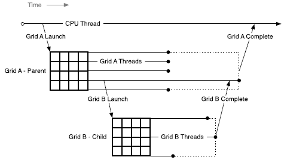

# 附录D CUDA的动态并行

## D.1. Introduction

### D.1.1. Overview

***Dynamic Parallelism***是 CUDA 编程模型的扩展，使 CUDA 内核能够直接在 GPU 上创建新工作并与新工作同步。在程序中需要的任何位置动态创建并行性提供了令人兴奋的新功能。

直接从 GPU 创建工作的能力可以减少在主机和设备之间传输执行控制和数据的需要，因为现在可以通过在设备上执行的线程在运行时做出启动配置决策。此外，可以在运行时在内核内内联生成依赖于数据的并行工作，动态利用 GPU 的硬件调度程序和负载平衡器，并根据数据驱动的决策或工作负载进行调整。以前需要修改以消除递归、不规则循环结构或其他不适合平面、单级并行性的构造的算法和编程模式可以更透明地表达。

本文档描述了支持动态并行的 CUDA 的扩展功能，包括为利用这些功能而对 CUDA 编程模型进行必要的修改和添加，以及利用此附加功能的指南和最佳实践。

注意：与父块的子内核显式同步（即在设备代码中使用 `cudaDeviceSynchronize()`）在 CUDA 11.6 中已弃用，并计划在未来的 CUDA 版本中删除。
只有计算能力为 3.5 或更高的设备支持动态并行。

### D.1.2. Glossary
本指南中使用的术语的定义。
* `Grid`:网格是线程的集合。网格中的线程执行内核函数并被划分为线程。
* `Thread Block`:线程块是在同一多处理器 (SM) 上执行的一组线程。线程块中的线程可以访问共享内存并且可以显式同步。
* `Kernel Function`:内核函数是一个隐式并行子程序，它在 CUDA 执行和内存模型下为网格中的每个线程执行。
* `Host`:Host 指的是最初调用 CUDA 的执行环境。通常是在系统的 CPU 处理器上运行的线程。
* `Parent`:父线程、线程块或网格是已启动新网格、子网格的一种。直到所有启动的子网格也完成后，父节点才被视为完成。
* `Child`:子线程、块或网格是由父网格启动的线程、块或网格。子网格必须在父线程、线程块或网格被认为完成之前完成。
* `Thread Block Scope`:具有线程块作用域的对象具有单个线程块的生命周期。它们仅在由创建对象的线程块中的线程操作时具有定义的行为，并在创建它们的线程块完成时被销毁。
* `Device Runtime`:设备运行时是指可用于使内核函数使用动态并行的运行时系统和 API。

## D.2. Execution Environment and Memory Model

### D.2.1. Execution Environment
CUDA 执行模型基于线程、线程块和网格的原语，内核函数定义了线程块和网格内的各个线程执行的程序。 当调用内核函数时，网格的属性由执行配置描述，该配置在 CUDA 中具有特殊的语法。 CUDA 中对动态并行性的支持扩展了在新网格上配置、启动和同步到设备上运行的线程的能力。

注意：与父块的子内核显式同步（即在设备代码中使用 cudaDeviceSynchronize() 块）在 CUDA 11.6 中已弃用，并计划在未来的 CUDA 版本中删除。

#### D.2.1.1. Parent and Child Grids
配置并启动新网格的设备线程属于父网格，调用创建的网格是子网格。

子网格的调用和完成是正确嵌套的，这意味着在其线程创建的所有子网格都完成之前，父网格不会被认为是完整的。 即使调用线程没有在启动的子网格上显式同步，运行时也会保证父子网格之间的隐式同步。

注意：与父块的子内核显式同步（即在设备代码中使用 cudaDeviceSynchronize()）在 CUDA 11.6 中已弃用，并计划在未来的 CUDA 版本中删除。



#### D.2.1.2. Scope of CUDA Primitives
在主机和设备上，CUDA 运行时都提供了一个 API，用于启动内核、等待启动的工作完成以及通过流和事件跟踪启动之间的依赖关系。 在主机系统上，启动状态和引用流和事件的 CUDA 原语由进程内的所有线程共享； 但是进程独立执行，可能不共享 CUDA 对象。

设备上存在类似的层次结构：启动的内核和 CUDA 对象对线程块中的所有线程都是可见的，但在线程块之间是独立的。 这意味着例如一个流可以由一个线程创建并由同一线程块中的任何其他线程使用，但不能与任何其他线程块中的线程共享。

#### D.2.1.3. Synchronization
注意：与父块的子内核显式同步（即在设备代码中使用 cudaDeviceSynchronize()）在 CUDA 11.6 中已弃用，并计划在未来的 CUDA 版本中删除。

来自任何线程的 CUDA 运行时操作，包括内核启动，在线程块中都是可见的。 这意味着父网格中的调用线程可以在由该线程启动的网格、线程块中的其他线程或在同一线程块中创建的流上执行同步。 直到块中所有线程的所有启动都完成后，才认为线程块的执行完成。 如果一个块中的所有线程在所有子启动完成之前退出，将自动触发同步操作。

#### D.2.1.4. Streams and Events
CUDA 流和事件允许控制网格启动之间的依赖关系：启动到同一流中的网格按顺序执行，事件可用于创建流之间的依赖关系。 在设备上创建的流和事件服务于这个完全相同的目的。

在网格中创建的流和事件存在于线程块范围内，但在创建它们的线程块之外使用时具有未定义的行为。 如上所述，线程块启动的所有工作在块退出时都会隐式同步； 启动到流中的工作包含在其中，所有依赖关系都得到了适当的解决。 已在线程块范围之外修改的流上的操作行为未定义。

在主机上创建的流和事件在任何内核中使用时具有未定义的行为，就像在子网格中使用时由父网格创建的流和事件具有未定义的行为一样。

#### D.2.1.5. Ordering and Concurrency

从设备运行时启动内核的顺序遵循 CUDA Stream 排序语义。在一个线程块内，所有内核启动到同一个流中都是按顺序执行的。当同一个线程块中的多个线程启动到同一个流中时，流内的顺序取决于块内的线程调度，这可以通过 `__syncthreads()` 等同步原语进行控制。

请注意，由于流由线程块内的所有线程共享，因此隐式 NULL 流也被共享。如果线程块中的多个线程启动到隐式流中，则这些启动将按顺序执行。如果需要并发，则应使用显式命名流。

动态并行使并发在程序中更容易表达；但是，设备运行时不会在 CUDA 执行模型中引入新的并发保证。无法保证设备上任意数量的不同线程块之间的并发执行。

缺乏并发保证延伸到父线程块及其子网格。当父线程块启动子网格时，在父线程块到达显式同步点（例如 `cudaDeviceSynchronize()`）之前，不保证子网格开始执行。

注意：与父块的子内核显式同步（即在设备代码中使用 cudaDeviceSynchronize()）在 CUDA 11.6 中已弃用，并计划在未来的 CUDA 版本中删除。
虽然并发通常很容易实现，但它可能会因设备配置、应用程序工作负载和运行时调度而异。因此，依赖不同线程块之间的任何并发性是不安全的。

#### D.2.1.6. Device Management
设备运行时不支持多 GPU； 设备运行时只能在其当前执行的设备上运行。 但是，允许查询系统中任何支持 CUDA 的设备的属性。

### D.2.2. Memory Model
父网格和子网格共享相同的全局和常量内存存储，但具有不同的本地和共享内存。

#### D.2.2.1. Coherence and Consistency
#### D.2.2.1.1. Global Memory
父子网格可以连贯地访问全局内存，但子网格和父网格之间的一致性保证很弱。当子网格的内存视图与父线程完全一致时，子网格的执行有两点：当子网格被父线程调用时，以及当子网格线程完成时（由父线程中的同步 API 调用发出信号）。

注意：与父块的子内核显式同步（即在设备代码中使用 cudaDeviceSynchronize()）在 CUDA 11.6 中已弃用，并计划在未来的 CUDA 版本中删除。

在子网格调用之前，父线程中的所有全局内存操作对子网格都是可见的。在父网格完成同步后，子网格的所有内存操作对父网格都是可见的。

在下面的示例中，执行 `child_launch` 的子网格只能保证看到在子网格启动之前对数据所做的修改。由于父线程 `0` 正在执行启动，子线程将与父线程 `0` 看到的内存保持一致。由于第一次` __syncthreads()` 调用，孩子将看到 `data[0]=0, data[1]=1, ..., data[255]=255`（没有 `__syncthreads()` 调用，只有 `data[0]`将保证被孩子看到）。当子网格返回时，线程 `0` 保证可以看到其子网格中的线程所做的修改。只有在第二次 `__syncthreads()` 调用之后，这些修改才可用于父网格的其他线程：
```C++
__global__ void child_launch(int *data) {
   data[threadIdx.x] = data[threadIdx.x]+1;
}

__global__ void parent_launch(int *data) {
   data[threadIdx.x] = threadIdx.x;

   __syncthreads();

   if (threadIdx.x == 0) {
       child_launch<<< 1, 256 >>>(data);
       cudaDeviceSynchronize();
   }

   __syncthreads();
}

void host_launch(int *data) {
    parent_launch<<< 1, 256 >>>(data);
}
```

#### D.2.2.1.2. Zero Copy Memory
零拷贝系统内存与全局内存具有相同的一致性和一致性保证，并遵循上面详述的语义。 内核可能不会分配或释放零拷贝内存，但可能会使用从主机程序传入的指向零拷贝的指针。

#### D.2.2.1.3. Constant Memory
常量是不可变的，不能从设备修改，即使在父子启动之间也是如此。 也就是说，所有 `__constant__` 变量的值必须在启动之前从主机设置。 所有子内核都从各自的父内核自动继承常量内存。

从内核线程中获取常量内存对象的地址与所有 CUDA 程序具有相同的语义，并且自然支持将该指针从父级传递给子级或从子级传递给父级。

#### D.2.2.1.4. Shared and Local Memory
共享内存和本地内存分别是线程块或线程私有的，并且在父子之间不可见或不连贯。 当这些位置之一中的对象在其所属范围之外被引用时，行为未定义，并且可能导致错误。

如果 NVIDIA 编译器可以检测到指向本地或共享内存的指针作为参数传递给内核启动，它将尝试发出警告。 在运行时，程序员可以使用 `__isGlobal()` 内部函数来确定指针是否引用全局内存，因此可以安全地传递给子启动。

请注意，对 `cudaMemcpy*Async()` 或 `cudaMemset*Async()` 的调用可能会调用设备上的新子内核以保留流语义。 因此，将共享或本地内存指针传递给这些 API 是非法的，并且会返回错误。

#### D.2.2.1.5. Local Memory
本地内存是执行线程的私有存储，在该线程之外不可见。 启动子内核时将指向本地内存的指针作为启动参数传递是非法的。 从子级取消引用此类本地内存指针的结果将是未定义的。

例如，如果 `child_launch` 访问 `x_array`，则以下内容是非法的，具有未定义的行为：
```C++
int x_array[10];       // Creates x_array in parent's local memory 
child_launch<<< 1, 1 >>>(x_array);
```

程序员有时很难知道编译器何时将变量放入本地内存。 作为一般规则，传递给子内核的所有存储都应该从全局内存堆中显式分配，或者使用 `cudaMalloc()`、`new()` 或通过在全局范围内声明` __device__` 存储。 例如：
```C++
// Correct - "value" is global storage
__device__ int value; 
__device__ void x() { 
    value = 5; 
    child<<< 1, 1 >>>(&value); 
}
```

```C++
// Invalid - "value" is local storage
__device__ void y() { 
    int value = 5; 
    child<<< 1, 1 >>>(&value); 
}
```

#### D.2.2.1.6. Texture Memory
对纹理映射的全局内存区域的写入相对于纹理访问是不连贯的。 纹理内存的一致性在子网格的调用和子网格完成时强制执行。 这意味着在子内核启动之前写入内存会反映在子内核的纹理内存访问中。 类似地，子进程对内存的写入将反映在父进程对纹理内存的访问中，但只有在父进程同步子进程完成之后。 父子并发访问可能会导致数据不一致。

注意：与父块的子内核显式同步（即在设备代码中使用 `cudaDeviceSynchronize()`）在 CUDA 11.6 中已弃用，并计划在未来的 CUDA 版本中删除。

## D.3. Programming Interface

### D.3.1. CUDA C++ Reference
内核可以使用标准 CUDA `<<< >>>` 语法从设备启动：
```C++
kernel_name<<< Dg, Db, Ns, S >>>([kernel arguments]);
```
* `Dg` 是 `dim3` 类型，并指定网格(grid)的尺寸和大小
* `Db` 是 `dim3` 类型，指定每个线程块(block)的维度和大小
* `Ns` 是 `size_t` 类型，并指定为每个线程块动态分配的共享内存字节数，用于此调用并添加到静态分配的内存中。 `Ns` 是一个可选参数，默认为 0。
* `S` 是 `cudaStream_t` 类型，并指定与此调用关联的流。 流必须已在进行调用的同一线程块中分配。` S` 是一个可选参数，默认为 0。

#### D.3.1.1.1. Launches are Asynchronous

与主机端启动相同，所有设备端内核启动相对于启动线程都是异步的。 也就是说，`<<<>>>` 启动命令将立即返回，启动线程将继续执行，直到它命中一个明确的启动同步点，例如 `cudaDeviceSynchronize()`。

注意：与父块的子内核显式同步（即在设备代码中使用 cudaDeviceSynchronize()）在 CUDA 11.6 中已弃用，并计划在未来的 CUDA 版本中删除。

网格启动会发布到设备，并将独立于父线程执行。 子网格可以在启动后的任何时间开始执行，但不能保证在启动线程到达显式启动同步点之前开始执行。

#### D.3.1.1.2. Launch Environment Configuration
所有全局设备配置设置（例如，从 `cudaDeviceGetCacheConfig() `返回的共享内存和 L1 缓存大小，以及从 `cudaDeviceGetLimit()` 返回的设备限制）都将从父级继承。 同样，堆栈大小等设备限制将保持配置不变。

对于主机启动的内核，从主机设置的每个内核配置将优先于全局设置。 这些配置也将在从设备启动内核时使用。 无法从设备重新配置内核环境。

#### D.3.1.2. Streams
设备运行时提供命名和未命名 (`NULL`) 流。线程块中的任何线程都可以使用命名流，但流句柄不能传递给其他块或子/父内核。换句话说，流应该被视为创建它的块的私有。流句柄不能保证在块之间是唯一的，因此在未分配它的块中使用流句柄将导致未定义的行为。

与主机端启动类似，启动到单独流中的工作可能会同时运行，但不能保证实际的并发性。 CUDA 编程模型不支持依赖子内核之间的并发性的程序，并且将具有未定义的行为。

设备不支持主机端 `NULL` 流的跨流屏障语义（详见下文）。为了保持与主机运行时的语义兼容性，必须使用 `cudaStreamCreateWithFlags()` API 创建所有设备流，并传递 `cudaStreamNonBlocking` 标志。 `cudaStreamCreate()` 调用是仅限主机运行时的 API，将无法为设备编译。

由于设备运行时不支持 `cudaStreamSynchronize()` 和 `cudaStreamQuery()`，因此当应用程序需要知道流启动的子内核已完成时，应使用 `cudaDeviceSynchronize()`。

注意：与父块的子内核显式同步（即在设备代码中使用 cudaDeviceSynchronize()）在 CUDA 11.6 中已弃用，并计划在未来的 CUDA 版本中删除。

#### D.3.1.2.1. The Implicit (NULL) Stream

在宿主程序中，未命名（NULL）流与其他流具有额外的屏障同步语义（有关详细信息，请参阅[默认流](https://docs.nvidia.com/cuda/cuda-c-programming-guide/index.html#default-stream)）。 设备运行时提供在块中的所有线程之间共享的单个隐式、未命名流，但由于必须使用 `cudaStreamNonBlocking` 标志创建所有命名流，启动到 `NULL` 流中的工作不会插入对任何其他流中未决工作的隐式依赖 （包括其他线程块的 `NULL` 流）。

#### D.3.1.3. Events
仅支持 CUDA 事件的流间同步功能。 这意味着支持 `cudaStreamWaitEvent()`，但不支持 `cudaEventSynchronize()`、`cudaEventElapsedTime()` 和 `cudaEventQuery()`。 由于不支持 `cudaEventElapsedTime()`，`cudaEvents` 必须通过 `cudaEventCreateWithFlags()` 创建，并传递 `cudaEventDisableTiming` 标志。

对于所有设备运行时对象，事件对象可以在创建它们的线程块内的所有线程之间共享，但对于该块是本地的，并且可能不会传递给其他内核，或者在同一内核内的块之间。 不保证事件句柄在块之间是唯一的，因此在未创建它的块中使用事件句柄将导致未定义的行为。

#### D.3.1.4. Synchronization

注意：与父块的子内核显式同步（即在设备代码中使用 cudaDeviceSynchronize()）在 CUDA 11.6 中已弃用，并计划在未来的 CUDA 版本中删除。

`cudaDeviceSynchronize()` 函数将同步线程块中任何线程启动的所有工作，直到调用 `cudaDeviceSynchronize()` 为止。 请注意，可以从不同的代码中调用 `cudaDeviceSynchronize()`（请参阅[块范围同步](https://docs.nvidia.com/cuda/cuda-c-programming-guide/index.html#block-wide-synchronization)）。

如果调用线程旨在与从其他线程调用的子网格同步，则由程序执行足够的额外线程间同步，例如通过调用 `__syncthreads()`。

##### D.3.1.4.1. Block Wide Synchronization

`cudaDeviceSynchronize()` 函数并不意味着块内同步。 特别是，如果没有通过 `__syncthreads()` 指令进行显式同步，则调用线程无法对除自身之外的任何线程启动的工作做出任何假设。 例如，如果一个块中的多个线程都在启动工作，并且所有这些工作都需要一次同步（可能是因为基于事件的依赖关系），则由程序来保证在调用之前由所有线程提交这项工作 `cudaDeviceSynchronize()`。

因为允许实现在从块中的任何线程启动时同步，所以很可能多个线程同时调用 `cudaDeviceSynchronize()` 将耗尽第一次调用中的所有工作，然后对后面的调用没有影响。

#### D.3.1.5. Device Management

只有运行内核的设备才能从该内核控制。 这意味着设备运行时不支持诸如` cudaSetDevice()` 之类的设备 API。 从 GPU 看到的活动设备（从 `cudaGetDevice()` 返回）将具有与从主机系统看到的相同的设备编号。 `cudaDeviceGetAttribute()` 调用可能会请求有关另一个设备的信息，因为此 API 允许将设备 ID 指定为调用的参数。 请注意，设备运行时不提供包罗万象的 `cudaGetDeviceProperties()` API - 必须单独查询属性。

#### D.3.1.6. Memory Declarations

##### D.3.1.6.1. Device and Constant Memory
使用 `__device__` 或 `__constant__` 内存空间说明符在文件范围内声明的内存在使用设备运行时行为相同。 所有内核都可以读取或写入设备变量，无论内核最初是由主机还是设备运行时启动的。 等效地，所有内核都将具有与在模块范围内声明的 `__constant__` 相同的视图。

##### D.3.1.6.2. Textures & Surfaces
CUDA 支持动态创建的[纹理和表面对象](https://docs.nvidia.com/cuda/cuda-c-programming-guide/index.html#fntarg_14)，其中纹理引用可以在主机上创建，传递给内核，由该内核使用，然后从主机销毁。 设备运行时不允许从设备代码中创建或销毁纹理或表面对象，但从主机创建的纹理和表面对象可以在设备上自由使用和传递。 不管它们是在哪里创建的，动态创建的纹理对象总是有效的，并且可以从父内核传递给子内核。

注意：设备运行时不支持从设备启动的内核中的遗留模块范围（即费米风格）纹理和表面。 模块范围（遗留）纹理可以从主机创建并在设备代码中用于任何内核，但只能由顶级内核（即从主机启动的内核）使用。

##### D.3.1.6.3. Shared Memory Variable Declarations
在 CUDA C++ 中，共享内存可以声明为静态大小的文件范围或函数范围的变量，也可以声明为外部变量，其大小由内核调用者在运行时通过启动配置参数确定。 这两种类型的声明在设备运行时都有效。

```C++
__global__ void permute(int n, int *data) {
   extern __shared__ int smem[];
   if (n <= 1)
       return;

   smem[threadIdx.x] = data[threadIdx.x];
   __syncthreads();

   permute_data(smem, n);
   __syncthreads();

   // Write back to GMEM since we can't pass SMEM to children.
   data[threadIdx.x] = smem[threadIdx.x];
   __syncthreads();

   if (threadIdx.x == 0) {
       permute<<< 1, 256, n/2*sizeof(int) >>>(n/2, data);
       permute<<< 1, 256, n/2*sizeof(int) >>>(n/2, data+n/2);
   }
}

void host_launch(int *data) {
    permute<<< 1, 256, 256*sizeof(int) >>>(256, data);
}
```

##### D.3.1.6.4. Symbol Addresses
设备端符号（即标记为 `__device__` 的符号）可以简单地通过 `&` 运算符从内核中引用，因为所有全局范围的设备变量都在内核的可见地址空间中。 这也适用于 `__constant__` 符号，尽管在这种情况下指针将引用只读数据。

鉴于可以直接引用设备端符号，那些引用符号的 CUDA 运行时 API（例如 `cudaMemcpyToSymbol()` 或 `cudaGetSymbolAddress()`）是多余的，因此设备运行时不支持。 请注意，这意味着常量数据不能在正在运行的内核中更改，即使在子内核启动之前也是如此，因为对 `__constant__` 空间的引用是只读的。


#### D.3.1.7. API Errors and Launch Failures

与 CUDA 运行时一样，任何函数都可能返回错误代码。 最后返回的错误代码被记录下来，并且可以通过 `cudaGetLastError()` 调用来检索。 每个线程都会记录错误，以便每个线程都可以识别它最近生成的错误。 错误代码的类型为 `cudaError_t`。

与主机端启动类似，设备端启动可能由于多种原因（无效参数等）而失败。 用户必须调用 `cudaGetLastError()` 来确定启动是否产生错误，但是启动后没有错误并不意味着子内核成功完成。

对于设备端异常，例如，访问无效地址，子网格中的错误将返回给主机，而不是由父调用 `cudaDeviceSynchronize()` 返回。

##### D.3.1.7.1. Launch Setup APIs

内核启动是通过设备运行时库公开的系统级机制，因此可通过底层 `cudaGetParameterBuffer()` 和 `cudaLaunchDevice()` API 直接从 PTX 获得。 允许 CUDA 应用程序自己调用这些 API，其要求与 PTX 相同。 在这两种情况下，用户都负责根据规范以正确的格式正确填充所有必要的数据结构。 这些数据结构保证了向后兼容性。

与主机端启动一样，设备端操作符 `<<<>>>` 映射到底层内核启动 API。 这样一来，以 PTX 为目标的用户将能够启动加载，并且编译器前端可以将 `<<<>>>` 转换为这些调用。

|Runtime API Launch Functions	|Description of Difference From Host Runtime Behaviour (behaviour is identical if no description)|
|----|----|
|cudaGetParameterBuffer|	Generated automatically from <<<>>>. Note different API to host equivalent.|
|cudaLaunchDevice	|Generated automatically from <<<>>>. Note different API to host equivalent.|

这些启动函数的 API 与 CUDA Runtime API 不同，定义如下：
```C++
extern   device   cudaError_t cudaGetParameterBuffer(void **params);
extern __device__ cudaError_t cudaLaunchDevice(void *kernel,
                                        void *params, dim3 gridDim,
                                        dim3 blockDim,
                                        unsigned int sharedMemSize = 0,
                                        cudaStream_t stream = 0);
```

 #### D.3.1.8. API Reference
 此处详细介绍了设备运行时支持的 CUDA 运行时 API 部分。 主机和设备运行时 API 具有相同的语法； 语义是相同的，除非另有说明。 下表提供了与主机可用版本相关的 API 概览。

 |Runtime API Functions|	Details|
 |----|----|
|cudaDeviceSynchronize|	Synchronizes on work launched from thread's own block only.
Warning: Note that calling this API from device code is deprecated in CUDA 11.6, and is slated for removal in a future CUDA release.|
|cudaDeviceGetCacheConfig	 ||
|cudaDeviceGetLimit	 ||
|cudaGetLastError	|Last error is per-thread state, not per-block state|
|cudaPeekAtLastError	 ||
|cudaGetErrorString	 ||
|cudaGetDeviceCount	 ||
|cudaDeviceGetAttribute|	Will return attributes for any device|
|cudaGetDevice|	Always returns current device ID as would be seen from host|
|cudaStreamCreateWithFlags|	Must pass `cudaStreamNonBlocking` flag|
|cudaStreamDestroy	 ||
|cudaStreamWaitEvent||	 
|cudaEventCreateWithFlags|	Must pass `cudaEventDisableTiming` flag|
|cudaEventRecord	 ||
|cudaEventDestroy	|| 
|cudaFuncGetAttributes	|| 
|udaMemsetAsync||
|cudaMemset2DAsync||	 
|cudaMemset3DAsync	 ||
|cudaRuntimeGetVersion	 ||
|cudaMalloc	|May not call cudaFree on the device on a pointer created on the host, and vice-versa|
|cudaFree||
|cudaOccupancyMaxActiveBlocksPerMultiprocessor||	 
|cudaOccupancyMaxPotentialBlockSize	|| 
|cudaOccupancyMaxPotentialBlockSizeVariableSMem||
|cudaMemcpyAsync	|Notes about all memcpy/memset functions: 1.Only async memcpy/set functions are supported 2.Only device-to-device memcpy is permitted 3.May not pass in local or shared memory pointers|
|cudaMemcpy2DAsync|Notes about all memcpy/memset functions: 1.Only async memcpy/set functions are supported 2.Only device-to-device memcpy is permitted 3.May not pass in local or shared memory pointers|
|cudaMemcpy3DAsync|Notes about all memcpy/memset functions: 1.Only async memcpy/set functions are supported 2.Only device-to-device memcpy is permitted 3.May not pass in local or shared memory pointers|

### D.3.2. Device-side Launch from PTX

本部分适用于以并行线程执行 (PTX) 为目标并计划在其语言中支持动态并行的编程语言和编译器实现者。 它提供了与在 PTX 级别支持内核启动相关的底层详细信息。

#### D.3.2.1. Kernel Launch APIs
可以使用可从 PTX 访问的以下两个 API 来实现设备端内核启动：`cudaLaunchDevice()` 和 `cudaGetParameterBuffer()`。 `cudaLaunchDevice()` 使用通过调用 `cudaGetParameterBuffer()` 获得的参数缓冲区启动指定的内核，并将参数填充到启动的内核。 参数缓冲区可以为 `NULL`，即，如果启动的内核不带任何参数，则无需调用 `cudaGetParameterBuffer()`。

##### D.3.2.1.1. cudaLaunchDevice
在 PTX 级别，`cudaLaunchDevice()` 需要在使用前以如下所示的两种形式之一声明。
```C++
// PTX-level Declaration of cudaLaunchDevice() when .address_size is 64
.extern .func(.param .b32 func_retval0) cudaLaunchDevice 
( 
  .param .b64 func, 
  .param .b64 parameterBuffer, 
  .param .align 4 .b8 gridDimension[12], 
  .param .align 4 .b8 blockDimension[12], 
  .param .b32 sharedMemSize, 
  .param .b64 stream 
) 
;
```
```C++
// PTX-level Declaration of cudaLaunchDevice() when .address_size is 32
.extern .func(.param .b32 func_retval0) cudaLaunchDevice
(
  .param .b32 func,
  .param .b32 parameterBuffer,
  .param .align 4 .b8 gridDimension[12],
  .param .align 4 .b8 blockDimension[12],
  .param .b32 sharedMemSize,
  .param .b32 stream
)
;
```

下面的 CUDA 级声明映射到上述 PTX 级声明之一，可在系统头文件 `cuda_device_runtime_api.h` 中找到。 该函数在 `cudadevrt` 系统库中定义，必须与程序链接才能使用设备端内核启动功能。

```C++
// CUDA-level declaration of cudaLaunchDevice()
extern "C" __device__ 
cudaError_t cudaLaunchDevice(void *func, void *parameterBuffer, 
                             dim3 gridDimension, dim3 blockDimension, 
                             unsigned int sharedMemSize, 
                             cudaStream_t stream);
```

第一个参数是指向要启动的内核的指针，第二个参数是保存已启动内核的实际参数的参数缓冲区。 参数缓冲区的布局在下面的[参数缓冲区布局](https://docs.nvidia.com/cuda/cuda-c-programming-guide/index.html#parameter-buffer-layout)中进行了说明。 其他参数指定启动配置，即网格维度、块维度、共享内存大小以及启动关联的流（启动配置的详细说明请参见[执行配置](https://docs.nvidia.com/cuda/cuda-c-programming-guide/index.html#execution-configuration))。

##### D.3.2.1.2. cudaGetParameterBuffer
`cudaGetParameterBuffer()` 需要在使用前在 PTX 级别声明。 PTX 级声明必须采用以下两种形式之一，具体取决于地址大小：
```C++
// PTX-level Declaration of cudaGetParameterBuffer() when .address_size is 64
// When .address_size is 64
.extern .func(.param .b64 func_retval0) cudaGetParameterBuffer
(
  .param .b64 alignment,
  .param .b64 size
)
;
```

```C++
 // PTX-level Declaration of cudaGetParameterBuffer() when .address_size is 32
.extern .func(.param .b32 func_retval0) cudaGetParameterBuffer
(
  .param .b32 alignment,
  .param .b32 size
)
;
```

`cudaGetParameterBuffer()` 的以下 CUDA 级声明映射到上述 PTX 级声明：
```C++
// CUDA-level Declaration of cudaGetParameterBuffer()
extern "C" __device__
void *cudaGetParameterBuffer(size_t alignment, size_t size);
```
第一个参数指定参数缓冲区的对齐要求，第二个参数以字节为单位的大小要求。 在当前实现中，`cudaGetParameterBuffer()` 返回的参数缓冲区始终保证为 64 字节对齐，忽略对齐要求参数。 但是，建议将正确的对齐要求值（即要放置在参数缓冲区中的任何参数的最大对齐）传递给 `cudaGetParameterBuffer()` 以确保将来的可移植性。

#### D.3.2.2. Parameter Buffer Layout
禁止参数缓冲区中的参数重新排序，并且要求放置在参数缓冲区中的每个单独的参数对齐。 也就是说，每个参数必须放在参数缓冲区中的第 n 个字节，其中 n 是参数大小的最小倍数，它大于前一个参数占用的最后一个字节的偏移量。 参数缓冲区的最大大小为 4KB。

有关 CUDA 编译器生成的 PTX 代码的更详细说明，请参阅 PTX-3.5 规范。

### D.3.3. Toolkit Support for Dynamic Parallelism
#### D.3.3.1. Including Device Runtime API in CUDA Code

与主机端运行时 API 类似，CUDA 设备运行时 API 的原型会在程序编译期间自动包含在内。 无需明确包含 `cuda_device_runtime_api.h`。

#### D.3.3.2. Compiling and Linking
当使用带有 nvcc 的动态并行编译和链接 CUDA 程序时，程序将自动链接到静态设备运行时库 `libcudadevrt`。

设备运行时作为静态库（Windows 上的 `cudadevrt.lib`，Linux 下的 `libcudadevrt.a`）提供，必须链接使用设备运行时的 GPU 应用程序。设备库的链接可以通过 `nvcc` 或 `nvlink` 完成。下面显示了两个简单的示例。

如果可以从命令行指定所有必需的源文件，则可以在一个步骤中编译和链接设备运行时程序：

`$ nvcc -arch=sm_35 -rdc=true hello_world.cu -o hello -lcudadevrt`

也可以先将 CUDA .cu 源文件编译为目标文件，然后在两个阶段的过程中将它们链接在一起：

`$ nvcc -arch=sm_35 -dc hello_world.cu -o hello_world.o`

`$ nvcc -arch=sm_35 -rdc=true hello_world.o -o hello -lcudadevrt`

有关详细信息，请参阅 ***The CUDA Driver Compiler NVCC***的使用单独编译部分。

## D.4. Programming Guidelines

### D.4.1. Basics
设备运行时是主机运行时的功能子集。 API 级别的设备管理、内核启动、设备 memcpy、流管理和事件管理从设备运行时公开。

已经有 CUDA 经验的人应该熟悉设备运行时的编程。 设备运行时语法和语义与主机 API 基本相同，但本文档前面详细介绍了任何例外情况。

注意：与父块的子内核显式同步（即在设备代码中使用 cudaDeviceSynchronize()）在 CUDA 11.6 中已弃用，并计划在未来的 CUDA 版本中删除。

以下示例显示了一个包含动态并行性的简单 Hello World 程序：

```C++
#include <stdio.h> 

__global__ void childKernel() 
{ 
    printf("Hello "); 
} 

__global__ void parentKernel() 
{ 
    // launch child 
    childKernel<<<1,1>>>(); 
    if (cudaSuccess != cudaGetLastError()) { 
        return; 
    }

    // wait for child to complete 
    if (cudaSuccess != cudaDeviceSynchronize()) { 
        return; 
    } 

    printf("World!\n"); 
} 

int main(int argc, char *argv[]) 
{ 
    // launch parent 
    parentKernel<<<1,1>>>(); 
    if (cudaSuccess != cudaGetLastError()) { 
        return 1; 
    } 

    // wait for parent to complete 
    if (cudaSuccess != cudaDeviceSynchronize()) { 
        return 2; 
    } 

    return 0; 
}
```

该程序可以从命令行一步构建，如下所示：

`$ nvcc -arch=sm_35 -rdc=true hello_world.cu -o hello -lcudadevrt`


### D.4.2. Performance

#### D.4.2.1. Synchronization

注意：与父块的子内核显式同步（即在设备代码中使用 cudaDeviceSynchronize()）在 CUDA 11.6 中已弃用，并计划在未来的 CUDA 版本中删除。

一个线程的同步可能会影响同一线程块中其他线程的性能，即使这些其他线程自己不调用 `cudaDeviceSynchronize()` 也是如此。 这种影响将取决于底层实现。 通常，与显式调用 `cudaDeviceSynchronize()` 相比，在线程块结束时完成子内核的隐式同步更有效。 因此，如果需要在线程块结束之前与子内核同步，建议仅调用 `cudaDeviceSynchronize()`。

#### D.4.2.2. Dynamic-parallelism-enabled Kernel Overhead

在控制动态启动时处于活动状态的系统软件可能会对当时正在运行的任何内核施加开销，无论它是否调用自己的内核启动。 这种开销来自设备运行时的执行跟踪和管理软件，并且可能导致性能下降，例如，与从主机端相比，从设备进行库调用时。 通常，链接到设备运行时库的应用程序会产生这种开销。


### D.4.3. Implementation Restrictions and Limitations

动态并行保证本文档中描述的所有语义，但是，某些硬件和软件资源依赖于实现，并限制了使用设备运行时的程序的规模、性能和其他属性。

#### D.4.3.1. Runtime

##### D.4.3.1.1. Memory Footprint
设备运行时系统软件为各种管理目的预留内存，特别是用于在同步期间保存父网格状态的一个预留，以及用于跟踪未决网格启动的第二个预留。 配置控制可用于减少这些预留的大小，以换取某些启动限制。 有关详细信息，请参阅下面的[配置选项](https://docs.nvidia.com/cuda/cuda-c-programming-guide/index.html#configuration-options)。

大多数保留内存被分配为父内核状态的后备存储，用于在子启动时进行同步。 保守地说，该内存必须支持为设备上可能的最大活动线程数存储状态。 这意味着可调用 `cudaDeviceSynchronize()` 的每个父代可能需要多达 `860MB` 的设备内存，具体取决于设备配置，即使它没有全部消耗，也将无法供程序使用。

##### D.4.3.1.2. Nesting and Synchronization Depth
使用设备运行时，一个内核可能会启动另一个内核，而该内核可能会启动另一个内核，以此类推。每个从属启动都被认为是一个新的嵌套层级，层级总数就是程序的嵌套深度。同步深度定义为程序在子启动时显式同步的最深级别。通常这比程序的嵌套深度小一，但如果程序不需要在所有级别调用 `cudaDeviceSynchronize()` ，则同步深度可能与嵌套深度有很大不同。

注意：与父块的子内核显式同步（即在设备代码中使用 cudaDeviceSynchronize()）在 CUDA 11.6 中已弃用，并计划在未来的 CUDA 版本中删除。

总体最大嵌套深度限制为 24，但实际上，真正的限制将是系统为每个新级别所需的内存量（请参阅上面的[内存占用量](https://docs.nvidia.com/cuda/cuda-c-programming-guide/index.html#memory-footprint)）。任何会导致内核处于比最大值更深的级别的启动都将失败。请注意，这也可能适用于 `cudaMemcpyAsync()`，它本身可能会生成内核启动。有关详细信息，请参阅[配置选项](https://docs.nvidia.com/cuda/cuda-c-programming-guide/index.html#configuration-options)。

默认情况下，为两级同步保留足够的存储空间。这个最大同步深度（以及因此保留的存储）可以通过调用 `cudaDeviceSetLimit()` 并指定 `cudaLimitDevRuntimeSyncDepth` 来控制。必须在主机启动顶层内核之前配置要支持的层数，以保证嵌套程序的成功执行。在大于指定最大同步深度的深度调用 `cudaDeviceSynchronize()` 将返回错误。

在父内核从不调用 `cudaDeviceSynchronize()` 的情况下，如果系统检测到不需要为父状态保留空间，则允许进行优化。在这种情况下，由于永远不会发生显式父/子同步，因此程序所需的内存占用量将远小于保守的最大值。这样的程序可以指定较浅的最大同步深度，以避免过度分配后备存储。

##### D.4.3.1.3. Pending Kernel Launches

启动内核时，会跟踪所有关联的配置和参数数据，直到内核完成。 此数据存储在系统管理的启动池中。

启动池分为固定大小的池和性能较低的虚拟化池。 设备运行时系统软件将首先尝试跟踪固定大小池中的启动数据。 当固定大小的池已满时，虚拟化池将用于跟踪新的启动。

固定大小启动池的大小可通过从主机调用 `cudaDeviceSetLimit() `并指定 `cudaLimitDevRuntimePendingLaunchCount` 来配置。

##### D.4.3.1.4. Configuration Options
设备运行时系统软件的资源分配通过主机程序的 `cudaDeviceSetLimit()` API 进行控制。 限制必须在任何内核启动之前设置，并且在 GPU 正在运行程序时不得更改。

注意：与父块的子内核显式同步（即在设备代码中使用 cudaDeviceSynchronize()）在 CUDA 11.6 中已弃用，并计划在未来的 CUDA 版本中删除。

可以设置以下命名限制：

|Limit|	Behavior|
|----|----|
|cudaLimitDevRuntimeSyncDepth|	Sets the maximum depth at which cudaDeviceSynchronize() may be called. Launches may be performed deeper than this, but explicit synchronization deeper than this limit will return the cudaErrorLaunchMaxDepthExceeded. The default maximum sync depth is 2.|
|cudaLimitDevRuntimePendingLaunchCount|	Controls the amount of memory set aside for buffering kernel launches which have not yet begun to execute, due either to unresolved dependencies or lack of execution resources. When the buffer is full, the device runtime system software will attempt to track new pending launches in a lower performance virtualized buffer. If the virtualized buffer is also full, i.e. when all available heap space is consumed, launches will not occur, and the thread's last error will be set to cudaErrorLaunchPendingCountExceeded. The default pending launch count is 2048 launches.|
|cudaLimitStackSize	|Controls the stack size in bytes of each GPU thread. The CUDA driver automatically increases the per-thread stack size for each kernel launch as needed. This size isn't reset back to the original value after each launch. To set the per-thread stack size to a different value, cudaDeviceSetLimit() can be called to set this limit. The stack will be immediately resized, and if necessary, the device will block until all preceding requested tasks are complete. cudaDeviceGetLimit() can be called to get the current per-thread stack size.|

##### D.4.3.1.5. Memory Allocation and Lifetime

`cudaMalloc()` 和 `cudaFree()` 在主机和设备环境之间具有不同的语义。 当从主机调用时，`cudaMalloc()` 从未使用的设备内存中分配一个新区域。 当从设备运行时调用时，这些函数映射到设备端的 `malloc()` 和 `free()`。 这意味着在设备环境中，总可分配内存限制为设备 `malloc()` 堆大小，它可能小于可用的未使用设备内存。 此外，在设备上由 `cudaMalloc()` 分配的指针上从主机程序调用 `cudaFree()` 是错误的，反之亦然。


| 	|cudaMalloc() on Host|	cudaMalloc() on Device|
|----|----|----|
|cudaFree() on Host	|Supported|	Not Supported|
|cudaFree() on Device|	Not Supported|	Supported|
|Allocation limit|	Free device memory	|cudaLimitMallocHeapSize|

##### D.4.3.1.6. SM Id and Warp Id
请注意，在 PTX 中，`%smid` 和 `%warpid` 被定义为 `volatile` 值。 设备运行时可以将线程块重新调度到不同的 SM 上，以便更有效地管理资源。 因此，依赖 `%smid` 或 `%warpid` 在线程或线程块的生命周期内保持不变是不安全的。

##### D.4.3.1.7. ECC Errors
CUDA 内核中的代码没有可用的 ECC 错误通知。 整个启动树完成后，主机端会报告 ECC 错误。 在嵌套程序执行期间出现的任何 ECC 错误都将生成异常或继续执行（取决于错误和配置）。


