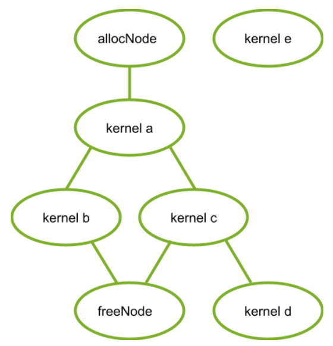
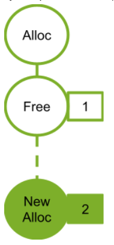
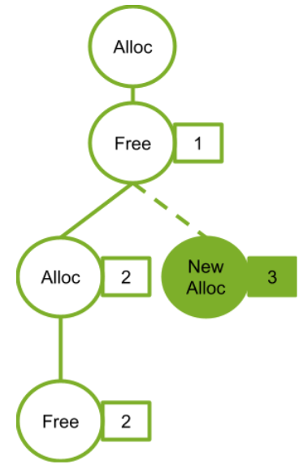

# 附录G 图内存节点
## G.1. Introduction
图内存节点允许图创建和拥有内存分配功能。图内存节点具有 GPU 有序生命周期语义，它指示何时允许在设备上访问内存。这些 GPU 有序生命周期语义支持驱动程序管理的内存重用，并与流序分配 API `cudaMallocAsync` 和 `cudaFreeAsync` 相匹配，这可能在创建图形时被捕获。

图分配在图的生命周期内具有固定的地址，包括重复的实例化和启动。这允许图中的其他操作直接引用内存，而无需更新图，即使 CUDA 更改了后备物理内存也是如此。在一个图中，其图有序生命周期不重叠的分配可以使用相同的底层物理内存。

CUDA 可以重用相同的物理内存进行跨多个图的分配，根据 GPU 有序生命周期语义对虚拟地址映射进行别名化。例如，当不同的图被启动到同一个流中时，CUDA 可以虚拟地为相同的物理内存取别名，以满足具有单图生命周期的分配的需求。

## G.2. Support and Compatibility
图内存节点需要支持 11.4 的 CUDA 驱动程序并支持 GPU 上的流序分配器。 以下代码段显示了如何检查给定设备上的支持。

```C++
int driverVersion = 0;
int deviceSupportsMemoryPools = 0;
int deviceSupportsMemoryNodes = 0;
cudaDriverGetVersion(&driverVersion);
if (driverVersion >= 11020) { // avoid invalid value error in cudaDeviceGetAttribute
    cudaDeviceGetAttribute(&deviceSupportsMemoryPools, cudaDevAttrMemoryPoolsSupported, device);
}
deviceSupportsMemoryNodes = (driverVersion >= 11040) && (deviceSupportsMemoryPools != 0);

```

在驱动程序版本检查中执行属性查询可避免 11.0 和 11.1 驱动程序上的无效值返回代码。 请注意，计算清理程序在检测到 CUDA 返回错误代码时会发出警告，并且在读取属性之前进行版本检查将避免这种情况。 图形内存节点仅在驱动程序版本 11.4 和更高版本上受支持。

## G.3. API Fundamentals

图内存节点是表示内存分配或空闲操作的图节点。 简而言之，分配内存的节点称为分配节点。 同样，释放内存的节点称为空闲节点。 分配节点创建的分配称为图分配。 CUDA 在节点创建时为图分配分配虚拟地址。 虽然这些虚拟地址在分配节点的生命周期内是固定的，但分配内容在释放操作之后不会持久，并且可能被引用不同分配的访问覆盖。

每次图运行时，图分配都被视为重新创建。 图分配的生命周期与节点的生命周期不同，从 GPU 执行到达分配图节点时开始，并在发生以下情况之一时结束：
* GPU 执行到达释放图节点
* GPU 执行到达释放 `cudaFreeAsync()` 流调用
* 立即释放对 `cudaFree()` 的调用

#### 注意：图销毁不会自动释放任何实时图分配的内存，即使它结束了分配节点的生命周期。 随后必须在另一个图中或使用 `cudaFreeAsync()/cudaFree()` 释放分配。
就像其他[图节点](https://docs.nvidia.com/cuda/cuda-c-programming-guide/index.html#graph-structure)一样，图内存节点在图中按依赖边排序。 程序必须保证访问图内存的操作：
* 在分配节点之后排序。
* 在释放内存的操作之前排序

图分配生命周期根据 GPU 执行开始和结束（与 API 调用相反）。 GPU 排序是工作在 GPU 上运行的顺序，而不是工作队列或描述的顺序。 因此，图分配被认为是“GPU 有序”。

### G.3.1. Graph Node APIs
可以使用内存节点创建 API、`cudaGraphAddMemAllocNode` 和 `cudaGraphAddMemFreeNode` 显式创建图形内存节点。 `cudaGraphAddMemAllocNode` 分配的地址在传递的 `CUDA_MEM_ALLOC_NODE_PARAMS` 结构的 `dptr` 字段中返回给用户。 在分配图中使用图分配的所有操作必须在分配节点之后排序。 类似地，任何空闲节点都必须在图中所有分配的使用之后进行排序。 `cudaGraphAddMemFreeNode` 创建空闲节点。

在下图中，有一个带有分配和空闲节点的示例图。 内核节点 `a`、`b` 和 `c` 在分配节点之后和空闲节点之前排序，以便内核可以访问分配。 内核节点 `e` 没有排在 `alloc` 节点之后，因此无法安全地访问内存。 内核节点 `d` 没有排在空闲节点之前，因此它不能安全地访问内存。



以下代码片段建立了该图中的图：
```C++
// Create the graph - it starts out empty
cudaGraphCreate(&graph, 0);

// parameters for a basic allocation
cudaMemAllocNodeParams params = {};
params.poolProps.allocType = cudaMemAllocationTypePinned;
params.poolProps.location.type = cudaMemLocationTypeDevice;
// specify device 0 as the resident device
params.poolProps.location.id = 0;
params.bytesize = size;

cudaGraphAddMemAllocNode(&allocNode, graph, NULL, 0, &params);
nodeParams->kernelParams[0] = params.dptr;
cudaGraphAddKernelNode(&a, graph, &allocNode, 1, &nodeParams);
cudaGraphAddKernelNode(&b, graph, &a, 1, &nodeParams);
cudaGraphAddKernelNode(&c, graph, &a, 1, &nodeParams);
cudaGraphNode_t dependencies[2];
// kernel nodes b and c are using the graph allocation, so the freeing node must depend on them.  Since the dependency of node b on node a establishes an indirect dependency, the free node does not need to explicitly depend on node a.
dependencies[0] = b;
dependencies[1] = c;
cudaGraphAddMemFreeNode(&freeNode, graph, dependencies, 2, params.dptr);
// free node does not depend on kernel node d, so it must not access the freed graph allocation.
cudaGraphAddKernelNode(&d, graph, &c, 1, &nodeParams);

// node e does not depend on the allocation node, so it must not access the allocation.  This would be true even if the freeNode depended on kernel node e.
cudaGraphAddKernelNode(&e, graph, NULL, 0, &nodeParams);
```

### G.3.2. Stream Capture

可以通过捕获相应的流序分配和免费调用 `cudaMallocAsync` 和 `cudaFreeAsync` 来创建图形内存节点。 在这种情况下，捕获的分配 API 返回的虚拟地址可以被图中的其他操作使用。 由于流序的依赖关系将被捕获到图中，流序分配 API 的排序要求保证了图内存节点将根据捕获的流操作正确排序（对于正确编写的流代码）。

忽略内核节点 `d` 和 `e`，为清楚起见，以下代码片段显示了如何使用流捕获来创建上图中的图形：

```C++
cudaMallocAsync(&dptr, size, stream1);
kernel_A<<< ..., stream1 >>>(dptr, ...);

// Fork into stream2
cudaEventRecord(event1, stream1);
cudaStreamWaitEvent(stream2, event1);

kernel_B<<< ..., stream1 >>>(dptr, ...);
// event dependencies translated into graph dependencies, so the kernel node created by the capture of kernel C will depend on the allocation node created by capturing the cudaMallocAsync call. 
kernel_C<<< ..., stream2 >>>(dptr, ...);

// Join stream2 back to origin stream (stream1)
cudaEventRecord(event2, stream2);
cudaStreamWaitEvent(stream1, event2);

// Free depends on all work accessing the memory.
cudaFreeAsync(dptr, stream1);

// End capture in the origin stream
cudaStreamEndCapture(stream1, &graph);
```

### G.3.3. Accessing and Freeing Graph Memory Outside of the Allocating Graph

图分配不必由分配图释放。当图不释放分配时，该分配会在图执行之后持续存在，并且可以通过后续 CUDA 操作访问。这些分配可以在另一个图中访问或直接通过流操作访问，只要访问操作在分配之后通过 CUDA 事件和其他流排序机制进行排序。随后可以通过定期调用 `cudaFree、cudaFreeAsync` 或通过启动具有相应空闲节点的另一个图，或随后启动分配图（如果它是使用 `cudaGraphInstantiateFlagAutoFreeOnLaunch` 标志实例化）来释放分配。在内存被释放后访问内存是非法的 - 必须在所有使用图依赖、CUDA 事件和其他流排序机制访问内存的操作之后对释放操作进行排序。

#### 注意:因为图分配可能彼此共享底层物理内存，所以必须考虑与一致性和一致性相关的虚拟混叠支持规则。简单地说，空闲操作必须在完整的设备操作(例如，计算内核/ memcpy)完成后排序。具体来说，带外同步——例如，作为访问图形内存的计算内核的一部分，通过内存进行信号交换——不足以提供对图形内存的写操作和该图形内存的自由操作之间的排序保证。

以下代码片段演示了在分配图之外访问图分配，并通过以下方式正确建立顺序：使用单个流，使用流之间的事件，以及使用嵌入到分配和释放图中的事件。

使用单个流建立的排序：
```C++
void *dptr;
cudaGraphAddMemAllocNode(&allocNode, allocGraph, NULL, 0, &params);
dptr = params.dptr;

cudaGraphInstantiate(&allocGraphExec, allocGraph, NULL, NULL, 0);

cudaGraphLaunch(allocGraphExec, stream);
kernel<<< …, stream >>>(dptr, …);
cudaFreeAsync(dptr, stream);
```

通过记录和等待 CUDA 事件建立的排序：
```C++
void *dptr;

// Contents of allocating graph
cudaGraphAddMemAllocNode(&allocNode, allocGraph, NULL, 0, &params);
dptr = params.dptr;

// contents of consuming/freeing graph
nodeParams->kernelParams[0] = params.dptr;
cudaGraphAddKernelNode(&a, graph, NULL, 0, &nodeParams);
cudaGraphAddMemFreeNode(&freeNode, freeGraph, &a, 1, dptr);

cudaGraphInstantiate(&allocGraphExec, allocGraph, NULL, NULL, 0);
cudaGraphInstantiate(&freeGraphExec, freeGraph, NULL, NULL, 0);

cudaGraphLaunch(allocGraphExec, allocStream);

// establish the dependency of stream2 on the allocation node
// note: the dependency could also have been established with a stream synchronize operation
cudaEventRecord(allocEvent, allocStream)
cudaStreamWaitEvent(stream2, allocEvent);

kernel<<< …, stream2 >>> (dptr, …);

// establish the dependency between the stream 3 and the allocation use
cudaStreamRecordEvent(streamUseDoneEvent, stream2);
cudaStreamWaitEvent(stream3, streamUseDoneEvent);

// it is now safe to launch the freeing graph, which may also access the memory
cudaGraphLaunch(freeGraphExec, stream3);
```

使用图外部事件节点建立的排序：
```C++
void *dptr;
cudaEvent_t allocEvent; // event indicating when the allocation will be ready for use.
cudaEvent_t streamUseDoneEvent; // event indicating when the stream operations are done with the allocation.

// Contents of allocating graph with event record node
cudaGraphAddMemAllocNode(&allocNode, allocGraph, NULL, 0, &params);
dptr = params.dptr;
// note: this event record node depends on the alloc node
cudaGraphAddEventRecordNode(&recordNode, allocGraph, &allocNode, 1, allocEvent);
cudaGraphInstantiate(&allocGraphExec, allocGraph, NULL, NULL, 0);

// contents of consuming/freeing graph with event wait nodes
cudaGraphAddEventWaitNode(&streamUseDoneEventNode, waitAndFreeGraph, NULL, 0, streamUseDoneEvent);
cudaGraphAddEventWaitNode(&allocReadyEventNode, waitAndFreeGraph, NULL, 0, allocEvent);
nodeParams->kernelParams[0] = params.dptr;

// The allocReadyEventNode provides ordering with the alloc node for use in a consuming graph.
cudaGraphAddKernelNode(&kernelNode, waitAndFreeGraph, &allocReadyEventNode, 1, &nodeParams);

// The free node has to be ordered after both external and internal users.
// Thus the node must depend on both the kernelNode and the 
// streamUseDoneEventNode.
dependencies[0] = kernelNode;
dependencies[1] = streamUseDoneEventNode;
cudaGraphAddMemFreeNode(&freeNode, waitAndFreeGraph, &dependencies, 2, dptr);
cudaGraphInstantiate(&waitAndFreeGraphExec, waitAndFreeGraph, NULL, NULL, 0);

cudaGraphLaunch(allocGraphExec, allocStream);

// establish the dependency of stream2 on the event node satisfies the ordering requirement
cudaStreamWaitEvent(stream2, allocEvent);
kernel<<< …, stream2 >>> (dptr, …);
cudaStreamRecordEvent(streamUseDoneEvent, stream2);

// the event wait node in the waitAndFreeGraphExec establishes the dependency on the “readyForFreeEvent” that is needed to prevent the kernel running in stream two from accessing the allocation after the free node in execution order.
cudaGraphLaunch(waitAndFreeGraphExec, stream3);
```

### G.3.4. cudaGraphInstantiateFlagAutoFreeOnLaunch
在正常情况下，如果图有未释放的内存分配，CUDA 将阻止重新启动图，因为同一地址的多个分配会泄漏内存。使用 `cudaGraphInstantiateFlagAutoFreeOnLaunch` 标志实例化图允许图在其仍有未释放的分配时重新启动。在这种情况下，启动会自动插入一个异步释放的未释放分配。

启动时自动对于单生产者多消费者算法很有用。在每次迭代中，生产者图创建多个分配，并且根据运行时条件，一组不同的消费者访问这些分配。这种类型的变量执行序列意味着消费者无法释放分配，因为后续消费者可能需要访问。启动时自动释放意味着启动循环不需要跟踪生产者的分配 - 相反，该信息与生产者的创建和销毁逻辑保持隔离。通常，启动时自动释放简化了算法，否则该算法需要在每次重新启动之前释放图所拥有的所有分配。
#### 注意： `cudaGraphInstantiateFlagAutoFreeOnLaunch` 标志不会改变图销毁的行为。应用程序必须显式释放未释放的内存以避免内存泄漏，即使对于使用标志实例化的图也是如此。
以下代码展示了使用 `cudaGraphInstantiateFlagAutoFreeOnLaunch` 来简化单生产者/多消费者算法：
```C++
// Create producer graph which allocates memory and populates it with data
cudaStreamBeginCapture(cudaStreamPerThread, cudaStreamCaptureModeGlobal);
cudaMallocAsync(&data1, blocks * threads, cudaStreamPerThread);
cudaMallocAsync(&data2, blocks * threads, cudaStreamPerThread);
produce<<<blocks, threads, 0, cudaStreamPerThread>>>(data1, data2);
...
cudaStreamEndCapture(cudaStreamPerThread, &graph);
cudaGraphInstantiateWithFlags(&producer,
                              graph,
                              cudaGraphInstantiateFlagAutoFreeOnLaunch);
cudaGraphDestroy(graph);

// Create first consumer graph by capturing an asynchronous library call
cudaStreamBeginCapture(cudaStreamPerThread, cudaStreamCaptureModeGlobal);
consumerFromLibrary(data1, cudaStreamPerThread);
cudaStreamEndCapture(cudaStreamPerThread, &graph);
cudaGraphInstantiateWithFlags(&consumer1, graph, 0); //regular instantiation
cudaGraphDestroy(graph);

// Create second consumer graph
cudaStreamBeginCapture(cudaStreamPerThread, cudaStreamCaptureModeGlobal);
consume2<<<blocks, threads, 0, cudaStreamPerThread>>>(data2);
...
cudaStreamEndCapture(cudaStreamPerThread, &graph);
cudaGraphInstantiateWithFlags(&consumer2, graph, 0);
cudaGraphDestroy(graph);

// Launch in a loop
bool launchConsumer2 = false;
do {
    cudaGraphLaunch(producer, myStream);
    cudaGraphLaunch(consumer1, myStream);
    if (launchConsumer2) {
        cudaGraphLaunch(consumer2, myStream);
    }
} while (determineAction(&launchConsumer2));

cudaFreeAsync(data1, myStream);
cudaFreeAsync(data2, myStream);

cudaGraphExecDestroy(producer);
cudaGraphExecDestroy(consumer1);
cudaGraphExecDestroy(consumer2);
```

## G.4. Optimized Memory Reuse
CUDA 以两种方式重用内存：
* 图中的虚拟和物理内存重用基于虚拟地址分配，就像在流序分配器中一样。
* 图之间的物理内存重用是通过虚拟别名完成的：不同的图可以将相同的物理内存映射到它们唯一的虚拟地址。

### G.4.1. Address Reuse within a Graph
CUDA 可以通过将相同的虚拟地址范围分配给生命周期不重叠的不同分配来重用图中的内存。 由于可以重用虚拟地址，因此不能保证指向具有不相交生命周期的不同分配的指针是唯一的。

下图显示了添加一个新的分配节点 (2)，它可以重用依赖节点 (1) 释放的地址。



下图显示了添加新的 `alloc` 节点（3）。 新的分配节点不依赖于空闲节点 (2)，因此不能重用来自关联分配节点 (2) 的地址。 如果分配节点 (2) 使用由空闲节点 (1) 释放的地址，则新分配节点 3 将需要一个新地址。



### G.4.2. Physical Memory Management and Sharing

CUDA 负责在按 GPU 顺序到达分配节点之前将物理内存映射到虚拟地址。作为内存占用和映射开销的优化，如果多个图不会同时运行，它们可能会使用相同的物理内存进行不同的分配，但是如果它们同时绑定到多个执行图，则物理页面不能被重用，或未释放的图形分配。

CUDA 可以在图形实例化、启动或执行期间随时更新物理内存映射。 CUDA 还可以在未来的图启动之间引入同步，以防止实时图分配引用相同的物理内存。对于任何 `allocate-free-allocate` 模式，如果程序在分配的生命周期之外访问指针，错误的访问可能会默默地读取或写入另一个分配拥有的实时数据（即使分配的虚拟地址是唯一的）。使用计算清理工具可以捕获此错误。

下图显示了在同一流中按顺序启动的图形。在此示例中，每个图都会释放它分配的所有内存。由于同一流中的图永远不会同时运行，CUDA 可以而且应该使用相同的物理内存来满足所有分配。


## G.5. Performance Considerations
当多个图启动到同一个流中时，CUDA 会尝试为它们分配相同的物理内存，因为这些图的执行不能重叠。 在启动之间保留图形的物理映射作为优化以避免重新映射的成本。 如果稍后启动其中一个图，使其执行可能与其他图重叠（例如，如果它启动到不同的流中），则 CUDA 必须执行一些重新映射，因为并发图需要不同的内存以避免数据损坏 .

一般来说，CUDA中图内存的重新映射很可能是由这些操作引起的
* 更改启动图形的流
* 图内存池上的修剪操作，显式释放未使用的内存（在[物理内存占用](https://docs.nvidia.com/cuda/cuda-c-programming-guide/index.html#graph-memory-nodes-physical-memory-footprint)中讨论）
* 当另一个图的未释放分配映射到同一内存时重新启动一个图将导致在重新启动之前重新映射内存  

重新映射必须按执行顺序发生，但在该图的任何先前执行完成之后（否则可能会取消映射仍在使用的内存）。 由于这种排序依赖性，以及映射操作是操作系统调用，映射操作可能相对昂贵。 应用程序可以通过将包含分配内存节点的图一致地启动到同一流中来避免这种成本。

### G.5.1. First Launch / cudaGraphUpload
在图实例化期间无法分配或映射物理内存，因为图将在其中执行的流是未知的。 映射是在图形启动期间完成的。 调用 `cudaGraphUpload` 可以通过立即执行该图的所有映射并将该图与上传流相关联，将分配成本与启动分开。 如果图随后启动到同一流中，它将启动而无需任何额外的重新映射。

使用不同的流进行图上传和图启动的行为类似于切换流，可能会导致重新映射操作。 此外，允许无关的内存池管理从空闲流中提取内存，这可能会抵消上传的影响。

## G.6. Physical Memory Footprint

异步分配的池管理行为意味着销毁包含内存节点的图（即使它们的分配是空闲的）不会立即将物理内存返回给操作系统以供其他进程使用。要显式将内存释放回操作系统，应用程序应使用 `cudaDeviceGraphMemTrim` API。

`cudaDeviceGraphMemTrim` 将取消映射并释放由图形内存节点保留的未主动使用的任何物理内存。尚未释放的分配和计划或运行的图被认为正在积极使用物理内存，不会受到影响。使用修剪 API 将使物理内存可用于其他分配 API 和其他应用程序或进程，但会导致 CUDA 在下次启动修剪图时重新分配和重新映射内存。请注意，`cudaDeviceGraphMemTrim` 在与 `cudaMemPoolTrimTo()` 不同的池上运行。图形内存池不会暴露给流序内存分配器。 CUDA 允许应用程序通过 `cudaDeviceGetGraphMemAttribute` API 查询其图形内存占用量。查询属性 `cudaGraphMemAttrReservedMemCurrent` 返回驱动程序为当前进程中的图形分配保留的物理内存量。查询 `cudaGraphMemAttrUsedMemCurrent` 返回至少一个图当前映射的物理内存量。这些属性中的任何一个都可用于跟踪 CUDA 何时为分配图而获取新的物理内存。这两个属性对于检查共享机制节省了多少内存都很有用。

## G.7. Peer Access
图分配可以配置为从多个 GPU 访问，在这种情况下，CUDA 将根据需要将分配映射到对等 GPU。 CUDA 允许需要不同映射的图分配重用相同的虚拟地址。 发生这种情况时，地址范围将映射到不同分配所需的所有 GPU。 这意味着分配有时可能允许比其创建期间请求的更多对等访问； 然而，依赖这些额外的映射仍然是一个错误。

### G.7.1. Peer Access with Graph Node APIs
`cudaGraphAddMemAllocNode` API 接受节点参数结构的 `accessDescs` 数组字段中的映射请求。 `poolProps.location` 嵌入式结构指定分配的常驻设备。 假设需要来自分配 GPU 的访问，因此应用程序不需要在 `accessDescs` 数组中为常驻设备指定条目。

```C++
cudaMemAllocNodeParams params = {};
params.poolProps.allocType = cudaMemAllocationTypePinned;
params.poolProps.location.type = cudaMemLocationTypeDevice;
// specify device 1 as the resident device
params.poolProps.location.id = 1;
params.bytesize = size;

// allocate an allocation resident on device 1 accessible from device 1
cudaGraphAddMemAllocNode(&allocNode, graph, NULL, 0, &params);

accessDescs[2];
// boilerplate for the access descs (only ReadWrite and Device access supported by the add node api)
accessDescs[0].flags = cudaMemAccessFlagsProtReadWrite;
accessDescs[0].location.type = cudaMemLocationTypeDevice;
accessDescs[1].flags = cudaMemAccessFlagsProtReadWrite;
accessDescs[1].location.type = cudaMemLocationTypeDevice;

// access being requested for device 0 & 2.  Device 1 access requirement left implicit.
accessDescs[0].location.id = 0;
accessDescs[1].location.id = 2;

// access request array has 2 entries.
params.accessDescCount = 2;
params.accessDescs = accessDescs;

// allocate an allocation resident on device 1 accessible from devices 0, 1 and 2. (0 & 2 from the descriptors, 1 from it being the resident device).
cudaGraphAddMemAllocNode(&allocNode, graph, NULL, 0, &params);
```
### G.7.2. Peer Access with Stream Capture
对于流捕获，分配节点在捕获时记录分配池的对等可访问性。 在捕获 `cudaMallocFromPoolAsync` 调用后更改分配池的对等可访问性不会影响图将为分配进行的映射。

```C++
// boilerplate for the access descs (only ReadWrite and Device access supported by the add node api)
accessDesc.flags = cudaMemAccessFlagsProtReadWrite;
accessDesc.location.type = cudaMemLocationTypeDevice;
accessDesc.location.id = 1;

// let memPool be resident and accessible on device 0

cudaStreamBeginCapture(stream);
cudaMallocAsync(&dptr1, size, memPool, stream);
cudaStreamEndCapture(stream, &graph1);

cudaMemPoolSetAccess(memPool, &accessDesc, 1);

cudaStreamBeginCapture(stream);
cudaMallocAsync(&dptr2, size, memPool, stream);
cudaStreamEndCapture(stream, &graph2);

//The graph node allocating dptr1 would only have the device 0 accessibility even though memPool now has device 1 accessibility.
//The graph node allocating dptr2 will have device 0 and device 1 accessibility, since that was the pool accessibility at the time of the cudaMallocAsync call.
```


