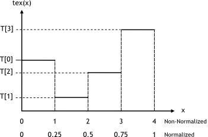
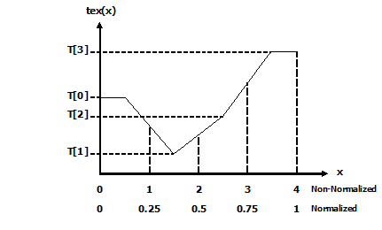
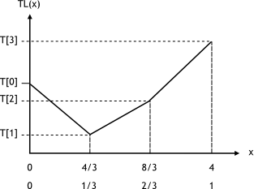

# 附录J 纹理获取
本附录给出了用于计算 Texture Functions 的纹理函数返回值的公式，具体取决于纹理引用的各种属性（请参阅[纹理和表面内存](https://docs.nvidia.com/cuda/cuda-c-programming-guide/index.html#texture-and-surface-memory)）。

绑定到纹理引用的纹理表示为一个数组 T

* 一维纹理的 N 个texels，
* 二维纹理的 N x M texels，
* 三维纹理的 N x M x L texels。

它是使用非归一化纹理坐标 x、y 和 z 或归一化纹理坐标 x/N、y/M 和 z/L 获取的，如[纹理内存](https://docs.nvidia.com/cuda/cuda-c-programming-guide/index.html#texture-memory)中所述。 在本附录中，假定坐标在有效范围内。 纹理内存解释了如何根据寻址模式将超出范围的坐标重新映射到有效范围。

## J.1. Nearest-Point Sampling
在这种过滤模式下，纹理获取返回的值是

* tex(x)=T[i] 对于一维纹理，
* tex(x,y)=T[i,j] 对于二维纹理，
* tex(x,y,z)=T[i,j,k] 对于三维纹理，

其中 i=floor(x)，j=floor(y)，k=floor(z)。

下图 说明了 N=4 的一维纹理的最近点采样。

对于整数纹理，纹理获取返回的值可以选择重新映射到 [0.0, 1.0]（请参阅[纹理内存](https://docs.nvidia.com/cuda/cuda-c-programming-guide/index.html#texture-memory)）。

## J.2. Linear Filtering
在这种仅适用于浮点纹理的过滤模式下，纹理获取返回的值是
* tex(x)=(1−α)T[i]+αT[i+1] for a one-dimensional texture,
* tex(x,y)=(1−α)(1−β)T[i,j]+α(1−β)T[i+1,j]+(1−α)βT[i,j+1]+αβT[i+1,j+1] for a two-dimensional texture,
* tex(x,y,z) =

    (1−α)(1−β)(1−γ)T[i,j,k]+α(1−β)(1−γ)T[i+1,j,k]+

    (1−α)β(1−γ)T[i,j+1,k]+αβ(1−γ)T[i+1,j+1,k]+

    (1−α)(1−β)γT[i,j,k+1]+α(1−β)γT[i+1,j,k+1]+

    (1−α)βγT[i,j+1,k+1]+αβγT[i+1,j+1,k+1]

    for a three-dimensional texture,

其中:

* i=floor(xB), α=frac(xB), xB=x-0.5,
* j=floor(yB), β=frac(yB), yB=y-0.5,
* k=floor(zB), γ=frac(zB), zB= z-0.5,

α、β 和 γ 以 9 位定点格式存储，带有 8 位小数值（因此精确表示 1.0）。

下图 说明了 N=4 的一维纹理的线性过滤。

## J.3. Table Lookup
x 跨越区间 [0,R] 的查表 TL(x) 可以实现为 TL(x)=tex((N-1)/R)x+0.5) 以确保 TL(0)= T[0] 和 TL(R)=T[N-1]。

下图 说明了使用纹理过滤从 N=4 的一维纹理中实现 R=4 或 R=1 的表查找。

