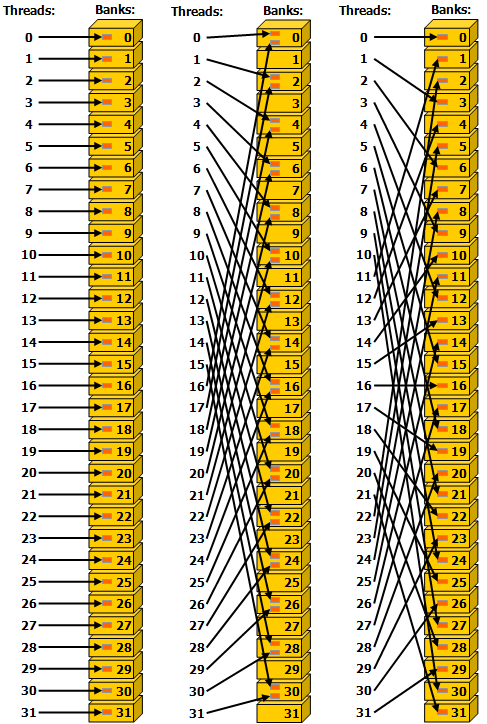
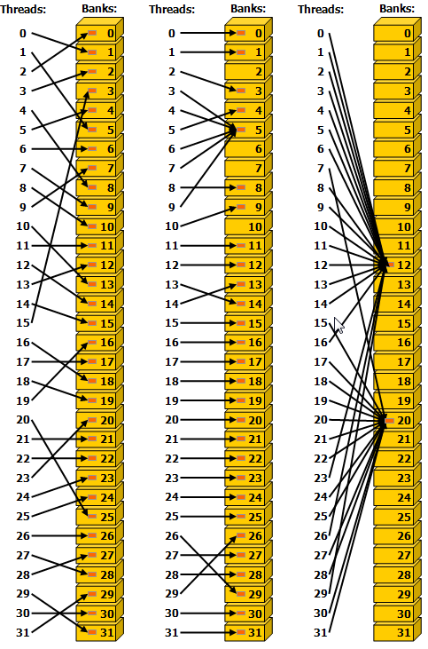

# 附录K CUDA计算能力

计算设备的一般规格和功能取决于其计算能力（请参阅[计算能力](https://docs.nvidia.com/cuda/cuda-c-programming-guide/index.html#compute-capability)）。

下面的表格中 显示了与当前支持的每种计算能力相关的特性和技术规格。

浮点标准审查是否符合 IEEE 浮点标准。

[Compute Capability 3.x](https://docs.nvidia.com/cuda/cuda-c-programming-guide/index.html#compute-capability-3-0)、[Compute Capability 5.x](https://docs.nvidia.com/cuda/cuda-c-programming-guide/index.html#compute-capability-5-x)、[Compute Capability 6.x](https://docs.nvidia.com/cuda/cuda-c-programming-guide/index.html#compute-capability-6-x)、[Compute Capability 7.x](https://docs.nvidia.com/cuda/cuda-c-programming-guide/index.html#compute-capability-7-x) 和 [Compute Capability 8.x](https://docs.nvidia.com/cuda/cuda-c-programming-guide/index.html#compute-capability-8-x) 部分提供了有关计算能力 3.x、5.x、6 的设备架构的更多详细信息 .x、7.x 和 8.x 分别。

## K.1. Features and Technical Specifications

<div class="tablenoborder"><a name="features-and-technical-specifications__feature-support-per-compute-capability" shape="rect">
                              <!-- --></a><table cellpadding="4" cellspacing="0" summary="" id="features-and-technical-specifications__feature-support-per-compute-capability" class="table" frame="border" border="1" rules="all">
                              <caption><span class="tablecap">Table 14. Feature Support per Compute Capability</span></caption>
                              <thead class="thead" align="left">
                                 <tr class="row" valign="middle">
                                    <th class="entry" align="left" valign="middle" width="50%" id="d117e33416" rowspan="1" colspan="1">Feature Support</th>
                                    <th class="entry" colspan="5" align="center" valign="middle" id="d117e33419" rowspan="1">
                                       Compute Capability   
                                    </th>
                                 </tr>
                                 <tr class="row" valign="middle">
                                    <th class="entry" align="left" valign="middle" width="50%" id="d117e33425" rowspan="1" colspan="1">
                                       (Unlisted features are
                                       supported for all compute capabilities)
                                    </th>
                                    <th class="entry" align="center" valign="middle" width="10%" id="d117e33428" rowspan="1" colspan="1">3.5, 3.7, 5.0, 5.2</th>
                                    <th class="entry" align="center" valign="middle" width="10%" id="d117e33431" rowspan="1" colspan="1">5.3</th>
                                    <th class="entry" align="center" valign="middle" width="10%" id="d117e33434" rowspan="1" colspan="1">6.x</th>
                                    <th class="entry" align="center" valign="middle" width="10%" id="d117e33437" rowspan="1" colspan="1">7.x</th>
                                    <th class="entry" align="center" valign="middle" width="10%" id="d117e33441" rowspan="1" colspan="1">8.x</th>
                                 </tr>
                              </thead>
                              <tbody class="tbody">
                                 <tr class="row" valign="middle">
                                    <td class="entry" align="left" valign="middle" width="50%" headers="d117e33416 d117e33425" rowspan="1" colspan="1">
                                       Atomic functions operating on 32-bit integer values in global memory
                                       (<a class="xref" href="index.html#atomic-functions" shape="rect">Atomic Functions</a>)  
                                    </td>
                                    <td class="entry" colspan="5" align="center" valign="middle" headers="d117e33419 d117e33428 d117e33431 d117e33434 d117e33437 d117e33441" rowspan="1">Yes</td>
                                 </tr>
                                 <tr class="row" valign="middle">
                                    <td class="entry" align="left" valign="middle" width="50%" headers="d117e33416 d117e33425" rowspan="1" colspan="1">
                                       Atomic functions operating on 32-bit integer values in shared memory
                                       (<a class="xref" href="index.html#atomic-functions" shape="rect">Atomic Functions</a>)
                                    </td>
                                    <td class="entry" colspan="5" align="center" valign="middle" headers="d117e33419 d117e33428 d117e33431 d117e33434 d117e33437 d117e33441" rowspan="1">Yes</td>
                                 </tr>
                                 <tr class="row" valign="middle">
                                    <td class="entry" align="left" valign="middle" width="50%" headers="d117e33416 d117e33425" rowspan="1" colspan="1">
                                       Atomic functions operating on 64-bit integer values in global memory
                                       (<a class="xref" href="index.html#atomic-functions" shape="rect">Atomic Functions</a>)  
                                    </td>
                                    <td class="entry" colspan="5" align="center" valign="middle" headers="d117e33419 d117e33428 d117e33431 d117e33434 d117e33437 d117e33441" rowspan="1">Yes</td>
                                 </tr>
                                 <tr class="row" valign="middle">
                                    <td class="entry" align="left" valign="middle" width="50%" headers="d117e33416 d117e33425" rowspan="1" colspan="1">
                                       Atomic functions operating on 64-bit integer values in shared memory
                                       (<a class="xref" href="index.html#atomic-functions" shape="rect">Atomic Functions</a>) 
                                    </td>
                                    <td class="entry" colspan="5" align="center" valign="middle" headers="d117e33419 d117e33428 d117e33431 d117e33434 d117e33437 d117e33441" rowspan="1">Yes</td>
                                 </tr>
                                 <tr class="row" valign="middle">
                                    <td class="entry" align="left" valign="middle" width="50%" headers="d117e33416 d117e33425" rowspan="1" colspan="1">
                                       Atomic addition operating on 32-bit floating point values in global
                                       and shared memory (<a class="xref" href="index.html#atomicadd" shape="rect">atomicAdd()</a>)  
                                    </td>
                                    <td class="entry" colspan="5" align="center" valign="middle" headers="d117e33419 d117e33428 d117e33431 d117e33434 d117e33437 d117e33441" rowspan="1">Yes</td>
                                 </tr>
                                 <tr class="row" valign="middle">
                                    <td class="entry" align="left" valign="middle" width="50%" headers="d117e33416 d117e33425" rowspan="1" colspan="1">
                                       Atomic addition operating on 64-bit floating point values in global
                                       memory and shared memory (<a class="xref" href="index.html#atomicadd" shape="rect">atomicAdd()</a>)
                                    </td>
                                    <td class="entry" colspan="2" align="center" valign="middle" headers="d117e33419 d117e33428 d117e33431" rowspan="1">No</td>
                                    <td class="entry" colspan="3" align="center" valign="middle" headers="d117e33419 d117e33434 d117e33437 d117e33441" rowspan="1">Yes</td>
                                 </tr>
                                 <tr class="row" valign="middle">
                                    <td class="entry" align="left" valign="middle" width="50%" headers="d117e33416 d117e33425" rowspan="1" colspan="1">
                                       Warp vote functions (<a class="xref" href="index.html#warp-vote-functions" shape="rect">Warp Vote Functions</a>) 
                                    </td>
                                    <td class="entry" rowspan="6" colspan="5" align="center" valign="middle" headers="d117e33419 d117e33428 d117e33431 d117e33434 d117e33437 d117e33441">Yes</td>
                                 </tr>
                                 <tr class="row" valign="middle">
                                    <td class="entry" align="left" valign="middle" width="50%" headers="d117e33416 d117e33425" rowspan="1" colspan="1">
                                       Memory fence functions (<a class="xref" href="index.html#memory-fence-functions" shape="rect">Memory Fence Functions</a>)
                                    </td>
                                 </tr>
                                 <tr class="row" valign="middle">
                                    <td class="entry" align="left" valign="middle" width="50%" headers="d117e33416 d117e33425" rowspan="1" colspan="1">
                                       Synchronization functions (<a class="xref" href="index.html#synchronization-functions" shape="rect">Synchronization Functions</a>) 
                                    </td>
                                 </tr>
                                 <tr class="row" valign="middle">
                                    <td class="entry" align="left" valign="middle" width="50%" headers="d117e33416 d117e33425" rowspan="1" colspan="1">
                                       Surface functions (<a class="xref" href="index.html#surface-functions" shape="rect">Surface Functions</a>)
                                    </td>
                                 </tr>
                                 <tr class="row" valign="middle">
                                    <td class="entry" align="left" valign="middle" width="50%" headers="d117e33416 d117e33425" rowspan="1" colspan="1">Unified Memory Programming (<a class="xref" href="index.html#um-unified-memory-programming-hd" shape="rect">Unified Memory Programming</a>)
                                    </td>
                                 </tr>
                                 <tr class="row" valign="middle">
                                    <td class="entry" align="left" valign="middle" width="50%" headers="d117e33416 d117e33425" rowspan="1" colspan="1">Dynamic Parallelism (<a class="xref" href="index.html#cuda-dynamic-parallelism" shape="rect">CUDA Dynamic Parallelism</a>)
                                    </td>
                                 </tr>
                                 <tr class="row" valign="middle">
                                    <td class="entry" align="left" valign="middle" width="50%" headers="d117e33416 d117e33425" rowspan="1" colspan="1">
                                       Half-precision floating-point operations: addition, subtraction, multiplication, comparison, warp shuffle functions, conversion
                                    </td>
                                    <td class="entry" colspan="1" align="center" valign="middle" headers="d117e33419 d117e33428" rowspan="1">No</td>
                                    <td class="entry" colspan="4" align="center" valign="middle" headers="d117e33419 d117e33431 d117e33434 d117e33437 d117e33441" rowspan="1">Yes</td>
                                 </tr>
                                 <tr class="row" valign="middle">
                                    <td class="entry" align="left" valign="middle" width="50%" headers="d117e33416 d117e33425" rowspan="1" colspan="1">
                                       Bfloat16-precision floating-point operations: addition, subtraction, multiplication, comparison, warp shuffle functions, conversion
                                    </td>
                                    <td class="entry" colspan="4" align="center" valign="middle" headers="d117e33419 d117e33428 d117e33431 d117e33434 d117e33437" rowspan="1">No</td>
                                    <td class="entry" colspan="1" align="center" valign="middle" headers="d117e33419 d117e33441" rowspan="1">Yes</td>
                                 </tr>
                                 <tr class="row" valign="middle">
                                    <td class="entry" align="left" valign="middle" width="50%" headers="d117e33416 d117e33425" rowspan="1" colspan="1">
                                       Tensor Cores
                                    </td>
                                    <td class="entry" colspan="3" align="center" valign="middle" headers="d117e33419 d117e33428 d117e33431 d117e33434" rowspan="1">No</td>
                                    <td class="entry" colspan="2" align="center" valign="middle" headers="d117e33419 d117e33437 d117e33441" rowspan="1">Yes</td>
                                 </tr>
                                 <tr class="row" valign="middle">
                                    <td class="entry" align="left" valign="middle" width="50%" headers="d117e33416 d117e33425" rowspan="1" colspan="1">Mixed Precision Warp-Matrix Functions
                                       (<a class="xref" href="index.html#wmma" shape="rect">Warp matrix functions</a>)
                                    </td>
                                    <td class="entry" colspan="3" align="center" valign="middle" headers="d117e33419 d117e33428 d117e33431 d117e33434" rowspan="1">No</td>
                                    <td class="entry" colspan="2" align="center" valign="middle" headers="d117e33419 d117e33437 d117e33441" rowspan="1">Yes</td>
                                 </tr>
                                 <tr class="row" valign="middle">
                                    <td class="entry" align="left" valign="middle" width="50%" headers="d117e33416 d117e33425" rowspan="1" colspan="1"> Hardware-accelerated <samp class="ph codeph">memcpy_async</samp>
                                       (<a class="xref" href="index.html#memcpy_async_pipeline" shape="rect">Asynchronous Data Copies using cuda::pipeline</a>)
                                    </td>
                                    <td class="entry" colspan="4" align="center" valign="middle" headers="d117e33419 d117e33428 d117e33431 d117e33434 d117e33437" rowspan="1">No</td>
                                    <td class="entry" colspan="1" align="center" valign="middle" headers="d117e33419 d117e33441" rowspan="1">Yes</td>
                                 </tr>
                                 <tr class="row" valign="middle">
                                    <td class="entry" align="left" valign="middle" width="50%" headers="d117e33416 d117e33425" rowspan="1" colspan="1"> Hardware-accelerated Split Arrive/Wait Barrier
                                       (<a class="xref" href="index.html#aw-barrier" shape="rect">Asynchronous Barrier</a>)
                                    </td>
                                    <td class="entry" colspan="4" align="center" valign="middle" headers="d117e33419 d117e33428 d117e33431 d117e33434 d117e33437" rowspan="1">No</td>
                                    <td class="entry" colspan="1" align="center" valign="middle" headers="d117e33419 d117e33441" rowspan="1">Yes</td>
                                 </tr>
                                 <tr class="row" valign="middle">
                                    <td class="entry" align="left" valign="middle" width="50%" headers="d117e33416 d117e33425" rowspan="1" colspan="1"> L2 Cache Residency Management
                                       (<a class="xref" href="index.html#L2_access_intro" shape="rect">Device Memory L2 Access Management</a>)
                                    </td>
                                    <td class="entry" colspan="4" align="center" valign="middle" headers="d117e33419 d117e33428 d117e33431 d117e33434 d117e33437" rowspan="1">No</td>
                                    <td class="entry" colspan="1" align="center" valign="middle" headers="d117e33419 d117e33441" rowspan="1">Yes</td>
                                 </tr>
                              </tbody>
                           </table>
                        </div>


请注意，下表中使用的 KB 和 K 单位分别对应于 1024 字节（即 KiB）和 1024。

<div class="tablenoborder"><a name="features-and-technical-specifications__technical-specifications-per-compute-capability" shape="rect">
                              <!-- --></a><table cellpadding="4" cellspacing="0" summary="" id="features-and-technical-specifications__technical-specifications-per-compute-capability" class="table" frame="border" border="1" rules="all">
                              <caption><span class="tablecap">Table 15. Technical Specifications per Compute Capability</span></caption>
                              <thead class="thead" align="left">
                                 <tr class="row" valign="middle">
                                    <th class="entry" align="left" valign="middle" width="26.31578947368421%" id="d117e33731" rowspan="1" colspan="1">&nbsp;</th>
                                    <th class="entry" colspan="14" align="center" valign="middle" id="d117e33733" rowspan="1"> Compute Capability </th>
                                 </tr>
                                 <tr class="row" valign="middle">
                                    <th class="entry" align="left" valign="middle" width="26.31578947368421%" id="d117e33739" rowspan="1" colspan="1">Technical Specifications</th>
                                    <th class="entry" align="center" valign="middle" width="5.263157894736842%" id="d117e33742" rowspan="1" colspan="1">3.5</th>
                                    <th class="entry" align="center" valign="middle" width="5.263157894736842%" id="d117e33745" rowspan="1" colspan="1">3.7</th>
                                    <th class="entry" align="center" valign="middle" width="5.263157894736842%" id="d117e33748" rowspan="1" colspan="1">5.0</th>
                                    <th class="entry" align="center" valign="middle" width="5.263157894736842%" id="d117e33751" rowspan="1" colspan="1">5.2</th>
                                    <th class="entry" align="center" valign="middle" width="5.263157894736842%" id="d117e33755" rowspan="1" colspan="1">5.3</th>
                                    <th class="entry" align="center" valign="middle" width="5.263157894736842%" id="d117e33758" rowspan="1" colspan="1">6.0</th>
                                    <th class="entry" align="center" valign="middle" width="5.263157894736842%" id="d117e33761" rowspan="1" colspan="1">6.1</th>
                                    <th class="entry" align="center" valign="middle" width="5.263157894736842%" id="d117e33764" rowspan="1" colspan="1">6.2</th>
                                    <th class="entry" align="center" valign="middle" width="5.263157894736842%" id="d117e33767" rowspan="1" colspan="1">7.0</th>
                                    <th class="entry" align="center" valign="middle" width="5.263157894736842%" id="d117e33770" rowspan="1" colspan="1">7.2</th>
                                    <th class="entry" align="center" valign="middle" width="5.263157894736842%" id="d117e33774" rowspan="1" colspan="1">7.5</th>
                                    <th class="entry" align="center" valign="middle" width="5.263157894736842%" id="d117e33777" rowspan="1" colspan="1">8.0</th>
                                    <th class="entry" align="center" valign="middle" width="5.263157894736842%" id="d117e33780" rowspan="1" colspan="1">8.6</th>
                                    <th class="entry" align="center" valign="middle" width="5.263157894736842%" id="d117e33783" rowspan="1" colspan="1">8.7</th>
                                 </tr>
                              </thead>
                              <tbody class="tbody">
                                 <tr class="row" valign="middle">
                                    <td class="entry" align="left" valign="middle" width="26.31578947368421%" headers="d117e33731 d117e33739" rowspan="1" colspan="1">Maximum number of resident grids per device (<a class="xref" href="index.html#concurrent-kernel-execution" shape="rect">Concurrent Kernel Execution</a>) 
                                    </td>
                                    <td class="entry" colspan="4" align="center" valign="middle" headers="d117e33733 d117e33742 d117e33745 d117e33748 d117e33751" rowspan="1">32</td>
                                    <td class="entry" colspan="1" align="center" valign="middle" headers="d117e33733 d117e33755" rowspan="1">16</td>
                                    <td class="entry" colspan="1" align="center" valign="middle" headers="d117e33733 d117e33758" rowspan="1">128</td>
                                    <td class="entry" colspan="1" align="center" valign="middle" headers="d117e33733 d117e33761" rowspan="1">32</td>
                                    <td class="entry" colspan="1" align="center" valign="middle" headers="d117e33733 d117e33764" rowspan="1">16</td>
                                    <td class="entry" colspan="1" align="center" valign="middle" headers="d117e33733 d117e33767" rowspan="1">128</td>
                                    <td class="entry" colspan="1" align="center" valign="middle" headers="d117e33733 d117e33770" rowspan="1">16</td>
                                    <td class="entry" colspan="4" align="center" valign="middle" headers="d117e33733 d117e33774 d117e33777 d117e33780 d117e33783" rowspan="1">128</td>
                                 </tr>
                                 <tr class="row" valign="middle">
                                    <td class="entry" align="left" valign="middle" width="26.31578947368421%" headers="d117e33731 d117e33739" rowspan="1" colspan="1">Maximum dimensionality of grid of thread blocks </td>
                                    <td class="entry" colspan="14" align="center" valign="middle" headers="d117e33733 d117e33742 d117e33745 d117e33748 d117e33751 d117e33755 d117e33758 d117e33761 d117e33764 d117e33767 d117e33770 d117e33774 d117e33777 d117e33780 d117e33783" rowspan="1">3</td>
                                 </tr>
                                 <tr class="row" valign="middle">
                                    <td class="entry" align="left" valign="middle" width="26.31578947368421%" headers="d117e33731 d117e33739" rowspan="1" colspan="1">Maximum x-dimension of a grid of thread blocks </td>
                                    <td class="entry" colspan="14" align="center" valign="middle" headers="d117e33733 d117e33742 d117e33745 d117e33748 d117e33751 d117e33755 d117e33758 d117e33761 d117e33764 d117e33767 d117e33770 d117e33774 d117e33777 d117e33780 d117e33783" rowspan="1"> 2<sup class="ph sup">31</sup>-1 
                                    </td>
                                 </tr>
                                 <tr class="row" valign="middle">
                                    <td class="entry" align="left" valign="middle" width="26.31578947368421%" headers="d117e33731 d117e33739" rowspan="1" colspan="1">Maximum y- or z-dimension of a grid of thread blocks</td>
                                    <td class="entry" colspan="14" align="center" valign="middle" headers="d117e33733 d117e33742 d117e33745 d117e33748 d117e33751 d117e33755 d117e33758 d117e33761 d117e33764 d117e33767 d117e33770 d117e33774 d117e33777 d117e33780 d117e33783" rowspan="1">65535</td>
                                 </tr>
                                 <tr class="row" valign="middle">
                                    <td class="entry" align="left" valign="middle" width="26.31578947368421%" headers="d117e33731 d117e33739" rowspan="1" colspan="1">Maximum dimensionality of a thread block </td>
                                    <td class="entry" colspan="14" align="center" valign="middle" headers="d117e33733 d117e33742 d117e33745 d117e33748 d117e33751 d117e33755 d117e33758 d117e33761 d117e33764 d117e33767 d117e33770 d117e33774 d117e33777 d117e33780 d117e33783" rowspan="1">3</td>
                                 </tr>
                                 <tr class="row" valign="middle">
                                    <td class="entry" align="left" valign="middle" width="26.31578947368421%" headers="d117e33731 d117e33739" rowspan="1" colspan="1">Maximum x- or y-dimension of a block </td>
                                    <td class="entry" colspan="14" align="center" valign="middle" headers="d117e33733 d117e33742 d117e33745 d117e33748 d117e33751 d117e33755 d117e33758 d117e33761 d117e33764 d117e33767 d117e33770 d117e33774 d117e33777 d117e33780 d117e33783" rowspan="1">1024</td>
                                 </tr>
                                 <tr class="row" valign="middle">
                                    <td class="entry" align="left" valign="middle" width="26.31578947368421%" headers="d117e33731 d117e33739" rowspan="1" colspan="1">Maximum z-dimension of a block </td>
                                    <td class="entry" colspan="14" align="center" valign="middle" headers="d117e33733 d117e33742 d117e33745 d117e33748 d117e33751 d117e33755 d117e33758 d117e33761 d117e33764 d117e33767 d117e33770 d117e33774 d117e33777 d117e33780 d117e33783" rowspan="1">64</td>
                                 </tr>
                                 <tr class="row" valign="middle">
                                    <td class="entry" align="left" valign="middle" width="26.31578947368421%" headers="d117e33731 d117e33739" rowspan="1" colspan="1">Maximum number of threads per block </td>
                                    <td class="entry" colspan="14" align="center" valign="middle" headers="d117e33733 d117e33742 d117e33745 d117e33748 d117e33751 d117e33755 d117e33758 d117e33761 d117e33764 d117e33767 d117e33770 d117e33774 d117e33777 d117e33780 d117e33783" rowspan="1">1024</td>
                                 </tr>
                                 <tr class="row" valign="middle">
                                    <td class="entry" align="left" valign="middle" width="26.31578947368421%" headers="d117e33731 d117e33739" rowspan="1" colspan="1">Warp size</td>
                                    <td class="entry" colspan="14" align="center" valign="middle" headers="d117e33733 d117e33742 d117e33745 d117e33748 d117e33751 d117e33755 d117e33758 d117e33761 d117e33764 d117e33767 d117e33770 d117e33774 d117e33777 d117e33780 d117e33783" rowspan="1">32</td>
                                 </tr>
                                 <tr class="row" valign="middle">
                                    <td class="entry" align="left" valign="middle" width="26.31578947368421%" headers="d117e33731 d117e33739" rowspan="1" colspan="1">Maximum number of resident blocks per SM </td>
                                    <td class="entry" colspan="2" align="center" valign="middle" headers="d117e33733 d117e33742 d117e33745" rowspan="1">16</td>
                                    <td class="entry" colspan="8" align="center" valign="middle" headers="d117e33733 d117e33748 d117e33751 d117e33755 d117e33758 d117e33761 d117e33764 d117e33767 d117e33770" rowspan="1">32</td>
                                    <td class="entry" colspan="1" align="center" valign="middle" headers="d117e33733 d117e33774" rowspan="1">16</td>
                                    <td class="entry" colspan="1" align="center" valign="middle" headers="d117e33733 d117e33777" rowspan="1">32</td>
                                    <td class="entry" colspan="2" align="center" valign="middle" headers="d117e33733 d117e33780 d117e33783" rowspan="1">16</td>
                                 </tr>
                                 <tr class="row" valign="middle">
                                    <td class="entry" align="left" valign="middle" width="26.31578947368421%" headers="d117e33731 d117e33739" rowspan="1" colspan="1">Maximum number of resident warps per SM </td>
                                    <td class="entry" colspan="10" align="center" valign="middle" headers="d117e33733 d117e33742 d117e33745 d117e33748 d117e33751 d117e33755 d117e33758 d117e33761 d117e33764 d117e33767 d117e33770" rowspan="1">64</td>
                                    <td class="entry" colspan="1" align="center" valign="middle" headers="d117e33733 d117e33774" rowspan="1">32</td>
                                    <td class="entry" colspan="1" align="center" valign="middle" headers="d117e33733 d117e33777" rowspan="1">64</td>
                                    <td class="entry" colspan="2" align="center" valign="middle" headers="d117e33733 d117e33780 d117e33783" rowspan="1">48</td>
                                 </tr>
                                 <tr class="row" valign="middle">
                                    <td class="entry" align="left" valign="middle" width="26.31578947368421%" headers="d117e33731 d117e33739" rowspan="1" colspan="1">Maximum number of resident threads per SM </td>
                                    <td class="entry" colspan="10" align="center" valign="middle" headers="d117e33733 d117e33742 d117e33745 d117e33748 d117e33751 d117e33755 d117e33758 d117e33761 d117e33764 d117e33767 d117e33770" rowspan="1">2048</td>
                                    <td class="entry" colspan="1" align="center" valign="middle" headers="d117e33733 d117e33774" rowspan="1">1024</td>
                                    <td class="entry" colspan="1" align="center" valign="middle" headers="d117e33733 d117e33777" rowspan="1">2048</td>
                                    <td class="entry" colspan="2" align="center" valign="middle" headers="d117e33733 d117e33780 d117e33783" rowspan="1">1536</td>
                                 </tr>
                                 <tr class="row" valign="middle">
                                    <td class="entry" align="left" valign="middle" width="26.31578947368421%" headers="d117e33731 d117e33739" rowspan="1" colspan="1">Number of 32-bit registers per SM </td>
                                    <td class="entry" colspan="1" align="center" valign="middle" headers="d117e33733 d117e33742" rowspan="1">64 K</td>
                                    <td class="entry" colspan="1" align="center" valign="middle" headers="d117e33733 d117e33745" rowspan="1">128 K</td>
                                    <td class="entry" colspan="12" align="center" valign="middle" headers="d117e33733 d117e33748 d117e33751 d117e33755 d117e33758 d117e33761 d117e33764 d117e33767 d117e33770 d117e33774 d117e33777 d117e33780 d117e33783" rowspan="1">64 K</td>
                                 </tr>
                                 <tr class="row" valign="middle">
                                    <td class="entry" align="left" valign="middle" width="26.31578947368421%" headers="d117e33731 d117e33739" rowspan="1" colspan="1">Maximum number of 32-bit registers per thread block </td>
                                    <td class="entry" colspan="4" align="center" valign="middle" headers="d117e33733 d117e33742 d117e33745 d117e33748 d117e33751" rowspan="1">64 K</td>
                                    <td class="entry" colspan="1" align="center" valign="middle" headers="d117e33733 d117e33755" rowspan="1">32 K</td>
                                    <td class="entry" colspan="2" align="center" valign="middle" headers="d117e33733 d117e33758 d117e33761" rowspan="1">64 K</td>
                                    <td class="entry" colspan="1" align="center" valign="middle" headers="d117e33733 d117e33764" rowspan="1">32 K</td>
                                    <td class="entry" colspan="6" align="center" valign="middle" headers="d117e33733 d117e33767 d117e33770 d117e33774 d117e33777 d117e33780 d117e33783" rowspan="1">64 K</td>
                                 </tr>
                                 <tr class="row" valign="middle">
                                    <td class="entry" align="left" valign="middle" width="26.31578947368421%" headers="d117e33731 d117e33739" rowspan="1" colspan="1">Maximum number of 32-bit registers per thread</td>
                                    <td class="entry" colspan="14" align="center" valign="middle" headers="d117e33733 d117e33742 d117e33745 d117e33748 d117e33751 d117e33755 d117e33758 d117e33761 d117e33764 d117e33767 d117e33770 d117e33774 d117e33777 d117e33780 d117e33783" rowspan="1">255</td>
                                 </tr>
                                 <tr class="row" valign="middle">
                                    <td class="entry" align="left" valign="middle" width="26.31578947368421%" headers="d117e33731 d117e33739" rowspan="1" colspan="1">Maximum amount of shared memory per SM </td>
                                    <td class="entry" colspan="1" align="center" valign="middle" headers="d117e33733 d117e33742" rowspan="1">48 KB</td>
                                    <td class="entry" colspan="1" align="center" valign="middle" headers="d117e33733 d117e33745" rowspan="1">112 KB</td>
                                    <td class="entry" colspan="1" align="center" valign="middle" headers="d117e33733 d117e33748" rowspan="1">64 KB</td>
                                    <td class="entry" colspan="1" align="center" valign="middle" headers="d117e33733 d117e33751" rowspan="1">96 KB</td>
                                    <td class="entry" colspan="2" align="center" valign="middle" headers="d117e33733 d117e33755 d117e33758" rowspan="1">64 KB</td>
                                    <td class="entry" colspan="1" align="center" valign="middle" headers="d117e33733 d117e33761" rowspan="1">96 KB</td>
                                    <td class="entry" colspan="1" align="center" valign="middle" headers="d117e33733 d117e33764" rowspan="1">64 KB</td>
                                    <td class="entry" colspan="2" align="center" valign="middle" headers="d117e33733 d117e33767 d117e33770" rowspan="1">96 KB</td>
                                    <td class="entry" colspan="1" align="center" valign="middle" headers="d117e33733 d117e33774" rowspan="1">64 KB</td>
                                    <td class="entry" colspan="1" align="center" valign="middle" headers="d117e33733 d117e33777" rowspan="1">164 KB</td>
                                    <td class="entry" colspan="1" align="center" valign="middle" headers="d117e33733 d117e33780" rowspan="1">100 KB</td>
                                    <td class="entry" align="center" valign="middle" width="5.263157894736842%" headers="d117e33733 d117e33783" rowspan="1" colspan="1">164 KB</td>
                                 </tr>
                                 <tr class="row" valign="middle">
                                    <td class="entry" align="left" valign="middle" width="26.31578947368421%" headers="d117e33731 d117e33739" rowspan="1" colspan="1">Maximum amount of shared memory per thread block <a name="fnsrc_33" href="#fntarg_33" shape="rect"><sup>33</sup></a></td>
                                    <td class="entry" colspan="8" align="center" valign="middle" headers="d117e33733 d117e33742 d117e33745 d117e33748 d117e33751 d117e33755 d117e33758 d117e33761 d117e33764" rowspan="1">48 KB</td>
                                    <td class="entry" colspan="1" align="center" valign="middle" headers="d117e33733 d117e33767" rowspan="1">96 KB</td>
                                    <td class="entry" colspan="1" align="center" valign="middle" headers="d117e33733 d117e33770" rowspan="1">96 KB</td>
                                    <td class="entry" colspan="1" align="center" valign="middle" headers="d117e33733 d117e33774" rowspan="1">64 KB</td>
                                    <td class="entry" colspan="1" align="center" valign="middle" headers="d117e33733 d117e33777" rowspan="1">163 KB</td>
                                    <td class="entry" colspan="1" align="center" valign="middle" headers="d117e33733 d117e33780" rowspan="1">99 KB</td>
                                    <td class="entry" align="center" valign="middle" width="5.263157894736842%" headers="d117e33733 d117e33783" rowspan="1" colspan="1">163 KB</td>
                                 </tr>
                                 <tr class="row" valign="middle">
                                    <td class="entry" align="left" valign="middle" width="26.31578947368421%" headers="d117e33731 d117e33739" rowspan="1" colspan="1">Number of shared memory banks </td>
                                    <td class="entry" colspan="14" align="center" valign="middle" headers="d117e33733 d117e33742 d117e33745 d117e33748 d117e33751 d117e33755 d117e33758 d117e33761 d117e33764 d117e33767 d117e33770 d117e33774 d117e33777 d117e33780 d117e33783" rowspan="1">32</td>
                                 </tr>
                                 <tr class="row" valign="middle">
                                    <td class="entry" align="left" valign="middle" width="26.31578947368421%" headers="d117e33731 d117e33739" rowspan="1" colspan="1">Maximum amount of local memory per thread </td>
                                    <td class="entry" colspan="14" align="center" valign="middle" headers="d117e33733 d117e33742 d117e33745 d117e33748 d117e33751 d117e33755 d117e33758 d117e33761 d117e33764 d117e33767 d117e33770 d117e33774 d117e33777 d117e33780 d117e33783" rowspan="1">512 KB</td>
                                 </tr>
                                 <tr class="row" valign="middle">
                                    <td class="entry" align="left" valign="middle" width="26.31578947368421%" headers="d117e33731 d117e33739" rowspan="1" colspan="1">Constant memory size </td>
                                    <td class="entry" colspan="14" align="center" valign="middle" headers="d117e33733 d117e33742 d117e33745 d117e33748 d117e33751 d117e33755 d117e33758 d117e33761 d117e33764 d117e33767 d117e33770 d117e33774 d117e33777 d117e33780 d117e33783" rowspan="1">64 KB</td>
                                 </tr>
                                 <tr class="row" valign="middle">
                                    <td class="entry" align="left" valign="middle" width="26.31578947368421%" headers="d117e33731 d117e33739" rowspan="1" colspan="1">Cache working set per SM for constant memory </td>
                                    <td class="entry" colspan="5" align="center" valign="middle" headers="d117e33733 d117e33742 d117e33745 d117e33748 d117e33751 d117e33755" rowspan="1">8 KB</td>
                                    <td class="entry" colspan="1" align="center" valign="middle" headers="d117e33733 d117e33758" rowspan="1">4 KB</td>
                                    <td class="entry" colspan="8" align="center" valign="middle" headers="d117e33733 d117e33761 d117e33764 d117e33767 d117e33770 d117e33774 d117e33777 d117e33780 d117e33783" rowspan="1">8 KB</td>
                                 </tr>
                                 <tr class="row" valign="middle">
                                    <td class="entry" align="left" valign="middle" width="26.31578947368421%" headers="d117e33731 d117e33739" rowspan="1" colspan="1">Cache working set per SM for texture memory </td>
                                    <td class="entry" colspan="5" align="center" valign="middle" headers="d117e33733 d117e33742 d117e33745 d117e33748 d117e33751 d117e33755" rowspan="1"> Between 12 KB and 48 KB </td>
                                    <td class="entry" colspan="3" align="center" valign="middle" headers="d117e33733 d117e33758 d117e33761 d117e33764" rowspan="1">Between 24 KB and 48 KB</td>
                                    <td class="entry" colspan="2" align="center" valign="middle" headers="d117e33733 d117e33767 d117e33770" rowspan="1">32 ~ 128 KB</td>
                                    <td class="entry" colspan="1" align="center" valign="middle" headers="d117e33733 d117e33774" rowspan="1">32 or 64 KB</td>
                                    <td class="entry" colspan="1" align="center" valign="middle" headers="d117e33733 d117e33777" rowspan="1">28KB ~ 192 KB</td>
                                    <td class="entry" colspan="1" align="center" valign="middle" headers="d117e33733 d117e33780" rowspan="1">28KB ~ 128 KB</td>
                                    <td class="entry" align="center" valign="middle" headers="d117e33733 d117e33783" rowspan="1" colspan="1">28KB ~ 192 KB</td>
                                 </tr>
                                 <tr class="row" valign="middle">
                                    <td class="entry" align="left" valign="middle" width="26.31578947368421%" headers="d117e33731 d117e33739" rowspan="1" colspan="1">Maximum width for a 1D texture reference bound to a CUDA array </td>
                                    <td class="entry" colspan="5" align="center" valign="middle" headers="d117e33733 d117e33742 d117e33745 d117e33748 d117e33751 d117e33755" rowspan="1">65536</td>
                                    <td class="entry" colspan="9" align="center" valign="middle" headers="d117e33733 d117e33758 d117e33761 d117e33764 d117e33767 d117e33770 d117e33774 d117e33777 d117e33780 d117e33783" rowspan="1">131072</td>
                                 </tr>
                                 <tr class="row" valign="middle">
                                    <td class="entry" align="left" valign="middle" width="26.31578947368421%" headers="d117e33731 d117e33739" rowspan="1" colspan="1">Maximum width for a 1D texture reference bound to linear memory </td>
                                    <td class="entry" colspan="5" align="center" valign="middle" headers="d117e33733 d117e33742 d117e33745 d117e33748 d117e33751 d117e33755" rowspan="1">2<sup class="ph sup">27</sup></td>
                                    <td class="entry" colspan="1" align="center" valign="middle" headers="d117e33733 d117e33758" rowspan="1">2<sup class="ph sup">28</sup></td>
                                    <td class="entry" colspan="2" align="center" valign="middle" headers="d117e33733 d117e33761 d117e33764" rowspan="1">2<sup class="ph sup">27</sup></td>
                                    <td class="entry" colspan="1" align="center" valign="middle" headers="d117e33733 d117e33767" rowspan="1">2<sup class="ph sup">28</sup></td>
                                    <td class="entry" colspan="1" align="center" valign="middle" headers="d117e33733 d117e33770" rowspan="1">2<sup class="ph sup">27</sup></td>
                                    <td class="entry" colspan="4" align="center" valign="middle" headers="d117e33733 d117e33774 d117e33777 d117e33780 d117e33783" rowspan="1">2<sup class="ph sup">28</sup></td>
                                 </tr>
                                 <tr class="row" valign="middle">
                                    <td class="entry" align="left" valign="middle" width="26.31578947368421%" headers="d117e33731 d117e33739" rowspan="1" colspan="1">Maximum width and number of layers for a 1D layered texture reference </td>
                                    <td class="entry" colspan="5" align="center" valign="middle" headers="d117e33733 d117e33742 d117e33745 d117e33748 d117e33751 d117e33755" rowspan="1"> 16384 x 2048 </td>
                                    <td class="entry" colspan="9" align="center" valign="middle" headers="d117e33733 d117e33758 d117e33761 d117e33764 d117e33767 d117e33770 d117e33774 d117e33777 d117e33780 d117e33783" rowspan="1">32768 x 2048 </td>
                                 </tr>
                                 <tr class="row" valign="middle">
                                    <td class="entry" align="left" valign="middle" width="26.31578947368421%" headers="d117e33731 d117e33739" rowspan="1" colspan="1"> Maximum width and height for a 2D texture reference bound to a CUDA array </td>
                                    <td class="entry" colspan="5" align="center" valign="middle" headers="d117e33733 d117e33742 d117e33745 d117e33748 d117e33751 d117e33755" rowspan="1"> 65536 x 65536 </td>
                                    <td class="entry" colspan="9" align="center" valign="middle" headers="d117e33733 d117e33758 d117e33761 d117e33764 d117e33767 d117e33770 d117e33774 d117e33777 d117e33780 d117e33783" rowspan="1">131072 x 65536</td>
                                 </tr>
                                 <tr class="row" valign="middle">
                                    <td class="entry" align="left" valign="middle" width="26.31578947368421%" headers="d117e33731 d117e33739" rowspan="1" colspan="1"> Maximum width and height for a 2D texture reference bound to linear memory </td>
                                    <td class="entry" colspan="2" align="center" valign="middle" headers="d117e33733 d117e33742 d117e33745" rowspan="1"> 65000 x 65000 </td>
                                    <td class="entry" colspan="3" align="center" valign="middle" headers="d117e33733 d117e33748 d117e33751 d117e33755" rowspan="1"> 65536 x 65536 </td>
                                    <td class="entry" colspan="9" align="center" valign="middle" headers="d117e33733 d117e33758 d117e33761 d117e33764 d117e33767 d117e33770 d117e33774 d117e33777 d117e33780 d117e33783" rowspan="1"> 131072 x 65000 </td>
                                 </tr>
                                 <tr class="row" valign="middle">
                                    <td class="entry" align="left" valign="middle" width="26.31578947368421%" headers="d117e33731 d117e33739" rowspan="1" colspan="1"> Maximum width and height for a 2D texture reference bound to a CUDA array
                                       supporting texture gather 
                                    </td>
                                    <td class="entry" colspan="5" align="center" valign="middle" headers="d117e33733 d117e33742 d117e33745 d117e33748 d117e33751 d117e33755" rowspan="1"> 16384 x 16384 </td>
                                    <td class="entry" colspan="9" align="center" valign="middle" headers="d117e33733 d117e33758 d117e33761 d117e33764 d117e33767 d117e33770 d117e33774 d117e33777 d117e33780 d117e33783" rowspan="1"> 32768 x 32768 </td>
                                 </tr>
                                 <tr class="row" valign="middle">
                                    <td class="entry" align="left" valign="middle" width="26.31578947368421%" headers="d117e33731 d117e33739" rowspan="1" colspan="1"> Maximum width, height, and number of layers for a 2D layered texture reference </td>
                                    <td class="entry" colspan="5" align="center" valign="middle" headers="d117e33733 d117e33742 d117e33745 d117e33748 d117e33751 d117e33755" rowspan="1"> 16384 x 16384 x 2048 </td>
                                    <td class="entry" colspan="9" align="center" valign="middle" headers="d117e33733 d117e33758 d117e33761 d117e33764 d117e33767 d117e33770 d117e33774 d117e33777 d117e33780 d117e33783" rowspan="1"> 32768 x 32768 x 2048 </td>
                                 </tr>
                                 <tr class="row" valign="middle">
                                    <td class="entry" align="left" valign="middle" width="26.31578947368421%" headers="d117e33731 d117e33739" rowspan="1" colspan="1"> Maximum width, height, and depth for a 3D texture reference bound to a CUDA
                                       array 
                                    </td>
                                    <td class="entry" colspan="5" align="center" valign="middle" headers="d117e33733 d117e33742 d117e33745 d117e33748 d117e33751 d117e33755" rowspan="1"> 4096 x 4096 x 4096 </td>
                                    <td class="entry" colspan="9" align="center" valign="middle" headers="d117e33733 d117e33758 d117e33761 d117e33764 d117e33767 d117e33770 d117e33774 d117e33777 d117e33780 d117e33783" rowspan="1"> 16384 x 16384 x 16384 </td>
                                 </tr>
                                 <tr class="row" valign="middle">
                                    <td class="entry" align="left" valign="middle" width="26.31578947368421%" headers="d117e33731 d117e33739" rowspan="1" colspan="1">Maximum width (and height) for a cubemap texture reference </td>
                                    <td class="entry" colspan="5" align="center" valign="middle" headers="d117e33733 d117e33742 d117e33745 d117e33748 d117e33751 d117e33755" rowspan="1"> 16384 </td>
                                    <td class="entry" colspan="9" align="center" valign="middle" headers="d117e33733 d117e33758 d117e33761 d117e33764 d117e33767 d117e33770 d117e33774 d117e33777 d117e33780 d117e33783" rowspan="1"> 32768 </td>
                                 </tr>
                                 <tr class="row" valign="middle">
                                    <td class="entry" align="left" valign="middle" width="26.31578947368421%" headers="d117e33731 d117e33739" rowspan="1" colspan="1"> Maximum width (and height) and number of layers for a cubemap layered texture
                                       reference 
                                    </td>
                                    <td class="entry" colspan="5" align="center" valign="middle" headers="d117e33733 d117e33742 d117e33745 d117e33748 d117e33751 d117e33755" rowspan="1">16384 x 2046 </td>
                                    <td class="entry" colspan="9" align="center" valign="middle" headers="d117e33733 d117e33758 d117e33761 d117e33764 d117e33767 d117e33770 d117e33774 d117e33777 d117e33780 d117e33783" rowspan="1"> 32768 x 2046 </td>
                                 </tr>
                                 <tr class="row" valign="middle">
                                    <td class="entry" align="left" valign="middle" width="26.31578947368421%" headers="d117e33731 d117e33739" rowspan="1" colspan="1">Maximum number of textures that can be bound to a kernel </td>
                                    <td class="entry" colspan="14" align="center" valign="middle" headers="d117e33733 d117e33742 d117e33745 d117e33748 d117e33751 d117e33755 d117e33758 d117e33761 d117e33764 d117e33767 d117e33770 d117e33774 d117e33777 d117e33780 d117e33783" rowspan="1">256</td>
                                 </tr>
                                 <tr class="row" valign="middle">
                                    <td class="entry" align="left" valign="middle" width="26.31578947368421%" headers="d117e33731 d117e33739" rowspan="1" colspan="1">Maximum width for a 1D surface reference bound to a CUDA array </td>
                                    <td class="entry" colspan="2" align="center" valign="middle" headers="d117e33733 d117e33742 d117e33745" rowspan="1"> 65536 </td>
                                    <td class="entry" colspan="3" align="center" valign="middle" headers="d117e33733 d117e33748 d117e33751 d117e33755" rowspan="1"> 16384 </td>
                                    <td class="entry" colspan="9" align="center" valign="middle" headers="d117e33733 d117e33758 d117e33761 d117e33764 d117e33767 d117e33770 d117e33774 d117e33777 d117e33780 d117e33783" rowspan="1"> 32768 </td>
                                 </tr>
                                 <tr class="row" valign="middle">
                                    <td class="entry" align="left" valign="middle" width="26.31578947368421%" headers="d117e33731 d117e33739" rowspan="1" colspan="1">Maximum width and number of layers for a 1D layered surface reference </td>
                                    <td class="entry" colspan="2" align="center" valign="middle" headers="d117e33733 d117e33742 d117e33745" rowspan="1"> 65536 x 2048 </td>
                                    <td class="entry" colspan="3" align="center" valign="middle" headers="d117e33733 d117e33748 d117e33751 d117e33755" rowspan="1"> 16384 x 2048 </td>
                                    <td class="entry" colspan="9" align="center" valign="middle" headers="d117e33733 d117e33758 d117e33761 d117e33764 d117e33767 d117e33770 d117e33774 d117e33777 d117e33780 d117e33783" rowspan="1"> 32768 x 2048 </td>
                                 </tr>
                                 <tr class="row" valign="middle">
                                    <td class="entry" align="left" valign="middle" width="26.31578947368421%" headers="d117e33731 d117e33739" rowspan="1" colspan="1"> Maximum width and height for a 2D surface reference bound to a CUDA array </td>
                                    <td class="entry" colspan="2" align="center" valign="middle" headers="d117e33733 d117e33742 d117e33745" rowspan="1"> 65536 x 32768 </td>
                                    <td class="entry" colspan="3" align="center" valign="middle" headers="d117e33733 d117e33748 d117e33751 d117e33755" rowspan="1"> 65536 x 65536 </td>
                                    <td class="entry" colspan="9" align="center" valign="middle" headers="d117e33733 d117e33758 d117e33761 d117e33764 d117e33767 d117e33770 d117e33774 d117e33777 d117e33780 d117e33783" rowspan="1"> 131072 x 65536 </td>
                                 </tr>
                                 <tr class="row" valign="middle">
                                    <td class="entry" align="left" valign="middle" width="26.31578947368421%" headers="d117e33731 d117e33739" rowspan="1" colspan="1"> Maximum width, height, and number of layers for a 2D layered surface reference </td>
                                    <td class="entry" colspan="2" align="center" valign="middle" headers="d117e33733 d117e33742 d117e33745" rowspan="1">65536 x 32768 x 2048 </td>
                                    <td class="entry" colspan="3" align="center" valign="middle" headers="d117e33733 d117e33748 d117e33751 d117e33755" rowspan="1"> 16384 x 16384 x 2048 </td>
                                    <td class="entry" colspan="9" align="center" valign="middle" headers="d117e33733 d117e33758 d117e33761 d117e33764 d117e33767 d117e33770 d117e33774 d117e33777 d117e33780 d117e33783" rowspan="1"> 32768 x 32768 x 2048 </td>
                                 </tr>
                                 <tr class="row" valign="middle">
                                    <td class="entry" align="left" valign="middle" width="26.31578947368421%" headers="d117e33731 d117e33739" rowspan="1" colspan="1"> Maximum width, height, and depth for a 3D surface reference bound to a CUDA
                                       array 
                                    </td>
                                    <td class="entry" colspan="2" align="center" valign="middle" headers="d117e33733 d117e33742 d117e33745" rowspan="1"> 65536 x 32768 x 2048 </td>
                                    <td class="entry" colspan="3" align="center" valign="middle" headers="d117e33733 d117e33748 d117e33751 d117e33755" rowspan="1"> 4096 x 4096 x 4096 </td>
                                    <td class="entry" colspan="9" align="center" valign="middle" headers="d117e33733 d117e33758 d117e33761 d117e33764 d117e33767 d117e33770 d117e33774 d117e33777 d117e33780 d117e33783" rowspan="1"> 16384 x 16384 x 16384 </td>
                                 </tr>
                                 <tr class="row" valign="middle">
                                    <td class="entry" align="left" valign="middle" width="26.31578947368421%" headers="d117e33731 d117e33739" rowspan="1" colspan="1"> Maximum width (and height) for a cubemap surface reference bound to a CUDA
                                       array 
                                    </td>
                                    <td class="entry" colspan="2" align="center" valign="middle" headers="d117e33733 d117e33742 d117e33745" rowspan="1"> 32768 </td>
                                    <td class="entry" colspan="3" align="center" valign="middle" headers="d117e33733 d117e33748 d117e33751 d117e33755" rowspan="1"> 16384 </td>
                                    <td class="entry" colspan="9" align="center" valign="middle" headers="d117e33733 d117e33758 d117e33761 d117e33764 d117e33767 d117e33770 d117e33774 d117e33777 d117e33780 d117e33783" rowspan="1"> 32768 </td>
                                 </tr>
                                 <tr class="row" valign="middle">
                                    <td class="entry" align="left" valign="middle" width="26.31578947368421%" headers="d117e33731 d117e33739" rowspan="1" colspan="1"> Maximum width (and height) and number of layers for a cubemap layered surface
                                       reference 
                                    </td>
                                    <td class="entry" colspan="2" align="center" valign="middle" headers="d117e33733 d117e33742 d117e33745" rowspan="1"> 32768 x 2046 </td>
                                    <td class="entry" colspan="3" align="center" valign="middle" headers="d117e33733 d117e33748 d117e33751 d117e33755" rowspan="1"> 16384 x 2046 </td>
                                    <td class="entry" colspan="9" align="center" valign="middle" headers="d117e33733 d117e33758 d117e33761 d117e33764 d117e33767 d117e33770 d117e33774 d117e33777 d117e33780 d117e33783" rowspan="1"> 32768 x 2046 </td>
                                 </tr>
                                 <tr class="row" valign="middle">
                                    <td class="entry" align="left" valign="middle" width="26.31578947368421%" headers="d117e33731 d117e33739" rowspan="1" colspan="1">Maximum number of surfaces that can be bound to a kernel </td>
                                    <td class="entry" colspan="8" align="center" valign="middle" headers="d117e33733 d117e33742 d117e33745 d117e33748 d117e33751 d117e33755 d117e33758 d117e33761 d117e33764" rowspan="1">16</td>
                                    <td class="entry" colspan="6" align="center" valign="middle" headers="d117e33733 d117e33767 d117e33770 d117e33774 d117e33777 d117e33780 d117e33783" rowspan="1">32</td>
                                 </tr>
                              </tbody>
                           </table>
                        </div>


## K.2. Floating-Point Standard

所有计算设备都遵循二进制浮点运算的 IEEE 754-2008 标准，但存在以下偏差：

* 没有动态可配置的舍入模式；但是，大多数操作支持多种 IEEE 舍入模式，通过设备内在函数公开。
* 没有检测浮点异常发生的机制，并且所有操作都表现得好像 IEEE-754 异常总是被屏蔽，如果出现异常事件，则传递 IEEE-754 定义的屏蔽响应。出于同样的原因，虽然支持 SNaN 编码，但它们不是发信号的，而是作为静默处理的。
* 涉及一个或多个输入 NaN 的单精度浮点运算的结果是位模式 0x7fffffff 的安静 NaN。
* 双精度浮点绝对值和求反在 NaN 方面不符合 IEEE-754；这些通过不变。


必须使用 `-ftz=false`、`-prec-div=true` 和 `-prec-sqrt=true` 编译代码以确保符合 IEEE 标准（这是默认设置；有关这些编译标志的说明，请参阅 nvcc 用户手册）。

无论编译器标志 `-ftz` 的设置如何，

* 全局内存上的原子单精度浮点加法始终以清零模式运行，即，行为等同于 `FADD.F32.FTZ.RN`，
* 共享内存上的原子单精度浮点加法始终在非规范支持下运行，即，行为等同于 `FADD.F32.RN`。


根据 IEEE-754R 标准，如果 `fminf()`、`fmin()`、`fmaxf()` 或 `fmax()` 的输入参数之一是 NaN，而另一个不是，则结果是`non-NaN` 参数。

IEEE-754 未定义在浮点值超出整数格式范围的情况下将浮点值转换为整数值。对于计算设备，行为是钳制到支持范围的末尾。这与 x86 架构行为不同。

IEEE-754 未定义整数除以零和整数溢出的行为。对于计算设备，没有机制可以检测是否发生了此类整数运算异常。整数除以零会产生一个未指定的、特定于机器的值。

https://developer.nvidia.com/content/precision-performance-floating-point-and-ieee-754-compliance-nvidia-gpus 包含有关 NVIDIA GPU 的浮点精度和合规性的更多信息。

## K.3. Compute Capability 3.x

### K.3.1. Architecture

一个 SM 包括：
* 192 个用于算术运算的 CUDA 内核（请参阅算术指令以了解算术运算的吞吐量），
* 32个单精度浮点先验函数的特殊函数单元，
* 4个warp调度器。


当一个 SM 被赋予执行 warp 时，它首先将它们分配给四个调度程序。然后，在每个指令发布时间，每个调度程序都会为其分配的一个已准备好执行的warp（如果有的话）发布两条独立的指令。

一个 SM 有一个只读常量缓存，它被所有功能单元共享，并加快了从驻留在设备内存中的常量内存空间的读取速度。

**每个 SM 都有一个 L1 缓存，所有 SM 共享一个 L2 缓存**。 L1 缓存用于缓存对本地内存的访问，包括临时寄存器溢出。 L2 缓存用于缓存对本地和全局内存的访问。缓存行为（例如，读取是在 L1 和 L2 中缓存还是仅在 L2 中缓存）可以使用加载或存储指令的修饰符在每次访问的基础上进行部分配置。某些计算能力为 3.5 的设备和计算能力为 3.7 的设备允许通过编译器选项选择在 L1 和 L2 中缓存全局内存。

相同的片上存储器用于 L1 和共享内存：它可以配置为 48 KB 共享内存和 16 KB 一级缓存或 16 KB 共享内存和 48 KB 一级缓存或 32 KB 共享内存和 32 KB 的 L1 缓存，使用 `cudaFuncSetCacheConfig()/cuFuncSetCacheConfig()`：

```C++
// Device code
__global__ void MyKernel()
{
    ...
}

// Host code

// Runtime API
// cudaFuncCachePreferShared: shared memory is 48 KB
// cudaFuncCachePreferEqual: shared memory is 32 KB
// cudaFuncCachePreferL1: shared memory is 16 KB
// cudaFuncCachePreferNone: no preference
cudaFuncSetCacheConfig(MyKernel, cudaFuncCachePreferShared)
```

默认的缓存配置是“prefer none”，意思是“无偏好”。如果内核被配置为没有首选项，那么它将默认为当前线程/上下文的首选项，这是使用 `cudaDeviceSetCacheConfig()/cuCtxSetCacheConfig()` 设置的（有关详细信息，请参阅参考手册）。如果当前线程/上下文也没有首选项（这又是默认设置），那么任何内核最近使用的缓存配置都将被使用，除非需要不同的缓存配置来启动内核（例如，由于共享内存要求）。初始配置是 48 KB 的共享内存和 16 KB 的 L1 高速缓存。

注意：计算能力为 3.7 的设备为上述每个配置添加了额外的 64 KB 共享内存，每个 SM 分别产生 112 KB、96 KB 和 80 KB 共享内存。但是，每个线程块的最大共享内存仍为 48 KB。
应用程序可以通过检查 `l2CacheSize` 设备属性来查询 L2 缓存大小（请参阅设备枚举）。最大二级缓存大小为 1.5 MB。

每个 SM 都有一个 48 KB 的只读数据缓存，以加快从设备内存中读取的速度。它直接访问此缓存（对于计算能力为 3.5 或 3.7 的设备），或通过实现[纹理和表面](https://docs.nvidia.com/cuda/cuda-c-programming-guide/index.html#texture-and-surface-memory)内存中提到的各种寻址模式和数据过滤的纹理单元。当通过纹理单元访问时，只读数据缓存也称为纹理缓存。

### K.3.2. Global Memory

计算能力 3.x 的设备的全局内存访问缓存在 L2 中，计算能力 3.5 或 3.7 的设备也可以缓存在上一节中描述的只读数据缓存中；它们通常不缓存在 L1 中。某些计算能力为 3.5 的设备和计算能力为 3.7 的设备允许通过 nvcc 的 `-Xptxas -dlcm=ca` 选项选择缓存 L1 中的全局内存访问。

高速缓存行是 128 字节，并映射到设备内存中 128 字节对齐的段。缓存在 L1 和 L2 中的内存访问使用 128 字节内存事务处理，而仅缓存在 L2 中的内存访问使用 32 字节内存事务处理。因此，仅在 L2 中进行缓存可以减少过度获取，例如，在分散内存访问的情况下。

如果每个线程访问的字的大小超过 4 字节，则 warp 的内存请求首先被拆分为独立发出的单独的 128 字节内存请求：
* 两个内存请求，每个半warp一个，如果大小为 8 字节，
* 如果大小为 16 字节，则四个内存请求，每个四分之一warp一个。

然后将每个内存请求分解为独立发出的高速缓存行请求。在缓存命中的情况下，以 L1 或 L2 缓存的吞吐量为缓存行请求提供服务，否则以设备内存的吞吐量提供服务。

请注意，线程可以以任何顺序访问任何字，包括相同的字。

如果 warp 执行的非原子指令为该 warp 的多个线程写入全局内存中的同一位置，则只有一个线程执行写入，并且未定义哪个线程执行写入。

在内核的整个生命周期内只读的数据也可以通过使用 `__ldg()` 函数读取它来缓存在上一节中描述的只读数据缓存中（请参阅只读数据缓存加载函数）。当编译器检测到某些数据满足只读条件时，它会使用`__ldg()` 来读取它。编译器可能并不总是能够检测到某些数据满足只读条件。使用 `const` 和 `__restrict__` 限定符标记用于加载此类数据的指针会增加编译器检测到只读条件的可能性。

下图显示了全局内存访问和相应内存事务的一些示例。

.png)

### K.3.3. Shared Memory

下图中显示了一些跨步访问的示例。



下图显示了一些涉及广播机制的内存读取访问示例。



**64 位模式**

连续的 64 位字映射到连续的存储区。

对 warp 的共享内存请求不会在访问同一 64 位字中的任何子字的两个线程之间产生bank冲突（即使两个子字的地址位于同一bank中）。在这种情况下，对于读取访问，64 位字被广播到请求线程，对于写入访问，每个子字仅由其中一个线程写入（哪个线程执行写入未定义）。

**32 位模式**

连续的 32 位字映射到连续的存储区。

对warp 的共享内存请求不会在访问同一32 位字或索引i 和j 在同一64 字对齐段中的两个32 位字内的任何子字的两个线程之间产生bank冲突（即，第一个索引是 64 的倍数的段）并且使得 j=i+32（即使两个子字的地址在同一个库中）。在这种情况下，对于读访问，32 位字被广播到请求线程，对于写访问，每个子字仅由其中一个线程写入（哪个线程执行写入未定义）。

## K.4. Compute Capability 5.x

### K.4.1. Architecture

一个 SM 包括：
* 128 个用于算术运算的 CUDA 内核（请参阅算术指令以了解算术运算的吞吐量），
* 32个单精度浮点先验函数的特殊函数单元，
* 4个warp调度器。


当一个 SM 被赋予执行 warp 时，它首先将它们分配给四个调度程序。然后，在每个指令发布时间，每个调度程序都会为其分配的经准备好执行的warp之一发布一条指令（如果有的话）。

SM 具有：
* 由所有功能单元共享的只读常量缓存，可加快从驻留在设备内存中的常量内存空间的读取速度，
* 一个 24 KB 的统一 L1/纹理缓存，用于缓存来自全局内存的读取，
* 64 KB 共享内存用于计算能力为 5.0 的设备或 96 KB 共享内存用于计算能力为 5.2 的设备。


纹理单元也使用统一的 L1/纹理缓存，实现[纹理和表面](https://docs.nvidia.com/cuda/cuda-c-programming-guide/index.html#texture-and-surface-memory)内存中提到的各种寻址模式和数据过滤。

还有一个由所有 SM 共享的 L2 缓存，用于缓存对本地或全局内存的访问，包括**临时寄存器溢出**。应用程序可以通过检查 `l2CacheSize` 设备属性来查询 L2 缓存大小（请参阅设备枚举）。

缓存行为（例如，读取是否缓存在统一的 L1/纹理缓存和 L2 中或仅在 L2 中）可以使用加载指令的修饰符在每次访问的基础上进行部分配置。


### K.4.2. Global Memory

全局内存访问始终缓存在 L2 中，并且 L2 中的缓存行为与计算能力 3.x 的设备相同（请参阅全局内存）。

在内核的整个生命周期内只读的数据也可以通过使用 `__ldg()` 函数读取它来缓存在上一节中描述的统一 L1/纹理缓存中（请参阅[只读数据缓存加载函数](https://docs.nvidia.com/cuda/cuda-c-programming-guide/index.html#ldg-function)）。当编译器检测到某些数据满足只读条件时，它会使用`__ldg()` 来读取它。编译器可能并不总是能够检测到某些数据满足只读条件。使用 `const` 和 `__restrict__` 限定符标记用于加载此类数据的指针会增加编译器检测到只读条件的可能性。

对于计算能力 5.0 的设备，在内核的整个生命周期内不是只读的数据不能缓存在统一的 L1/纹理缓存中。对于计算能力为 5.2 的设备，默认情况下不缓存在统一的 L1/纹理缓存中，但可以使用以下机制启用缓存：
* 如 PTX 参考手册中所述，使用带有适当修饰符的内联汇编执行读取；
* 使用 `-Xptxas -dlcm=ca` 编译标志进行编译，在这种情况下，所有读取都被缓存，除了使用带有禁用缓存的修饰符的内联汇编执行的读取；
* 使用 `-Xptxas -fscm=ca` 编译标志进行编译，在这种情况下，所有读取都被缓存，包括使用内联汇编执行的读取，无论使用何种修饰符。


当使用上面列出的三种机制之一启用缓存时，计算能力 5.2 的设备将为所有内核启动缓存全局内存读取到统一的 L1/纹理缓存中，除了线程块消耗过多 SM 寄存器的内核启动文件。这些异常由分析器报告。


### K.4.3. Shared Memory

共享内存有 32 个bank，这些bank被组织成连续的 32 位字映射到连续的bank。 每个bank的带宽为每个时钟周期 32 位。

对 warp 的共享内存请求不会在访问同一 32 位字内的任何地址的两个线程之间产生bank冲突（即使两个地址位于同一存储库中）。 在这种情况下，对于读取访问，该字被广播到请求线程，对于写入访问，每个地址仅由一个线程写入（哪个线程执行写入未定义）。

下显示了一些跨步访问的示例。


左边

步长为一个 32 位字的线性寻址（无bank冲突）。

中间

跨两个 32 位字的线性寻址（双向bank冲突）。

右边

跨度为三个 32 位字的线性寻址（无bank冲突）。


下图显示了一些涉及广播机制的内存读取访问示例。


左边

通过随机排列实现无冲突访问。

中间

由于线程 3、4、6、7 和 9 访问存储区 5 中的同一个字，因此无冲突访问。

右边

无冲突广播访问（线程访问bank内的同一个词）。

## K.5. Compute Capability 6.x

### K.5.1. Architecture

一个 SM 包括：
* 64 个（计算能力 6.0）或 128 个（6.1 和 6.2）用于算术运算的 CUDA 内核，
* 16 个 (6.0) 或 32 个 (6.1 和 6.2) 用于单精度浮点超越函数的特殊函数单元，
* 2 个（6.0）或 4 个（6.1 和 6.2）warp 调度器。


当一个 SM 被指定执行 warp 时，它首先将它们分配给它的调度程序。然后，在每个指令发布时间，每个调度程序都会为其分配的经准备好执行的warp之一发布一条指令（如果有的话）。

SM 具有：
* 由所有功能单元共享的只读常量缓存，可加快从驻留在设备内存中的常量内存空间的读取速度，
* 一个统一的 L1/纹理缓存，用于从大小为 24 KB（6.0 和 6.2）或 48 KB（6.1）的全局内存中读取，
* 大小为 64 KB（6.0 和 6.2）或 96 KB（6.1）的共享内存。
  

纹理单元也使用统一的 L1/纹理缓存，实现纹理和表面内存中提到的各种寻址模式和数据过滤。

还有一个由所有 SM 共享的 L2 缓存，用于缓存对本地或全局内存的访问，包括临时寄存器溢出。应用程序可以通过检查 `l2CacheSize` 设备属性来查询 L2 缓存大小（请参阅[设备枚举](https://docs.nvidia.com/cuda/cuda-c-programming-guide/index.html#device-enumeration)）。

缓存行为（例如，读取是否缓存在统一的 L1/纹理缓存和 L2 中或仅在 L2 中）可以使用加载指令的修饰符在每次访问的基础上进行部分配置。

### K.5.2. Global Memory
全局内存的行为方式与计算能力 5.x 的设备相同（请参阅[全局内存](https://docs.nvidia.com/cuda/cuda-c-programming-guide/index.html#global-memory-5-x)）。

### K.5.3. Shared Memory
共享内存的行为方式与计算能力 5.x 的设备相同（请参阅[共享内存](https://docs.nvidia.com/cuda/cuda-c-programming-guide/index.html#shared-memory-5-x)）。


## K.6. Compute Capability 7.x

一个 SM 包括：
* 64 个 FP32 内核，用于单精度算术运算，
* 32 个用于双精度算术运算的 FP64 内核，
* 64 个 INT32 内核用于整数数学，
* 8 个混合精度张量核，用于深度学习矩阵算术
* 16个单精度浮点超越函数的特殊函数单元，
* 4个warp调度器。


一个 SM 在它的调度器之间静态地分配它的 warp。然后，在每个指令发布时间，每个调度程序都会为其分配的warp准备好执行的warp之一发布一条指令（如果有的话）。

SM 具有：
* 由所有功能单元共享的只读常量缓存，可加快从驻留在设备内存中的常量内存空间的读取速度，
* 一个统一的数据缓存和共享内存，总大小为 128 KB (Volta) 或 96 KB (Turing)。


共享内存从统一的数据缓存中分割出来，并且可以配置为各种大小（请参阅[共享内存](https://docs.nvidia.com/cuda/cuda-c-programming-guide/index.html#shared-memory-7-x)。）剩余的数据缓存用作 L1 缓存，也由实现上述各种寻址和数据过滤模式的纹理单元使用在纹理和表面内存。

### K.6.2. Independent Thread Scheduling

1.Volta 架构在 warp 中的线程之间引入了独立线程调度，启用了以前不可用的内部 warp 同步模式，并在移植 CPU 代码时简化了代码更改。 但是，如果开发人员对先前硬件架构的warp同步性做出假设，这可能会导致参与执行代码的线程集与预期的完全不同。

以下是 Volta 安全代码的关注代码模式和建议的纠正措施。

对于使用 warp 内在函数（`__shfl*、__any、__all、__ballot`）的应用程序，开发人员有必要将他们的代码移植到具有 `*_sync` 后缀的新的、安全的同步对应方。 新的warp内在函数采用线程掩码，明确定义哪些通道（warp的线程）必须参与warp内在函数。 有关详细信息，请参阅 Warp Vote 函数和 Warp Shuffle 函数。

由于内在函数可用于 CUDA 9.0+，因此（如有必要）可以使用以下预处理器宏有条件地执行代码：

```C++
#if defined(CUDART_VERSION) && CUDART_VERSION >= 9000
// *_sync intrinsic
#endif      
```

这些内在函数可用于所有架构，而不仅仅是 Volta 或 Turing，并且在大多数情况下，单个代码库就足以满足所有架构的需求。 但是请注意，对于 Pascal 和更早的架构，mask 中的所有线程在收敛时必须执行相同的 warp 内在指令，并且 mask 中所有值的并集必须等于 warp 的活动掩码。 以下代码模式在 Volta 上有效，但在 Pascal 或更早的架构上无效。


```C++
    if (tid % warpSize < 16) {
        ...
        float swapped = __shfl_xor_sync(0xffffffff, val, 16);
        ...
    } else {
        ...
        float swapped = __shfl_xor_sync(0xffffffff, val, 16);
        ...
    }
```
`__ballot(1)` 的替代品是 `__activemask()`。 请注意，即使在单个代码路径中，warp 中的线程也可以发散。 因此，`__activemask()` 和 `__ballot(1)` 可能只返回当前代码路径上的线程子集。 以下无效代码示例在 `data[i]` 大于阈值时将输出的位` i` 设置为 1。 `__activemask()` 用于尝试启用 `dataLen` 不是 32 的倍数的情况。

```C++
// Sets bit in output[] to 1 if the correspond element in data[i]
// is greater than ‘threshold’, using 32 threads in a warp.

for (int i = warpLane; i < dataLen; i += warpSize) {
    unsigned active = __activemask();
    unsigned bitPack = __ballot_sync(active, data[i] > threshold);
    if (warpLane == 0) {
        output[i / 32] = bitPack;
    }
}
```

此代码无效，因为 CUDA 不保证warp只会在循环条件下发散。 当由于其他原因发生分歧时，将由 warp 中的不同线程子集为相同的 32 位输出元素计算冲突的结果。 正确的代码可能会使用非发散循环条件和 `__ballot_sync()` 来安全地枚举 warp 中参与阈值计算的线程集，如下所示。

```C++
for (int i = warpLane; i - warpLane < dataLen; i += warpSize) {
    unsigned active = __ballot_sync(0xFFFFFFFF, i < dataLen);
    if (i < dataLen) {
        unsigned bitPack = __ballot_sync(active, data[i] > threshold);
        if (warpLane == 0) {
            output[i / 32] = bitPack;
        }
    }
}
```
[Discovery Pattern](https://docs.nvidia.com/cuda/cuda-c-programming-guide/index.html#discovery-pattern-cg) 演示了 `__activemask()` 的有效用例。

2.如果应用程序有warp同步代码，他们将需要在通过全局或共享内存在线程之间交换数据的任何步骤之间插入新的 `__syncwarp()` warp范围屏障同步指令。 假设代码以锁步方式执行，或者来自不同线程的读/写在没有同步的情况下在 warp 中可见是无效的。

```C++
    __shared__ float s_buff[BLOCK_SIZE];
    s_buff[tid] = val;
    __syncthreads();

    // Inter-warp reduction
    for (int i = BLOCK_SIZE / 2; i >= 32; i /= 2) {
        if (tid < i) {
            s_buff[tid] += s_buff[tid+i];
        }
        __syncthreads();
    }

    // Intra-warp reduction
    // Butterfly reduction simplifies syncwarp mask
    if (tid < 32) {
        float temp;
        temp = s_buff[tid ^ 16]; __syncwarp();
        s_buff[tid] += temp;     __syncwarp();
        temp = s_buff[tid ^ 8];  __syncwarp();
        s_buff[tid] += temp;     __syncwarp();
        temp = s_buff[tid ^ 4];  __syncwarp();
        s_buff[tid] += temp;     __syncwarp();
        temp = s_buff[tid ^ 2];  __syncwarp();
        s_buff[tid] += temp;     __syncwarp();
    }

    if (tid == 0) {
        *output = s_buff[0] + s_buff[1];
    }
    __syncthreads();
```

3.尽管 `__syncthreads()` 一直被记录为同步线程块中的所有线程，但 Pascal 和以前的体系结构只能在 warp 级别强制同步。 在某些情况下，只要每个 warp 中至少有一些线程到达屏障，这就会允许屏障成功，而不会被每个线程执行。 从 Volta 开始，CUDA 内置的 `__syncthreads()` 和 PTX 指令 `bar.sync`（及其派生类）在每个线程中强制执行，因此在块中所有未退出的线程到达之前不会成功。 利用先前行为的代码可能会死锁，必须进行修改以确保所有未退出的线程都到达屏障。

`cuda-memcheck` 提供的 `racecheck` 和 `synccheck` 工具可以帮助定位第 2 点和第 3 点的违规行为。

为了在实现上述纠正措施的同时帮助迁移，开发人员可以选择加入不支持独立线程调度的 Pascal 调度模型。 有关详细信息，请参阅应用[程序兼容性](https://docs.nvidia.com/cuda/cuda-c-programming-guide/index.html#application-compatibility)。

### K.6.3. Global Memory

全局内存的行为方式与计算能力 5.x 的设备相同（请参阅[全局内存](https://docs.nvidia.com/cuda/cuda-c-programming-guide/index.html#global-memory-5-x)）。

### K.6.4. Shared Memory

与 Kepler 架构类似，为共享内存保留的统一数据缓存的数量可以在每个内核的基础上进行配置。对于 Volta 架构（计算能力 7.0），统一数据缓存大小为 128 KB，共享内存容量可设置为 0、8、16、32、64 或 96 KB。对于图灵架构（计算能力 7.5），统一数据缓存大小为 96 KB，共享内存容量可以设置为 32 KB 或 64 KB。与 Kepler 不同，驱动程序自动为每个内核配置共享内存容量以避免共享内存占用瓶颈，同时还允许在可能的情况下与已启动的内核并发执行。在大多数情况下，驱动程序的默认行为应该提供最佳性能。

因为驱动程序并不总是知道全部工作负载，所以有时应用程序提供有关所需共享内存配置的额外提示很有用。例如，很少或没有使用共享内存的内核可能会请求更大的分割，以鼓励与需要更多共享内存的后续内核并发执行。新的 `cudaFuncSetAttribute()` API 允许应用程序设置首选共享内存容量或分割，作为支持的最大共享内存容量的百分比（Volta 为 96 KB，Turing 为 64 KB）。

与 Kepler 引入的传统 `cudaFuncSetCacheConfig()` API 相比，`cudaFuncSetAttribute()` 放宽了首选共享容量的执行。旧版 API 将共享内存容量视为内核启动的硬性要求。结果，具有不同共享内存配置的交错内核将不必要地序列化共享内存重新配置之后的启动。使用新 API，分割被视为提示。如果需要执行功能或避免颠簸，驱动程序可以选择不同的配置。

```C++
// Device code
__global__ void MyKernel(...)
{
    __shared__ float buffer[BLOCK_DIM];
    ...
}

// Host code
int carveout = 50; // prefer shared memory capacity 50% of maximum
// Named Carveout Values:
// carveout = cudaSharedmemCarveoutDefault;   //  (-1)
// carveout = cudaSharedmemCarveoutMaxL1;     //   (0)
// carveout = cudaSharedmemCarveoutMaxShared; // (100)
cudaFuncSetAttribute(MyKernel, cudaFuncAttributePreferredSharedMemoryCarveout, carveout);
MyKernel <<<gridDim, BLOCK_DIM>>>(...);
```

除了整数百分比之外，还提供了几个方便的枚举，如上面的代码注释中所列。 如果选择的整数百分比不完全映射到支持的容量（SM 7.0 设备支持 0、8、16、32、64 或 96 KB 的共享容量），则使用下一个更大的容量。 例如，在上面的示例中，最大 96 KB 的 50% 是 48 KB，这不是受支持的共享内存容量。 因此，首选项向上舍入为 64 KB。

计算能力 7.x 设备允许单个线程块来处理共享内存的全部容量：Volta 上为 96 KB，Turing 上为 64 KB。 依赖于每个块超过 48 KB 的共享内存分配的内核是特定于体系结构的，因此它们必须使用动态共享内存（而不是静态大小的数组），并且需要使用 `cudaFuncSetAttribute()` 显式选择加入，如下所示。
```C++
// Device code
__global__ void MyKernel(...)
{
    ...
}

// Host code
int maxbytes = 98304; // 96 KB
cudaFuncSetAttribute(MyKernel, cudaFuncAttributeMaxDynamicSharedMemorySize, maxbytes);
MyKernel <<<gridDim, blockDim>>>(...);
```
否则，共享内存的行为方式与计算能力 5.x 的设备相同（请参阅[共享内存](https://docs.nvidia.com/cuda/cuda-c-programming-guide/index.html#shared-memory-5-x)）。


## K.7. Compute Capability 8.x

### K.7.1. Architecture
流式多处理器 (SM) 包括：
* 计算能力为 8.0 的设备中用于单精度算术运算的 64 个 FP32 内核和计算能力为 8.6 的设备中的 128 个 FP32 内核，
* 计算能力 8.0 的设备中用于双精度算术运算的 32 个 FP64 内核和计算能力 8.6 的设备中的 2 个 FP64 内核
* 64 个 INT32 内核用于整数数学，
* 4 个混合精度第三代张量核心，支持半精度 (fp16)、__nv_bfloat16、tf32、子字节和双精度 (fp64) 矩阵运算（详见 [Warp 矩阵函数](https://docs.nvidia.com/cuda/cuda-c-programming-guide/index.html#wmma)），
* 16个单精度浮点超越函数的特殊函数单元，
* 4个warp调度器。


一个 SM 在它的调度器之间静态地分配它的 warp。然后，在每个指令发布时间，每个调度程序都会为其分配的warp准备好执行的warp之一发布一条指令（如果有的话）。

SM 具有：
* 由所有功能单元共享的只读常量缓存，可加快从驻留在设备内存中的常量内存空间的读取速度，
* 一个统一的数据缓存和共享内存，总大小为 192 KB，用于计算能力 8.0 的设备（1.5 倍 Volta 的 128 KB 容量）和 128 KB，用于计算能力 8.6 的设备。


共享内存从统一数据缓存中分割出来，并且可以配置为各种大小（请参阅[共享内存](https://docs.nvidia.com/cuda/cuda-c-programming-guide/index.html#shared-memory-8-x)部分）。剩余的数据缓存用作 L1 缓存，也由实现[纹理和表面内存](https://docs.nvidia.com/cuda/cuda-c-programming-guide/index.html#texture-and-surface-memory)中提到的各种寻址和数据过滤模式的纹理单元使用。


### K.7.2. Global Memory
全局内存的行为方式与计算能力 5.x 的设备相同（请参阅[全局内存](https://docs.nvidia.com/cuda/cuda-c-programming-guide/index.html#global-memory-5-x)）。


### K.7.3. Shared Memory
与 [Volta](https://docs.nvidia.com/cuda/cuda-c-programming-guide/index.html#architecture-7-x) 架构类似，为共享内存保留的统一数据缓存的数量可在每个内核的基础上进行配置。对于 NVIDIA Ampere GPU 架构，计算能力为 8.0 的设备的统一数据缓存大小为 192 KB，计算能力为 8.6 的设备为 128 KB。对于计算能力为 8.0 的设备，共享内存容量可以设置为 0、8、16、32、64、100、132 或 164 KB，对于计算能力的设备，可以设置为 0、8、16、32、64 或 100 KB 8.6.

应用程序可以使用 `cudaFuncSetAttribute()` 设置`carveout`，即首选共享内存容量。

`cudaFuncSetAttribute(kernel_name, cudaFuncAttributePreferredSharedMemoryCarveout, carveout);`

API 可以分别指定计算能力为 8.0 的设备的最大支持共享内存容量 164 KB 和计算能力为 8.6 的设备的 100 KB 的整数百分比，或以下值之一：`cudaSharedmemCarveoutDefault, cudaSharedmemCarveoutMaxL1 ，或 cudaSharedmemCarveoutMaxShared`。使用百分比时，分拆四舍五入到最接近的受支持共享内存容量。例如，对于计算能力为 8.0 的设备，50% 将映射到 100 KB 的分割，而不是 82 KB 的分割。设置 `cudaFuncAttributePreferredSharedMemoryCarveout` 被驱动程序视为提示；如果需要，驱动程序可以选择不同的配置。

计算能力 8.0 的设备允许单个线程块寻址多达 163 KB 的共享内存，而计算能力 8.6 的设备允许多达 99 KB 的共享内存。依赖于每个块超过 48 KB 的共享内存分配的内核是特定于体系结构的，并且必须使用动态共享内存而不是静态大小的共享内存数组。这些内核需要通过使用 `cudaFuncSetAttribute()` 来设置 `cudaFuncAttributeMaxDynamicSharedMemorySize` 来明确选择加入；请参阅 Volta 架构的[共享内存](https://docs.nvidia.com/cuda/cuda-c-programming-guide/topics/compute-capabilities.html#shared-memory-7.x)。

**请注意，每个线程块的最大共享内存量小于每个 SM 可用的最大共享内存分区。未提供给线程块的 1 KB 共享内存保留给系统使用。**


