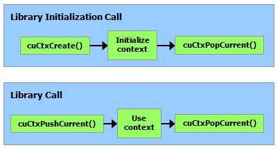

# 附录L CUDA底层驱动API

本附录假定您了解 CUDA 运行时中描述的概念。

驱动程序 API 在 cuda 动态库（`cuda.dll` 或 `cuda.so`）中实现，该库在安装设备驱动程序期间复制到系统上。 它的所有入口点都以 cu 为前缀。

它是一个基于句柄的命令式 API：大多数对象都由不透明的句柄引用，这些句柄可以指定给函数来操作对象。

驱动程序 API 中可用的对象汇总在下表中。

<div class="tablenoborder"><a name="driver-api__objects-available-in-cuda-driver-api" shape="rect">
                           <!-- --></a><table cellpadding="4" cellspacing="0" summary="" id="driver-api__objects-available-in-cuda-driver-api" class="table" frame="border" border="1" rules="all">
                           <caption><span class="tablecap">Table 16. Objects Available in the CUDA Driver API</span></caption>
                           <thead class="thead" align="left">
                              <tr class="row">
                                 <th class="entry" valign="top" width="33.33333333333333%" id="d117e35648" rowspan="1" colspan="1">Object</th>
                                 <th class="entry" valign="top" width="16.666666666666664%" id="d117e35651" rowspan="1" colspan="1">Handle</th>
                                 <th class="entry" valign="top" width="50%" id="d117e35654" rowspan="1" colspan="1">Description</th>
                              </tr>
                           </thead>
                           <tbody class="tbody">
                              <tr class="row">
                                 <td class="entry" valign="top" width="33.33333333333333%" headers="d117e35648" rowspan="1" colspan="1">Device</td>
                                 <td class="entry" valign="top" width="16.666666666666664%" headers="d117e35651" rowspan="1" colspan="1">CUdevice</td>
                                 <td class="entry" valign="top" width="50%" headers="d117e35654" rowspan="1" colspan="1">CUDA-enabled device</td>
                              </tr>
                              <tr class="row">
                                 <td class="entry" valign="top" width="33.33333333333333%" headers="d117e35648" rowspan="1" colspan="1">Context</td>
                                 <td class="entry" valign="top" width="16.666666666666664%" headers="d117e35651" rowspan="1" colspan="1">CUcontext</td>
                                 <td class="entry" valign="top" width="50%" headers="d117e35654" rowspan="1" colspan="1">Roughly equivalent to a CPU process</td>
                              </tr>
                              <tr class="row">
                                 <td class="entry" valign="top" width="33.33333333333333%" headers="d117e35648" rowspan="1" colspan="1">Module</td>
                                 <td class="entry" valign="top" width="16.666666666666664%" headers="d117e35651" rowspan="1" colspan="1">CUmodule</td>
                                 <td class="entry" valign="top" width="50%" headers="d117e35654" rowspan="1" colspan="1">Roughly equivalent to a dynamic library</td>
                              </tr>
                              <tr class="row">
                                 <td class="entry" valign="top" width="33.33333333333333%" headers="d117e35648" rowspan="1" colspan="1">Function</td>
                                 <td class="entry" valign="top" width="16.666666666666664%" headers="d117e35651" rowspan="1" colspan="1">CUfunction</td>
                                 <td class="entry" valign="top" width="50%" headers="d117e35654" rowspan="1" colspan="1">Kernel</td>
                              </tr>
                              <tr class="row">
                                 <td class="entry" valign="top" width="33.33333333333333%" headers="d117e35648" rowspan="1" colspan="1">Heap memory</td>
                                 <td class="entry" valign="top" width="16.666666666666664%" headers="d117e35651" rowspan="1" colspan="1">CUdeviceptr</td>
                                 <td class="entry" valign="top" width="50%" headers="d117e35654" rowspan="1" colspan="1">Pointer to device memory</td>
                              </tr>
                              <tr class="row">
                                 <td class="entry" valign="top" width="33.33333333333333%" headers="d117e35648" rowspan="1" colspan="1">CUDA array</td>
                                 <td class="entry" valign="top" width="16.666666666666664%" headers="d117e35651" rowspan="1" colspan="1">CUarray</td>
                                 <td class="entry" valign="top" width="50%" headers="d117e35654" rowspan="1" colspan="1">Opaque container for one-dimensional or two-dimensional data on the
                                    device, readable via texture or surface references
                                 </td>
                              </tr>
                              <tr class="row">
                                 <td class="entry" valign="top" width="33.33333333333333%" headers="d117e35648" rowspan="1" colspan="1">Texture reference</td>
                                 <td class="entry" valign="top" width="16.666666666666664%" headers="d117e35651" rowspan="1" colspan="1">CUtexref</td>
                                 <td class="entry" valign="top" width="50%" headers="d117e35654" rowspan="1" colspan="1">Object that describes how to interpret texture memory data</td>
                              </tr>
                              <tr class="row">
                                 <td class="entry" valign="top" width="33.33333333333333%" headers="d117e35648" rowspan="1" colspan="1">Surface reference</td>
                                 <td class="entry" valign="top" width="16.666666666666664%" headers="d117e35651" rowspan="1" colspan="1">CUsurfref</td>
                                 <td class="entry" valign="top" width="50%" headers="d117e35654" rowspan="1" colspan="1">Object that describes how to read or write CUDA arrays</td>
                              </tr>
                              <tr class="row">
                                 <td class="entry" valign="top" width="33.33333333333333%" headers="d117e35648" rowspan="1" colspan="1">Stream</td>
                                 <td class="entry" valign="top" width="16.666666666666664%" headers="d117e35651" rowspan="1" colspan="1">CUstream</td>
                                 <td class="entry" valign="top" width="50%" headers="d117e35654" rowspan="1" colspan="1">Object that describes a CUDA stream</td>
                              </tr>
                              <tr class="row">
                                 <td class="entry" valign="top" width="33.33333333333333%" headers="d117e35648" rowspan="1" colspan="1">Event</td>
                                 <td class="entry" valign="top" width="16.666666666666664%" headers="d117e35651" rowspan="1" colspan="1">CUevent</td>
                                 <td class="entry" valign="top" width="50%" headers="d117e35654" rowspan="1" colspan="1">Object that describes a CUDA event</td>
                              </tr>
                           </tbody>
                        </table>
                     </div>

在调用驱动程序 API 的任何函数之前，必须使用 `cuInit()` 初始化驱动程序 API。 然后必须创建一个附加到特定设备的 CUDA 上下文，并使其成为当前调用主机线程，如上下文中所述。

在 CUDA 上下文中，内核作为 PTX 或二进制对象由主机代码显式加载，如模块中所述。 因此，用 C++ 编写的内核必须单独编译成 PTX 或二进制对象。 内核使用 API 入口点启动，如内核执行中所述。

任何想要在未来设备架构上运行的应用程序都必须加载 PTX，而不是二进制代码。 这是因为二进制代码是特定于体系结构的，因此与未来的体系结构不兼容，而 PTX 代码在加载时由设备驱动程序编译为二进制代码。

以下是使用驱动程序 API 编写的内核示例的主机代码：

```C++
int main()
{
    int N = ...;
    size_t size = N * sizeof(float);

    // Allocate input vectors h_A and h_B in host memory
    float* h_A = (float*)malloc(size);
    float* h_B = (float*)malloc(size);

    // Initialize input vectors
    ...

    // Initialize
    cuInit(0);

    // Get number of devices supporting CUDA
    int deviceCount = 0;
    cuDeviceGetCount(&deviceCount);
    if (deviceCount == 0) {
        printf("There is no device supporting CUDA.\n");
        exit (0);
    }

    // Get handle for device 0
    CUdevice cuDevice;
    cuDeviceGet(&cuDevice, 0);

    // Create context
    CUcontext cuContext;
    cuCtxCreate(&cuContext, 0, cuDevice);

    // Create module from binary file
    CUmodule cuModule;
    cuModuleLoad(&cuModule, "VecAdd.ptx");

    // Allocate vectors in device memory
    CUdeviceptr d_A;
    cuMemAlloc(&d_A, size);
    CUdeviceptr d_B;
    cuMemAlloc(&d_B, size);
    CUdeviceptr d_C;
    cuMemAlloc(&d_C, size);

    // Copy vectors from host memory to device memory
    cuMemcpyHtoD(d_A, h_A, size);
    cuMemcpyHtoD(d_B, h_B, size);

    // Get function handle from module
    CUfunction vecAdd;
    cuModuleGetFunction(&vecAdd, cuModule, "VecAdd");

    // Invoke kernel
    int threadsPerBlock = 256;
    int blocksPerGrid =
            (N + threadsPerBlock - 1) / threadsPerBlock;
    void* args[] = { &d_A, &d_B, &d_C, &N };
    cuLaunchKernel(vecAdd,
                   blocksPerGrid, 1, 1, threadsPerBlock, 1, 1,
                   0, 0, args, 0);

    ...
}
```
完整的代码可以在 `vectorAddDrv CUDA` 示例中找到。

## L.1. Context
CUDA 上下文类似于 CPU 进程。驱动 API 中执行的所有资源和操作都封装在 CUDA 上下文中，当上下文被销毁时，系统会自动清理这些资源。除了模块和纹理或表面引用等对象外，每个上下文都有自己独特的地址空间。因此，来自不同上下文的 `CUdeviceptr` 值引用不同的内存位置。

主机线程一次可能只有一个设备上下文当前。当使用 `cuCtxCreate()` 创建上下文时，它对调用主机线程是当前的。如果有效上下文不是线程当前的，则在上下文中操作的 CUDA 函数（大多数不涉及设备枚举或上下文管理的函数）将返回 `CUDA_ERROR_INVALID_CONTEXT`。

每个主机线程都有一堆当前上下文。 `cuCtxCreate()` 将新上下文推送到堆栈顶部。可以调用 `cuCtxPopCurrent()` 将上下文与主机线程分离。然后上下文是“浮动的”，并且可以作为任何主机线程的当前上下文推送。 `cuCtxPopCurrent()` 还会恢复先前的当前上下文（如果有）。

还为每个上下文维护使用计数。 `cuCtxCreate()` 创建使用计数为 1 的上下文。`cuCtxAttach()` 增加使用计数，而 `cuCtxDetach()` 减少使用计数。当调用 `cuCtxDetach()` 或 `cuCtxDestroy()` 时使用计数变为 0，上下文将被销毁。

驱动程序 API 可与运行时互操作，并且可以通过 `cuDevicePrimaryCtxRetain()` 从驱动程序 API 访问由运行时管理的主上下文（参见[初始化](https://docs.nvidia.com/cuda/cuda-c-programming-guide/index.html#initialization)）。

使用计数有助于在相同上下文中运行的第三方编写的代码之间的互操作性。例如，如果加载三个库以使用相同的上下文，则每个库将调用 `cuCtxAttach() `来增加使用计数，并在库使用上下文完成时调用 `cuCtxDetach()` 来减少使用计数。对于大多数库，预计应用程序会在加载或初始化库之前创建上下文；这样，应用程序可以使用自己的启发式方法创建上下文，并且库只需对传递给它的上下文进行操作。希望创建自己的上下文的库（可能会或可能没有创建自己的上下文的 API 客户端不知道）将使用 `cuCtxPushCurrent()` 和 `cuCtxPopCurrent()`，如下图所示。



## L.2. Module
模块是设备代码和数据的动态可加载包，类似于 Windows 中的 DLL，由 nvcc 输出（请参阅使用 NVCC 编译）。 所有符号的名称，包括函数、全局变量和纹理或表面引用，都在模块范围内维护，以便独立第三方编写的模块可以在相同的 CUDA 上下文中互操作。

此代码示例加载一个模块并检索某个内核的句柄：
```C++
CUmodule cuModule;
cuModuleLoad(&cuModule, "myModule.ptx");
CUfunction myKernel;
cuModuleGetFunction(&myKernel, cuModule, "MyKernel");
```
此代码示例从 PTX 代码编译和加载新模块并解析编译错误：

```C++
#define BUFFER_SIZE 8192
CUmodule cuModule;
CUjit_option options[3];
void* values[3];
char* PTXCode = "some PTX code";
char error_log[BUFFER_SIZE];
int err;
options[0] = CU_JIT_ERROR_LOG_BUFFER;
values[0]  = (void*)error_log;
options[1] = CU_JIT_ERROR_LOG_BUFFER_SIZE_BYTES;
values[1]  = (void*)BUFFER_SIZE;
options[2] = CU_JIT_TARGET_FROM_CUCONTEXT;
values[2]  = 0;
err = cuModuleLoadDataEx(&cuModule, PTXCode, 3, options, values);
if (err != CUDA_SUCCESS)
    printf("Link error:\n%s\n", error_log);
```

此代码示例从多个 PTX 代码编译、链接和加载新模块，并解析链接和编译错误：

```C++
#define BUFFER_SIZE 8192
CUmodule cuModule;
CUjit_option options[6];
void* values[6];
float walltime;
char error_log[BUFFER_SIZE], info_log[BUFFER_SIZE];
char* PTXCode0 = "some PTX code";
char* PTXCode1 = "some other PTX code";
CUlinkState linkState;
int err;
void* cubin;
size_t cubinSize;
options[0] = CU_JIT_WALL_TIME;
values[0] = (void*)&walltime;
options[1] = CU_JIT_INFO_LOG_BUFFER;
values[1] = (void*)info_log;
options[2] = CU_JIT_INFO_LOG_BUFFER_SIZE_BYTES;
values[2] = (void*)BUFFER_SIZE;
options[3] = CU_JIT_ERROR_LOG_BUFFER;
values[3] = (void*)error_log;
options[4] = CU_JIT_ERROR_LOG_BUFFER_SIZE_BYTES;
values[4] = (void*)BUFFER_SIZE;
options[5] = CU_JIT_LOG_VERBOSE;
values[5] = (void*)1;
cuLinkCreate(6, options, values, &linkState);
err = cuLinkAddData(linkState, CU_JIT_INPUT_PTX,
                    (void*)PTXCode0, strlen(PTXCode0) + 1, 0, 0, 0, 0);
if (err != CUDA_SUCCESS)
    printf("Link error:\n%s\n", error_log);
err = cuLinkAddData(linkState, CU_JIT_INPUT_PTX,
                    (void*)PTXCode1, strlen(PTXCode1) + 1, 0, 0, 0, 0);
if (err != CUDA_SUCCESS)
    printf("Link error:\n%s\n", error_log);
cuLinkComplete(linkState, &cubin, &cubinSize);
printf("Link completed in %fms. Linker Output:\n%s\n", walltime, info_log);
cuModuleLoadData(cuModule, cubin);
cuLinkDestroy(linkState);
```

完整的代码可以在 `ptxjit` CUDA 示例中找到。

## L.3. Kernel Execution

`cuLaunchKernel()` 启动具有给定执行配置的内核。

参数可以作为指针数组（在 `cuLaunchKernel()` 的最后一个参数旁边）传递，其中第 n 个指针对应于第 n 个参数并指向从中复制参数的内存区域，或者作为额外选项之一（ `cuLaunchKernel()`) 的最后一个参数。

当参数作为额外选项（`CU_LAUNCH_PARAM_BUFFER_POINTER` 选项）传递时，它们作为指向单个缓冲区的指针传递，在该缓冲区中，通过匹配设备代码中每个参数类型的对齐要求，参数被假定为彼此正确偏移。

[表 4](https://docs.nvidia.com/cuda/cuda-c-programming-guide/index.html#vector-types__alignment-requirements-in-device-code) 列出了内置向量类型的设备代码中的对齐要求。对于所有其他基本类型，设备代码中的对齐要求与主机代码中的对齐要求相匹配，因此可以使用 `__alignof()` 获得。唯一的例外是当宿主编译器在一个字边界而不是两个字边界上对齐 `doubl`e 和 `long long`（在 64 位系统上为 long）（例如，使用 gcc 的编译标志 `-mno-align-double` ) 因为在设备代码中，这些类型总是在两个字的边界上对齐。

`CUdeviceptr`是一个整数，但是代表一个指针，所以它的对齐要求是`__alignof(void*)`。

以下代码示例使用宏 (`ALIGN_UP()`) 调整每个参数的偏移量以满足其对齐要求，并使用另一个宏 (`ADD_TO_PARAM_BUFFER()`) 将每个参数添加到传递给 `CU_LAUNCH_PARAM_BUFFER_POINTER` 选项的参数缓冲区。

```C++
#define ALIGN_UP(offset, alignment) \
      (offset) = ((offset) + (alignment) - 1) & ~((alignment) - 1)

char paramBuffer[1024];
size_t paramBufferSize = 0;

#define ADD_TO_PARAM_BUFFER(value, alignment)                   \
    do {                                                        \
        paramBufferSize = ALIGN_UP(paramBufferSize, alignment); \
        memcpy(paramBuffer + paramBufferSize,                   \
               &(value), sizeof(value));                        \
        paramBufferSize += sizeof(value);                       \
    } while (0)

int i;
ADD_TO_PARAM_BUFFER(i, __alignof(i));
float4 f4;
ADD_TO_PARAM_BUFFER(f4, 16); // float4's alignment is 16
char c;
ADD_TO_PARAM_BUFFER(c, __alignof(c));
float f;
ADD_TO_PARAM_BUFFER(f, __alignof(f));
CUdeviceptr devPtr;
ADD_TO_PARAM_BUFFER(devPtr, __alignof(devPtr));
float2 f2;
ADD_TO_PARAM_BUFFER(f2, 8); // float2's alignment is 8

void* extra[] = {
    CU_LAUNCH_PARAM_BUFFER_POINTER, paramBuffer,
    CU_LAUNCH_PARAM_BUFFER_SIZE,    &paramBufferSize,
    CU_LAUNCH_PARAM_END
};
cuLaunchKernel(cuFunction,
               blockWidth, blockHeight, blockDepth,
               gridWidth, gridHeight, gridDepth,
               0, 0, 0, extra);
```

结构的对齐要求等于其字段的对齐要求的最大值。 因此，包含内置向量类型 `CUdeviceptr` 或未对齐的 `double` 和 `long long` 的结构的对齐要求可能在设备代码和主机代码之间有所不同。 这种结构也可以用不同的方式填充。 例如，以下结构在主机代码中根本不填充，但在设备代码中填充了字段 `f `之后的 12 个字节，因为字段 `f4` 的对齐要求是 16。

```C++
typedef struct {
    float  f;
    float4 f4;
} myStruct;
```
## L.4. Interoperability between Runtime and Driver APIs

应用程序可以将运行时 API 代码与驱动程序 API 代码混合。

如果通过驱动程序 API 创建上下文并使其成为当前上下文，则后续运行时调用将获取此上下文，而不是创建新上下文。

如果运行时已初始化（如 CUDA 运行时中提到的那样），`cuCtxGetCurrent()` 可用于检索在初始化期间创建的上下文。 后续驱动程序 API 调用可以使用此上下文。

从运行时隐式创建的上下文称为主上下文（请参阅[初始化](https://docs.nvidia.com/cuda/cuda-c-programming-guide/index.html#initialization)）。 它可以通过具有[主要上下文管理](https://docs.nvidia.com/cuda/cuda-driver-api/group__CUDA__PRIMARY__CTX.html)功能的驱动程序 API 进行管理。

可以使用任一 API 分配和释放设备内存。 `CUdeviceptr` 可以转换为常规指针，反之亦然：

```C++
CUdeviceptr devPtr;
float* d_data;

// Allocation using driver API
cuMemAlloc(&devPtr, size);
d_data = (float*)devPtr;

// Allocation using runtime API
cudaMalloc(&d_data, size);
devPtr = (CUdeviceptr)d_data;
```
特别是，这意味着使用驱动程序 API 编写的应用程序可以调用使用运行时 API 编写的库（例如 cuFFT、cuBLAS...）。

参考手册的设备和版本管理部分的所有功能都可以互换使用。


## L.5. Driver Entry Point Access

### L.5.1. Introduction

[驱动程序入口点访问](https://docs.nvidia.com/cuda/cuda-driver-api/group__CUDA__DRIVER__ENTRY__POINT.html) API 提供了一种检索 CUDA 驱动程序函数地址的方法。 从 CUDA 11.3 开始，用户可以使用从这些 API 获得的函数指针调用可用的 CUDA 驱动程序 API。

这些 API 提供的功能类似于它们的对应物，POSIX 平台上的 `dlsym` 和 Windows 上的 `GetProcAddress`。 提供的 API 将允许用户：
* 使用 CUDA 驱动程序 API 检索[驱动程序](https://docs.nvidia.com/cuda/cuda-driver-api/group__CUDA__DRIVER__ENTRY__POINT.html)函数的地址。

* 使用 CUDA [运行时](https://docs.nvidia.com/cuda/cuda-runtime-api/group__CUDART__DRIVER__ENTRY__POINT.html) API 检索驱动程序函数的地址。

* 请求 CUDA 驱动程序函数的每线程默认流版本。 有关更多详细信息，请参阅[检索每个线程的默认流版本](https://docs.nvidia.com/cuda/cuda-c-programming-guide/index.html#retrieve-per-thread-default-stream-versions)
 
* 使用较新的驱动程序访问旧工具包上的新 CUDA 功能。

### L.5.2. Driver Function Typedefs

为了帮助检索 CUDA 驱动程序 API 入口点，CUDA 工具包提供对包含所有 CUDA 驱动程序 API 的函数指针定义的头文件的访问。 这些头文件与 CUDA Toolkit 一起安装，并且在工具包的 `include/` 目录中可用。 下表总结了包含每个 CUDA API 头文件的 `typedef` 的头文件。

<div class="tablenoborder"><a name="driver-function-typedefs__driver-api-typedefs-header-files" shape="rect">
                                 <!-- --></a><table cellpadding="4" cellspacing="0" summary="" id="driver-function-typedefs__driver-api-typedefs-header-files" class="table" frame="border" border="1" rules="all">
                                 <caption><span class="tablecap">Table 17. Typedefs header files for CUDA driver APIs</span></caption>
                                 <thead class="thead" align="left">
                                    <tr class="row">
                                       <th class="entry" valign="top" width="50%" id="d117e36211" rowspan="1" colspan="1">API header file</th>
                                       <th class="entry" valign="top" width="50%" id="d117e36214" rowspan="1" colspan="1">API Typedef header file</th>
                                    </tr>
                                 </thead>
                                 <tbody class="tbody">
                                    <tr class="row">
                                       <td class="entry" valign="top" width="50%" headers="d117e36211" rowspan="1" colspan="1"><samp class="ph codeph">cuda.h</samp></td>
                                       <td class="entry" valign="top" width="50%" headers="d117e36214" rowspan="1" colspan="1"><samp class="ph codeph">cudaTypedefs.h</samp></td>
                                    </tr>
                                    <tr class="row">
                                       <td class="entry" valign="top" width="50%" headers="d117e36211" rowspan="1" colspan="1"><samp class="ph codeph">cudaGL.h</samp></td>
                                       <td class="entry" valign="top" width="50%" headers="d117e36214" rowspan="1" colspan="1"><samp class="ph codeph">cudaGLTypedefs.h</samp></td>
                                    </tr>
                                    <tr class="row">
                                       <td class="entry" valign="top" width="50%" headers="d117e36211" rowspan="1" colspan="1"><samp class="ph codeph">cudaProfiler.h</samp></td>
                                       <td class="entry" valign="top" width="50%" headers="d117e36214" rowspan="1" colspan="1"><samp class="ph codeph">cudaProfilerTypedefs.h</samp></td>
                                    </tr>
                                    <tr class="row">
                                       <td class="entry" valign="top" width="50%" headers="d117e36211" rowspan="1" colspan="1"><samp class="ph codeph">cudaVDPAU.h</samp></td>
                                       <td class="entry" valign="top" width="50%" headers="d117e36214" rowspan="1" colspan="1"><samp class="ph codeph">cudaVDPAUTypedefs.h</samp></td>
                                    </tr>
                                    <tr class="row">
                                       <td class="entry" valign="top" width="50%" headers="d117e36211" rowspan="1" colspan="1"><samp class="ph codeph">cudaEGL.h</samp></td>
                                       <td class="entry" valign="top" width="50%" headers="d117e36214" rowspan="1" colspan="1"><samp class="ph codeph">cudaEGLTypedefs.h</samp></td>
                                    </tr>
                                    <tr class="row">
                                       <td class="entry" valign="top" width="50%" headers="d117e36211" rowspan="1" colspan="1"><samp class="ph codeph">cudaD3D9.h</samp></td>
                                       <td class="entry" valign="top" width="50%" headers="d117e36214" rowspan="1" colspan="1"><samp class="ph codeph">cudaD3D9Typedefs.h</samp></td>
                                    </tr>
                                    <tr class="row">
                                       <td class="entry" valign="top" width="50%" headers="d117e36211" rowspan="1" colspan="1"><samp class="ph codeph">cudaD3D10.h</samp></td>
                                       <td class="entry" valign="top" width="50%" headers="d117e36214" rowspan="1" colspan="1"><samp class="ph codeph">cudaD3D10Typedefs.h</samp></td>
                                    </tr>
                                    <tr class="row">
                                       <td class="entry" valign="top" width="50%" headers="d117e36211" rowspan="1" colspan="1"><samp class="ph codeph">cudaD3D11.h</samp></td>
                                       <td class="entry" valign="top" width="50%" headers="d117e36214" rowspan="1" colspan="1"><samp class="ph codeph">cudaD3D11Typedefs.h</samp></td>
                                    </tr>
                                 </tbody>
                              </table>
                           </div>


上面的头文件本身并没有定义实际的函数指针； 他们为函数指针定义了 `typedef`。 例如，`cudaTypedefs.h` 具有驱动 API `cuMemAlloc` 的以下 `typedef`：
```C++
    typedef CUresult (CUDAAPI *PFN_cuMemAlloc_v3020)(CUdeviceptr_v2 *dptr, size_t bytesize);
    typedef CUresult (CUDAAPI *PFN_cuMemAlloc_v2000)(CUdeviceptr_v1 *dptr, unsigned int bytesize);
```
CUDA 驱动程序符号具有基于版本的命名方案，其名称中带有 `_v*` 扩展名，但第一个版本除外。 当特定 CUDA 驱动程序 API 的签名或语义发生变化时，我们会增加相应驱动程序符号的版本号。 对于 `cuMemAlloc` 驱动程序 API，第一个驱动程序符号名称是 `cuMemAlloc`，下一个符号名称是 `cuMemAlloc_v2`。 CUDA 2.0 (2000) 中引入的第一个版本的 `typedef` 是 `PFN_cuMemAlloc_v2000`。 CUDA 3.2 (3020) 中引入的下一个版本的 `typedef` 是 `PFN_cuMemAlloc_v3020`。

typedef 可用于更轻松地在代码中定义适当类型的函数指针：
```C++
    PFN_cuMemAlloc_v3020 pfn_cuMemAlloc_v2;
    PFN_cuMemAlloc_v2000 pfn_cuMemAlloc_v1;
```

如果用户对 API 的特定版本感兴趣，则上述方法更可取。 此外，头文件中包含所有驱动程序符号的最新版本的预定义宏，这些驱动程序符号在安装的 CUDA 工具包发布时可用； 这些 `typedef` 没有 `_v*` 后缀。 对于 CUDA 11.3 工具包，`cuMemAlloc_v2` 是最新版本，所以我们也可以定义它的函数指针如下：

```C++
  PFN_cuMemAlloc pfn_cuMemAlloc;
```

### L.5.3. Driver Function Retrieval
使用驱动程序入口点访问 API 和适当的 `typedef`，我们可以获得指向任何 CUDA 驱动程序 API 的函数指针。

#### L.5.3.1. Using the driver API
驱动程序 API 需要 CUDA 版本作为参数来获取请求的驱动程序符号的 ABI 兼容版本。 CUDA 驱动程序 API 有一个以 `_v*` 扩展名表示的按功能 ABI。 例如，考虑 `cudaTypedefs.h` 中 `cuStreamBeginCapture` 的版本及其对应的 `typedef`：

```C++
    // cuda.h
    CUresult CUDAAPI cuStreamBeginCapture(CUstream hStream);
    CUresult CUDAAPI cuStreamBeginCapture_v2(CUstream hStream, CUstreamCaptureMode mode);
            
    // cudaTypedefs.h
    typedef CUresult (CUDAAPI *PFN_cuStreamBeginCapture_v10000)(CUstream hStream);
    typedef CUresult (CUDAAPI *PFN_cuStreamBeginCapture_v10010)(CUstream hStream, CUstreamCaptureMode mode);
```

从上述代码片段中的typedefs，版本后缀`_v10000`和`_v10010`表示上述API分别在`CUDA 10.0`和`CUDA 10.1`中引入。

```C++
    #include <cudaTypedefs.h>
    
    // Declare the entry points for cuStreamBeginCapture
    PFN_cuStreamBeginCapture_v10000 pfn_cuStreamBeginCapture_v1;
    PFN_cuStreamBeginCapture_v10010 pfn_cuStreamBeginCapture_v2;
    
    // Get the function pointer to the cuStreamBeginCapture driver symbol
    cuGetProcAddress("cuStreamBeginCapture", &pfn_cuStreamBeginCapture_v1, 10000, CU_GET_PROC_ADDRESS_DEFAULT);
    // Get the function pointer to the cuStreamBeginCapture_v2 driver symbol
    cuGetProcAddress("cuStreamBeginCapture", &pfn_cuStreamBeginCapture_v2, 10010, CU_GET_PROC_ADDRESS_DEFAULT);
```


参考上面的代码片段，要检索到驱动程序 API `cuStreamBeginCapture` 的 _v1 版本的地址，CUDA 版本参数应该正好是 `10.0 (10000)`。同样，用于检索 _v2 版本 API 的地址的 CUDA 版本应该是 `10.1 (10010`)。为检索特定版本的驱动程序 API 指定更高的 CUDA 版本可能并不总是可移植的。例如，在此处使用 `11030` 仍会返回 `_v2` 符号，但如果在 CUDA 11.3 中发布假设的 `_v3` 版本，则当与 CUDA 11.3 驱动程序配对时，`cuGetProcAddress` API 将开始返回较新的 _v3 符号。由于 `_v2 `和 `_v3` 符号的 ABI 和函数签名可能不同，使用用于 `_v2` 符号的 `_v10010 typedef` 调用 `_v3` 函数将表现出未定义的行为。

要检索给定 CUDA 工具包的驱动程序 API 的最新版本，我们还可以指定 `CUDA_VERSION` 作为版本参数，并使用未版本化的 `typedef` 来定义函数指针。由于 `_v2` 是 CUDA 11.3 中驱动程序 API `cuStreamBeginCapture` 的最新版本，因此下面的代码片段显示了检索它的不同方法。
```C++
    // Assuming we are using CUDA 11.3 Toolkit

    #include <cudaTypedefs.h>
    
    // Declare the entry point
    PFN_cuStreamBeginCapture pfn_cuStreamBeginCapture_latest;
    
    // Intialize the entry point. Specifying CUDA_VERSION will give the function pointer to the
    // cuStreamBeginCapture_v2 symbol since it is latest version on CUDA 11.3.
    cuGetProcAddress("cuStreamBeginCapture", &pfn_cuStreamBeginCapture_latest, CUDA_VERSION, CU_GET_PROC_ADDRESS_DEFAULT);
  
```
请注意，请求具有无效 CUDA 版本的驱动程序 API 将返回错误 `CUDA_ERROR_NOT_FOUND。` 在上面的代码示例中，传入小于 `10000 (CUDA 10.0)` 的版本将是无效的。

#### L.5.3.2. Using the runtime API

运行时 API 使用 CUDA 运行时版本来获取请求的驱动程序符号的 ABI 兼容版本。 在下面的代码片段中，所需的最低 CUDA 运行时版本将是 CUDA 11.2，因为当时引入了 `cuMemAllocAsync`。

```C++
    #include <cudaTypedefs.h>
    
    // Declare the entry point
    PFN_cuMemAllocAsync pfn_cuMemAllocAsync;
    
    // Intialize the entry point. Assuming CUDA runtime version >= 11.2
    cudaGetDriverEntryPoint("cuMemAllocAsync", &pfn_cuMemAllocAsync, cudaEnableDefault);
    
    // Call the entry point
    pfn_cuMemAllocAsync(...);
```

#### L.5.3.3. Retrieve per-thread default stream versions

一些 CUDA 驱动程序 API 可以配置为具有默认流或每线程默认流语义。具有每个线程默认流语义的驱动程序 API 在其名称中以 `_ptsz` 或 `_ptds` `为后缀。例如，cuLaunchKernel` 有一个名为 `cuLaunchKernel_ptsz` 的每线程默认流变体。使用驱动程序入口点访问 API，用户可以请求驱动程序 API `cuLaunchKernel` 的每线程默认流版本，而不是默认流版本。为默认流或每线程默认流语义配置 CUDA 驱动程序 API 会影响同步行为。更多详细信息可以在这里找到。

驱动API的默认流或每线程默认流版本可以通过以下方式之一获得：
* 使用编译标志 `--default-stream per-thread` 或定义宏 `CUDA_API_PER_THREAD_DEFAULT_STREAM` 以获取每个线程的默认流行为。
* 分别使用标志 `CU_GET_PROC_ADDRESS_LEGACY_STREAM/cudaEnableLegacyStream` 或 `CU_GET_PROC_ADDRESS_PER_THREAD_DEFAULT_STREAM/cudaEnablePerThreadDefaultStream` 强制默认流或每个线程的默认流行为。

#### L.5.3.4. Access new CUDA features
始终建议安装最新的 CUDA 工具包以访问新的 CUDA 驱动程序功能，但如果出于某种原因，用户不想更新或无法访问最新的工具包，则可以使用 API 来访问新的 CUDA 功能 只有更新的 CUDA 驱动程序。 为了讨论，让我们假设用户使用 CUDA 11.3，并希望使用 CUDA 12.0 驱动程序中提供的新驱动程序 API `cuFoo`。 下面的代码片段说明了这个用例：

```C++
    int main()
    {
        // Assuming we have CUDA 12.0 driver installed.

        // Manually define the prototype as cudaTypedefs.h in CUDA 11.3 does not have the cuFoo typedef
        typedef CUresult (CUDAAPI *PFN_cuFoo)(...);
        PFN_cuFoo pfn_cuFoo = NULL;
        
        // Get the address for cuFoo API using cuGetProcAddress. Specify CUDA version as
        // 12000 since cuFoo was introduced then or get the driver version dynamically
        // using cuDriverGetVersion 
        int driverVersion;
        cuDriverGetVersion(&driverVersion);
        cuGetProcAddress("cuFoo", &pfn_cuFoo, driverVersion, CU_GET_PROC_ADDRESS_DEFAULT);
        
        if (pfn_cuFoo) {
            pfn_cuFoo(...);
        }
        else {
            printf("Cannot retrieve the address to cuFoo. Check if the latest driver for CUDA 12.0 is installed.\n");
            assert(0);
        }
        
        // rest of code here
        
    }
```
